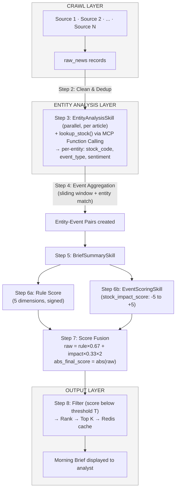

# 港股新聞智能洞察系統

### *HK Stock AI Research Assistant*

**Product Requirements Document · PRD v0.5**

Status: Draft · 2025-Q2 · MVP Scope

**Supersedes PRD v0.4 · Updates: scoring rule refinements (U-44 to U-47)**

> **Version:** 0.5 &nbsp;·&nbsp; **Phase:** MVP &nbsp;·&nbsp; **Status:** Draft &nbsp;·&nbsp; **Horizon:** 6 Weeks

## 1 Product Overview

### 1.1 Product Definition

An AI-driven Hong Kong equity research assistant system that automatically aggregates multi-source news, performs structured entity-level analysis and enrichment, scores Entity-Event Pairs by relevance and urgency, and delivers a prioritised Morning Brief to professional buy-side and sell-side users.

### 1.2 Target Users

| **User Type**      | **Organisation**                   | **Primary Need**                                                    |
|:-------------------|:-----------------------------------|:--------------------------------------------------------------------|
| Equity Analyst     | Sell-side broker / Investment bank | Monitor covered stocks; detect material events before market open   |
| Fund Researcher    | Buy-side fund / Asset manager      | Screen market-wide events; filter noise; generate research leads    |
| Investment Advisor | Wealth management / Family office  | Stay informed on client portfolio stocks with minimal manual effort |

### 1.3 Core Value Proposition

- Replaces hours of manual news trawling with a structured, scored Morning Brief delivered before 09:00 HKT

- Surfaces not just what happened, but why it matters — via explainable per-entity scoring and AI-generated summaries

- Engineered for extensibility: scoring model, data sources, LLM provider and Skills are all independently pluggable

## 2 Core User Scenario

### 2.1 The 09:00 Morning Brief

Primary scenario: An analyst at a mid-size Hong Kong broker arrives at 08:45. The market opens at 09:30. The analyst opens the system and sees a ranked list of Entity-Event Pairs relevant to their personal stock watchlist — ordered by Final Score, with score breakdowns available in detail view.

The system has already:

- Crawled and de-duplicated news from configured sources since the previous run

- Extracted per-entity structured analysis (entities, event classification, sentiment) via EntityAnalysisSkill

- Aggregated multi-source reports into single Entity-Event Pairs and scored each pair

- Filtered noise and surfaced the Top K pairs most relevant to this analyst's watchlist

### 2.2 Key Design Implications

| **Property**   | **Implication**                                                                                |
|:---------------|:-----------------------------------------------------------------------------------------------|
| Timeliness     | Pipeline must complete before 08:30 HKT; scheduled trigger required                            |
| Relevance      | Scoring must respect each analyst's personal stock watchlist via pool_match boost              |
| Explainability | Every score must be decomposable; analyst can understand why a pair ranked \#1 via Detail View |

## 3 User & Personalisation

### 3.1 MVP Scope: Single-User Mode

MVP operates in single-user mode. No authentication, no user database, no multi-tenancy. A single stock watchlist is configured at system startup via local configuration file.

### 3.2 Stock Watchlist

- User maintains a personal watchlist of bare HK stock codes, no exchange suffix (e.g. 00700, 09988) — same canonical form the server uses throughout (SAPI TAD §9.2); an exchange indicator (e.g. `HKEX`) is carried as its own field where needed, never folded into the code string

- MVP: watchlist stored in local configuration file on client; passed as request parameter to server at query time

- Server uses watchlist parameter to prioritise matching Entity-Event Pairs in response; pool_match boost applied on client after receiving server response

- Post-MVP: watchlist migrated to cloud database; supports multi-device sync and multi-user profiles

### 3.3 Post-MVP Personalisation Roadmap

- Multi-user support with individual watchlists and authentication

- Analyst feedback loop: manual re-ranking feeds into dynamic weight adjustment

- Per-user scoring weight profiles

- Intraday Run: real-time incremental crawl every 2 hours during trading session

- Card display density: user-configurable information density on Event cards

- Source authority microtuning: user-adjustable authority weights per source

## 4 Data Sources & Crawling Strategy

### 4.1 MVP News Sources

*MVP Scope: Hong Kong equity news sources only. US market content (ADR post-market, Fed policy, sector contagion) is deferred to Post-MVP. See Section 13.2 for Post-MVP roadmap.*

| **Source**            | **Type**                | **Language**        | **Coverage**                                           | **Priority** |
|:----------------------|:-------------------------|:---------------------|:--------------------------------------------------------|:-------------|
| HKEX NEWSLINE          | Official filings (PDF)   | Bilingual (EN/ZH)    | Regulatory announcements & circulars, tagged by stock code | P1           |
| Ming Pao 明報          | RSS (teaser only — see note) | Traditional Chinese  | General HK economy & corporate news                      | P2           |
| AAStocks 阿斯達克      | Web scrape               | Traditional Chinese  | HK-specific stock/financial news                          | P2           |
| Yahoo Finance HK       | RSS feed                 | English               | General finance news                                       | P2           |

*This table reflects the 4 sources SADI actually implements (`CrawlSourceName`: `HKEX`/`MINGPAO`/`AASTOCKS`/`YAHOO_HK`), replacing this section's original v0.5 6-source plan (South China Morning Post, Reuters Asia, Bloomberg HK, AAStocks, HKEx NEWSLINE, Yahoo Finance HK) — SADI's docs don't state why the source list changed during implementation, only that it did. Priority tiers match Admin's live `data_sources` seed data (`admin-tad.md` §4.1); no source is currently seeded at P3. Ming Pao's body is currently a ~150–250 char RSS `<description>` teaser, not full article text, due to a Cloudflare block encountered on SADI's dev network (2026-08-31, `admin-tad.md` §4.1's revision note) — full-article fetch for HKEX, AAStocks, and Yahoo HK was unaffected; revisit Ming Pao upward if this proves network-specific once running from the real deployment target.*

### 4.2 Crawl Frequency & Strategy

| **Job**        | **UTC Trigger** | **HKT Equivalent**           | **Crawl Window**                                              | **Actions**                                                                    |
|:---------------|:----------------|:-----------------------------|:--------------------------------------------------------------|:-------------------------------------------------------------------------------|
| morning-crawl  | 14:00 UTC       | 22:00 HKT (~6hrs post-close) | last_successful_run_at → 14:00 UTC (dynamic, not fixed hours) | Full pipeline: crawl P1+P2+P3 → clean → Entity Analysis → aggregate → score → cache        |
| pre-open-crawl | 00:30 UTC       | 08:30 HKT (pre-market)       | last_successful_run_at → 00:30 UTC                            | Incremental pipeline; refresh Morning Brief cache. Must complete by 01:00 UTC. |
| watchlist-sync | 00:00 UTC daily | 08:00 HKT                    | n/a                                                           | Reload watchlist config from local file                                        |

*Time Zone: All internal timestamps stored as UTC. HKT = UTC+8. Timezone conversion is a display-layer concern only. No multi-timezone handling in MVP.*

*Morning Run Design Rationale: 22:00 HKT chosen because post-close announcement peak (HKT 16:00-20:00) has passed, data is relatively complete. Dynamic crawl window (last_successful_run_at → trigger) prevents data gaps on job failure or retry.*

### 4.3 Crawl Output Schema (Raw News Record)

| **Field**     | **Type**        | **Description**                                    |
|:--------------|:----------------|:---------------------------------------------------|
| raw_id        | UUID            | Primary key, generated at ingest                   |
| source_name   | String          | Canonical source identifier (e.g. HKEX, MINGPAO)   |
| source_url    | String          | Original article URL                               |
| title         | String          | Article headline (raw)                             |
| body          | Text            | Full article body text (raw, HTML-stripped)        |
| published_at  | DateTime (UTC)  | Publication timestamp from source                  |
| crawled_at    | DateTime (UTC)  | System ingest timestamp                            |
| language      | Enum            | EN / ZH                                            |
| raw_hash      | String          | SHA-256 of (source_url + title); primary dedup key |
| is_update     | Boolean         | Reserved for Post-MVP; defaults false in MVP       |
| parent_raw_id | UUID (nullable) | Reserved for Post-MVP article update tracking      |

### 4.4 Error & Exception Handling

- Source unavailable: log failure, skip source for current run, alert on 3 consecutive failures

- Partial content (paywall): store available content, flag partial=true; exclude from Entity Analysis layer

- Encoding issues: normalise to UTF-8 at ingest; discard records with \>5% undecodable characters

- Retry policy: exponential backoff with jitter, max 3 retries per article. Formula: wait = base × 2^n + random(0, 1000ms). Prevents retry storms in multi-article batch failures.

### 4.5 Crawl-Level Deduplication Strategy

Deduplication operates at two distinct layers. This section covers crawl-level dedup, which prevents duplicate raw records from entering the database. News-level and event-level dedup (Section 5) operates on already-stored records.

**Duplication Scenarios & Handling**

| **Scenario**                 | **When it occurs**                                                         | **MVP Handling**                                               | **Post-MVP**                               |
|:-----------------------------|:---------------------------------------------------------------------------|:---------------------------------------------------------------|:-------------------------------------------|
| Time window boundary overlap | Job retry or scheduling overlap causes same article to be crawled twice    | raw_hash check before insert; duplicate discarded (idempotent) | Same                                       |
| Job failure & retry          | Failed job re-crawls articles already processed in partial run             | raw_hash check; already-inserted records skipped               | Same                                       |
| Cross-source syndication     | Reuters report republished by Yahoo Finance HK with different URL          | Handled by news-level title hash dedup in Section 5.1          | Semantic vector dedup                      |
| Article content update       | Same URL; body edited after initial crawl (e.g. earnings figure corrected) | Skip — URL already exists, update ignored; is_update=false     | Track update via is_update + parent_raw_id |

*Idempotency Design: The crawl layer does not determine whether content is 'new enough' to process. It writes everything and delegates dedup responsibility to the cleaning layer. This makes the crawler stateless and safe to retry.*

## 5 Data Cleaning & De-duplication Strategy

### 5.1 News-Level De-duplication

Applied immediately after crawl, before Entity Analysis processing. Only deterministic rules — no fuzzy matching at this layer.

| **Rule**         | **Logic**                                                                                                                                         | **Action**                        |
|:-----------------|:--------------------------------------------------------------------------------------------------------------------------------------------------|:----------------------------------|
| URL match        | source_url already exists in DB                                                                                                                   | Discard new record                |
| Title hash match | SHA-256(normalised_title) collision. Normalisation: traditional→simplified Chinese, full-width→half-width, remove punctuation & spaces, lowercase | Discard; keep earliest crawled_at |

*Near-duplicate detection (Levenshtein distance, vector similarity) is deferred to Post-MVP. Articles with similar but non-identical titles pass through to Event Aggregation (Section 5.2), which handles them naturally via entity + event_type matching.*

### 5.2 Event-Level Aggregation

After Entity Analysis processing, news records are grouped into Entity-Event Pairs. Each pair is the atomic unit for scoring and Morning Brief display.

*Key concept: An Entity-Event Pair is defined as: one stock entity (stock_code) + one primary event type (event_type_primary) + a time-bounded cluster of articles reporting on that combination. This is the natural grain for analyst consumption.*

**Aggregation Rules (applied in order):**

- Rule 1 — URL match: already handled at crawl-level dedup; not repeated here

- Rule 2 — Entity-Event sliding window merge: see detailed specification below

**Rule 2 — Sliding Window Merge Specification:**

Two news records are candidates for the same Entity-Event Pair if ALL three conditions are met:

- Condition 1 — Same stock entity: both records contain the same stock_code in their EntityAnalysisSkill output

- Condition 2 — Same primary event type: both records have identical event_type_primary for that stock_code

- Condition 3 — Time proximity: \|record_A.published_at - record_B.published_at\| ≤ SLIDING_WINDOW_HOURS (system config, default 4h)

Additionally, a hard cap prevents unbounded chain merging:

- Hard cap: \|earliest_published_at - latest_published_at\| within the merged pair ≤ EVENT_MAX_TIMESPAN_HOURS (system config, default 24h)

- If a candidate article would extend the pair beyond the hard cap, it starts a new Entity-Event Pair instead

*Rationale for sliding window over fixed window: An event with continuous coverage over many hours likely has sustained market impact. Merging all corroborating reports produces a higher source_count (heat score) that accurately reflects this significance. The 24h hard cap prevents unbounded chain merging across unrelated subsequent events.*

**Entity-Event Pair Record Structure:**

| **Field**            | **Description**                                                                                                          |
|:---------------------|:-------------------------------------------------------------------------------------------------------------------------|
| event_id             | UUID; primary key                                                                                                        |
| headline             | LLM-generated entity-level event headline (繁體中文, ≤20 chars); sourced from EntityAnalysisSkill entity.headline output |
| stock_code           | Primary stock entity for this pair                                                                                       |
| event_type_primary   | Primary event classification for this pair                                                                               |
| event_type_secondary | Array of up to 2 distinct secondary types (frequency-ranked); tie-breaking rule: OQ-8                                    |
| source_count         | Number of distinct sources reporting this pair (drives heat score)                                                       |
| source_list          | Array of {source_name, url, published_at} — full traceability                                                            |
| first_seen_at        | published_at of earliest constituent article (UTC)                                                                       |
| last_seen_at         | published_at of most recent constituent article (UTC)                                                                    |
| entity_analysis_output           | JSONB: full EntityAnalysisSkill output for all constituent articles                                                      |
| summary_short        | BriefSummarySkill output: ≤30 Chinese chars or ≤20 English words                                                         |
| summary_full         | BriefSummarySkill output: ≤150 words                                                                                     |
| key_numbers          | BriefSummarySkill output: array of extracted numeric figures, max 3                                                      |
| score_record         | JSONB: full EventScoringSkill + Rule Score output                                                                        |

## 6 Entity Analysis Processing Layer

### 6.1 Architecture: LLM-Primary + Function Calling + Skills

The Entity Analysis layer is built on three complementary engineering patterns:

| **Pattern**            | **Role in this system**                                                               | **Implementation**                                                                               |
|:-----------------------|:--------------------------------------------------------------------------------------|:-------------------------------------------------------------------------------------------------|
| Skills                 | Encapsulate NLP tasks as reusable, versioned prompt modules with stable I/O contracts | 3 Skills defined: EntityAnalysisSkill, BriefSummarySkill, EventScoringSkill                      |
| Function Calling / MCP | Allow LLM to invoke external tools mid-generation for self-validation                 | lookup_stock() tool queries HK Stock List; defined per MCP spec for multi-model compatibility |
| Structured Output      | Force LLM output to conform to predefined JSON schema                                 | Gemini response_schema parameter; equivalent capability required for any Post-MVP model swap     |

### 6.2 Output Quality: Three-Layer Guarantee

| **Layer**                | **Mechanism**                                                                                                                                      | **Catches**                                                                                       |
|:-------------------------|:---------------------------------------------------------------------------------------------------------------------------------------------------|:--------------------------------------------------------------------------------------------------|
| Layer 1 — Format         | response_schema enforces field presence, types, and Enum values                                                                                    | Missing fields, wrong types, out-of-enum values                                                   |
| Layer 2 — Business Logic | System validation layer checks semantic correctness post-parse                                                                                     | score out of range, event_type_primary = event_type_secondary, stock_code not in HK Stock List |
| Layer 3 — Fallback       | Parse failure or validation failure triggers one retry; if retry fails, record flagged entity_analysis_failed=true and excluded from scoring and Morning Brief | Unrecoverable LLM output errors                                                                   |

### 6.3 HK Stock List — Data Source & Caching

- Source: HKEXnews's own bilingual stock-list JSON endpoints (`activestock_sehk_e.json` / `activestock_sehk_c.json` — free, no API key, no third-party dependency), cross-checked against HKEX's official daily "List of Securities" download to filter to equities only. See TAD §9.2.1 for the verified endpoints and filtering detail.

- Ownership: SAPI owns the fetch/filter/caching code; two things trigger it. (1) SAPI startup — loaded eagerly and blocking (`GET /health` reports `unhealthy` until loaded, since an empty list would silently fail every entity in the first batch of articles), independent of any other service. (2) Ongoing refresh — triggered by Admin's `watchlist-sync` job (00:00 UTC, §11.1) calling SAPI's sync endpoint; SAPI does not refresh on its own schedule after startup, so freshness after day one depends on this job firing.

- Cache: no expiry. The cache is persistent and is only ever replaced by a successful run of (1) or (2) above — never evicted just because time has passed. If Admin's job is delayed or fails, the cache simply stays at its last successfully-loaded state rather than going empty.

- Failure degradation: if a refresh triggered by (1) or (2) fails, SAPI leaves the existing cached version untouched (no partial overwrite); if the cache is genuinely empty (cold start with no prior successful fetch), SAPI does not serve `lookup_stock` traffic — see OQ-9 for the full degradation policy.

- `sector` is removed from `lookup_stock`/`EntityAnalysisSkill` entirely (not just left unsourced) — this data source doesn't provide it in bulk, and it has no scoring-critical, API-facing, or UI consumer in MVP (§13.4 lists "Sector / stock filtering UI" as Post-MVP — the only feature that would need it).

### 6.4 Skills Specification

#### 6.4.1 EntityAnalysisSkill

| **Attribute**     | **Specification**                                                                                                              |
|:------------------|:-------------------------------------------------------------------------------------------------------------------------------|
| Purpose           | Per-article: extract stock entities, classify event type, analyse per-entity sentiment in a single LLM call                    |
| Input             | article title + article body                                                                                                   |
| MCP Tools         | lookup_stock(name_or_code) → {stock_code, company_name, exchange}; called by LLM during generation for self-validation |
| Few-shot coverage | Multi-entity articles; implicit negative signals (cautious management language); articles where event_type differs per entity  |

**EntityAnalysisSkill Output Schema:**

| **Field**                   | **Type**              | **Constraint**                                                                                                                                                             |
|:----------------------------|:----------------------|:---------------------------------------------------------------------------------------------------------------------------------------------------------------------------|
| entities                    | Array\<EntityRecord\> | Min 1 entity; all stock_codes validated via lookup_stock()                                                                                                                 |
| entity.headline             | String (繁體中文)     | LLM-generated entity-level event headline; ≤20 Chinese characters; output in Traditional Chinese regardless of source language                                             |
| entity.company_name         | String                | Non-empty                                                                                                                                                                  |
| entity.stock_code           | String                | Must exist in HK Stock List (validated via Function Calling)                                                                                                            |
| entity.exchange             | Enum                  | HKEX (MVP only)                                                                                                                                                            |
| entity.event_type_primary   | Enum                  | EARNINGS \| BUYBACK \| MA \| REGULATORY \| MANAGEMENT_CHANGE \| ANALYST_RATING \| DIVIDEND \| GENERAL_ANNOUNCEMENT                                                         |
| entity.event_type_secondary | Enum (nullable)       | Same allowed values as primary; must differ from primary if present; LLM outputs at most 1 value — most relevant secondary type only; enforced via Skill output constraint |
| entity.sentiment_label      | Enum                  | POSITIVE \| NEUTRAL \| NEGATIVE                                                                                                                                            |
| entity.sentiment_score      | Float \[0,1\]         | 0 = weak signal, 1 = strong signal; strong financial keywords embedded in few-shot examples                                                                                |

*Design Decision — No Keyword Override: Strong-signal financial keywords (e.g. profit warning, trading halt, special dividend) are embedded as few-shot examples within EntityAnalysisSkill rather than maintained as a separate override list. This eliminates the entity-attribution ambiguity problem (which entity does a keyword belong to?) while achieving the same reliability goal.*

#### 6.4.2 BriefSummarySkill

| **Attribute**         | **Specification**                                                                                                                                                                                                                                                                                                                 |
|:----------------------|:----------------------------------------------------------------------------------------------------------------------------------------------------------------------------------------------------------------------------------------------------------------------------------------------------------------------------------|
| Purpose               | Per Entity-Event Pair: generate human-readable summary after aggregation                                                                                                                                                                                                                                                          |
| Input                 | Representative article title + body + EntityAnalysisSkill output for the pair                                                                                                                                                                                                                                                     |
| Output language       | Traditional Chinese (繁體中文) for all text outputs regardless of source article language                                                                                                                                                                                                                                         |
| Output: summary_short | ≤30 Chinese characters; shown on Event card in Morning Brief                                                                                                                                                                                                                                                                      |
| Output: summary_full  | ≤150 Chinese characters; shown in Detail View                                                                                                                                                                                                                                                                                     |
| Output: key_numbers   | Array of up to 3 extracted numeric data points directly relevant to the primary event type. Each item is a concise structured expression (number + unit + direction where applicable). Example: \['廣告收入+32% YoY', '總收入HK\$1,722億', '回購計劃HK\$1,000億'\]. Not verbatim quotes from source — LLM-structured expressions. |

#### 6.4.3 EventScoringSkill

| **Attribute**                      | **Specification**                                                                                                                                                                                                                                                                                                                          |
|:-----------------------------------|:-------------------------------------------------------------------------------------------------------------------------------------------------------------------------------------------------------------------------------------------------------------------------------------------------------------------------------------------|
| Purpose                            | Per Entity-Event Pair: independently evaluate the impact of the announcement on the specific stock entity, producing a directional impact score                                                                                                                                                                                            |
| Input                              | Article title + body + EntityAnalysisSkill output only. rule_score intentionally excluded — semantic evaluation must be independent of rule scoring to avoid anchoring bias.                                                                                                                                                               |
| Output: stock_impact_score         | Float \[-5, +5\]. Positive = bullish impact on the stock; negative = bearish impact; 0 = neutral or ambiguous. Evaluates both direction and magnitude of the announcement's effect on the specific stock.                                                                                                                                  |
| Scoring guidance embedded in Skill | −5: existential threat (liquidation risk, major fraud allegation) \| −3: profit warning, regulatory investigation \| −1: mild negative, limited impact \| 0: neutral / boilerplate announcement \| +1: mild positive, limited impact \| +3: dividend increase, analyst upgrade \| +5: major earnings beat, significant premium acquisition |
| Output: adjustment_reason          | String (Traditional Chinese); plain-language explanation of why this score was given, shown in Detail View for analyst explainability                                                                                                                                                                                                      |
| Few-shot coverage                  | Implicit bearish signal (cautious guidance language → negative score); exceptional earnings beat (extreme outperformance → high positive score); routine boilerplate announcement (→ 0); conflicting signals within same article (→ near-zero with explanation)                                                                            |
| Execution                          | Parallel with Rule Score calculation (Step 6a); both independent, merged in Score Fusion (Step 7)                                                                                                                                                                                                                                          |
| Versioning                         | Skill version tracked; changes require score_version bump                                                                                                                                                                                                                                                                                  |

### 6.5 Entity Analysis Output — Example JSON

```json
// EntityAnalysisSkill output (per article)
{
  "entities": [
    {
      "headline": "騰訊Q4廣告收入超預期",
      "company_name": "騰訊控股",
      "stock_code": "00700",
      "exchange": "HKEX",
      "event_type_primary": "EARNINGS",
      "event_type_secondary": "BUYBACK",
      "sentiment_label": "POSITIVE",
      "sentiment_score": 0.85
    },
    {
      "headline": "監管機構就阿里電商業務展開調查",
      "company_name": "阿里巴巴",
      "stock_code": "09988",
      "exchange": "HKEX",
      "event_type_primary": "REGULATORY",
      "event_type_secondary": null,
      "sentiment_label": "NEGATIVE",
      "sentiment_score": 0.72
    }
  ]
}

// BriefSummarySkill output (per Entity-Event Pair, after aggregation)
// All text outputs in Traditional Chinese regardless of source language
{
  "summary_short": "騰訊Q4廣告收入超預期32%",
  "summary_full": "騰訊第四季廣告收入按年增長32%，主要受惠於微信視頻號廣告業務強勁增長...",
  "key_numbers": ["廣告收入+32% YoY", "總收入HK$1,722億", "回購計劃HK$1,000億"]
}

// EventScoringSkill output (per Entity-Event Pair)
// Executed in parallel with Rule Score; rule_score intentionally not included in input
{
  "stock_impact_score": 3.8,
  "adjustment_reason": "業績顯著超預期，回購規模反映管理層對前景高度信心，對股價具明確正面催化作用"
}
```

## 7 Complete Pipeline Flow

### 7.1 End-to-End Data Flow

The following describes the complete journey from raw news source to Morning Brief display. Each step's input, output, and dependencies are specified.

| **Step** | **Name**            | **Input**                                                          | **Output**                                                                                                                                                   | **Dependency**                                          | **Health Check**                                                         |
|:---------|:--------------------|:-------------------------------------------------------------------|:-------------------------------------------------------------------------------------------------------------------------------------------------------------|:--------------------------------------------------------|:-------------------------------------------------------------------------|
| 1        | Crawl               | Source URLs / RSS feeds                                            | raw_news records (raw_id, title, body, published_at, raw_hash)                                                                                               | Scheduled trigger (morning-crawl or pre-open-crawl job) | Alert on source failure ≥3 consecutive runs; log crawl volume per source |
| 2        | Clean & Dedup       | raw_news records                                                   | Deduplicated raw_news records (URL match + title hash match)                                                                                                 | Step 1                                                  | Log dedup rate; alert if \>80% dedup rate (possible crawler loop)        |
| 3        | EntityAnalysisSkill | Deduplicated raw_news records (parallel processing)                | Per-article structured JSON: entities\[\] each with headline, stock_code, event_type_primary, event_type_secondary (max 1), sentiment_label, sentiment_score | Step 2; HK Stock List in Redis                       | Log entity_analysis_failed rate; alert if \>10% failure rate                         |
| 4        | Event Aggregation   | EntityAnalysisSkill outputs + published_at from raw_news           | Entity-Event Pair records with headline, source_list, source_count, first_seen_at, last_seen_at                                                              | Step 3                                                  | Log avg source_count per pair; alert on abnormal aggregation patterns    |
| 5        | BriefSummarySkill   | Entity-Event Pair + representative article content                 | summary_short, summary_full, key_numbers per pair (all Traditional Chinese)                                                                                  | Step 4                                                  | Log generation failures; fallback: use entity.headline as summary_short  |
| 6a       | Rule Score          | Entity-Event Pair metadata + 5 score dimensions (excl. pool_match) | base_rule_score (unsigned weighted sum); rule_score (signed: base_rule_score × direction_coefficient)                                                        | Step 4 (parallel with 6b)                               | —                                                                        |
| 6b       | EventScoringSkill   | Article content + EntityAnalysisSkill output only (no rule_score)  | stock_impact_score \[-5,+5\] + adjustment_reason (Traditional Chinese)                                                                                       | Step 4 (parallel with 6a)                               | Log LLM fallback rate (stock_impact_score=0); alert if \>20%             |
| 7        | Score Fusion        | rule_score + stock_impact_score                                    | raw_final_score (signed); abs_final_score = \|raw_final_score\| (stored); complete score_record written to DB                                                | Steps 6a + 6b                                           | —                                                                        |
| 8        | Filter → Cache      | All scored Entity-Event Pairs (abs_final_score ≥ T)                | Scored pairs written to Redis cache; client requests Top K with watchlist filter                                                                             | Step 7                                                  | Alert if cache write fails; serve stale with staleness timestamp         |

### 7.2 Pipeline Flow Diagram



### 7.3 Inter-Step Data Contracts

Each step boundary is a defined data contract. Steps can be independently tested and replaced.

| **Boundary**         | **Contract**                                                                         | **Failure Mode**                                                                                            |
|:---------------------|:-------------------------------------------------------------------------------------|:------------------------------------------------------------------------------------------------------------|
| Step 2 → Step 3      | Deduplicated raw_news record with non-null title, body, published_at                 | Entity Analysis step skips records with null body; logs warning                                                         |
| Step 3 → Step 4      | Valid EntityAnalysisSkill JSON with ≥1 entity; all stock_codes HKEx-validated        | Records with entity_analysis_failed=true excluded from aggregation                                                      |
| Step 4 → Step 5/6    | Entity-Event Pair with ≥1 source article; non-null stock_code and event_type_primary | Pairs with missing required fields excluded from scoring                                                    |
| Steps 6a+6b → Step 7 | rule_score (signed Float) and stock_impact_score (signed Float) both present         | If EventScoringSkill fails: stock_impact_score=0, llm_fallback=true; scoring continues with rule_score only |
| Step 7 → Step 8      | abs_final_score (Float ≥ 0); complete score_record JSONB                             | Pairs with null abs_final_score excluded from cache                                                         |

## 8 Event Scoring Layer

### 8.1 Scoring Philosophy

- Scoring object: Entity-Event Pair (post-aggregation); event_id is the primary key

- Both rule_score and stock_impact_score carry direction (positive = bullish, negative = bearish); their weighted sum naturally reinforces when signals agree and attenuates when they conflict

- Ranking uses absolute value: abs_final_score is used for ranking and display; directional signal (bullish / bearish / neutral) is expressed separately via sentiment_label as a UI label

- Explainability requirement: every sub-score stored independently; analyst inspects full score breakdown in Detail View

- Architecture: Rule Score dominates (stability, auditability, financial domain logic); EventScoringSkill adjusts (semantic nuance, impact direction and magnitude)

### 8.2 Rule Score — Five Dimensions (Server-Side)

*stock_pool_match is intentionally excluded from server-side Rule Score. Pool match boost is applied client-side after receiving server response, keeping user watchlist data on the client. See Section 8.6 for client-side final_score computation.*

| **Dimension**            | **What it measures**                                                                                                                                    | **Input Source**                                | **Default Weight** |
|:-------------------------|:--------------------------------------------------------------------------------------------------------------------------------------------------------|:------------------------------------------------|:-------------------|
| event_type_score         | Importance of event category (EARNINGS \> GENERAL_ANNOUNCEMENT). Applied as signed value via direction coefficient.                                     | entity.event_type_primary                       | 0.30               |
| source_authority_score   | Credibility of reporting source (P1 \> P2 \> P3). Applied as signed value via direction coefficient.                                                    | source_name → authority tier (system config)    | 0.25               |
| recency_score            | Time decay — newer events score higher. Formula: 10 × e^(-λ × hours_elapsed). Applied as signed value via direction coefficient.                        | first_seen_at vs. run timestamp                 | 0.20               |
| sentiment_strength_score | Strength of directional sentiment signal (0 = weak, 10 = strong). Applied as signed value via direction coefficient.                                    | entity.sentiment_score from EntityAnalysisSkill | 0.15               |
| source_heat_score        | Multi-source corroboration: more sources reporting the same event = higher market attention breadth. Applied as signed value via direction coefficient. | event.source_count                              | 0.10               |

*Direction coefficient: derived from entity.sentiment_label → POSITIVE = +1, NEUTRAL = 0, NEGATIVE = −1. No separate direction field stored; direction always derivable from sentiment_label.*

> **Superseded for the SAPI implementation.** Direction is instead derived from `sign(stock_impact_score)`, falling back to sentiment only when `stock_impact_score = 0` — more accurate in financial contexts, where news sentiment doesn't always align with price-impact direction. `direction` is persisted as its own column rather than left derivable from `sentiment_label`. See SAPI system-design.md §5.7/§5.8.

*base_rule_score = Σ (dimension_score × weight) \[0, 10\]*

*rule_score = base_rule_score × direction_coefficient \[−10, +10\]*

### 8.3 Model Score (EventScoringSkill)

- EventScoringSkill independently evaluates the announcement's impact on the specific stock entity

- Output: stock_impact_score ∈ \[−5, +5\]; positive = bullish, negative = bearish, 0 = neutral/ambiguous

- Captures semantic nuance rules cannot: implicit bearish language, magnitude of beat vs. expectations, conflicting signals within an article

- Fallback: if EventScoringSkill fails, stock_impact_score = 0, llm_fallback = true; scoring continues with rule_score only

### 8.4 Score Fusion Formula

**raw_final_score = rule_score × 0.67 + stock_impact_score × 0.33 × 2**

**abs_final_score = \|raw_final_score\| \[stored; used for ranking & display\]**

**final_score (client) = abs_final_score × POOL_MATCH_BOOST \[not persisted\]**

*Direction reinforcement: when rule_score and stock_impact_score agree in direction, abs_final_score is higher (signals reinforce). When they conflict, abs_final_score is lower (signals attenuate) — correctly reducing confidence for ambiguous events. Direction for UI display is always derived from sentiment_label; raw_final_score need not be stored separately as it is fully derivable from abs_final_score + sentiment_label.*

> **Superseded for the SAPI implementation** — see the note in §8.2 above. `raw_final_score`'s derivability claim here is likewise superseded: direction is no longer a pure function of `sentiment_label` alone, so reconstructing `raw_final_score` from `abs_final_score` + `sentiment_label` no longer holds. SAPI instead persists `direction` directly (`event_scores.direction`) rather than reconstructing it. See SAPI system-design.md §5.7.

### 8.5 Score Record Schema (Server-Persisted)

| **Field**                | **Type**          | **Example**                                                                            |
|:-------------------------|:------------------|:---------------------------------------------------------------------------------------|
| event_id                 | UUID              | FK to events table                                                                     |
| stock_code               | String            | 00700 (bare, no exchange suffix)                                                       |
| event_type_primary       | Enum              | EARNINGS                                                                               |
| sentiment_label          | Enum              | POSITIVE — used to derive direction (+1/0/−1) for display and raw score reconstruction |
| event_type_score         | Float             | 9.0 (unsigned dimension score)                                                         |
| source_authority_score   | Float             | 8.5 (unsigned dimension score)                                                         |
| recency_score            | Float             | 9.2 (unsigned; computed via decay formula)                                             |
| sentiment_strength_score | Float             | 8.5 (unsigned strength from sentiment_score 0.85)                                      |
| source_heat_score        | Float             | 7.0 (unsigned; 3 sources)                                                              |
| base_rule_score          | Float             | 8.65 (unsigned weighted sum of 5 dimensions)                                           |
| stock_impact_score       | Float             | 3.8 (signed: EventScoringSkill output \[−5,+5\])                                       |
| adjustment_reason        | String (繁體中文) | 業績顯著超預期，回購規模反映管理層對前景高度信心                                       |
| llm_fallback             | Boolean           | false (true if EventScoringSkill failed; stock_impact_score=0)                         |
| abs_final_score          | Float             | 7.13 (stored; used for ranking, display, and client pool_match computation)            |
| score_version            | String            | v1.0.0 (defined in EventScoringSkill; bumped on Skill or weight changes)               |
| scored_at                | DateTime (UTC)    | 2025-01-15T00:28:00Z                                                                   |

*Neither raw_final_score nor rule_score are stored — both are fully derivable at any time: rule_score = base_rule_score x direction_coefficient(sentiment_label); raw_final_score = rule_score x 0.67 + stock_impact_score x 0.33 x 2. final_score (client) = abs_final_score x POOL_MATCH_BOOST — computed locally, never sent to server. Client may cache locally for display continuity between app sessions; local storage details are a client implementation concern.*

### 8.6 Client/Server Request & Ranking Flow

**Server-side (pipeline output):**

- Filter: discard all pairs with abs_final_score \< T (NOISE_FILTER_THRESHOLD, default 3.0)

- Cache: write all remaining scored pairs to Redis (not pre-ranked to Top K — client watchlist unknown)

**Client request:**

- Client sends: GET /morning-brief?stocks=00700,09988,03690&k=20

- Server response: returns Top K pairs prioritising watchlist-matching stocks; appends highest abs_final_score non-matching pairs if fewer than K matches found

**Client-side (local computation):**

- Apply POOL_MATCH_BOOST: final_score = abs_final_score × POOL_MATCH_BOOST for watchlist matches, × 1.0 otherwise

- Re-rank by final_score descending

- Display direction label (利好/利空/中性) derived from sentiment_label

- Client may cache final Morning Brief locally for display continuity; local storage details are a client implementation concern

- Frontend: display 'Morning Brief updated — click to refresh' on pipeline completion; analyst triggers update manually

## 9 Client / Server Architecture

### 9.1 Responsibility Boundary

| **Responsibility**              | **Server**   | **Client**                                                         |
|:--------------------------------|:-------------|:-------------------------------------------------------------------|
| News crawling & cleaning        | ✓            | —                                                                  |
| EntityAnalysisSkill             | ✓            | —                                                                  |
| Event Aggregation               | ✓            | —                                                                  |
| BriefSummarySkill               | ✓            | —                                                                  |
| Rule Score (5 dimensions)       | ✓            | —                                                                  |
| EventScoringSkill               | ✓            | —                                                                  |
| Score Fusion → base_final_score | ✓            | —                                                                  |
| Cache scored pairs (Redis)      | ✓            | —                                                                  |
| stock_pool_match boost          | —            | ✓                                                                  |
| final_score computation         | —            | ✓ (not persisted on server)                                        |
| Local cache of Morning Brief    | —            | ✓ (for display continuity between sessions; implementation detail) |
| Re-ranking by final_score       | —            | ✓                                                                  |
| Morning Brief display           | —            | ✓                                                                  |
| Watchlist storage (MVP)         | —            | ✓ (local config file)                                              |
| Watchlist storage (Post-MVP)    | ✓ (cloud DB) | ✓ (sync)                                                           |

### 9.2 API Contract

**Morning Brief Request:**

```
GET /morning-brief?stocks=00700,09988,03690&k=20

Parameters:
stocks — comma-separated bare HK stock codes from client watchlist, no exchange suffix (same canonical form as stored pairs — no conversion needed either direction)
k — number of pairs to return (client TOP_K_DEFAULT)
```

**Server Response Logic:**

- Step 1: From Redis cache, select all pairs where stock_code ∈ request stocks parameter, ordered by base_final_score descending

- Step 2: If matches \< k, append highest base_final_score non-matching pairs until k total pairs returned

- Step 3: Return k pairs with full score_record (base_final_score; no pool_match fields)

**Client Processing:**

- Apply POOL_MATCH_BOOST to watchlist-matching pairs: final_score = base_final_score × POOL_MATCH_BOOST

- Non-matching pairs: final_score = base_final_score

- Re-rank all k pairs by final_score descending

- Display ranked Morning Brief to analyst

### 9.3 Watchlist Privacy Model

- MVP: watchlist stored in client local config; transmitted to server as request parameter at query time only; not persisted server-side

- Server has no persistent record of user watchlist; pool_match computation never occurs server-side

- Post-MVP: watchlist optionally stored in cloud DB for multi-device sync; privacy implications to be addressed in Post-MVP design

## 10 Data Storage Requirements

*Scope: This section defines storage requirements at the product level. Technology selection (PostgreSQL, Redis, etc.), schema definitions, client/server data boundaries, and deployment configuration are TAD concerns and will be specified in the Technical Architecture Document.*

### 10.1 Storage Capability Requirements

| **Requirement**               | **Purpose**                                                                                         | **Characteristics**                                                                                                |
|:------------------------------|:----------------------------------------------------------------------------------------------------|:-------------------------------------------------------------------------------------------------------------------|
| Persistent structured storage | Store raw news, Entity-Event Pairs, Entity Analysis outputs, score records, watchlist                           | Relational; ACID; supports JSONB for flexible Entity Analysis output schema; queryable by stock_code, event_type, published_at |
| Low-latency cache             | Serve Morning Brief Top K to frontend without re-querying DB; store HK Stock List for Entity Analysis lookup | Sub-10ms read; key-value; TTL-based expiry; survives pipeline restarts                                             |
| Local configuration           | Store watchlist, system config parameters, Skills prompt templates                                  | File-based in MVP; version-controlled                                                                              |

### 10.2 Data Retention Requirements

- Raw news records: retain for 90 days (configurable); news has short utility window

- Entity-Event Pairs + score records: retain for 1 year; supports future historical analysis feature

- Morning Brief cache: TTL = until next pipeline run completes; stale cache served with staleness timestamp on failure

- HK Stock List cache: no expiry (persistent); replaced only on a successful SAPI startup fetch or a successful daily `watchlist-sync` job trigger (see §6.3)

*Design Decision — No Object Storage: Raw HTML snapshots are not stored. News content has a short utility window; NLP model/Skills upgrades do not require reprocessing of historical articles. Cleaned article body in raw_news record is sufficient for all traceability needs.*

## 11 System Scheduling & Orchestration

*Scope: Trigger schedules and pipeline step sequence are defined here as product requirements. Specific scheduler technology (Spring @Scheduled, Quartz, etc.) and deployment configuration are TAD concerns.*

### 11.1 Job Schedule

| **Job**        | **UTC Trigger** | **HKT**   | **Purpose**                                                   |
|:---------------|:----------------|:----------|:--------------------------------------------------------------|
| morning-crawl  | 14:00 UTC       | 22:00 HKT | Full pipeline run; captures post-close announcement peak      |
| pre-open-crawl | 00:30 UTC       | 08:30 HKT | Incremental run; final Morning Brief ready before market open |
| watchlist-sync | 00:00 UTC       | 08:00 HKT | Reload watchlist + trigger SAPI's HK Stock List cache refresh (SAPI's own startup fetch is independent, but ongoing freshness after day one depends on this job; see §6.3) |

### 11.2 Pipeline Step Sequence

| **Step** | **Action**                                            | **Health Check Scope**                                           |
|:---------|:------------------------------------------------------|:-----------------------------------------------------------------|
| 1        | Crawl all configured sources                          | Crawl layer: alert on source failure ≥3 consecutive runs         |
| 2        | Clean & deduplicate (news level)                      | —                                                                |
| 3        | EntityAnalysisSkill — parallel processing per article | Entity Analysis layer: alert if entity_analysis_failed rate \>10%                        |
| 4        | Event Aggregation — sliding window merge              | —                                                                |
| 5        | BriefSummarySkill — per Entity-Event Pair             | —                                                                |
| 6        | Rule Score + EventScoringSkill — parallel             | Scoring layer: alert if llm_fallback rate \>20%                  |
| 7        | Score Fusion — merge rule_score and model_adjustment  | —                                                                |
| 8        | Filter → Top K → Redis cache refresh                  | Alert if cache write fails; serve stale with staleness timestamp |

*Health Check Design: Health checks are cross-cutting concerns, defined per layer (Crawl / Entity Analysis / Scoring), not as a single terminal pipeline step. Specific metrics, alert thresholds, and monitoring tooling are TAD concerns.*

### 11.3 Failure & Degradation Strategy

| **Failure**                                  | **Behaviour**                                                                                                                   |
|:---------------------------------------------|:--------------------------------------------------------------------------------------------------------------------------------|
| Single source unavailable                    | Skip source; continue pipeline; log warning; alert on 3 consecutive failures                                                    |
| EntityAnalysisSkill failure (single article) | Mark entity_analysis_failed=true; exclude from aggregation; pipeline continues                                                              |
| EventScoringSkill failure (single pair)      | Set model_adjustment=0, llm_fallback=true; rule score used as final score                                                       |
| Full pipeline failure                        | Serve previous Morning Brief from Redis cache; display staleness timestamp to user                                              |
| HK Stock List sync failure                | Use stale Redis cache; pipeline continues with stale_hkex_data=true flag in health log; Post-MVP: alert on consecutive failures |
| Score version change                         | Re-score only pairs created after version change; historical scores preserved with version tag                                  |

## 12 System Configuration Parameters

*All parameters in this section are system-level configuration. They are not exposed to end users. Modification requires operator access (environment variables or config file). Parameters marked 'Hot-reload: Yes' can be changed without pipeline restart.*

### 12.1 Server-Side Parameters

| **Parameter**                | **Default** | **Range** | **Hot-reload** | **Description**                                                                                                              |
|:-----------------------------|:------------|:----------|:---------------|:-----------------------------------------------------------------------------------------------------------------------------|
| SLIDING_WINDOW_HOURS         | 4           | 1–12 hrs  | Yes            | Max time gap between adjacent articles to be merged into same Entity-Event Pair                                              |
| EVENT_MAX_TIMESPAN_HOURS     | 24          | 12–72 hrs | Yes            | Hard cap on total time span of a single Entity-Event Pair                                                                    |
| NOISE_FILTER_THRESHOLD (T)   | 3.0         | 0–10      | Yes            | Pairs with base_final_score below T excluded from cache                                                                      |
| RECENCY_DECAY_LAMBDA (λ)     | 0.1         | 0.05–0.5  | Yes            | Controls speed of recency score decay. Higher = faster decay.                                                                |
| SOURCE_AUTHORITY_P1          | 9.0         | 0–10      | Yes            | Authority score for P1 sources (HKEX NEWSLINE)                                                                               |
| SOURCE_AUTHORITY_P2          | 6.0         | 0–10      | Yes            | Authority score for P2 sources (Ming Pao, AAStocks, Yahoo Finance HK)                                                        |
| SOURCE_AUTHORITY_P3          | 4.0         | 0–10      | Yes            | Authority score for P3 sources — no source currently seeded at this tier (§4.1)                                              |
| EVENT_TYPE_WEIGHT_EARNINGS   | 9.0         | 0–10      | Yes            | event_type_score for EARNINGS events                                                                                         |
| EVENT_TYPE_WEIGHT_MA         | 8.5         | 0–10      | Yes            | event_type_score for M&A events                                                                                              |
| EVENT_TYPE_WEIGHT_REGULATORY | 8.0         | 0–10      | Yes            | event_type_score for REGULATORY events                                                                                       |
| EVENT_TYPE_WEIGHT_BUYBACK           | 7.0  | 0–10      | Yes            | event_type_score for BUYBACK events *(added post-v0.5 — see note below)*                                                     |
| EVENT_TYPE_WEIGHT_MANAGEMENT_CHANGE | 7.0  | 0–10      | Yes            | event_type_score for MANAGEMENT_CHANGE events *(added post-v0.5 — see note below)*                                           |
| EVENT_TYPE_WEIGHT_DIVIDEND          | 6.0  | 0–10      | Yes            | event_type_score for DIVIDEND events *(added post-v0.5 — see note below)*                                                    |
| EVENT_TYPE_WEIGHT_ANALYST_RATING    | 5.0  | 0–10      | Yes            | event_type_score for ANALYST_RATING events *(added post-v0.5 — see note below)*                                              |
| EVENT_TYPE_WEIGHT_GENERAL    | 4.0         | 0–10      | Yes            | event_type_score for GENERAL_ANNOUNCEMENT events                                                                             |
| MAX_RETRY_ATTEMPTS           | 3           | 1–5       | No             | Max retries for crawl and LLM calls (exponential backoff with jitter)                                                        |
| SCORE_VERSION                | v1.0.0      | semver    | No             | Defined in Skill; bumped automatically on Skill prompt or weight changes; historical scores preserved with their version tag |

*`EVENT_TYPE_WEIGHT_BUYBACK`/`_MANAGEMENT_CHANGE`/`_DIVIDEND`/`_ANALYST_RATING`: this table originally specified only the four event types above (EARNINGS/MA/REGULATORY/GENERAL) — these four were added during SAPI design review to cover the full 8-value `event_type_primary` enum (§6.4.1), anchored to the original four by typical HK-market price-impact materiality. See SAPI system-design.md §5.6 for the full rationale.*

### 12.2 Client-Side Parameters

| **Parameter**    | **Default** | **Range** | **Description**                                                                                                   |
|:-----------------|:------------|:----------|:------------------------------------------------------------------------------------------------------------------|
| POOL_MATCH_BOOST | 1.2         | 1.0–2.0   | Multiplicative boost applied to base_final_score for watchlist-matched pairs; applied locally, not sent to server |
| TOP_K_DEFAULT    | 20          | 5–50      | Number of pairs requested from server and displayed in Morning Brief                                              |

## 13 Frontend Display & MVP Scope

*UI Design (layout, interaction patterns, component library, mobile adaptation) is specified in a separate UI Design Document. This section defines display requirements only.*

### 13.1 Morning Brief View — Event Card

Each Entity-Event Pair is displayed as a card. Card content (MVP):

| **Field**                | **Source**                      | **Notes**                              |
|:-------------------------|:--------------------------------|:---------------------------------------|
| Company name             | event.stock_code → display name | Primary entity for this pair           |
| Primary event type badge | event.event_type_primary        | e.g. EARNINGS, REGULATORY              |
| Secondary event type tag | event.event_type_secondary\[0\] | Shown if non-null; max 1 tag on card   |
| Final Score              | score_record.final_score        | Numeric display                        |
| Short summary            | event.summary_short             | ≤30 Chinese chars or ≤20 English words |
| Source count             | event.source_count              | e.g. '3 sources'                       |
| Timestamp                | event.first_seen_at             | Displayed in HKT                       |

### 13.2 Event Detail View

- Full summary (summary_full) + key_numbers

- Complete score breakdown: all 6 rule dimensions + model_adjustment + final_score

- adjustment_reason from EventScoringSkill (plain-language AI explanation)

- Full source list with links and publication timestamps

- Raw Entity Analysis output JSON (collapsible — developer/demo mode)

### 13.3 Morning Brief Refresh

- Morning Brief is regenerated in full on each pipeline run (full replacement, not incremental)

- Frontend displays notification: 'Morning Brief updated — click to refresh'

- Analyst triggers update manually to avoid disrupting active reading session

- If pipeline fails: serve previous cache with staleness timestamp displayed

### 13.4 MVP Exclusions (Post-MVP)

- Sector / stock filtering UI

- Company cross-comparison view

- Historical event timeline

- Analyst feedback / re-ranking interface

- Report PDF export

- User-configurable card display density

## 14 Explainability & Traceability

### 14.1 Design Principle

Every output the system produces must be traceable back to its inputs. Explainability operates at two levels: analyst-facing (visible in UI) and system-internal (visible in logs/DB only).

### 14.2 Two-Level Explainability Model

| **Level**       | **Audience**          | **Content**                                                                                                                                                               | **Access**                               |
|:----------------|:----------------------|:--------------------------------------------------------------------------------------------------------------------------------------------------------------------------|:-----------------------------------------|
| Analyst-facing  | Equity analyst        | Score breakdown (5 rule dimensions + stock_impact_score + abs_final_score), adjustment_reason, direction label (利好/利空/中性), source list, source_count, first_seen_at | Detail View in frontend                  |
| System-internal | Engineers / operators | LLM call logs (prompt + response, truncated), Skills version, score_version, entity_analysis_failed flags, llm_fallback flags                                                         | System logs + DB only; not exposed in UI |

### 14.3 Traceability Chain

| **Layer**   | **What is stored**                                                    | **Enables**                                                                          |
|:------------|:----------------------------------------------------------------------|:-------------------------------------------------------------------------------------|
| Crawl       | raw_news record: source, URL, title, body, published_at, raw_hash     | Re-identify original article; verify crawl timestamp                                 |
| Entity Analysis | EntityAnalysisSkill JSON output stored in events.entity_analysis_output (JSONB)   | Audit entity recognition, event classification, per-entity sentiment for any article |
| Aggregation | event_news_map linking all source articles to their Entity-Event Pair | Show analyst all original sources; verify aggregation correctness                    |
| Scoring     | Complete score_record with all sub-scores + score_version             | Explain why pair A ranked above pair B; reproduce scoring with same inputs           |
| LLM Calls   | Prompt + response logged per Skill invocation (system-internal only)  | Debug model adjustment; detect prompt regression after Skills version change         |

### 14.4 'Why is this \#1?' — Analyst-Facing Explanation

*Example explanation rendered in Detail View for a top-ranked Entity-Event Pair: "This event ranked \#1 because: EARNINGS event type (weight 0.30, score 9.0), reported by Bloomberg and Reuters (source authority weight 0.25, score 8.5), published 45 minutes ago (recency score 9.2), strongly positive sentiment (sentiment strength 8.5). base_rule_score = 8.65; direction = POSITIVE (+1); rule_score = +8.65. AI impact score: +3.8 — 業績顯著超預期，回購規模反映管理層對前景高度信心. abs_final_score = \|8.65×0.67 + 3.8×0.33×2\| = 7.13. 00700 is in your watchlist — pool_match boost ×1.2 applied: final_score = 8.56."*

## 15 Core Design Decisions & Rationale

This section documents key architectural decisions made during requirements analysis. These represent deliberate trade-offs, not defaults. New decisions D-9 through D-16 were added in PRD v0.2.

| **\#** | **Decision**                                  | **Chosen**                                                                                   | **Alternatives**                                         | **Rationale**                                                                                                                                                                           |
|:-------|:----------------------------------------------|:---------------------------------------------------------------------------------------------|:---------------------------------------------------------|:----------------------------------------------------------------------------------------------------------------------------------------------------------------------------------------|
| D-1    | Entity Analysis Implementation                | LLM-primary + Function Calling validation (Method C)                                         | A: Pure LLM; B: lightweight specialist models            | Balances simplicity with engineering correctness. Validation prevents hallucination propagation. Maps to clear service boundary.                                                        |
| D-2    | Scoring Architecture                          | Rule score dominant (0.67) + LLM model adjustment (0.33)                                     | Pure ML scoring; equal weighting                         | Rules provide stability, auditability, financial domain logic. LLM provides semantic nuance. Each layer independently testable.                                                         |
| D-3    | Scoring grain                                 | Entity-Event Pair (post-aggregation)                                                         | Score individual articles                                | Prevents same event occupying multiple Top K slots. source_count becomes meaningful heat signal. Matches analyst mental model.                                                          |
| D-4    | Score sub-field storage                       | Every dimension score stored independently                                                   | Store only final_score                                   | Explainability requirement is non-negotiable for professional users. Enables future weight tuning without re-running pipeline.                                                          |
| D-5    | No vector store in MVP                        | PostgreSQL only; nullable embedding_id FK reserved                                           | Include Milvus from day 1                                | Reduces operational complexity for MVP. Schema forward-compatible. Vector store introduced when RAG query (Direction B) is in scope.                                                    |
| D-6    | Single-user MVP                               | No auth; single watchlist config file                                                        | Build multi-user from start                              | Reduces scope to 6-week target. Multi-user architecture documented for Post-MVP; no schema decisions that would block it.                                                               |
| D-7    | UTC timestamps only                           | All internal timestamps UTC                                                                  | Store HKT; handle timezone at DB level                   | Eliminates DST edge cases. HKT conversion is display-layer concern only.                                                                                                                |
| D-8    | LLM Provider                                  | Google Gemini (MVP); pluggable adapter pattern                                               | OpenAI only; hardcoded                                   | Adapter interface abstracts provider. Switching to Claude, GPT-4, or local models requires only new adapter implementation.                                                             |
| D-9    | Entity-Event Pair as scoring unit             | event_id maps 1:1 to Entity-Event Pair                                                       | Separate pair concept from event                         | Event aggregation rules (same stock_code + same event_type_primary + time window) naturally produce Entity-Event Pairs. No separate abstraction needed.                                 |
| D-10   | Entity Analysis layer architecture                        | Two-stage serial: EntityAnalysisSkill → BriefSummarySkill                                    | Original: 4 parallel tasks + 1 serial                    | Entity recognition is prerequisite for per-entity sentiment and classification. Combining into one Skill eliminates artificial task boundaries and reduces LLM call overhead.           |
| D-11   | Per-entity sentiment; no Keyword Override     | Entity-level sentiment from EntityAnalysisSkill; strong-signal keywords in few-shot examples | Article-level sentiment + separate keyword override list | Keyword override cannot resolve entity attribution ambiguity (which entity does 'profit warning' belong to?). Few-shot embedding achieves same reliability without attribution problem. |
| D-12   | Skills + MCP as NLP engineering pattern       | Skills for task encapsulation; MCP for external tool access                                  | Ad-hoc prompts; hardcoded validation                     | Skills provide versioned, testable, reusable prompt modules. MCP provides model-agnostic tool interface. Together they form a maintainable NLP engineering layer.                       |
| D-13   | Rule Score and EventScoringSkill parallel     | Steps 6a and 6b execute in parallel after BriefSummarySkill                                  | Serial execution                                         | Both steps depend on Step 4 output but not on each other. Parallel execution reduces pipeline latency.                                                                                  |
| D-14   | Sliding window + 24h hard cap for aggregation | Sliding window (any adjacent pair ≤4h) + EVENT_MAX_TIMESPAN_HOURS hard cap                   | Fixed time window from first article                     | Sliding window captures sustained coverage of impactful events. Hard cap prevents unbounded chain merging. Both values are system config, not hardcoded.                                |
| D-15   | No Object Storage                             | Removed from architecture                                                                    | Store raw HTML snapshots                                 | News has short utility window. Skills/model upgrades do not require reprocessing historical articles. raw_news.body provides sufficient traceability.                                   |
| D-16   | UI Design Document separate                   | UI design specified in dedicated document                                                    | Include UI design in PRD                                 | PRD defines what to display; UI Design Document defines how. Separation prevents PRD from becoming implementation spec.                                                                 |

## 16 MVP Boundary & Post-MVP Roadmap

### 16.1 MVP Scope (6-Week Target)

| **Feature**                                                 | **MVP** | **Notes**                                                           |
|:------------------------------------------------------------|:--------|:--------------------------------------------------------------------|
| News crawl (P1+P2+P3 HK sources only)                       | ✓       | Morning + pre-open scheduled runs                                   |
| Crawl-level deduplication (raw_hash idempotency)            | ✓       | URL + title hash; article updates deferred                          |
| News-level dedup (URL + title hash)                         | ✓       | Deterministic rules only                                            |
| Event aggregation (sliding window + entity match)           | ✓       | System-configurable window and hard cap                             |
| EntityAnalysisSkill (entity + classification + sentiment)   | ✓       | LLM + Function Calling + MCP                                        |
| BriefSummarySkill                                           | ✓       | Per Entity-Event Pair                                               |
| EventScoringSkill (LLM model adjustment)                    | ✓       | Parallel with Rule Score                                            |
| Rule Score (5 dimensions, signed via direction coefficient) | ✓       | Weights v1.0.0; direction from sentiment_label; system configurable |
| Score Fusion & Top K Morning Brief                          | ✓       | Full replacement per pipeline run                                   |
| Score breakdown display (Detail View)                       | ✓       | All sub-scores + adjustment_reason                                  |
| HK Stock List via HKEXnews JSON endpoints + Redis cache   | ✓       | SAPI startup fetch (independent) + `watchlist-sync`-triggered refresh|
| System configuration parameters                             | ✓       | All params externalised; operator-managed                           |
| Docker local deployment                                     | ✓       | docker-compose for all services                                     |
| US market content                                           | ✗       | Post-MVP                                                            |
| Near-duplicate detection (vector similarity)                | ✗       | Post-MVP                                                            |
| Vector store / semantic dedup                               | ✗       | Post-MVP                                                            |
| RAG query interface (Direction B)                           | ✗       | Post-MVP                                                            |
| Multi-user / authentication                                 | ✗       | Post-MVP                                                            |
| Intraday Run (real-time crawl)                              | ✗       | Post-MVP                                                            |
| Historical event timeline                                   | ✗       | Post-MVP                                                            |
| Company cross-comparison                                    | ✗       | Post-MVP                                                            |
| Dynamic scoring weights via analyst feedback                | ✗       | Post-MVP                                                            |
| Cloud deployment                                            | ✗       | Post-MVP (after MVP validated)                                      |
| Report PDF export                                           | ✗       | Post-MVP                                                            |
| Entity-Event Pair post-scoring merge                        | ✗       | Post-MVP                                                            |

### 16.2 Post-MVP Iteration Roadmap

| **Phase**               | **Scope**                                                                                                     | **Key Technical Addition**                                                                              |
|:------------------------|:--------------------------------------------------------------------------------------------------------------|:--------------------------------------------------------------------------------------------------------|
| v0.2 — Direction B      | RAG query interface; analyst natural-language questions against news corpus                                   | Vector store (Milvus/FAISS); embedding pipeline; LangChain RAG chain                                    |
| v0.3 — US Market        | US post-market content; us-postmarket-crawl Job (HKT 06:00)                                                   | ADR / Fed policy crawlers; market-entity linking                                                        |
| v0.4 — Personalisation  | Multi-user; per-analyst weights; feedback loop; card density config; source authority microtuning             | Auth service; user DB; weight update pipeline; feedback event store                                     |
| v0.5 — Intelligence     | Near-duplicate detection; company cross-comparison; historical timeline; Entity-Event Pair post-scoring merge | Semantic similarity; graph relations; time-series event store; lightweight NLP models (FinBERT + spaCy) |
| v1.0 — Cloud Production | Full cloud deployment; monitoring; SLA                                                                        | Kubernetes; managed cloud DB; observability stack                                                       |

## 17 Open Questions & Pending Decisions

| **\#** | **Question**                                                                                                                      | **Impact**                                          | **Status**                                                                                                                                                                              |
|:-------|:----------------------------------------------------------------------------------------------------------------------------------|:----------------------------------------------------|:----------------------------------------------------------------------------------------------------------------------------------------------------------------------------------------|
| OQ-1   | Exact event_type enum list: are the 8 types in Section 6.4.1 complete for HK equity coverage?                                     | Entity Analysis classification accuracy; Skills few-shot design | Open — validate in Week 3-4                                                                                                                                                             |
| OQ-2   | Source authority exact scores: what numeric values for P1/P2/P3 tiers? (current defaults: 9/6/4 — need validation with real data) | Rule score calibration                              | Open — defaults set; validate in Week 3-4                                                                                                                                               |
| OQ-6   | LLM Prompt versioning                                                                                                             | Score consistency                                   | Closed — score_version defined in Skill; Skill upgrade automatically triggers score_version bump; historical records preserved with version tag                                         |
| OQ-7   | EventScoringSkill few-shot examples: who defines and maintains them? Financial domain expert required?                            | Model adjustment accuracy                           | Open                                                                                                                                                                                    |
| OQ-8   | Secondary event_type tie-breaking when multiple types have equal frequency                                                        | Data consistency                                    | Closed — LLM outputs at most 1 secondary type per entity (enforced via Skill output constraint); no tie-breaking needed at article level; Event-level distinct aggregation max 2 values |
| OQ-9   | HK Stock List sync failure degradation policy                                                                                  | Data quality vs. pipeline availability              | Closed — cache has no expiry (§6.3); a failed refresh (startup or `watchlist-sync`-triggered) leaves the existing cached version untouched rather than serving a partial or empty result. A genuinely empty cache (cold start, no prior successful fetch) is treated as not-ready — SAPI reports `unhealthy` and does not serve `lookup_stock` traffic rather than silently dropping every entity. Post-MVP: alert mechanism on consecutive sync failures                                       |
| OQ-10  | Skills version and score_version coupling                                                                                         | Historical score comparability                      | Closed — resolved with OQ-6; score_version is defined and managed within each Skill definition                                                                                          |

---

*港股新聞智能洞察系統 · PRD v0.5 · Draft · Supersedes v0.4*

**Next deliverable:** Technical Architecture Document (TAD v0.1)
