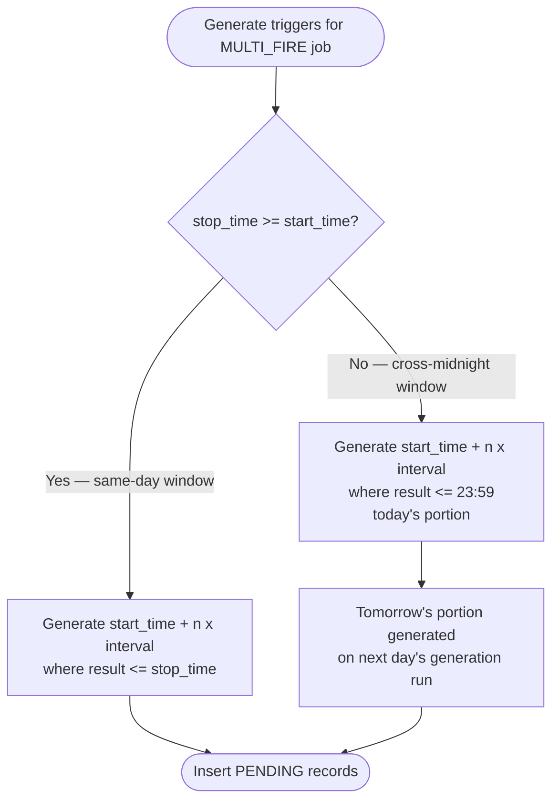
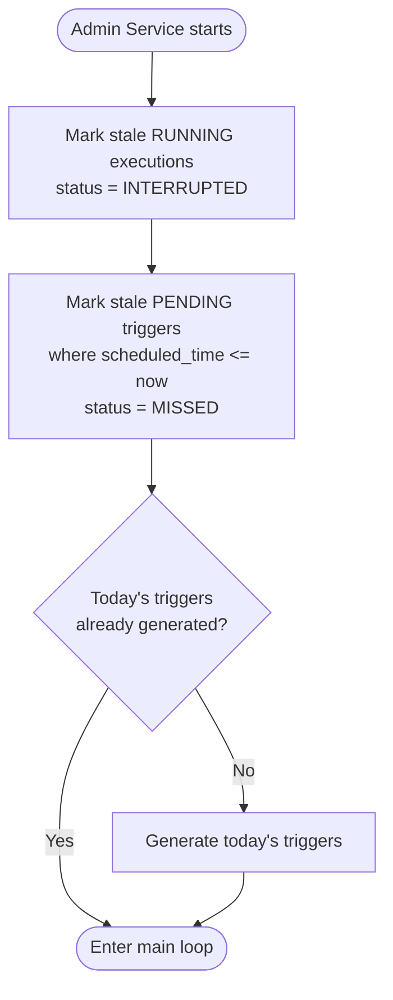
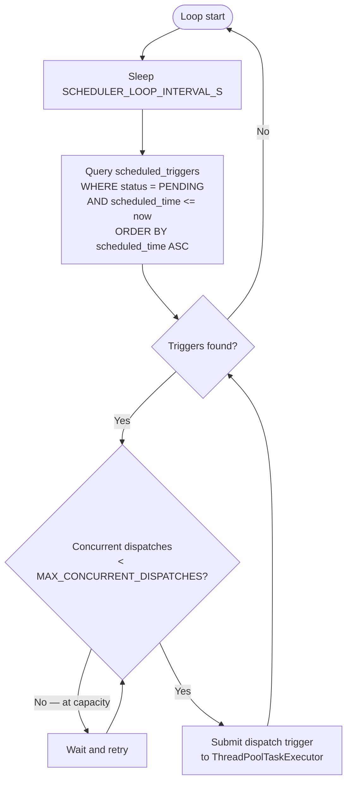
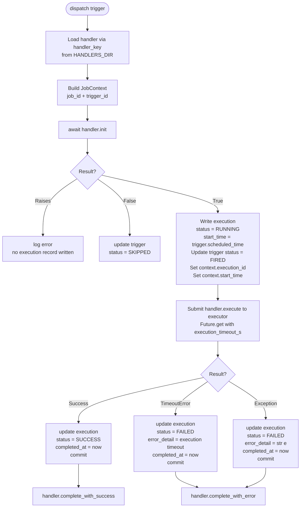
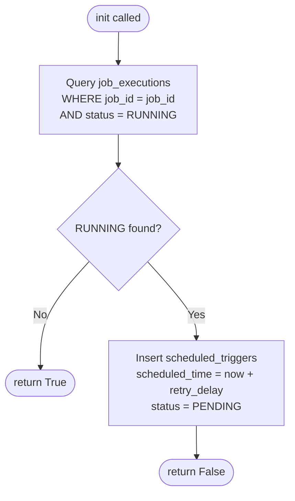
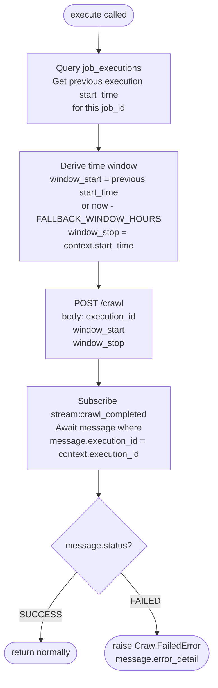

# MWP Admin Service
## Technical Architecture Document — v0.1

| Field | Detail |
|---|---|
| Service Name | MWP Admin Service |
| Document Version | TAD v0.1 |
| Parent System | HK Stock AI Research Assistant |
| Service Responsibility | System configuration, source management, and job scheduling |
| Tech Stack | Java 21 + Spring Boot 3 |
| Dependencies | PostgreSQL 16, Redis, SADI (via API + Redis Streams) |
| Document Status | DRAFT — Work in progress |

---

## Table of Contents

1. [Scheduler Framework](#1-scheduler-framework)
2. [CrawlHandler](#2-crawlhandler)
3. [Source API](#3-source-api)
4. [Redis Stream Signal Specification](#4-redis-stream-signal-specification)
5. [API](#5-api)
6. [Deployment](#6-deployment)
7. [Open Questions](#7-open-questions)

---

## 1. Scheduler Framework

### 1.1 Overview

The Scheduler Framework is a module within MWP Admin Service responsible for time-based job triggering. It reads job configurations from the database, generates scheduled trigger records, and dispatches execution to dynamically loaded handler implementations.

> **Core Principle:** The framework is generic — it has no knowledge of business logic. All business behaviour is encapsulated in handler implementations that conform to the JobHandler contract.

### 1.2 Database Design

#### `scheduled_jobs`

Stores job configuration. One record per named job. Modified by operators only.

| Field | Type | Description |
|---|---|---|
| `job_id` | UUID | Primary key |
| `job_name` | VARCHAR | Human-readable name, e.g. `morning-crawl` |
| `job_type` | ENUM | `SINGLE_FIRE` / `MULTI_FIRE` |
| `handler_key` | VARCHAR | Maps to handler class name and file in handlers directory, e.g. `MORNING_CRAWL` |
| `start_time` | TIME (UTC) | Daily trigger time; for `MULTI_FIRE` defines window start |
| `interval_value` | INTEGER | Null for `SINGLE_FIRE` |
| `interval_unit` | ENUM | `MINUTE` / `HOUR` / `DAY`; Null for `SINGLE_FIRE` |
| `stop_time` | TIME (UTC) | Inclusive final trigger time; Null for `SINGLE_FIRE` |
| `execution_timeout_s` | INTEGER | Execution timeout passed to `Future.get(timeout)`; Null uses `DEFAULT_EXECUTION_TIMEOUT_S` |
| `is_active` | BOOLEAN | Whether this job is currently enabled |
| `created_at` | TIMESTAMPTZ | Record creation time UTC |
| `updated_at` | TIMESTAMPTZ | Last updated time UTC |

**MVP seed data:**

| job_name | job_type | handler_key | start_time | interval_value / unit | stop_time |
|---|---|---|---|---|---|
| `morning-crawl` | `SINGLE_FIRE` | `MORNING_CRAWL` | 14:00 UTC | null / null | null |
| `pre-open-crawl` | `MULTI_FIRE` | `PRE_OPEN_CRAWL` | 00:00 UTC | 15 / `MINUTE` | 01:00 UTC |

#### `scheduled_triggers`

Pre-generated trigger time points for all active jobs. Generated daily at `TRIGGER_GENERATION_TIME`. The main loop polls this table rather than computing trigger times inline.

| Field | Type | Description |
|---|---|---|
| `trigger_id` | UUID | Primary key |
| `job_id` | UUID | FK → `scheduled_jobs.job_id` |
| `scheduled_time` | TIMESTAMPTZ | Pre-computed trigger time UTC; indexed |
| `status` | ENUM | `PENDING` / `FIRED` / `SKIPPED` / `MISSED` |
| `execution_id` | UUID | FK → `job_executions.execution_id`; Null until fired |
| `created_at` | TIMESTAMPTZ | Record creation time UTC |
| `updated_at` | TIMESTAMPTZ | Last updated time UTC |

> **Trigger status flow:** `PENDING` → `FIRED` (normal) / `SKIPPED` (init returned false) / `MISSED` (stale on service restart)

> **Manual re-trigger:** Insert a new `PENDING` record with `scheduled_time = now()`. The main loop picks it up on the next cycle. `stop_time` is not validated at execution time — it is used only during trigger generation.

#### `job_executions`

One record per handler invocation. Written and updated exclusively by the framework.

| Field | Type | Description |
|---|---|---|
| `execution_id` | UUID | Primary key |
| `job_id` | UUID | FK → `scheduled_jobs.job_id` |
| `status` | ENUM | `RUNNING` / `SUCCESS` / `FAILED` / `INTERRUPTED` |
| `start_time` | TIMESTAMPTZ | Written by framework after `init()` returns True; used as `window_stop` by the next execution's handler |
| `completed_at` | TIMESTAMPTZ | Null until terminal state reached |
| `error_detail` | TEXT | Null unless `FAILED` |
| `created_at` | TIMESTAMPTZ | Record creation time UTC |
| `updated_at` | TIMESTAMPTZ | Last updated time UTC |

> **Execution status flow:** `RUNNING` → `SUCCESS` / `FAILED` (exception or timeout) / `INTERRUPTED` (stale on service restart)

### 1.3 Trigger Generation

**Daily generation:** At `TRIGGER_GENERATION_TIME` (00:00 UTC), the framework generates all trigger records for the current day for every `is_active = true` job.

**MULTI_FIRE trigger calculation:**



> `stop_time` is inclusive — the `stop_time` point itself is always generated as a trigger.

### 1.4 Scheduler Main Loop

**Startup sequence:**



**Main loop:**



> Each trigger is dispatched as an independent `Future` submitted to `ThreadPoolTaskExecutor`. The main loop does not await individual dispatches. `MAX_CONCURRENT_DISPATCHES` maps directly to the executor pool size, preventing unbounded concurrency on service restart when many stale `PENDING` triggers may be present.

### 1.5 Handler Contract

#### JobHandler Interface

| Method | Async | Description |
|---|---|---|
| `init(job_id, context)` | Yes | Decides whether execution should proceed. Returns `True` to proceed, `False` to skip. Raises on unrecoverable error. If retry is needed, handler inserts a new `PENDING` trigger before returning `False`. |
| `execute(job_id, context)` | Yes | Core business logic. Subject to `Future.get(execution_timeout_s)` timeout enforced by `JobExecutor`. |
| `complete_with_success(job_id, context)` | No | Called after `SUCCESS` committed. For post-execution business logic. |
| `complete_with_error(job_id, context, error)` | No | Called after `FAILED` committed. For alerting and cleanup. |

#### JobContext

`JobContext` carries information the framework produces or can derive at dispatch time. Handler-specific configuration and query results are the handler's own responsibility.

| Field | Type | Populated by | Description |
|---|---|---|---|
| `job_id` | UUID | Framework at dispatch | From `scheduled_triggers.job_id` |
| `trigger_id` | UUID | Framework at dispatch | From `scheduled_triggers.trigger_id` |
| `execution_id` | UUID | Framework after `init()` returns True | Set after `RUNNING` record written; available to `execute()` and `complete_*()` |
| `start_time` | datetime | Framework after `init()` returns True | Set after `RUNNING` record written; equals `trigger.scheduled_time` |

> `JobContext` is a placeholder in MVP. Per-job metadata fields may be added post-MVP as needed.

> `previous_start_time` is not in context. Handlers that need the previous execution's `start_time` query `job_executions` directly within `execute()`.

#### Handler Loading

Handlers are loaded dynamically at dispatch time via Java reflection. All handler classes live under `HANDLERS_PACKAGE`. The class name must match `handler_key` exactly.

```
com.mwp.admin.handlers/
    MORNING_CRAWL.java     # class MORNING_CRAWL implements JobHandler
    PRE_OPEN_CRAWL.java    # class PRE_OPEN_CRAWL implements JobHandler
```

`JobExecutor` resolves and instantiates the handler at dispatch time:

```
Class<?> clazz = Class.forName(HANDLERS_PACKAGE + "." + job.getHandlerKey())
JobHandler handler = (JobHandler) clazz.getDeclaredConstructor().newInstance()
```

### 1.6 Framework Execution Flow



> `commit()` is called before `complete_with_success` / `complete_with_error`. Terminal state is persisted even if the complete methods raise.

### 1.7 Responsibility Boundary

| Responsibility | Framework | Handler |
|---|---|---|
| Generate daily trigger records | yes | |
| Poll `scheduled_triggers` and dispatch | yes | |
| Limit concurrent dispatches via Semaphore | yes | |
| Dynamically load handler by `handler_key` | yes | |
| Decide whether to execute (conflict detection) | | `init()` |
| Insert retry trigger on conflict | | `init()` |
| Write and update `job_executions` records | yes | |
| Commit execution status to terminal state | yes | |
| Apply `Future.get` execution timeout | yes | |
| Core business execution logic | | `execute()` |
| Query previous execution data | | `execute()` |
| Post-success business logic | | `complete_with_success()` |
| Post-failure business logic | | `complete_with_error()` |
| Recover `RUNNING` → `INTERRUPTED` on startup | yes | |
| Recover `PENDING` trigger → `MISSED` on startup | yes | |
| Generate missed triggers on startup | yes | |

### 1.8 Configuration Parameters

| Parameter | Default | Description |
|---|---|---|
| `DEFAULT_EXECUTION_TIMEOUT_S` | 1800 | Global execution timeout (30 min); overridden per job via `scheduled_jobs.execution_timeout_s` |
| `SCHEDULER_LOOP_INTERVAL_S` | 60 | Main loop wake interval (seconds) |
| `TRIGGER_GENERATION_TIME` | 00:00 UTC | Daily time at which trigger records are generated |
| `FALLBACK_WINDOW_HOURS` | 24 | Crawl window start fallback when no previous execution exists |
| `MAX_CONCURRENT_DISPATCHES` | 10 | `ThreadPoolTaskExecutor` max pool size; limits concurrent dispatch tasks |
| `HANDLERS_DIR` | `handlers/` | Directory containing handler implementations |

---

## 2. CrawlHandler

### 2.1 Overview

`CrawlHandler` is the base behaviour shared by `MORNING_CRAWL` and `PRE_OPEN_CRAWL`. Both trigger SADI's crawl pipeline via `POST /crawl` and await completion via `stream:crawl_completed`. The only behavioural difference is the conflict retry delay.

| handler_key | Job | Conflict retry delay |
|---|---|---|
| `MORNING_CRAWL` | morning-crawl | 30 minutes |
| `PRE_OPEN_CRAWL` | pre-open-crawl | 5 minutes |

### 2.2 `init()`



### 2.3 `execute()`



> `execute()` is subject to `Future.get(execution_timeout_s)` timeout enforced by `JobExecutor`. On timeout, the framework marks the execution `FAILED` and calls `complete_with_error()`.

### 2.4 `complete_with_success()`

No-op in MVP.

### 2.5 `complete_with_error()`

Logs a CRITICAL alert with fields: `job_id`, `execution_id`, `error_detail`.

---

## 3. Source API

### 3.1 `data_sources` Table

Stores configuration for all news sources. Owned and managed exclusively by Admin Service. All other services are read-only consumers via `GET /sources`.

| Field | Type | Description |
|---|---|---|
| `source_id` | UUID | Primary key |
| `source_name` | VARCHAR | Canonical source identifier, e.g. `HKEX`, `MINGPAO`; unique |
| `source_type` | ENUM | `RSS_FULL` / `RSS_CRAWLER` / `API` |
| `priority` | ENUM | `P1` / `P2` / `P3`; controls crawl resource allocation |
| `authority_weight` | FLOAT | Source authority score used by SAPI Rule Score; per-source value |
| `rss_url` | TEXT | RSS feed URL; nullable |
| `base_url` | TEXT | Site root URL for resolving relative paths; nullable |
| `max_concurrent` | INTEGER | Max concurrent crawler coroutines; default 3 |
| `request_interval_min_ms` | INTEGER | Min request interval (ms); default 500 |
| `request_interval_max_ms` | INTEGER | Max request interval (ms); default 1000 |
| `crawl_config` | JSONB | Source-specific config, e.g. CSS selectors, custom headers; `{}` until schema defined |
| `is_active` | BOOLEAN | Whether this source is currently enabled |
| `created_at` | TIMESTAMPTZ | Record creation time UTC |
| `updated_at` | TIMESTAMPTZ | Last updated time UTC |

> `priority` and `authority_weight` are independent fields. `priority` governs crawl ordering and resource allocation. `authority_weight` is the numeric score used in SAPI Rule Score computation and allows per-source fine-tuning independent of tier.

> `crawl_config` schema is pending investigation. All records return `{}` in MVP.

**MVP seed data:**

| source_name | source_type | priority | authority_weight | is_active |
|---|---|---|---|---|
| `HKEX` | `RSS_FULL` | `P1` | 9.0 | true |
| `MINGPAO` | `RSS_CRAWLER` | `P1` | 9.0 | true |
| `AASTOCKS` | `RSS_CRAWLER` | `P2` | 6.0 | true |
| `YAHOO_HK` | `RSS_CRAWLER` | `P2` | 6.0 | true |

> Initial `authority_weight` values follow P1=9.0, P2=6.0 defaults. To be validated against real data in Week 3-4 (PRD OQ-2).

### 3.2 `GET /sources`

Returns all `is_active = true` source records in full. Key design points:

- No query parameters — returns all active sources; consumers filter fields locally
- `crawl_config` always returns `{}` in MVP
- Full API contract (request/response schema) defined in API specification document

### 3.3 Consumer Caching

Each consumer fetches `GET /sources` and caches the result locally in Redis with TTL-based auto-refresh. On Admin API unreachable, consumers fall back to their existing Redis cache.

| Consumer | Fields used | Redis key | Fallback |
|---|---|---|---|
| SADI | All fields | `source:config` (Hash keyed by `source_name`) | Use stale cache; log warning |
| SAPI | `source_name`, `authority_weight` | `source:config` (Hash keyed by `source_name`) | Use default weights P1=9, P2=6, P3=4; log warning |

---

## 4. Redis Stream Signal Specification

Admin Service consumes one Redis Stream produced by SADI, used by CrawlHandler `execute()` to detect crawl completion.

| Stream | Producer | Consumer Group | Message Fields | Role |
|---|---|---|---|---|
| `stream:crawl_completed` | SADI | `admin-scheduler` | `execution_id`, `status` (SUCCESS / FAILED), `error_detail` | CrawlHandler awaits message matching `context.execution_id` to resolve `execute()` |

**Consumption mechanism:** `XREADGROUP COUNT+BLOCK` on `stream:crawl_completed`. Messages remain unACKed until CrawlHandler matches `execution_id` and resolves the result. Unacknowledged messages are reclaimed via `XAUTOCLAIM` after `STREAM_CLAIM_TIMEOUT_MS` and redelivered to the consumer group.

**Retry and Dead Letter:**

| Condition | Action |
|---|---|
| `delivery_count < CRAWL_STREAM_MAX_RETRY` | Redeliver via `XAUTOCLAIM`; CrawlHandler retries matching |
| `delivery_count >= CRAWL_STREAM_MAX_RETRY` | Write to `stream:crawl_completed_dead_letter`; ACK original message; log CRITICAL |

Dead Letter message fields: `execution_id`, `error_detail`, `delivery_count`, `failed_at`.

> In MVP, Dead Letter Stream serves as a monitoring indicator only — no automated reprocessing. Manual intervention required.

---

## 5. API

### 5.1 Endpoints (MVP)

| Method | Endpoint | Description |
|---|---|---|
| GET | `/health` | Service health check |
| GET | `/sources` | Return all active source records; full API contract in API specification document |

### 5.2 `GET /health` Response

| Field | Values | Description |
|---|---|---|
| `status` | healthy / degraded / unhealthy | Overall service status |
| `database` | ok / error | PostgreSQL connectivity |
| `redis` | ok / error | Redis connectivity |
| `scheduler` | ok / error | Scheduler main loop Task status |

HTTP response codes:
- All healthy → `200 healthy`
- Any component degraded → `200 degraded`
- Database or Redis unreachable → `503 unhealthy`

---

## 6. Deployment

### 6.1 Tech Stack

| Component | Choice | Rationale |
|---|---|---|
| Runtime | Java 21 | LTS release; virtual threads available if needed post-MVP |
| Framework | Spring Boot 3 | Native async support via `@Async`; integrates with JPA and Redis |
| Async execution | `@Async` + `ThreadPoolTaskExecutor` | Sufficient for low-concurrency scheduler dispatch; compatible with Spring Data JPA |
| DB client | Spring Data JPA | Standard ORM for Spring Boot; straightforward entity mapping |
| Redis client | Lettuce (via Spring Data Redis) | Default Spring Data Redis client; `RedisTemplate` for stream operations |
| DB migration | Flyway | Standard migration tool for Spring Boot |
| Containerisation | Docker | Independent deployment; docker-compose for local development |

### 6.2 Container Configuration

| Service | Image | Notes |
|---|---|---|
| admin | eclipse-temurin:21-jre-alpine (custom build) | Main Admin Service; includes Scheduler Framework, CrawlHandler, Source API |
| postgres | postgres:16-alpine | Shared with SADI and SAPI; persistent volume mounted |
| redis | redis:7-alpine | Shared with SADI and SAPI |

### 6.3 Environment Variables

| Variable | Default | Description |
|---|---|---|
| `SPRING_DATASOURCE_URL` | — | PostgreSQL JDBC connection string; required |
| `SPRING_DATASOURCE_USERNAME` | — | PostgreSQL username; required |
| `SPRING_DATASOURCE_PASSWORD` | — | PostgreSQL password; required |
| `SPRING_REDIS_URL` | — | Redis connection string; required |
| `SADI_API_URL` | — | SADI service API endpoint; required |
| `DEFAULT_EXECUTION_TIMEOUT_S` | 1800 | Global job execution timeout (seconds) |
| `SCHEDULER_LOOP_INTERVAL_S` | 60 | Scheduler main loop wake interval (seconds) |
| `TRIGGER_GENERATION_TIME` | 00:00 UTC | Daily trigger generation time |
| `FALLBACK_WINDOW_HOURS` | 24 | Crawl window start fallback when no previous execution exists |
| `MAX_CONCURRENT_DISPATCHES` | 10 | `ThreadPoolTaskExecutor` max pool size for dispatch tasks |
| `HANDLERS_PACKAGE` | `com.mwp.admin.handlers` | Package containing handler implementations |
| `STREAM_CLAIM_TIMEOUT_MS` | 30000 | Pending message idle time before XAUTOCLAIM redelivery (ms) |
| `CRAWL_STREAM_MAX_RETRY` | 3 | Max delivery attempts for `stream:crawl_completed` before Dead Letter |

### 6.4 Project Structure

```
admin/
├── src/main/java/com/mwp/admin/
│   ├── scheduler/
│   │   ├── SchedulerLoop.java           # Main loop; startup recovery; trigger dispatch
│   │   ├── JobExecutor.java             # dispatch(); dynamic handler loading; framework execution flow
│   │   ├── TriggerGenerator.java        # MULTI_FIRE calculation; daily generation; cross-midnight logic
│   │   └── JobHandler.java              # JobHandler interface; JobContext class
│   ├── handlers/
│   │   ├── MORNING_CRAWL.java           # class MORNING_CRAWL implements JobHandler
│   │   └── PRE_OPEN_CRAWL.java          # class PRE_OPEN_CRAWL implements JobHandler
│   ├── stream/
│   │   └── CrawlCompletedConsumer.java  # XREADGROUP consumer for stream:crawl_completed; XAUTOCLAIM; Dead Letter
│   ├── api/
│   │   ├── HealthController.java        # GET /health
│   │   └── SourcesController.java       # GET /sources
│   ├── entity/                          # JPA entities: ScheduledJob, ScheduledTrigger, JobExecution, DataSource
│   ├── repository/                      # Spring Data JPA repositories
│   ├── config/
│   │   ├── AppConfig.java               # ThreadPoolTaskExecutor; environment variable binding
│   │   └── RedisConfig.java             # RedisTemplate configuration
│   └── AdminApplication.java            # Spring Boot entry point
├── src/main/resources/
│   ├── application.yml                  # Spring Boot configuration
│   └── db/migration/
│       └── V1__create_tables.sql        # Flyway: scheduled_jobs + scheduled_triggers + job_executions + data_sources schema + seed data
├── Dockerfile
├── pom.xml
└── docker-compose.yml
```

---

## 7. Open Questions

| # | Question | Impact | Target |
|---|---|---|---|
| Q-1 | Validate `DEFAULT_EXECUTION_TIMEOUT_S = 1800s` against real crawl + pipeline completion time | Timeout calibration | Week 1 |
| Q-2 | `POST /crawl` and `GET /sources` full API contracts defined in API specification document | CrawlHandler implementation | Next session |
| Q-3 | `crawl_config` JSONB schema: define structure for CSS selectors, custom headers, and other source-specific crawl parameters | SADI crawl accuracy | Week 1 |
| Q-4 | Validate `authority_weight` initial values (P1=9.0, P2=6.0) against real data; per-source fine-tuning post-validation | SAPI Rule Score calibration | Week 3-4 |

---

*— End of Document | Admin TAD v0.1 | Work in progress —*