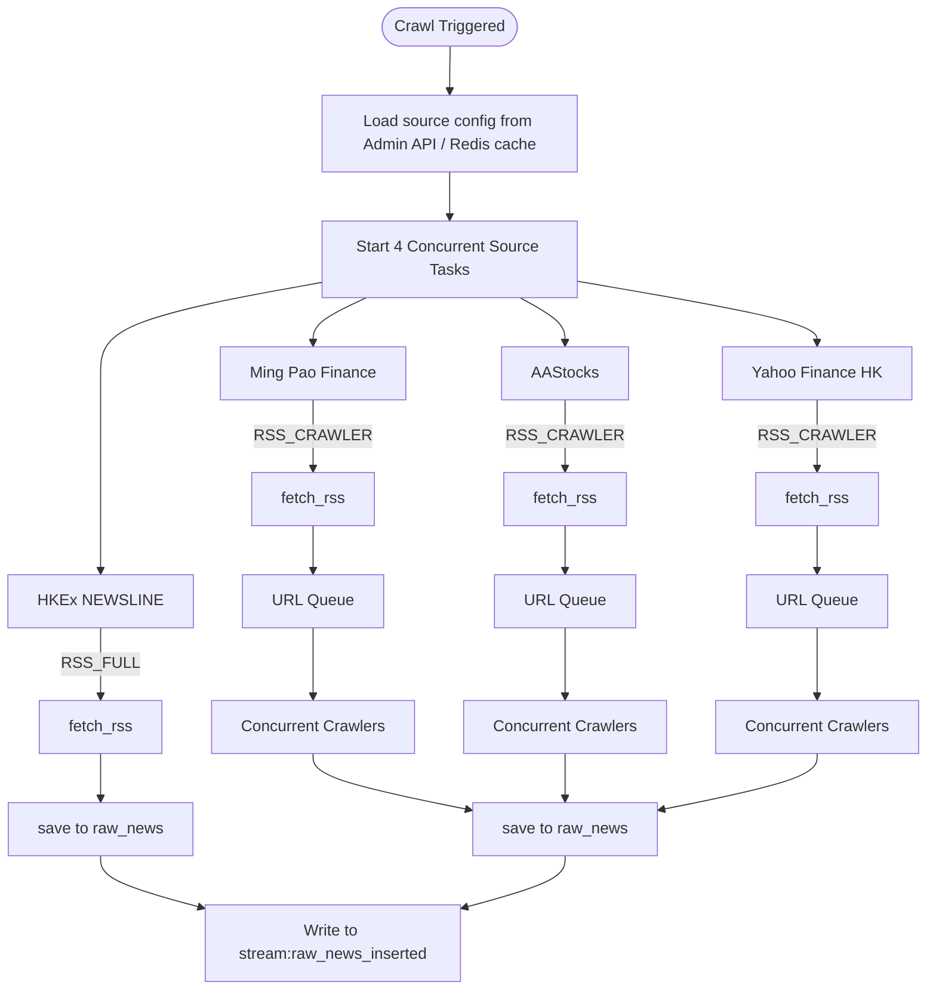

# Stock Assistant Data Ingestion (SADI)
## Technical Architecture Document — v0.6

| Field | Detail |
|---|---|
| Service Name | Stock Assistant Data Ingestion (SADI) |
| Document Version | TAD v0.6 |
| Parent System | HK Stock AI Research Assistant |
| Service Responsibility | News data ingestion and cleaning |
| Tech Stack | Python + asyncio + FastAPI |
| Dependencies | PostgreSQL 16, Redis, MWP Admin Service (via API), Downstream parsing service (via Redis Streams + API) |
| Document Status | DRAFT — Pending team review |

---

## Table of Contents

1. [Service Overview](#1-service-overview)
2. [Data Source Design](#2-data-source-design)
3. [Crawler Layer](#3-crawler-layer)
4. [Cleaning Layer](#4-cleaning-layer)
5. [Redis Stream Signal Specification](#5-redis-stream-signal-specification)
6. [API](#6-api)
7. [Database Retry Strategy](#7-database-retry-strategy)
8. [Coroutine Health Management](#8-coroutine-health-management)
9. [Deployment](#9-deployment)
10. [Open Questions](#10-open-questions)

---

## 1. Service Overview

### 1.1 Responsibility Boundary

SADI is the data entry point of the HK Stock AI Research Assistant. It is responsible for crawling raw content from configured news sources and producing clean, plain-text records for downstream consumption.

> **Core Principle:** SADI only handles data acquisition and pre-processing. It does not participate in any business analysis or content judgment. The only contract with downstream services is: every record's `body_cleaned` field is guaranteed to be plain text.

| Layer | Input | Output | Out of Scope |
|---|---|---|---|
| Crawler | RSS feeds and page URLs from Admin Service source config | `raw_news` records (plain text body) + Redis Stream signal | Content analysis, classification, entity recognition |
| Cleaner | `raw_news` records with no corresponding entry in `cleaned_news` | `cleaned_news` records + Redis Stream signal to downstream | Business rules, scoring, NLP |

### 1.2 Tech Stack

| Component | Choice | Rationale |
|---|---|---|
| Runtime | Python 3.12 | Best ecosystem for crawling and AI/LLM integration |
| Async framework | asyncio | Standard library; optimal for IO-intensive workloads vs threading (GIL limitation) |
| API framework | FastAPI | Native async support; automatic OpenAPI documentation |
| HTTP client | httpx | vs aiohttp: cleaner API, supports sync/async; vs requests: native async support |
| RSS parsing | feedparser | De facto standard for RSS/Atom in Python; no viable alternative |
| Content extraction | trafilatura | vs newspaper3k: actively maintained, lighter, higher body extraction accuracy |
| HTML fallback parser | BeautifulSoup4 | CSS selector override when trafilatura extraction quality is insufficient |
| PDF parsing | pdfplumber | vs PyPDF2: significantly better text extraction for complex layouts |
| Text normalisation | unicodedata (stdlib) | NFKC normalisation for fullwidth-to-halfwidth conversion; zero dependency |
| Hash computation | hashlib (stdlib) | SHA-256 for title deduplication; zero dependency |
| Database client | asyncpg | vs psycopg2: native asyncio driver |
| Redis client | redis-py (asyncio) | Redis Streams for inter-service messaging |
| Database migration | Alembic | Standard Python migration tool; supports versioned seed data |
| Containerisation | Docker | Independent deployment; docker-compose for local development |

---

## 2. Data Source Design

### 2.1 MVP Data Sources

| Source | Type | Language | Strategy | Priority |
|---|---|---|---|---|
| HKEx NEWSLINE | Official RSS | EN / ZH | RSS_FULL — RSS full text, no crawler required | P1 |
| Ming Pao Finance | RSS + Web | Traditional Chinese | RSS_CRAWLER — RSS for URL discovery, Crawler for body | P1 |
| AAStocks | Web | Traditional Chinese | RSS_CRAWLER — RSS for URL discovery, Crawler for body | P2 |
| Yahoo Finance HK | RSS + Web | English | RSS_CRAWLER — RSS for URL discovery, Crawler for body | P2 |

> **Note:** NewsAPI is reserved as a post-MVP data source. New sources are added via Admin Service configuration without code changes.
>
> **Excluded from MVP:** SCMP (paywalled), Bloomberg HK (no stable RSS, strong anti-crawl), Reuters Asia (unstable RSS endpoints — pending Week 1 validation).

### 2.2 Source Configuration — Admin Service

Data source configurations are managed by MWP Admin Service and shared across services. SADI fetches configuration via Admin API and caches it in Redis with TTL-based auto-refresh.

```
Crawl execution requires source config:
├── Redis key exists → read directly
└── Redis key expired or missing
    → fetch from Admin API
    → write to Redis with TTL = SOURCE_CONFIG_TTL_S
    → fallback if Admin API unreachable: use previous Redis cache; log warning
```

> **Note:** SADI does not own the `data_sources` table. Source configuration is the single responsibility of MWP Admin Service. SADI is a read-only consumer of this configuration.

The source config cached in Redis contains the fields required for crawl execution:

| Field | Description |
|---|---|
| source_name | Source identifier, e.g. HKEX, MINGPAO, AASTOCKS, YAHOO_HK |
| source_type | RSS_FULL / RSS_CRAWLER / API — determines crawl strategy branch |
| rss_url | RSS feed URL |
| base_url | Site root URL, used for resolving relative paths |
| is_active | Whether the source is currently enabled |
| priority | P1 / P2 / P3 |
| max_concurrent | Max concurrent crawler coroutines for this source; default 3 |
| request_interval_min_ms | Minimum request interval (ms); default 500 |
| request_interval_max_ms | Maximum request interval (ms); default 1000 |
| crawl_config | Source-specific extension config, e.g. CSS selectors, custom headers |

---

## 3. Crawler Layer

### 3.1 Concurrency Model

The crawler layer is fully async, driven by Python's asyncio event loop. All four sources start concurrently as independent tasks and do not interfere with each other.



### 3.2 Pipeline Model

RSS_CRAWLER sources use a producer-consumer pipeline. RSS fetching (producer) and page crawling (consumer) run concurrently per source — crawling begins as soon as the first URLs are available, without waiting for other sources.

| Role | Implementation | Responsibility |
|---|---|---|
| Producer | `fetch_rss(source)` | Parses RSS feed, filters articles outside the time window, enqueues URLs |
| Consumer | `crawl_worker(queue, source)` | Dequeues URLs, fetches pages, extracts body, writes to `raw_news` |
| Queue | `asyncio.Queue` (one per source) | Decouples producer and consumer throughput; enforces per-source concurrency limit |

### 3.3 Content Format Handling

After fetching a page, the crawler determines the parsing path based on the HTTP response `Content-Type` header. URL suffix is not used — it is unreliable for dynamically generated URLs (e.g. HKEx announcement links).

| Content-Type | Parser | Output |
|---|---|---|
| text/html | trafilatura (auto-extraction); CSS selector override from `crawl_config` if quality is insufficient | Plain text body |
| application/pdf | pdfplumber — extracts PDF text layer; encrypted or scanned PDFs are logged as errors | Plain text body |
| Other | Skip | Logged to `crawl_error_log` with `error_code = UNSUPPORTED_CONTENT_TYPE` |

### 3.4 Crawl Parameters

| Parameter | Default | Description | Config Location |
|---|---|---|---|
| max_concurrent | 3 | Max concurrent crawler coroutines per source | Source config via Admin API |
| request_interval | 500–1000ms random | Random jitter between requests to mimic human behaviour | Source config via Admin API |
| CRAWL_REQUEST_TIMEOUT_S | 10s | Single page fetch timeout | Environment variable |
| CRAWL_MAX_RETRY | 3 | Max retry attempts with exponential backoff | Environment variable |

### 3.5 Retry and Error Handling

Retries are scoped to the stage of failure. Successful stages are not repeated.

**Retryable failures — retry from failed stage only:**

| Failure | Stage | Action |
|---|---|---|
| Connection timeout | Network fetch | Retry fetch; exponential backoff |
| HTTP 500 | Network fetch | Retry fetch; exponential backoff |
| RSS format error | RSS parsing | Retry full source; exponential backoff |
| PDF parse failure (non-encrypted) | Content parsing | Retry parsing only; do not re-fetch page |

**Non-retryable failures — log and discard:**

| Failure | Action |
|---|---|
| HTTP 403 anti-crawl block | Log to `crawl_error_log`; discard URL |
| HTTP 404 not found | Log to `crawl_error_log`; discard URL |
| Encrypted or scanned PDF | Log to `crawl_error_log`; discard URL |
| HTML structure changed (empty body) | Log to `crawl_error_log`; requires manual intervention |
| Unsupported Content-Type | Log to `crawl_error_log`; discard URL |

> **Note:** `crawl_error_log` is a pure audit log and does not drive any retry business logic. Failed URLs within the time window will be re-discovered naturally in the next crawl execution via RSS.

**Retry mechanism:**
- Retries execute within the same coroutine; no database state required
- Backoff formula: `wait = CRAWL_RETRY_BASE_WAIT_MS × 2^(attempt - 1)`
- After exhausting all retries, the final failure is written to `crawl_error_log`
- Database operation retries are handled separately — see [Section 7](#7-database-retry-strategy)

**Crawl-scoped coroutine error handling:**

`rss_fetcher` and `crawl_worker` run for the duration of a single crawl execution and are not managed by Watchdog. On exception:
- Exception is captured at the execution level via `asyncio.gather()`
- Failure is logged to application log and `crawl_error_log`
- Other source Tasks are unaffected and continue running
- Unprocessed URLs in the Queue are discarded; they will be re-discovered naturally in the next crawl execution via RSS

### 3.6 Data Model

**`raw_news` table** — Written by the crawler layer. Never modified after initial insert.

| Field | Type | Description |
|---|---|---|
| raw_id | UUID | Primary key |
| source_name | VARCHAR(50) | Source identifier from Admin Service config, e.g. HKEX, MINGPAO |
| source_url | TEXT | Original article URL; unique index |
| title | TEXT | Original title; never modified |
| body | TEXT | Plain text body guaranteed by crawler layer; never modified |
| published_at | TIMESTAMPTZ | Article publish time UTC; nullable — consuming layers fall back to `created_at` when null |
| created_at | TIMESTAMPTZ | Record creation time UTC |
| raw_hash | VARCHAR(64) | SHA-256(normalised_title); unique index for cross-source deduplication |
| is_deleted | BOOLEAN | Soft delete flag set by cleaning layer for rejected records; default false |
| deleted_reason | VARCHAR(50) | EMPTY_FIELD / DUPLICATE_TITLE / BODY_TOO_SHORT; required when `is_deleted = true` |

**`crawl_error_log` table** — Pure audit log. Does not drive any business decisions.

| Field | Type | Description |
|---|---|---|
| error_id | UUID | Primary key |
| execution_id | UUID | Execution context ID |
| source_name | VARCHAR(50) | Source identifier from Admin Service config, e.g. HKEX, MINGPAO |
| url | TEXT | Failed article URL; null indicates RSS-level failure |
| error_type | VARCHAR(50) | NETWORK / PARSE / STORAGE |
| error_code | VARCHAR(50) | Specific error code, e.g. HTTP_403, PDF_ENCRYPTED, TIMEOUT |
| attempt_count | INTEGER | Total attempts made |
| created_at | TIMESTAMPTZ | Record creation time UTC |

**Index strategy:**

`raw_news`:
- `source_url` — unique index; `INSERT ON CONFLICT DO NOTHING`
- `raw_hash` — unique index; `INSERT ON CONFLICT DO NOTHING`
- `is_deleted` — index
- `created_at` — index

### 3.7 Crawler Data Flow

| Stage | Action | Output |
|---|---|---|
| Crawl triggered | Read time window from request; load `is_active = true` source configs from Redis / Admin API | Time window + source config list |
| Concurrent start | Create one `asyncio.Task` per source; run all via `asyncio.gather()` | 4 concurrent tasks |
| RSS fetch | Parse feed; filter articles outside time window | Article list (title, url, published_at) |
| RSS_FULL save | Write directly to `raw_news`; write to `stream:raw_news_inserted` | `raw_news` record + Stream message |
| RSS_CRAWLER enqueue | Enqueue article URLs into per-source `asyncio.Queue`; crawler workers consume concurrently | URLs in queue |
| Crawler fetch | httpx request; Content-Type detection; trafilatura or pdfplumber parsing | Plain text body |
| Save | Write to `raw_news` (`INSERT ON CONFLICT DO NOTHING`); write to `stream:raw_news_inserted` | `raw_news` record + Stream message |
| Error handling | Retryable: exponential backoff up to max retries. Non-retryable: write to `crawl_error_log` immediately | `crawl_error_log` record |

---

## 4. Cleaning Layer

### 4.1 Overview


### 4.2 Trigger Mechanism

The cleaning layer consumes from `stream:raw_news_inserted` via Redis Streams Consumer Group. Messages are persistent — no fallback polling required.

| Mechanism | Description |
|---|---|
| Primary trigger | Redis Streams `XREADGROUP COUNT+BLOCK` on `stream:raw_news_inserted`; on message received, enqueue `raw_id` to internal queue |
| At-least-once delivery | Unacknowledged messages are automatically redelivered via `XAUTOCLAIM` after `STREAM_CLAIM_TIMEOUT_MS` |
| Service restart recovery | Consumer Group position is preserved in Redis; processing resumes automatically from last ACKed message on restart |

> **Design note:** Redis Streams persistence guarantees no message loss on service restart, eliminating the need for fallback polling. All inter-service signals use Redis Streams exclusively.

**Idempotency:** Before processing, each worker checks whether a record with the same `raw_id` already exists in `cleaned_news`. If so, the record is skipped, ensuring redelivered messages cause no data corruption.

**Concurrency:** Default 5 concurrent workers, configurable via `CLEAN_WORKER_CONCURRENCY`. Guidelines for tuning:
- Workers should not exceed 60% of the database connection pool size
- Recommended pool size: `CPU cores × 2`
- Example: 4-core server → pool size 8 → max clean workers 4

### 4.3 Cleaning Steps

| Step | Operation | On Failure |
|---|---|---|
| 1. Null check | Validate `title` and `body` are not empty | Either null → log rejection (`EMPTY_FIELD`); mark `is_deleted = true` in `raw_news`; stop processing |
| 2. `published_at` check | `published_at` is nullable; no substitution is applied by the cleaning layer. Downstream consuming layers are responsible for falling back to `created_at` when null | Does not block processing |
| 3. Title normalisation | Fullwidth-to-halfwidth (NFKC), strip excess whitespace | Normalisation failure logged as warning; does not block |
| 4. Title hash deduplication | Compute `SHA-256(normalised_title)`; if collision found, retain record with earliest `created_at` | Duplicate → log rejection (`DUPLICATE_TITLE`); mark `is_deleted = true` in `raw_news`; stop processing |
| 5. Body normalisation | Strip excess whitespace and line breaks, fullwidth-to-halfwidth | Normalisation failure logged as warning; does not block |
| 6. Body length check | After normalisation, if `len(body_cleaned) < CLEAN_BODY_MIN_LENGTH` | Too short → log rejection (`BODY_TOO_SHORT`); mark `is_deleted = true` in `raw_news`; stop processing |
| 7. Write to `cleaned_news` | Insert record with `title_cleaned`, `body_cleaned`, `created_at = now()` | On success: write to `stream:raw_news_cleaned`. On failure: do not write to stream — message remains unACKed for redelivery |

> **Rejection logging:** Rejected records are marked `is_deleted = true` with `deleted_reason` in `raw_news`. No entry is written to `cleaned_news`. Rejection details are recorded in application logs only.

### 4.4 Data Model

**`cleaned_news` table** — Written by the cleaning layer. Contains only successfully cleaned records. Consumed by downstream parsing service via API.

| Field | Type | Description |
|---|---|---|
| cleaned_id | UUID | Primary key |
| raw_id | UUID | FK → `raw_news.raw_id`; index for traceability joins |
| title_cleaned | TEXT | Normalised title |
| body_cleaned | TEXT | Normalised plain text body |
| created_at | TIMESTAMPTZ | Record creation time UTC |

**Index strategy:**
- `cleaned_id` — primary key; auto-indexed
- `raw_id` — FK index; used for traceability joins to `raw_news`

### 4.5 Cleaning Data Flow

| Stage | Action | Output |
|---|---|---|
| Stream message received | `XREADGROUP` reads from `stream:raw_news_inserted`; extract `raw_id` from message | `raw_id` enqueued to internal queue |
| Idempotency check | Worker dequeues `raw_id`; checks if `raw_id` exists in `cleaned_news` — skip if found | Skip or proceed |
| Execute cleaning | Run 7-step cleaning sequence (see Section 4.3) | Field updates or soft delete in `raw_news` |
| Write result | Insert into `cleaned_news`; set `created_at = now()` | `cleaned_news` record |
| Signal downstream | Write to `stream:raw_news_cleaned` with `cleaned_id`; ACK original message | Downstream parsing service receives stream message |
| Redelivery | Messages not ACKed within `STREAM_CLAIM_TIMEOUT_MS` are reclaimed via `XAUTOCLAIM` and redelivered | Reprocessed from idempotency check |

---

## 5. Redis Stream Signal Specification

Redis Streams are used as the inter-service messaging mechanism. Each stream message carries only the record ID — receivers fetch full data via database query (internal) or API (external).

| Stream | Producer | Consumer Group | Message Fields | Role |
|---|---|---|---|---|
| `stream:raw_news_inserted` | Crawler layer | `sadi-cleaner` | `raw_id` | Cleaning layer input trigger |
| `stream:raw_news_cleaned` | Cleaning layer | `sapi-nlp` | `cleaned_id` | Downstream parsing service input trigger |

> **Note:** Both connections may point to the same Redis instance in MVP. `stream:raw_news_cleaned` is consumed by SAPI; SADI only produces to this stream and has no dependency on its consumers.

---

## 6. API

SADI exposes a minimal REST API via FastAPI. The API serves two purposes: external trigger for crawl execution, and data access for downstream services.

### 6.1 Endpoints (MVP)

| Method | Endpoint | Description |
|---|---|---|
| POST | `/crawl` | Trigger a crawl execution; accepts optional time window parameter |
| GET | `/health` | Service health check |
| GET | `/cleaned_news/{cleaned_id}` | Return a single cleaned article record by ID |
| POST | `/cleaned_news/batch` | Return multiple cleaned article records by ID list; consumed by downstream parsing service |

### 6.2 `GET /health` Response

| Field | Values | Description |
|---|---|---|
| status | healthy / degraded / unhealthy | Overall service status |
| database | ok / error | Database connectivity |
| redis | ok / error | Redis connectivity |
| coroutines.clean_worker | ok / error | clean_worker coroutine status |
| coroutines.stream_handler | ok / error | stream_handler coroutine status |

HTTP response codes:
- All healthy → `200 healthy`
- Any component degraded → `200 degraded`
- Database or Redis unreachable → `503 unhealthy`

---

## 7. Database Retry Strategy

### 7.1 Scope

Applies to all database write operations within SADI. Retry logic is handled at the asyncpg connection pool layer; business code does not implement retry logic directly.

### 7.2 Failure Classification

| Type | Examples | Action |
|---|---|---|
| Transient failure | Connection timeout, pool exhaustion, temporary network interruption | Retry with exponential backoff |
| Permanent failure | Unique constraint violation, type mismatch, permission error | Raise exception immediately; no retry |

> **Note:** Unique constraint violations (e.g. duplicate `source_url`) are expected behaviour in the crawler layer and are treated as successful idempotent writes, not errors.

### 7.3 Retry Parameters

| Parameter | Default | Description |
|---|---|---|
| DB_MAX_RETRY | 3 | Max retry attempts for database operations |
| DB_RETRY_BASE_WAIT_MS | 100 | Base wait time for exponential backoff (ms) |

Backoff formula: `wait = DB_RETRY_BASE_WAIT_MS × 2^(attempt - 1)`

| Attempt | Wait |
|---|---|
| 1 | 100ms |
| 2 | 200ms |
| 3 | 400ms |

---

## 8. Coroutine Health Management

### 8.1 Managed Coroutines

Watchdog manages only long-running coroutines. Crawl-scoped coroutines (`rss_fetcher`, `crawl_worker`) are handled at the execution level — see Section 3.5.

| Coroutine | Responsibility |
|---|---|
| `clean_worker` | Dequeues raw_ids from internal queue; executes cleaning steps |
| `stream_handler` | Consumes `stream:raw_news_inserted`; enqueues raw_ids to internal queue; writes to `stream:raw_news_cleaned` |

### 8.2 Watchdog Mechanism

Each coroutine is monitored for two failure modes:

**Unexpected exit** — Coroutine terminates due to an unhandled exception. Watchdog detects the exit and immediately restarts the coroutine.

**Deadlock / hang** — Coroutine becomes unresponsive without raising an exception. Each coroutine has a configurable timeout threshold. If exceeded, Watchdog forcibly cancels and restarts the coroutine.

### 8.3 Restart Strategy

- Restart interval uses exponential backoff
- If consecutive restarts exceed `WATCHDOG_MAX_RESTART`, the coroutine is not restarted
- A critical alert is written to the application log
- Manual intervention is required to resume

### 8.4 Watchdog Configuration

| Parameter | Default | Description |
|---|---|---|
| WATCHDOG_CLEAN_WORKER_TIMEOUT_S | 30 | Hang detection threshold for `clean_worker` (seconds) |
| WATCHDOG_STREAM_HANDLER_TIMEOUT_S | 30 | Hang detection threshold for `stream_handler` (seconds) |
| WATCHDOG_MAX_RESTART | 5 | Max consecutive restarts before halting and awaiting manual intervention |

---

## 9. Deployment

### 9.1 Container Configuration

| Service | Image | Notes |
|---|---|---|
| sadi | python:3.12-slim (custom build) | Main SADI service; includes crawler, cleaning layers and API |
| postgres | postgres:16-alpine | Primary database; persistent volume mounted |
| redis | redis:7-alpine | Redis Streams for inter-service messaging; shared with SAPI |

### 9.2 Environment Variables

| Variable | Default | Description |
|---|---|---|
| DATABASE_URL | — | PostgreSQL connection string; required |
| DB_POOL_SIZE | 10 | Database connection pool size |
| DB_MAX_RETRY | 3 | Max database operation retry attempts |
| DB_RETRY_BASE_WAIT_MS | 100 | Database retry base wait time (ms) |
| REDIS_URL | — | Redis connection string; required |
| MWP_ADMIN_API_URL | — | Admin Service API endpoint for source configuration; required |
| SOURCE_CONFIG_TTL_S | 3600 | Source configuration Redis cache TTL (seconds) |
| CRAWL_MAX_RETRY | 3 | Max crawler retry attempts |
| CRAWL_RETRY_BASE_WAIT_MS | 500 | Crawler retry base wait time (ms) |
| CRAWL_REQUEST_TIMEOUT_S | 10 | Single page fetch timeout (seconds) |
| CLEAN_WORKER_CONCURRENCY | 5 | Number of concurrent cleaning workers |
| CLEAN_BODY_MIN_LENGTH | 50 | Minimum body length after cleaning (characters) |
| STREAM_CLAIM_TIMEOUT_MS | 30000 | Message pending time before XAUTOCLAIM redelivery (ms) |
| WATCHDOG_CLEAN_WORKER_TIMEOUT_S | 30 | `clean_worker` hang detection threshold (seconds) |
| WATCHDOG_STREAM_HANDLER_TIMEOUT_S | 30 | `stream_handler` hang detection threshold (seconds) |
| WATCHDOG_MAX_RESTART | 5 | Max consecutive coroutine restarts before halting |

### 9.3 Project Structure

```
sadi/
├── app/
│   ├── crawler/
│   │   ├── feed_fetcher.py          # RSS parsing, fetch_rss()
│   │   ├── page_crawler.py          # HTTP fetch, crawl_with_retry()
│   │   ├── html_parser.py           # trafilatura extraction + BS4 fallback
│   │   ├── pdf_parser.py            # pdfplumber text extraction
│   │   └── crawler_service.py       # process_source(), concurrency orchestration
│   ├── cleaner/
│   │   ├── cleaning_service.py      # Cleaning layer main service, queue management
│   │   ├── stream_handler.py        # Redis Streams consumer/producer
│   │   ├── text_normaliser.py       # Fullwidth conversion, whitespace cleaning
│   │   └── dedup_service.py         # Title hash deduplication logic
│   ├── watchdog/
│   │   └── watchdog.py              # Coroutine health monitoring and restart
│   ├── api/
│   │   ├── routes/
│   │   │   ├── crawl.py             # POST /crawl
│   │   │   ├── health.py            # GET /health
│   │   │   └── cleaned_news.py      # GET /cleaned_news/{cleaned_id}, POST /cleaned_news/batch
│   │   └── main.py                  # FastAPI app initialisation
│   ├── db/
│   │   └── connection.py            # asyncpg connection pool
│   ├── redis/
│   │   └── stream_client.py         # Redis Streams client abstraction
│   ├── admin/
│   │   └── source_config.py         # Admin API client + Redis cache for source config
│   ├── models/                      # Data model definitions
│   ├── config.py                    # Environment variable loading
│   └── main.py                      # Service entry point
├── alembic/
│   └── versions/
│       └── 001_create_tables.py     # Schema creation
├── Dockerfile
├── requirements.txt
└── docker-compose.yml
```

---

## 10. Open Questions

| # | Question | Impact | Target |
|---|---|---|---|
| Q-1 | Validate RSS URLs and CSS selectors for Ming Pao Finance and AAStocks via real crawl test | HTML parsing accuracy | Week 1 |
| Q-2 | Validate whether `CLEAN_BODY_MIN_LENGTH = 50` is appropriate based on real data | BODY_TOO_SHORT rejection rate | Week 2 |
| Q-3 | Assess anti-crawl measures per source: User-Agent, Cookie, or proxy requirements | Crawl success rate | Week 1 |

---

*— End of Document | SADI TAD v0.6 | Pending team review before status change to APPROVED —*