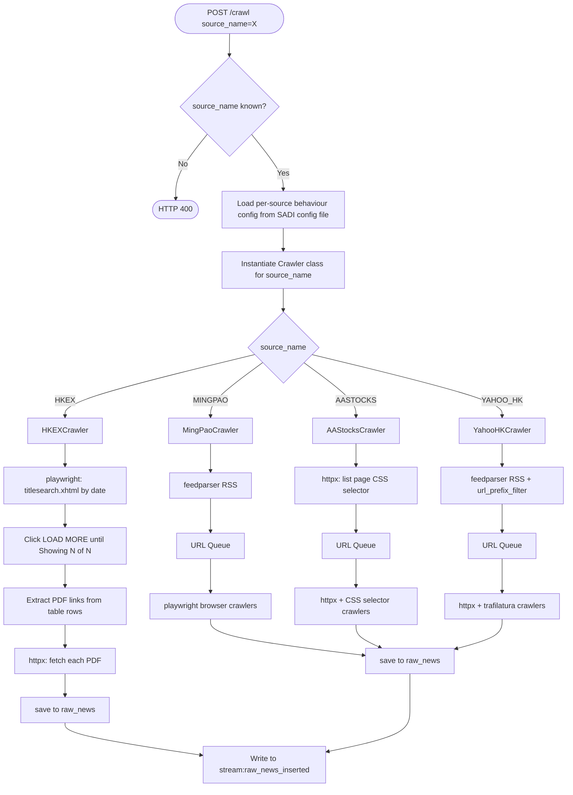
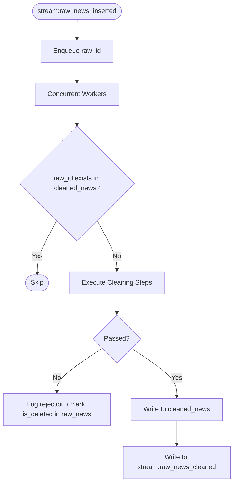

# Stock Assistant Data Ingestion (SADI)
## Technical Architecture Document — v0.8

| Field | Detail |
|---|---|
| Service Name | Stock Assistant Data Ingestion (SADI) |
| Document Version | TAD v0.8 |
| Parent System | HK Stock AI Research Assistant |
| Service Responsibility | News data ingestion and cleaning |
| Tech Stack | Python + asyncio + FastAPI |
| Dependencies | PostgreSQL 16, Redis, Downstream parsing service (via Redis Streams + API) |
| Document Status | DRAFT — Pending team review |

---

## Table of Contents

1. [Service Overview](#1-service-overview)
2. [Data Source Design](#2-data-source-design)
3. [Crawler Layer](#3-crawler-layer)
4. [Cleaning Layer](#4-cleaning-layer)
5. [Redis Stream Signal Specification](#5-redis-stream-signal-specification)
6. [API](#6-api)
7. [Database Retry Strategy](#7-database-retry-strategy)
8. [Deployment](#8-deployment)
9. [Open Questions](#9-open-questions)

---

## 1. Service Overview

### 1.1 Responsibility Boundary

SADI is the data entry point of the HK Stock AI Research Assistant. It is responsible for crawling raw content from configured news sources and producing clean, plain-text records for downstream consumption.

> **Core Principle:** SADI only handles data acquisition and pre-processing. It does not participate in any business analysis or content judgment. The only contract with downstream services is: every record's `body_cleaned` field is guaranteed to be plain text.

| Layer | Input | Output | Out of Scope |
|---|---|---|---|
| Crawler | `source_name` from crawl trigger; per-source crawler implementation in code; per-source behaviour config (concurrency, interval) in SADI config file | `raw_news` records (plain text body) + Redis Stream signal | Content analysis, classification, entity recognition |
| Cleaner | `raw_news` records with no corresponding entry in `cleaned_news` | `cleaned_news` records + Redis Stream signal to downstream | Business rules, scoring, NLP |

### 1.2 Tech Stack

| Component | Choice | Rationale |
|---|---|---|
| Runtime | Python 3.12 | Best ecosystem for crawling and AI/LLM integration |
| Async framework | asyncio | Standard library; optimal for IO-intensive workloads vs threading (GIL limitation) |
| API framework | FastAPI | Native async support; automatic OpenAPI documentation |
| HTTP client | httpx | vs aiohttp: cleaner API, supports sync/async; vs requests: native async support |
| RSS parsing | feedparser | De facto standard for RSS/Atom in Python; no viable alternative |
| Content extraction | trafilatura | vs newspaper3k: actively maintained, lighter, higher body extraction accuracy |
| HTML fallback parser | BeautifulSoup4 | CSS selector override when trafilatura extraction quality is insufficient |
| PDF parsing | pymupdf (fitz) | Primary PDF text extractor; handles standard text-layer PDFs and partial XFA support. pdfminer.six as fallback for complex layouts. Replaces pdfplumber |
| Browser crawler | playwright (async) | Required for sources where TLS fingerprint detection blocks httpx; currently: MINGPAO |
| Text normalisation | unicodedata (stdlib) | NFKC normalisation for fullwidth-to-halfwidth conversion; zero dependency |
| Hash computation | hashlib (stdlib) | SHA-256 for title deduplication; zero dependency |
| Database client | asyncpg | vs psycopg2: native asyncio driver |
| Redis client | redis-py (asyncio) | Redis Streams for inter-service messaging |
| Database migration | Alembic | Standard Python migration tool; supports versioned seed data |
| Containerisation | Docker | Independent deployment; docker-compose for local development |

---

## 2. Data Source Design

### 2.1 MVP Data Sources

| Source | Language | Crawl Strategy |
|---|---|---|
| HKEx NEWSLINE | EN / ZH | `HKEXCrawler` — playwright daily batch pull via `titlesearch.xhtml`; LOAD MORE pagination; PDF direct fetch via httpx |
| Ming Pao Finance | Traditional Chinese | `MingPaoCrawler` — feedparser RSS for URL discovery; playwright headless browser for article body (httpx blocked by TLS fingerprint) |
| AAStocks | Traditional Chinese | `AAStocksCrawler` — httpx list page + CSS selector for URL discovery; httpx + CSS selector for article body |
| Yahoo Finance HK | English | `YahooHKCrawler` — feedparser RSS with `url_prefix_filter` for URL discovery; httpx + trafilatura for article body |

> **Source strategy validation status:** All four sources fully validated as of probe v4 (2026-04-06). See Section 2.3 for per-source implementation details.
>
> **Note:** NewsAPI is reserved as a post-MVP data source. Adding a new source requires implementing a new Crawler class in SADI and adding a corresponding `scheduled_trigger` entry in Admin Service.
>
> **Excluded from MVP:** SCMP (paywalled), Bloomberg HK (no stable RSS, strong anti-crawl), Reuters Asia (unstable RSS endpoints).

### 2.2 Source Configuration — Responsibility Split

Source configuration is split across two boundaries by nature of the data:

| Config Category | Fields | Owner | Rationale |
|---|---|---|---|
| Scheduling | Crawl frequency, enabled/disabled per source | Admin Service `scheduled_triggers` table | Business decisions; managed by operators |
| Crawl behaviour config | `max_concurrent`, `request_interval_min_ms`, `request_interval_max_ms` | SADI config file (per-source) | Runtime tuning parameters; no code change required; not business decisions |
| Crawl logic | URL patterns, CSS selectors, pagination, parsers | SADI codebase (per-source Crawler class) | Tightly coupled to site structure; requires code change when sites change |

**`source_name` validation:**

SADI validates the `source_name` in each crawl request against its own set of implemented Crawler classes. If the `source_name` does not match a known Crawler class, the request is rejected with HTTP 400. SADI has no runtime dependency on Admin Service.

```
Crawl triggered with source_name:
├── source_name matches a known Crawler class → load per-source behaviour config → execute Crawler
└── source_name unknown → reject with HTTP 400; log warning
```

**SADI config file — per-source behaviour parameters:**

```yaml
crawl_sources:
  HKEX:
    max_concurrent: 5
    request_interval_min_ms: 500
    request_interval_max_ms: 1000
  MINGPAO:
    max_concurrent: 3
    request_interval_min_ms: 500
    request_interval_max_ms: 1000
  AASTOCKS:
    max_concurrent: 3
    request_interval_min_ms: 500
    request_interval_max_ms: 1000
  YAHOO_HK:
    max_concurrent: 3
    request_interval_min_ms: 500
    request_interval_max_ms: 1000
```

> **HKEX note:** HKEX crawls in two phases. **Phase 1** (LOAD MORE pagination in a single playwright session) is inherently sequential and ignores `max_concurrent`. **Phase 2** (parallel PDF fetch via httpx) uses `max_concurrent` to bound the number of concurrent PDF downloads.

### 2.3 Per-Source Implementation Guide

This section documents the implementation details for each source crawler. It is intended for developers writing the Crawler class for each source. All times are stored as UTC in the database; all source timestamps are HKT (UTC+8) unless otherwise noted.

---

**HKEX (`HKEXCrawler`)**

| Item | Detail |
|---|---|
| Entry point | `https://www1.hkexnews.hk/search/titlesearch.xhtml?lang=EN&category=0&market=SEHK&searchType=0&stockId=&from={date}&to={date}&title=` |
| Date format | URL parameter: `YYYYMMDD` (e.g. `20260402`). Note: the form's hidden input uses `YYYY-MM-DD` and visible input uses `YYYY/MM/DD` — these are managed by the page's JSF state and must not be manually constructed. Only the URL parameter needs to be set by the crawler. |
| Browser required | Yes — LOAD MORE triggers a JSF full-page POST that maintains `javax.faces.ViewState` session state; httpx cannot replicate this |
| playwright `waitUntil` | `domcontentloaded` |
| Pagination | Click `a.component-loadmore__link` repeatedly. Termination: read text from `.component-loadmore-leftPart__container` (e.g. `"Showing 1471 of 1471 records"`); extract both integers with regex; stop when equal |
| Estimated crawl time | ~14 LOAD MORE clicks × ~3,174ms/click ≈ 44s for a full trading day (~1,471 records) |
| Row extraction | `table tbody tr` — extract per row: PDF link (`td > div.doc-link > a[href$='.pdf']`), headline (`td > div.headline`), release time (`td.release-time`), stock code (`td.stock-short-code`) |
| PDF fetch | httpx direct GET; no session cookie required (`credentials: 'omit'` returns HTTP 200). PDF links are fully public |
| PDF base URL | `https://www1.hkexnews.hk` — prepend to relative PDF hrefs |
| PDF parsing | pymupdf (fitz) primary → pdfminer.six fallback for complex layouts. Two sub-types: standard text-layer PDF (most announcements) and XFA form PDF (e.g. Next Day Disclosure Returns). Encrypted or scanned PDFs: log error, discard |
| `published_at` | Raw format: `DD/MM/YYYY HH:mm` (e.g. `02/04/2026 22:59`). Timezone: HKT (UTC+8). Convert to UTC before storing |
| Deduplication | PDF URL (`source_url`). `newsId` is not available in search result HTML |
| Stock code | Extracted from search result table (`td.stock-short-code`). One row may list multiple short codes (multi-issuer announcement); store all of them in `raw_news.extra_metadata` as `{"stock_code": ["00700", "00388"]}` (always a list, even when only one code is present). `body` is not modified |
| playwright instance | Shared with MINGPAO (same `Browser` process, separate `BrowserContext`). Context is created fresh per crawl execution and closed on completion |

---

**MINGPAO (`MingPaoCrawler`)**

| Item | Detail |
|---|---|
| RSS URL | `https://news.mingpao.com/rss/pns/s00004.xml` |
| RSS auth | None — bare httpx GET works |
| RSS entry count | ~26 entries per poll |
| RSS `published_at` | RFC 822 format with explicit timezone (e.g. `Mon, 06 Apr 2026 01:03:00 +0800`). feedparser parses this into `time.struct_time`; convert explicitly to UTC before storing |
| Article fetch | playwright headless browser required — httpx returns HTTP 403 due to TLS fingerprint detection. No paywall, no login required |
| playwright `waitUntil` | `domcontentloaded` (~2,226ms). Do not use `networkidle` (~5,871ms) — unnecessary overhead; `<article>` is available at domContentLoaded |
| Article body selector | `article` — captures full article body (~950 chars average) |
| `published_at` fallback | If RSS `published` field is missing, extract from article page `<time>` element innerText using regex `\d{4}年\d{1,2}月\d{1,2}日.*?\d{1,2}:\d{2}[AP]M` |
| playwright instance | Shared with HKEX (same `Browser` process, separate `BrowserContext`). Multiple page workers within MINGPAO share the same `BrowserContext`. Context is created fresh per crawl execution and closed on completion |

---

**AASTOCKS (`AAStocksCrawler`)**

| Item | Detail |
|---|---|
| List page URL | `https://www.aastocks.com/tc/stocks/news/aafn/latest-news` |
| Language requirement | `/tc/` URL path prefix is required for Traditional Chinese. `?totc=1` query parameter is ineffective |
| List page entry count | 9 articles per fetch. No pagination, no LOAD MORE. Coverage depends on crawl frequency configured in Admin Service `scheduled_triggers` |
| URL discovery selector | `a[href*='/aafn-con/NOW.']` — extracts article URLs from list page |
| Article fetch | httpx (no browser required; no anti-crawl measures detected) |
| Article body selector | `[class*='newscon']` — matches class `newscontent5 fLevel3`; captures article body (~361 chars average) |
| `published_at` | Extracted from visible page text via regex `\d{4}/\d{2}/\d{2}\s+\d{2}:\d{2}` (e.g. `2026/04/06 01:27`). Not available in meta tags. Timezone: HKT (UTC+8). Convert to UTC before storing |

---

**YAHOO_HK (`YahooHKCrawler`)**

| Item | Detail |
|---|---|
| RSS URL | `https://hk.finance.yahoo.com/news/rssindex` |
| RSS auth | None |
| RSS entry count | 5 entries per poll |
| URL filter | RSS feed mixes real article URLs with `promotions.yahoo.com` ad URLs. Filter: retain only entries whose URL contains `hk.finance.yahoo.com/news/` |
| Article fetch | httpx (no browser required) |
| Article body extraction | trafilatura auto-extraction (~739 chars average). No CSS selector override required |
| `published_at` | From RSS `published` field. RFC 822 format; feedparser parses automatically. Convert to UTC before storing |
| Coverage gap detection | RSS returns only 5 entries per poll. If the oldest entry in a poll has `published_at` newer than the previous crawl's execution time, log a warning: potential entries may have been missed. Crawl frequency is managed by Admin Service `scheduled_triggers` |

---

## 3. Crawler Layer

### 3.1 Concurrency Model

The crawler layer is fully async, driven by Python's asyncio event loop. Each crawl execution targets a single source, specified by `source_name` in the trigger request. The Crawler class for that source is instantiated and executed as an asyncio Task.



### 3.2 Pipeline Model

The crawler layer uses a strategy pattern. Each source has a dedicated Crawler class; `source_name` is the dispatch key. There is no generic `source_type` field — routing is determined at code level, not by runtime config.

| Crawler Class | Source | List Discovery | Body Fetch |
|---|---|---|---|
| `HKEXCrawler` | HKEX | playwright: `titlesearch.xhtml` by date; LOAD MORE until all records shown (~14 clicks, ~44s) | httpx + pymupdf (PDF direct link, no auth required) |
| `YahooHKCrawler` | YAHOO_HK | feedparser RSS + `url_prefix_filter` | httpx + trafilatura |
| `MingPaoCrawler` | MINGPAO | feedparser RSS | playwright headless browser + `article` CSS selector |
| `AAStocksCrawler` | AASTOCKS | httpx list page + CSS selector `a[href*='/aafn-con/NOW.']` | httpx + CSS selector `[class*='newscon']` |

For strategies with a URL discovery phase, a producer-consumer pipeline is used. URL discovery (producer) and page crawling (consumer) run concurrently — crawling begins as soon as the first URLs are available.

| Role | Implementation | Responsibility |
|---|---|---|
| Producer | `fetch_rss(source)` or `fetch_list_page(source)` | Discovers article URLs; enqueues URLs |
| Consumer | `crawl_worker(queue, source)` | Dequeues URLs; fetches pages; extracts body; writes to `raw_news` |
| Queue | `asyncio.Queue` (one per source) | Decouples producer and consumer throughput; enforces per-source concurrency limit |

> **BROWSER_CRAWLER note:** playwright browser instances are initialised once per crawl execution and shared across workers for the same source. Each instance uses a fresh browser context (no cookie persistence between executions) to avoid session state accumulation.

### 3.3 Content Format Handling

After fetching a page, the crawler determines the parsing path based on the HTTP response `Content-Type` header. URL suffix is not used — it is unreliable for dynamically generated URLs (e.g. HKEx announcement links).

| Content-Type | Source | Parser | Notes |
|---|---|---|---|
| `application/pdf` | HKEX | pymupdf (fitz) primary → pdfminer.six fallback | Two PDF sub-types exist: standard text-layer PDF (most announcements) and XFA form PDF (e.g. Next Day Disclosure Returns generated by Adobe Experience Manager). pymupdf handles both; pdfminer.six is fallback for complex layouts. Encrypted or scanned PDFs are logged as errors |
| `text/html` via playwright | MINGPAO | playwright + `article` CSS selector | httpx blocked by TLS fingerprint detection; playwright headless browser required. Body ~950 chars in Traditional Chinese. No paywall |
| `text/html` via httpx | AASTOCKS | CSS selector `[class*='newscon']` | Matches class `newscontent5 fLevel3`. Traditional Chinese requires `/tc/` URL prefix |
| `text/html` via httpx | YAHOO_HK | trafilatura (auto-extraction) | No CSS override needed; trafilatura extraction quality sufficient (~739 chars) |
| Other | All | Skip | Logged to `crawl_error_log` with `error_code = UNSUPPORTED_CONTENT_TYPE` |

### 3.4 Crawl Parameters

| Parameter | Default | Description | Config Location |
|---|---|---|---|
| max_concurrent | 3 (HKEX: 1) | Max concurrent crawler coroutines per source | SADI config file (per-source) |
| request_interval | 500–1000ms random | Random jitter between requests to mimic human behaviour | SADI config file (per-source) |
| CRAWL_REQUEST_TIMEOUT_S | 10s | Single page fetch timeout | Environment variable |
| CRAWL_MAX_RETRY | 3 | Max retry attempts with exponential backoff | Environment variable |

### 3.5 Retry and Error Handling

Retries are scoped to the stage of failure. Successful stages are not repeated.

**Retryable failures — retry from failed stage only:**

| Failure | Stage | Action |
|---|---|---|
| Connection timeout | Network fetch | Retry fetch; exponential backoff |
| HTTP 500 | Network fetch | Retry fetch; exponential backoff |
| RSS format error | RSS parsing | Retry full source; exponential backoff |
| PDF parse failure (non-encrypted) | Content parsing | Retry parsing only; do not re-fetch page |

**Non-retryable failures — log and discard:**

| Failure | Action |
|---|---|
| HTTP 403 anti-crawl block | Log to `crawl_error_log`; discard URL |
| HTTP 404 not found | Log to `crawl_error_log`; discard URL |
| Encrypted or scanned PDF | Log to `crawl_error_log`; discard URL |
| HTML structure changed (empty body) | Log to `crawl_error_log`; requires manual intervention |
| Unsupported Content-Type | Log to `crawl_error_log`; discard URL |

> **Note:** `crawl_error_log` is a pure audit log and does not drive any retry business logic. For RSS-based sources (MINGPAO, YAHOO_HK), failed URLs within the time window will be re-discovered naturally in the next crawl execution. For non-RSS sources (HKEX, AASTOCKS), failed URLs within the same day's batch will not be automatically retried — manual intervention or next-day re-crawl is required.

**Retry mechanism:**
- Retries execute within the same coroutine; no database state required
- Backoff formula: `wait = CRAWL_RETRY_BASE_WAIT_MS × 2^(attempt - 1)`
- After exhausting all retries, the final failure is written to `crawl_error_log`
- Database operation retries are handled separately — see [Section 7](#7-database-retry-strategy)

**Crawl-scoped coroutine error handling:**

`rss_fetcher` and `crawl_worker` run for the duration of a single crawl execution. On exception:
- Exception is captured at the execution level via `asyncio.gather()`
- RSS-level failure (e.g. RSS fetch fails after all retries): logged to application log only — no `crawl_error_log` entry. There is no URL to skip in future executions; the feed will be retried fresh on the next crawl cycle.
- URL-level failure (per-article): logged to `crawl_error_log`. `PageCrawler` checks this table before fetching to skip known-bad URLs in future executions.
- Unprocessed URLs in the Queue are discarded; for RSS-based sources they will be re-discovered naturally in the next crawl execution

### 3.6 Data Model

**`raw_news` table** — Written by the crawler layer. Never modified after initial insert.

| Field | Type | Description |
|---|---|---|
| raw_id | UUID | Primary key |
| source_name | VARCHAR(50) | Source identifier from crawl trigger, e.g. HKEX, MINGPAO |
| source_url | TEXT | Original article URL; unique index |
| title | TEXT | Original title; never modified |
| body | TEXT | Plain text body guaranteed by crawler layer; never modified |
| published_at | TIMESTAMPTZ | Article publish time UTC; nullable — consuming layers fall back to `created_at` when null |
| created_at | TIMESTAMPTZ | Record creation time UTC |
| raw_hash | VARCHAR(64) | SHA-256(normalised_title); unique index for cross-source deduplication |
| extra_metadata | JSONB | Source-specific structured metadata; e.g. `{"stock_code": ["00700", "00388"]}` for HKEX (always a list, even for single-issuer rows). Nullable |
| is_deleted | BOOLEAN | Soft delete flag set by cleaning layer for rejected records; default false |
| deleted_reason | VARCHAR(50) | EMPTY_FIELD / DUPLICATE_TITLE / BODY_TOO_SHORT; required when `is_deleted = true` |

**`crawl_error_log` table** — Pure audit log. Does not drive any business decisions.

| Field | Type | Description |
|---|---|---|
| error_id | UUID | Primary key |
| execution_id | UUID | Correlation ID from `POST /crawl` request body; nullable if crawl was triggered outside Admin Service context |
| source_name | VARCHAR(50) | Source identifier from crawl trigger, e.g. HKEX, MINGPAO |
| url | TEXT | Failed article URL; always non-null — only URL-level failures are logged here |
| error_type | VARCHAR(50) | NETWORK / PARSE / STORAGE |
| error_code | VARCHAR(50) | Specific error code, e.g. HTTP_403, PDF_ENCRYPTED, TIMEOUT |
| attempt_count | INTEGER | Total attempts made |
| created_at | TIMESTAMPTZ | Record creation time UTC |

**Index strategy:**

`raw_news`:
- `source_url` — unique index; `INSERT ON CONFLICT DO NOTHING`
- `raw_hash` — unique index; `INSERT ON CONFLICT DO NOTHING`
- `is_deleted` — index
- `created_at` — index
- `extra_metadata` — GIN index for JSONB key lookup

### 3.7 Crawler Data Flow

| Stage | Action | Output |
|---|---|---|
| Crawl triggered | Validate `source_name` against known Crawler classes (HTTP 400 if unknown); load per-source behaviour config from SADI config file; instantiate Crawler class | Crawler instance ready |
| **HKEX** — titlesearch batch | playwright GET `titlesearch.xhtml?from={date}&to={date}` (date format: `YYYYMMDD`); click LOAD MORE until regex extracts equal integers from `.component-loadmore-leftPart__container` (≤15 clicks, ~44s total); extract all rows: PDF link, headline, stock code, release time | Full PDF link list for the day |
| **HKEX** — PDF fetch | httpx GET each PDF URL (direct link, no auth, no cookie); pymupdf → pdfminer.six fallback; dedup by PDF URL; write stock code to `extra_metadata.stock_code` | Plain text body + metadata |
| **MINGPAO** — RSS fetch | feedparser GET RSS (bare request, no auth); returns ~26 entries; `published_at` from RFC 822 `published` field converted to UTC | Article list (title, url, published_at) |
| **MINGPAO** — Browser crawl | playwright headless browser GET article URL (`waitUntil='domcontentloaded'`); extract with `article` CSS selector; fallback `published_at` from `<time>` innerText if RSS field missing | Plain text body |
| **AASTOCKS** — List fetch | httpx GET list page (`/tc/` prefix); CSS selector `a[href*='/aafn-con/NOW.']` extracts 9 article URLs | Article URL list |
| **AASTOCKS** — Article crawl | httpx GET article URL (`/tc/` prefix); CSS selector `[class*='newscon']` extracts body; regex extracts `published_at` from visible text (format: `YYYY/MM/DD HH:mm`); convert HKT→UTC | Plain text body |
| **YAHOO_HK** — RSS fetch | feedparser GET RSS; apply `url_prefix_filter` (`hk.finance.yahoo.com/news/`) to discard ad URLs; returns ≤5 real entries; `published_at` from RSS `published` field converted to UTC | Article list (title, url, published_at) |
| **YAHOO_HK** — Coverage check | If oldest entry `published_at` > previous crawl execution time: log warning (potential gap) | Warning log entry |
| **YAHOO_HK** — Article crawl | httpx GET article URL; trafilatura auto-extraction | Plain text body |
| Save | Write to `raw_news` (`INSERT ON CONFLICT DO NOTHING`); write to `stream:raw_news_inserted` | `raw_news` record + Stream message |
| Signal completion | After all records for this execution written: write to `stream:crawl_completed` with `execution_id` (from request) + `status=SUCCESS` | Admin CrawlHandler unblocks |
| Error handling | Retryable: exponential backoff up to max retries. Non-retryable: write to `crawl_error_log` immediately; on fatal source-level failure write `stream:crawl_completed` with `status=FAILED` | `crawl_error_log` record |

---

## 4. Cleaning Layer

### 4.1 Overview



### 4.2 Trigger Mechanism

The cleaning layer consumes from `stream:raw_news_inserted` via Redis Streams Consumer Group. Messages are persistent — no fallback polling required.

| Mechanism | Description |
|---|---|
| Primary trigger | Redis Streams `XREADGROUP COUNT+BLOCK` on `stream:raw_news_inserted`; on message received, enqueue `raw_id` to internal queue |
| At-least-once delivery | Unacknowledged messages are automatically redelivered via `XAUTOCLAIM` after `STREAM_CLAIM_TIMEOUT_MS` |
| Service restart recovery | Consumer Group position is preserved in Redis; processing resumes automatically from last ACKed message on restart |

> **Design note:** Redis Streams persistence guarantees no message loss on service restart, eliminating the need for fallback polling. All inter-service signals use Redis Streams exclusively.

**Idempotency:** Before processing, each worker checks whether a record with the same `raw_id` already exists in `cleaned_news`. If so, the record is skipped, ensuring redelivered messages cause no data corruption.

**Concurrency:** Default 5 concurrent workers, configurable via `CLEAN_WORKER_CONCURRENCY`. Guidelines for tuning:
- Workers should not exceed 60% of the database connection pool size
- Recommended pool size: `CPU cores × 2`
- Example: 4-core server → pool size 8 → max clean workers 4

### 4.3 Cleaning Steps

| Step | Operation | On Failure |
|---|---|---|
| 1. Null check | Validate `title` and `body` are not empty | Either null → log rejection (`EMPTY_FIELD`); mark `is_deleted = true` in `raw_news`; stop processing |
| 2. `published_at` check | `published_at` is nullable; no substitution is applied by the cleaning layer. Downstream consuming layers are responsible for falling back to `created_at` when null | Does not block processing |
| 3. Title normalisation | Fullwidth-to-halfwidth (NFKC), strip excess whitespace | Normalisation failure logged as warning; does not block |
| 4. Title hash deduplication | Compute `SHA-256(normalised_title)`; if collision found, retain record with earliest `created_at` | Duplicate → log rejection (`DUPLICATE_TITLE`); mark `is_deleted = true` in `raw_news`; stop processing |
| 5. Body normalisation | Strip excess whitespace and line breaks, fullwidth-to-halfwidth | Normalisation failure logged as warning; does not block |
| 6. Body length check | After normalisation, if `len(body_cleaned) < CLEAN_BODY_MIN_LENGTH` | Too short → log rejection (`BODY_TOO_SHORT`); mark `is_deleted = true` in `raw_news`; stop processing |
| 7. Write to `cleaned_news` | Insert record with `title_cleaned`, `body_cleaned`, `created_at = now()` | On success: write to `stream:raw_news_cleaned`. On failure: do not write to stream — message remains unACKed for redelivery |

> **Rejection logging:** Rejected records are marked `is_deleted = true` with `deleted_reason` in `raw_news`. No entry is written to `cleaned_news`. Rejection details are recorded in application logs only.

### 4.4 Data Model

**`cleaned_news` table** — Written by the cleaning layer. Contains only successfully cleaned records. Consumed by downstream parsing service via API.

| Field | Type | Description |
|---|---|---|
| cleaned_id | UUID | Primary key |
| raw_id | UUID | FK → `raw_news.raw_id`; index for traceability joins |
| title_cleaned | TEXT | Normalised title |
| body_cleaned | TEXT | Normalised plain text body |
| created_at | TIMESTAMPTZ | Record creation time UTC |

**Index strategy:**
- `cleaned_id` — primary key; auto-indexed
- `raw_id` — FK index; used for traceability joins to `raw_news`

### 4.5 Cleaning Data Flow

| Stage | Action | Output |
|---|---|---|
| Stream message received | `XREADGROUP` reads from `stream:raw_news_inserted`; extract `raw_id` from message | `raw_id` enqueued to internal queue |
| Idempotency check | Worker dequeues `raw_id`; checks if `raw_id` exists in `cleaned_news` — skip if found | Skip or proceed |
| Execute cleaning | Run 7-step cleaning sequence (see Section 4.3) | Field updates or soft delete in `raw_news` |
| Write result | Insert into `cleaned_news`; set `created_at = now()` | `cleaned_news` record |
| Signal downstream | Write to `stream:raw_news_cleaned` with `cleaned_id`; ACK original message | Downstream parsing service receives stream message |
| Redelivery | Messages not ACKed within `STREAM_CLAIM_TIMEOUT_MS` are reclaimed via `XAUTOCLAIM` and redelivered | Reprocessed from idempotency check |

---

## 5. Redis Stream Signal Specification

Redis Streams are used as the inter-service messaging mechanism. Each stream message carries only the record ID — receivers fetch full data via database query (internal) or API (external).

| Stream | Producer | Consumer Group | Message Fields | Role |
|---|---|---|---|---|
| `stream:raw_news_inserted` | Crawler layer | `sadi-cleaner` | `raw_id` | Cleaning layer input trigger |
| `stream:raw_news_cleaned` | Cleaning layer | `sapi-nlp` | `cleaned_id` | Downstream parsing service input trigger |
| `stream:crawl_completed` | Crawler layer | `admin-scheduler` | `execution_id`, `status` (SUCCESS / FAILED), `error_detail` | Admin Service CrawlHandler completion signal |

> `stream:crawl_completed` is written by the Crawler layer immediately after all `raw_news` records for the execution have been written — before the Cleaning layer processes them. `execution_id` is echoed from the `POST /crawl` request body. `error_detail` is null on SUCCESS.

> `stream:raw_news_cleaned` is consumed by SAPI; SADI only produces to this stream and has no dependency on its consumers.

> All three streams may point to the same Redis instance in MVP.

---

## 6. API

SADI exposes a minimal REST API via FastAPI. The API serves two purposes: external trigger for crawl execution, and data access for downstream services.

### 6.1 Endpoints (MVP)

| Method | Endpoint | Description |
|---|---|---|
| POST | `/crawl` | Trigger a crawl execution; `source_name` is required |
| GET | `/health` | Service health check |
| GET | `/cleaned_news/{cleaned_id}` | Return a single cleaned article record by ID |
| POST | `/cleaned_news/batch` | Return multiple cleaned article records by ID list; consumed by downstream parsing service |

**`POST /crawl` request body:**

| Field | Type | Required | Description |
|---|---|---|---|
| source_name | STRING | Yes | Source identifier: `HKEX`, `MINGPAO`, `AASTOCKS`, `YAHOO_HK`. Must match a known Crawler class in SADI |
| date | STRING | No | Target date for HKEX batch pull, format `YYYYMMDD`. Defaults to current date if omitted. Ignored for non-HKEX sources |

> **Note:** `source_name` is mandatory. Requests without `source_name` or with an unknown `source_name` are rejected with HTTP 400. Each scheduled trigger in Admin Service maps to one `POST /crawl` call with a specific `source_name`; scheduling frequency is configured per-source in Admin Service `scheduled_triggers`.

### 6.2 `GET /health` Response

| Field | Values | Description |
|---|---|---|
| status | healthy / degraded / unhealthy | Overall service status |
| database | ok / error | Database connectivity |
| redis | ok / error | Redis connectivity |

HTTP response codes:
- All healthy → `200 healthy`
- Any component degraded → `200 degraded`
- Database or Redis unreachable → `503 unhealthy`

---

## 7. Database Retry Strategy

### 7.1 Scope

Applies to all database write operations within SADI. Retry logic is handled at the asyncpg connection pool layer; business code does not implement retry logic directly.

### 7.2 Failure Classification

| Type | Examples | Action |
|---|---|---|
| Transient failure | Connection timeout, pool exhaustion, temporary network interruption | Retry with exponential backoff |
| Permanent failure | Unique constraint violation, type mismatch, permission error | Raise exception immediately; no retry |

> **Note:** Unique constraint violations (e.g. duplicate `source_url`) are expected behaviour in the crawler layer and are treated as successful idempotent writes, not errors.

### 7.3 Retry Parameters

| Parameter | Default | Description |
|---|---|---|
| DB_MAX_RETRY | 3 | Max retry attempts for database operations |
| DB_RETRY_BASE_WAIT_MS | 100 | Base wait time for exponential backoff (ms) |

Backoff formula: `wait = DB_RETRY_BASE_WAIT_MS × 2^(attempt - 1)`

| Attempt | Wait |
|---|---|
| 1 | 100ms |
| 2 | 200ms |
| 3 | 400ms |

---

## 8. Deployment

### 8.1 Container Configuration

| Service | Image | Notes |
|---|---|---|
| sadi | python:3.12-slim (custom build) | Main SADI service; includes crawler, cleaning layers and API |
| postgres | postgres:16-alpine | Primary database; persistent volume mounted |
| redis | redis:7-alpine | Redis Streams for inter-service messaging; shared with SAPI |

### 8.2 Environment Variables

| Variable | Default | Description |
|---|---|---|
| DATABASE_URL | — | PostgreSQL connection string; required |
| DB_POOL_SIZE | 10 | Database connection pool size |
| DB_MAX_RETRY | 3 | Max database operation retry attempts |
| DB_RETRY_BASE_WAIT_MS | 100 | Database retry base wait time (ms) |
| REDIS_URL | — | Redis connection string; required |
| CRAWL_MAX_RETRY | 3 | Max crawler retry attempts |
| CRAWL_RETRY_BASE_WAIT_MS | 500 | Crawler retry base wait time (ms) |
| CRAWL_REQUEST_TIMEOUT_S | 10 | Single page fetch timeout (seconds) |
| CLEAN_WORKER_CONCURRENCY | 5 | Number of concurrent cleaning workers |
| CLEAN_BODY_MIN_LENGTH | 50 | Minimum body length after cleaning (characters) |
| STREAM_CLAIM_TIMEOUT_MS | 30000 | Message pending time before XAUTOCLAIM redelivery (ms) |

### 8.3 Project Structure

```
sadi/
├── app/
│   ├── crawler/
│   │   ├── base_crawler.py          # Abstract base class for all Crawler implementations
│   │   ├── hkex_crawler.py          # HKEXCrawler — playwright batch, PDF fetch
│   │   ├── mingpao_crawler.py       # MingPaoCrawler — RSS + playwright browser
│   │   ├── aastocks_crawler.py      # AAStocksCrawler — list page + httpx
│   │   ├── yahoo_hk_crawler.py      # YahooHKCrawler — RSS + trafilatura
│   │   ├── browser_manager.py       # playwright Browser/BrowserContext lifecycle (shared HKEX + MINGPAO)
│   │   ├── feed_fetcher.py          # RSS parsing via feedparser
│   │   ├── page_crawler.py          # HTTP fetch via httpx, crawl_with_retry()
│   │   ├── html_parser.py           # trafilatura extraction + BS4/CSS selector fallback
│   │   └── pdf_parser.py            # pymupdf primary + pdfminer.six fallback
│   ├── cleaner/
│   │   ├── cleaning_service.py      # Cleaning layer main service, queue management
│   │   ├── stream_handler.py        # Redis Streams consumer/producer
│   │   └── dedup_service.py         # is_duplicate() — cross-source raw_hash lookup
│   ├── common/
│   │   └── text_utils.py            # normalise() + compute_hash() — pure text tools shared by crawl & clean layers
│   ├── api/
│   │   ├── routes/
│   │   │   ├── crawl.py             # POST /crawl
│   │   │   ├── health.py            # GET /health
│   │   │   └── cleaned_news.py      # GET /cleaned_news/{cleaned_id}, POST /cleaned_news/batch
│   │   └── main.py                  # FastAPI app initialisation
│   ├── db/
│   │   └── connection.py            # asyncpg connection pool
│   ├── redis/
│   │   └── stream_client.py         # Redis Streams client abstraction
│   ├── models/                      # Data model definitions
│   ├── config.py                    # Environment variable loading + SADI config file loader
│   └── main.py                      # Service entry point
├── config/
│   └── sources.yaml                 # Per-source behaviour config: max_concurrent, request_interval
├── alembic/
│   └── versions/
│       └── 001_create_tables.py     # Schema creation
├── Dockerfile
├── requirements.txt
└── docker-compose.yml
```

---

## 9. Open Questions

| # | Question | Impact | Status |
|---|---|---|---|
| Q-1 | ~~Validate RSS URLs and CSS selectors for Ming Pao Finance and AAStocks via real crawl test~~ | ~~HTML parsing accuracy~~ | ✅ **Resolved** — see Section 2.3 for confirmed selectors per source |
| Q-2 | Validate whether `CLEAN_BODY_MIN_LENGTH = 50` is appropriate based on real data | BODY_TOO_SHORT rejection rate | **Pending** — Week 2; baseline: MINGPAO ~950 chars, AASTOCKS ~361 chars, YAHOO_HK ~739 chars, HKEX PDF varies |
| Q-3 | ~~Assess anti-crawl measures per source: User-Agent, Cookie, or proxy requirements~~ | ~~Crawl success rate~~ | ✅ **Resolved** — MINGPAO requires playwright (TLS fingerprint); HKEX/AASTOCKS/YAHOO_HK no anti-crawl detected |
| Q-4 | ~~Validate playwright async performance: can one browser instance handle MINGPAO's crawl volume within the scheduler time window?~~ | ~~MINGPAO crawl throughput~~ | ✅ **Resolved** — domContentLoaded = 2,226ms; 3 concurrent contexts cover 26 RSS entries in ~19s. Use `waitUntil='domcontentloaded'`; do not use `networkidle` (5,871ms, unnecessary). Per-source config updated accordingly |
| Q-5 | ~~Confirm HKEX `homecat` JSON polling frequency: do endpoints update in real-time or on a fixed schedule?~~ | ~~HKEX data freshness~~ | ✅ **Resolved** — homecat insufficient for full coverage; replaced by `titlesearch.xhtml` daily batch pull |
| Q-6 | ~~HKEX full coverage strategy~~ | ~~HKEX data completeness~~ | ✅ **Resolved** — daily `titlesearch.xhtml` batch pull adopted; see Section 2.3 |
| Q-7 | ~~HKEX stock_code field ownership~~ | ~~Data model; SAPI EntityAnalysisSkill input format~~ | ✅ **Resolved** — `raw_news.extra_metadata JSONB` field added; stock_code stored as a list, e.g. `{"stock_code": ["00700", "00388"]}` (always a list, even for single-issuer rows). `body` remains unmodified |

---

*— End of Document | SADI TAD v0.8 | Pending team review before status change to APPROVED —*