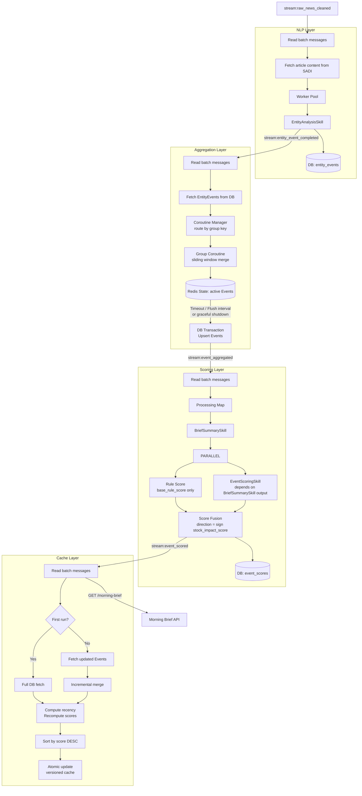
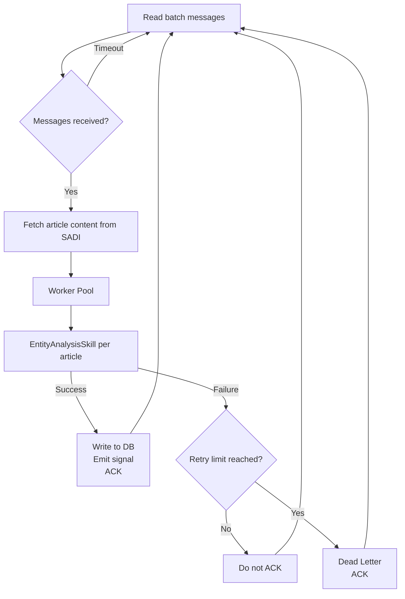
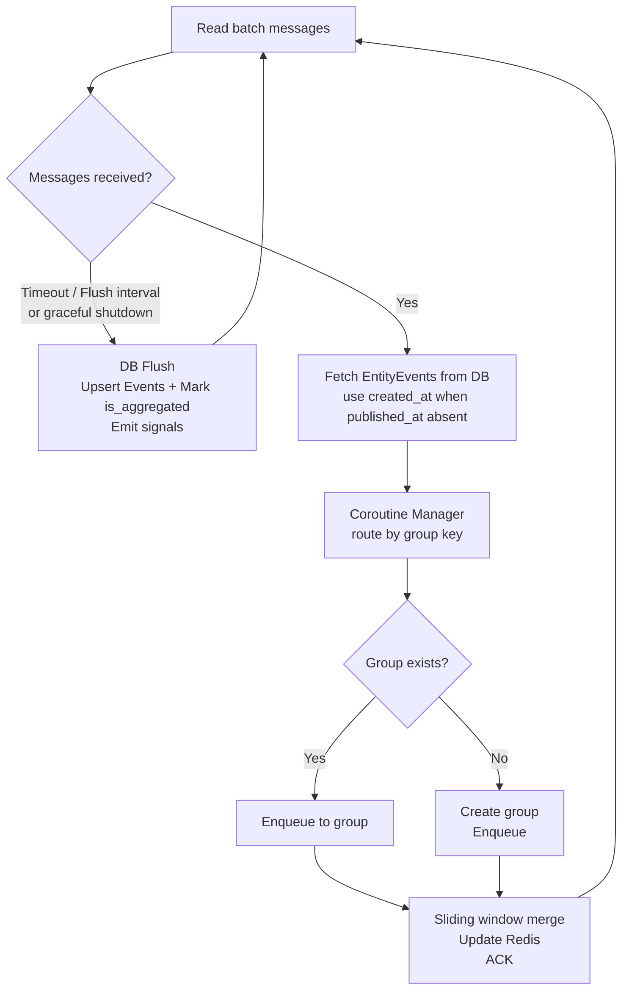
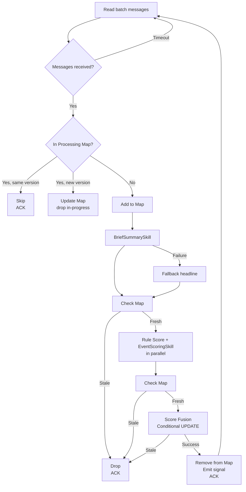
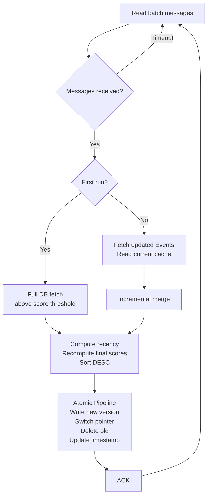

# Stock Assistant Pipeline Intelligence (SAPI)
## Technical Architecture Document — v0.7

| Field | Detail |
|---|---|
| Service Name | Stock Assistant Pipeline Intelligence (SAPI) |
| Document Version | TAD v0.7 |
| Parent System | HK Stock AI Research Assistant |
| Service Responsibility | NLP enrichment, event aggregation, scoring, and cache population |
| Tech Stack | Python + asyncio + Redis |
| Dependencies | PostgreSQL 16, Redis, LLM API (Vertex AI), SADI (via API + Redis Streams), Admin API |
| Document Status | DRAFT — Work in progress |

**Supersedes TAD v0.6 · Updates: Removed stale is_aggregated index from entity_events index strategy (replaced by event_entity_map in v0.6); DB Write Failure retry strategy fully specified in Section 12.1 (exponential backoff, failure classification, retry parameters — previously deferred to separate document)**

---

## Table of Contents

1. [Service Overview](#1-service-overview)
2. [System Architecture](#2-system-architecture)
3. [NLP Layer](#3-nlp-layer)
4. [Aggregation Layer](#4-aggregation-layer)
5. [Scoring Layer](#5-scoring-layer)
6. [Cache Layer](#6-cache-layer)
7. [Morning Brief API](#7-morning-brief-api)
8. [LLM Adapter](#8-llm-adapter)
9. [LLM Skills](#9-llm-skills)
10. [Database Design](#10-database-design)
11. [Redis Design](#11-redis-design)
12. [Error Handling](#12-error-handling)
13. [Deployment](#13-deployment)
14. [Open Questions](#14-open-questions)

---

## 1. Service Overview

### 1.1 Responsibility Boundary

SAPI is the intelligence layer of the HK Stock AI Research Assistant. It consumes cleaned news records from SADI and produces a scored, ranked Morning Brief cache ready for frontend consumption.

> **Core Principle:** SAPI does not perform data acquisition or cleaning. Its input contract is `cleaned_news` records from SADI. Its output contract is a scored Event cache in Redis for the Morning Brief API.

| Layer | Input | Output |
|---|---|---|
| NLP Layer | `cleaned_news` records via SADI API | `EntityEvent` records in DB |
| Aggregation Layer | `EntityEvent` records | `Event` records in DB and Redis |
| Scoring Layer | `Event` records | Scored `Event` records in DB |
| Cache Layer | Scored `Event` records | Morning Brief cache in Redis |

### 1.2 Naming Conventions

| Term | Definition |
|---|---|
| **EntityEvent** | Entity-level event extracted from a single article by EntityAnalysisSkill. One article may produce multiple EntityEvents, one per identified entity. |
| **Event** | Aggregated unit grouping multiple EntityEvents with the same `(stock_code, event_type_primary)` within a sliding time window. Equivalent to "Entity-Event Pair" in the PRD. |
| **Scored Event** | A fully scored Event record combining Event metadata and all scoring dimensions. The atomic unit stored in the Morning Brief cache. |

### 1.3 Tech Stack

| Component | Choice | Rationale |
|---|---|---|
| Runtime | Python 3.12 | Consistent with SADI; best ecosystem for LLM integration |
| Async framework | asyncio | Optimal for IO-intensive LLM API calls; single-threaded concurrency is safe for shared in-memory state |
| API framework | FastAPI | Native async support; automatic OpenAPI documentation |
| Messaging | Redis Streams | Persistent; Consumer Group guarantees at-least-once delivery; `XREADGROUP COUNT+BLOCK` provides native batching with timeout; `XAUTOCLAIM` provides delivery_count for retry management |
| LLM provider | Vertex AI (Gemini) | Enterprise data isolation; no training data usage; asia-east1 region; unified SDK with `vertexai=True` |
| LLM structured output | Instructor | Pydantic-based schema enforcement and automatic retry for structured output; used by BriefSummarySkill and EventScoringSkill via `generate_structured`; EntityAnalysisSkill uses raw SDK for Function Calling loop control |
| Database client | asyncpg | Native asyncio driver |
| Cache | Redis | Existing dependency; low-latency Morning Brief serving |

### 1.4 Redis Connection Separation

Redis serves two independent purposes in SAPI, managed via separate connection pools to ensure infrastructure substitutability.

| Client | Purpose | Can be replaced by |
|---|---|---|
| `RedisStreamClient` | Inter-service and inter-layer messaging via Redis Streams | Kafka or any message broker |
| `RedisStateClient` | Runtime state storage (active Events, scores, cache) | Remains unaffected by messaging changes |

Both connections may point to the same Redis instance in MVP. Configuration is separated via distinct environment variables `REDIS_STREAM_URL` and `REDIS_STATE_URL`.

### 1.5 Source Configuration

Source authority weights are stored in an Admin database and accessed via Admin API. SAPI caches the configuration in `RedisStateClient` with TTL-based auto-refresh — no dedicated refresh coroutine required.

```
Rule Score requires source:config:
├── Redis key exists → read directly via HGET / HMGET
└── Redis key expired or missing
    → fetch from Admin API
    → write to Redis with TTL = SOURCE_CONFIG_TTL_S
    → fallback if Admin API unreachable: use default weights P1=9, P2=6, P3=4
```

> **Query pattern:** Rule Score computation uses `HMGET source:config source1 source2 ...` to fetch all required weights in a single Redis call.

### 1.6 Recency Score Design

`recency_score` is a time-dependent value that decays continuously:

```
recency_score = 10 × e^(-λ × hours_elapsed)
hours_elapsed = now() - event.aggregation_updated_at
```

**Design decision:** `recency_score` is never stored. The Cache Layer computes it in real time using `event.aggregation_updated_at` as the reference timestamp when building each Morning Brief version. This correctly reflects the freshness of each Event's content at the time it was last aggregated.

Stored scores (`base_rule_score`, `abs_final_score`) exclude `recency_score` and serve as historical snapshots only.

**Design rationale:** All Events' recency scores decay at the same rate between cache updates, so relative ranking is stable. Recomputing only when new scored Events arrive is sufficient — no periodic refresh needed.

---

## 2. System Architecture

### 2.1 Pipeline Design Principle

Each layer is an **independent continuous processor**. No layer waits for upstream completion. Each layer processes what is available and delivers results downstream immediately. The system naturally degrades gracefully — when upstream is slow, downstream still serves users with the most recently available data.

### 2.2 Complete Data Flow



### 2.3 Inter-Layer Signals

All signals use Redis Streams via `RedisStreamClient`. Each stream serves as both the signal and the persistent queue for the receiving layer. All messages include a `v` field for message schema versioning — consumers check `v` before parsing and route to Dead Letter on version mismatch.

| Stream | Producer | Consumer Group | Message Fields | Role |
|---|---|---|---|---|
| `stream:raw_news_cleaned` | SADI | `sapi-nlp` | `cleaned_id`, `execution_id`, `v` | NLP Layer input queue |
| `stream:entity_event_completed` | NLP Layer | `sapi-aggregation` | `entity_event_id`, `v` | Aggregation Layer input queue |
| `stream:event_aggregated` | Aggregation Layer | `sapi-scoring` | `event_id`, `v` | Scoring Layer input queue |
| `stream:event_scored` | Scoring Layer | `sapi-cache` | `event_id`, `v` | Cache Layer input queue |

> `execution_id` is carried only in `stream:raw_news_cleaned` for SADI-to-SAPI traceability. Downstream streams carry only the business ID relevant to each layer.

> **Persistence guarantee:** Redis Streams persist messages until ACKed. On service restart, each layer resumes from its last consumed position via Consumer Group with no data loss.

> **Batching mechanism:** Each layer uses `XREADGROUP COUNT {BATCH_SIZE} BLOCK {TIMEOUT_MS}`. This single command handles both batch size and timeout triggers natively.

---

## 3. NLP Layer

### 3.1 Responsibility

Consume `cleaned_news` records from SADI, invoke EntityAnalysisSkill per article, and write `EntityEvent` records to DB.

### 3.2 Processing Flow



### 3.3 Batching and Concurrency

`XREADGROUP COUNT NLP_BATCH_SIZE BLOCK NLP_BATCH_TIMEOUT_MS` handles both triggers natively:
- Returns up to `NLP_BATCH_SIZE` messages immediately when available
- Returns whatever is available after `NLP_BATCH_TIMEOUT_MS` if batch size not reached

`asyncio.Semaphore(NLP_MAX_CONCURRENT)` limits concurrent LLM API calls within each batch.

### 3.4 Idempotency

Two-layer protection prevents duplicate processing:

**Layer 1 — In-memory Set (concurrent deduplication):**

An in-memory Set `processing_cleaned_ids` prevents the same article from being processed concurrently within the same service instance. Before invoking EntityAnalysisSkill, the worker checks the Set:

```
if cleaned_id in processing_cleaned_ids → skip
else → add to Set → process → remove from Set
```

Safe for asyncio single-threaded concurrency — no locking required.

**Layer 2 — DB unique constraint (cross-batch deduplication):**

`entity_events.source_url` has a unique index. All DB inserts use `INSERT ON CONFLICT (source_url) DO NOTHING`, ensuring redelivered messages never produce duplicate records.

### 3.5 Configuration Parameters

| Parameter | Description |
|---|---|
| `NLP_BATCH_SIZE` | Max messages per XREADGROUP read |
| `NLP_BATCH_TIMEOUT_MS` | XREADGROUP block timeout (ms) |
| `NLP_MAX_CONCURRENT` | Worker Pool concurrency limit; constrained by LLM API rate limits |
| `NLP_MAX_RETRY` | Max delivery attempts before Dead Letter |

### 3.6 Error Handling

| Scenario | Strategy |
|---|---|
| LLM API call failure | No DB record written; log error; do not ACK → redelivery → Dead Letter at `NLP_MAX_RETRY` |
| LLM schema violation (Instructor exhausted retries) | No DB record written; log error; do not ACK → redelivery → Dead Letter at `NLP_MAX_RETRY` |
| `LLMRateLimitError` | Pause entire Worker Pool for `RATE_LIMIT_BACKOFF_S`; do not ACK → redelivery after backoff; see Section 12.1 Rate Limit Backoff policy |
| All entities filtered by stock verification | Write empty `entities=[]` record; emit signal; ACK — valid outcome |
| DB write failure | See Section 12.1 DB Write Failure policy |
| SADI API failure | Do not ACK → redelivery → Dead Letter at `NLP_MAX_RETRY` |
| RedisStreamClient unreachable | See Section 12.1 RedisStreamClient policy |

---

## 4. Aggregation Layer

### 4.1 Responsibility

Consume `EntityEvent` records, route to per-group coroutines for sliding window merging, maintain active Event state in Redis, and persist Events to DB periodically.

### 4.2 Processing Flow



### 4.3 Coroutine Manager and Concurrency

The Coroutine Manager maintains a dict of active group coroutines:

```
coroutines: Dict[(exchange, stock_code, event_type_primary), GroupCoroutine]
```

- `asyncio.Semaphore(AGG_MAX_CONCURRENT)` limits the number of concurrently active Group Coroutines, controlling Redis and DB concurrent request load
- Each Group Coroutine contains an internal `asyncio.Queue` — EntityEvents for the same group are processed strictly serially, preventing concurrent modification of the same sliding window state
- Group Coroutine is destroyed after `AGG_GROUP_IDLE_TIMEOUT_S` of inactivity; removed from manager dict on destruction

### 4.4 Sliding Window Algorithm

Within each Group Coroutine, EntityEvents are processed in arrival order from the internal queue. For each EntityEvent:

- **Merge condition:** `entity_event.published_at - event.last_seen_at <= SLIDING_WINDOW_HOURS` AND `remaining_lifespan > 0`
- **Hard cap:** `remaining_lifespan = EVENT_MAX_TIMESPAN_HOURS - (entity_event.published_at - event.first_seen_at)`
- **On merge:** update `last_seen_at`; reset Redis TTL to `min(SLIDING_WINDOW_HOURS, remaining_lifespan)`
- **On no merge:** create new Event in memory and Redis

> **`published_at` fallback:** Retrieved via `COALESCE(published_at, created_at)` at query time. Source data is not modified.

### 4.5 DB Flush

DB Flush is triggered by three conditions:

- **XREADGROUP timeout:** No new messages arrive within `AGG_BATCH_TIMEOUT_MS` — equivalent to the input queue being empty.
- **`AGG_DB_FLUSH_INTERVAL_S` elapsed:** Maximum interval between flushes, ensuring timely delivery to downstream layers during continuous high-volume ingestion.
- **Graceful shutdown:** Immediate flush before service exit to persist all in-memory state.

On each flush, within a single DB transaction:
- All active Events in Redis are Upserted to the `events` table
- `aggregation_updated_at = now()` written for each Upserted Event
- All EntityEvent-to-Event mappings written to `event_entity_map` via `INSERT ON CONFLICT DO NOTHING`

After transaction commits, `stream:event_aggregated` is emitted per event_id.

> **TTL safety constraint:** `AGG_BATCH_TIMEOUT_MS` and `AGG_DB_FLUSH_INTERVAL_S` must be significantly smaller than `SLIDING_WINDOW_HOURS` converted to milliseconds to ensure all active Events are persisted to DB before their Redis TTL expires.

> **Crash recovery:** If the service crashes after ACKing messages but before DB Flush, Redis still holds the active Event state. On restart, the next DB Flush will persist the pre-crash state correctly, maintaining data consistency. The only unrecoverable scenario is simultaneous failure of both the service and Redis — treated as a service quality monitoring event, with remediation deferred to Post-MVP.

### 4.6 Configuration Parameters

| Parameter | Description |
|---|---|
| `AGG_BATCH_SIZE` | Max messages per XREADGROUP read |
| `AGG_BATCH_TIMEOUT_MS` | XREADGROUP block timeout (ms); also serves as queue-empty detection |
| `AGG_MAX_CONCURRENT` | Max concurrent active Group Coroutines; controls Redis and DB concurrent load |
| `AGG_GROUP_IDLE_TIMEOUT_S` | Group Coroutine idle destruction threshold |
| `AGG_DB_FLUSH_INTERVAL_S` | Maximum interval between DB flushes |
| `AGG_MAX_RETRY` | Max delivery attempts before Dead Letter |
| `SLIDING_WINDOW_HOURS` | Max time gap between adjacent articles for merging; base Redis TTL |
| `EVENT_MAX_TIMESPAN_HOURS` | Hard cap on total Event time span |

### 4.7 Error Handling

| Scenario | Strategy |
|---|---|
| DB read failure | Do not ACK; log warning |
| RedisStateClient unreachable | Do not ACK; retry with fixed interval |
| DB Flush failure | See Section 12.1 DB Write Failure policy |
| Group Coroutine failure | UnACked messages redelivered via XAUTOCLAIM → group recreated → reprocessed |
| RedisStreamClient unreachable | See Section 12.1 RedisStreamClient policy |

---

## 5. Scoring Layer

### 5.1 Responsibility

Score Events pushed by the Aggregation Layer. Execute BriefSummarySkill, then Rule Score and EventScoringSkill in parallel. Apply direction in Score Fusion. Persist score records to DB via conditional update.

Each Skill is responsible for constructing its own input from raw DB data. The Scoring Layer passes constituent EntityEvent records and Event metadata to each Skill; the Skill applies its own input selection and formatting rules internally. This ensures input construction logic and prompt design remain co-located within the same module.

### 5.2 Processing Flow



### 5.3 Scoring Layer Execution Sequence

BriefSummarySkill executes first. Rule Score and EventScoringSkill execute in parallel after BriefSummarySkill completes.

```
BriefSummarySkill
    ↓
Rule Score (parallel)    EventScoringSkill (parallel, uses BriefSummarySkill output)
    ↓                              ↓
                Score Fusion
```

**Rationale:** EventScoringSkill takes `summary_full` and `key_numbers` from BriefSummarySkill as input — these are the distilled, structured representations of the Event content. This avoids requiring EventScoringSkill to re-interpret raw article content, reduces token consumption, and produces more consistent scoring inputs. Rule Score does not depend on BriefSummarySkill and runs in parallel with EventScoringSkill.

### 5.4 Processing Map

An in-memory Map prevents duplicate processing across concurrent triggers and detects mid-processing data changes:

```
processing_events: Dict[event_id, aggregation_updated_at]
```

- Safe for asyncio single-threaded concurrency — no locking required
- On service restart: Map is empty; in-progress Events are redelivered from Redis Stream and reprocessed normally

### 5.5 Stale Data Detection

| Check Point | Mechanism |
|---|---|
| After BriefSummarySkill | Compare `processing_events[event_id]` with current `aggregation_updated_at` |
| After Rule Score + EventScoringSkill | Same in-memory comparison |
| Score Fusion write | Conditional `UPDATE event_scores WHERE event_id = :id AND events.aggregation_updated_at = :expected`; 0 rows = stale |

### 5.6 Rule Score — Recency and Direction Exclusion

`recency_score` and direction coefficient are both excluded from Rule Score computation. `base_rule_score` is a pure unsigned weighted sum of the remaining four dimensions:

```
base_rule_score (stored) = Σ(dimension_score × weight) excluding recency_score
```

Direction is applied in Score Fusion (Step 7), not in Rule Score (Step 6a). This keeps the two steps independent and parallel.

### 5.7 Score Fusion — Direction

Direction is derived from `stock_impact_score` in Score Fusion, not from `sentiment_label`. This is more accurate in financial context where news sentiment does not always align with stock price impact direction.

```
direction = sign(stock_impact_score)
    stock_impact_score > 0 → +1
    stock_impact_score < 0 → -1
    stock_impact_score = 0 → derived from sentiment_label (fallback when llm_fallback=true)

rule_score = base_rule_score × direction
raw_final_score = rule_score × 0.67 + stock_impact_score × 0.33 × 2
abs_final_score = |raw_final_score|
```

> **Score cross-type comparability:** `event_type_score` (weight 0.30) assigns higher base scores to more impactful event types (EARNINGS=9.0, REGULATORY=8.0, GENERAL=4.0). This ensures `abs_final_score` is comparable across different `event_type_primary` values without additional normalisation.

### 5.8 Sentiment Aggregation

Event-level sentiment is computed from all constituent EntityEvents, weighted by source authority from `source:config`. The result is used for display purposes (利好/利空/中性 label) and as a direction fallback when `llm_fallback=true`.

```
signed_score = sentiment_score × direction_coefficient
    where POSITIVE=+1, NEUTRAL=0, NEGATIVE=-1

weighted_signed_score = Σ(signed_score × source_authority_weight) ÷ Σ(source_authority_weight)

sentiment_label:
    weighted_signed_score > SENTIMENT_THRESHOLD   → POSITIVE
    weighted_signed_score < -SENTIMENT_THRESHOLD  → NEGATIVE
    otherwise                                      → NEUTRAL

sentiment_strength_score:
    Σ(sentiment_score × source_authority_weight) ÷ Σ(source_authority_weight)
```

### 5.9 Per-Event Fallbacks

**BriefSummarySkill failure:** `summary_short` populated from `headline` of constituent EntityEvent with highest source authority; ties broken by latest `published_at`. `summary_full` set equal to `summary_short`. `key_numbers` set to empty list `[]`. Log warning `brief_summary_fallback`.

**EventScoringSkill failure:** `stock_impact_score = 0`; `llm_fallback = true`; direction falls back to `sentiment_label` derived value; scoring continues. Log warning `event_scoring_fallback`.

**EventScoringSkill receiving fallback input:** When `events.brief_output` was produced by BriefSummarySkill fallback, EventScoringSkill proceeds normally but records `input_from_fallback: true` in the `event_scoring_completed` log event. This flags the resulting score as potentially lower quality for monitoring purposes without affecting the business flow.

### 5.10 Configuration Parameters

| Parameter | Description |
|---|---|
| `SCORING_BATCH_SIZE` | Max messages per XREADGROUP read |
| `SCORING_BATCH_TIMEOUT_MS` | XREADGROUP block timeout (ms) |
| `SCORING_MAX_CONCURRENT` | Max concurrent Event processing; constrained by LLM API rate limits |
| `SCORING_MAX_RETRY` | Max delivery attempts before Dead Letter |
| `SOURCE_CONFIG_TTL_S` | Source configuration cache TTL in Redis |
| `MWP_ADMIN_API_URL` | Admin service API endpoint |
| `SENTIMENT_THRESHOLD` | Threshold for classifying weighted_signed_score as POSITIVE or NEGATIVE |

### 5.11 Error Handling

| Scenario | Strategy |
|---|---|
| DB read failure | Do not ACK; log warning |
| BriefSummarySkill failure | Fallback applied; processing continues |
| EventScoringSkill failure | Fallback applied; processing continues |
| `LLMRateLimitError` | Pause entire Scoring Layer concurrent pool for `RATE_LIMIT_BACKOFF_S`; do not ACK → redelivery after backoff; see Section 12.1 Rate Limit Backoff policy |
| source:config unreachable | Use default weights; log warning; processing continues |
| DB write failure | See Section 12.1 DB Write Failure policy |
| RedisStreamClient unreachable | See Section 12.1 RedisStreamClient policy |

---

## 6. Cache Layer

### 6.1 Responsibility

Consume scored Event IDs, fetch and merge Scored Events, compute real-time recency scores using `event.aggregation_updated_at`, and maintain a versioned Morning Brief cache in Redis. Processes messages serially — no concurrent cache updates.

### 6.2 Processing Flow



### 6.3 Recency Score Computation

At each cache build, `recency_score` is computed for all Events using `event.aggregation_updated_at`:

```
recency_score = 10 × e^(-λ × hours_elapsed)
hours_elapsed = now() - event.aggregation_updated_at

final_base_rule_score = stored_base_rule_score + recency_score × recency_weight(0.20)
final_abs_final_score = |final_base_rule_score × 0.67 + stock_impact_score × 0.33 × 2|
```

Sorting uses `final_abs_final_score`. The stored `abs_final_score` in `event_scores` is a historical snapshot excluding recency.

### 6.4 Incremental Merge Rules

Merge decisions use `final_abs_final_score` (real-time computed value including recency):

| Condition | Action |
|---|---|
| Updated Event, `final_abs_final_score >= NOISE_FILTER_THRESHOLD`, already in cache | Replace |
| Updated Event, `final_abs_final_score >= NOISE_FILTER_THRESHOLD`, not in cache | Insert |
| Updated Event, `final_abs_final_score < NOISE_FILTER_THRESHOLD`, already in cache | Remove |
| Updated Event, `final_abs_final_score < NOISE_FILTER_THRESHOLD`, not in cache | Ignore |

### 6.5 Versioned Cache Replacement

All three operations execute atomically via Redis Pipeline `MULTI/EXEC`:

| Step | Frontend reads | State |
|---|---|---|
| Before update | `v42` | Stable |
| Atomic Pipeline: write `v43`, switch pointer, delete `v42` | `v43` | Atomic cutover |
| After update | `v43` | Stable |

`morning_brief:version_counter` is a persistent monotonically incrementing counter with no TTL.

### 6.6 Scored Event Structure

Each item in the Morning Brief cache is a Scored Event. Top-level fields are used for filtering and sorting; display fields are nested.

```json
{
    "event_id": "uuid",
    "exchange": "HKEX",
    "stock_code": "00700.HK",
    "event_type_primary": "EARNINGS",
    "abs_final_score": 7.43,
    "base_rule_score": 8.95,
    "first_seen_at": "2025-01-15T00:00:00Z",
    "last_seen_at": "2025-01-15T06:00:00Z",
    "event": {
        "event_type_secondary": ["BUYBACK"],
        "source_count": 3,
        "source_list": [
            {
                "source_name": "REUTERS",
                "url": "https://...",
                "published_at": "2025-01-15T00:00:00Z"
            }
        ],
        "summary_short": "騰訊Q4廣告收入超預期",
        "summary_full": "騰訊第四季廣告收入按年增長32%，主要受惠於微信視頻號廣告業務強勁增長...",
        "key_numbers": [
            "廣告收入+32% YoY",
            "總收入HK$1,722億",
            "回購計劃HK$1,000億"
        ]
    },
    "score": {
        "stock_impact_score": 3.8,
        "llm_fallback": false,
        "rule_score_detail": {
            "event_type_score": 9.0,
            "source_authority_score": 8.5,
            "sentiment_strength_score": 8.5,
            "source_heat_score": 7.0
        },
        "llm_score_detail": {
            "adjustment_reason": "業績顯著超預期，回購規模反映管理層對前景高度信心，對股價具明確正面催化作用",
            "score_version": "v1.0.0",
            "scored_at": "2025-01-15T00:28:00Z"
        }
    }
}
```

> **`abs_final_score` and `base_rule_score`** are real-time computed values including `recency_score`, not the stored snapshots from `event_scores`.

**Top-level field rationale:**

| Field | Reason |
|---|---|
| `exchange`, `stock_code` | Query filter conditions |
| `event_type_primary` | Potential future filter condition |
| `abs_final_score` | Primary sort key (includes real-time recency) |
| `base_rule_score` | Secondary sort key for tie-breaking (includes real-time recency) |
| `first_seen_at`, `last_seen_at` | Additional tie-breaking sort keys |

**Excluded fields:** `nlp_output`, `aggregation_updated_at`, `updated_at`, `created_at`, `metadata`, `recency_score` — internal fields not relevant to Morning Brief display.

### 6.7 Configuration Parameters

| Parameter | Description |
|---|---|
| `CACHE_BATCH_SIZE` | Max messages per XREADGROUP read |
| `CACHE_BATCH_TIMEOUT_MS` | XREADGROUP block timeout (ms) |
| `CACHE_MAX_RETRY` | Max delivery attempts before Dead Letter |
| `NOISE_FILTER_THRESHOLD` | Minimum `final_abs_final_score` for Morning Brief cache inclusion |
| `CACHE_ORPHAN_CLEANUP_INTERVAL_S` | Interval for scanning and deleting orphaned `morning_brief:v*` keys |

### 6.8 Error Handling

| Scenario | Strategy |
|---|---|
| DB read failure | Do not ACK; log warning |
| RedisStateClient unreachable | Do not ACK; retry with fixed interval |
| Atomic pipeline failure | See Section 12.1 DB Write Failure policy |
| Orphaned version cleanup failure | Log warning; retry on next cleanup interval |
| RedisStreamClient unreachable | See Section 12.1 RedisStreamClient policy |

---

## 7. Morning Brief API

### 7.1 Health Check

```
GET /health
```

**Response fields:**

| Field | Values | Description |
|---|---|---|
| `status` | healthy / degraded / unhealthy | Overall service status |
| `database` | ok / error | PostgreSQL connectivity |
| `redis_stream` | ok / error | RedisStreamClient connectivity |
| `redis_state` | ok / error | RedisStateClient connectivity |
| `layers.nlp` | ok / error | NLP Layer consumer coroutine status |
| `layers.aggregation` | ok / error | Aggregation Layer consumer coroutine status |
| `layers.scoring` | ok / error | Scoring Layer consumer coroutine status |
| `layers.cache` | ok / error | Cache Layer consumer coroutine status |

**HTTP response codes:**
- All healthy → `200 healthy`
- Any layer degraded → `200 degraded`
- Database or Redis unreachable → `503 unhealthy`

> Post-MVP extension: add Dead Letter Stream backlog monitoring per layer to detect processing failures earlier.

### 7.2 Morning Brief Endpoint

```
GET /morning-brief?stocks=00700,09988,03690&k=20
```

| Parameter | Type | Required | Description |
|---|---|---|---|
| `stocks` | string | Yes | Comma-separated HK stock codes from client watchlist |
| `k` | integer | No | Max results to return; default `TOP_K_DEFAULT = 20` |

### 7.3 Server Processing Logic

```
Read morning_brief:v{current_version} from Redis
        ↓
Step 1: Select Events where stock_code in stocks parameter
        Order by final_abs_final_score DESC
        Take up to k
        ↓
Step 2: If matched count < k
        Append highest scoring non-watchlist Events
        Until total = k or no more Events available
        ↓
Return results
```

### 7.4 Response

> All timestamps in response are UTC. `last_updated` reflects `morning_brief:last_updated` — the time of the last successful cache build.

**Normal response (`HTTP 200`):**

```json
{
    "cache_version": 43,
    "last_updated": "2025-01-15T00:28:00Z",
    "events": [
        {
            "event_id": "uuid",
            "exchange": "HKEX",
            "stock_code": "00700.HK",
            "event_type_primary": "EARNINGS",
            "abs_final_score": 7.43,
            "base_rule_score": 8.95,
            "first_seen_at": "2025-01-15T00:00:00Z",
            "last_seen_at": "2025-01-15T06:00:00Z",
            "event": {
                "event_type_secondary": ["BUYBACK"],
                "source_count": 3,
                "source_list": [
                    {
                        "source_name": "REUTERS",
                        "url": "https://...",
                        "published_at": "2025-01-15T00:00:00Z"
                    }
                ],
                "summary_short": "騰訊Q4廣告收入超預期",
                "summary_full": "騰訊第四季廣告收入按年增長32%，主要受惠於微信視頻號廣告業務強勁增長...",
                "key_numbers": [
                    "廣告收入+32% YoY",
                    "總收入HK$1,722億",
                    "回購計劃HK$1,000億"
                ]
            },
            "score": {
                "stock_impact_score": 3.8,
                "llm_fallback": false,
                "rule_score_detail": {
                    "event_type_score": 9.0,
                    "source_authority_score": 8.5,
                    "sentiment_strength_score": 8.5,
                    "source_heat_score": 7.0
                },
                "llm_score_detail": {
                    "adjustment_reason": "業績顯著超預期，回購規模反映管理層對前景高度信心，對股價具明確正面催化作用",
                    "score_version": "v1.0.0",
                    "scored_at": "2025-01-15T00:28:00Z"
                }
            }
        }
    ]
}
```

**Empty cache (`HTTP 200`):**

```json
{
    "cache_version": null,
    "last_updated": null,
    "events": []
}
```

**System error (`HTTP 503`):**

```json
{
    "error": "system_error",
    "error_code": "CACHE_UNAVAILABLE"
}
```

> Specific `error_code` values are defined per error scenario. Detailed error information is logged server-side only.

### 7.5 Client Processing

The client applies `POOL_MATCH_BOOST` to watchlist-matching Events and re-ranks the results. See PRD Section 12.2 for client-side parameter details.

---

## 8. LLM Adapter

### 8.1 Design Principle

All LLM interactions are encapsulated behind a provider-agnostic Adapter interface. Switching providers requires only a new Adapter implementation with no changes to Skill logic. The Adapter exposes two methods corresponding to two distinct call modes used by different Skills.

### 8.2 MVP Implementation

| Attribute | Detail |
|---|---|
| Provider | Vertex AI (Gemini) |
| SDK | `google-genai` with `vertexai=True` (raw calls via `generate_raw`) |
| Structured output library | Instructor (via `generate_structured`) |
| Region | `asia-east1` |
| Authentication | Google Cloud IAM (Service Account) |

### 8.2.1 Timeout Management

All external API timeouts are centralised in environment variables to ensure consistent management:

| Timeout | Variable | Applies To |
|---|---|---|
| LLM API call timeout | `LLM_API_TIMEOUT_S` | All `generate_raw` and `generate_structured` calls via Adapter |
| SADI API call timeout | `SADI_API_TIMEOUT_S` | NLP Layer article content fetch |

On timeout, both raise `LLMProviderError` (LLM) or propagate as SADI API failure (SADI) — existing error handling policies apply. See Section 3.6 and Section 12.1.

### 8.3 Standard Data Structures

**`ToolCall`** — A tool invocation request returned by the LLM:

| Field | Type | Description |
|---|---|---|
| `tool_call_id` | str | Provider-generated unique ID; must be echoed back in tool result |
| `tool_name` | str | Tool name e.g. `lookup_stock` |
| `arguments` | dict | Parsed argument dict |

**`ToolResultMessage`** — Result of a tool execution, passed back to the LLM:

| Field | Type | Description |
|---|---|---|
| `tool_call_id` | str | Matches `ToolCall.tool_call_id` |
| `tool_name` | str | Matches `ToolCall.tool_name` |
| `result` | dict | Tool execution result |

**`ToolDefinition`** — Tool schema passed to `generate_raw`:

| Field | Type | Description |
|---|---|---|
| `name` | str | Tool name |
| `description` | str | Tool purpose description; LLM uses this to decide when to call |
| `parameters` | dict | JSON Schema format parameter definition |
| `strict` | bool | If true, instructs provider to enforce tool usage (Gemini: `function_calling_config.mode = ANY`) |

**`LLMResponse`** — Return object from `generate_raw`:

| Field | Type | Description |
|---|---|---|
| `tool_calls` | `list[ToolCall]` | Non-empty when LLM requests tool execution; empty list on final output |
| `raw_response` | Any | Provider raw response; for debugging only; must not be used in business logic |

**`Message`** — Single conversation history unit:

| Role | `content` | `tool_calls` | `tool_results` |
|---|---|---|---|
| SYSTEM | str | — | — |
| USER | str | — | — |
| ASSISTANT (tool call round) | None | `list[ToolCall]` | — |
| TOOL | None | — | `list[ToolResultMessage]` |

### 8.4 Adapter Interface

```
LLMAdapter (abstract base class)

generate_raw(messages, tools) → LLMResponse
    Single LLM call returning raw response.
    Used by EntityAnalysisSkill for Function Calling loop control.
    tools=None is not permitted for this method.

generate_structured(messages, output_schema) → BaseModel instance
    Single LLM call with Instructor-enforced schema validation.
    Used by BriefSummarySkill and EventScoringSkill.
    output_schema: Pydantic BaseModel class; Adapter converts via model_json_schema() internally.
    Returns validated Pydantic instance.

close() → None
    Release underlying provider client resources.
```

### 8.5 Exception Mapping

All provider-specific exceptions are mapped to standard types. Skill layer handles only these standard exceptions.

| Exception | Retryable | Trigger |
|---|---|---|
| `LLMRateLimitError` | Yes | Provider rate limit hit |
| `LLMProviderError` | Yes | Provider-side error (5xx, network timeout) |
| `LLMSchemaViolationError` | No | Instructor internal retries exhausted; output still does not conform to schema |

> `LLMSchemaViolationError` occurs when Pydantic validators defined in the output schema (e.g. value range constraints) are repeatedly violated after Instructor's internal retries. Gemini's `response_schema` parameter prevents missing field and type errors at the API level; Pydantic validators are the second-layer protection for business logic constraints.

> `LLMRateLimitError` handling: When raised, the receiving Layer pauses its entire Worker Pool for `RATE_LIMIT_BACKOFF_S` before allowing new tasks to proceed. This prevents retry storms by coordinating backoff at the pool level rather than the individual worker level. See Section 12.1 Rate Limit Backoff policy.

> `BusinessValidationError` is a log-only event type (not an exception class) used to record cases where Instructor validation passed but business constraint truncation was applied (e.g. `headline` exceeding 20 characters, `sentiment_score` clipped to boundary). These do not affect business flow but are recorded in Skill completion log events for prompt quality analysis. See Section 9.7 for log event specifications.

---

## 9. LLM Skills

### 9.1 Skill Overview

Three Skills encapsulate all LLM interactions. Each Skill is a versioned, reusable prompt module with a stable I/O contract.

| Skill | Adapter Method | Temperature | Max Tokens | Depends On |
|---|---|---|---|---|
| EntityAnalysisSkill | `generate_raw` + `generate_structured` | 0 | 8192 | — |
| BriefSummarySkill | `generate_structured` | 0.1 | 4096 | EntityAnalysisSkill output |
| EventScoringSkill | `generate_structured` | 0 | 2048 | BriefSummarySkill output |

### 9.1.1 Skill Version Management

Each Skill maintains an independent version number defined within its module:

```
EntityAnalysisSkill:  ENTITY_SKILL_VERSION  = "v1.0.0"
BriefSummarySkill:    BRIEF_SKILL_VERSION   = "v1.0.0"
EventScoringSkill:    SCORING_SKILL_VERSION = "v1.0.0"
```

**Version bump rules:**

| Change Type | Version Position |
|---|---|
| Prompt wording adjustment, few-shot example modification | Patch (v1.0.0 → v1.0.1) |
| Output field addition/removal, scoring logic adjustment | Minor (v1.0.0 → v1.1.0) |
| Output schema structural change | Major (v1.0.0 → v2.0.0) |

**Version storage:** Each Skill's version is stored in the `version` field of its corresponding JSONB output column — `nlp_output.version`, `brief_output.version`, `llm_score_output.version`, `rule_score_detail.version`. This ensures every DB record is traceable to the exact Skill version that produced it.

**LLM call cost estimation (per pipeline run):**

| Item | Estimate |
|---|---|
| Articles crawled per run | 50–150 |
| EntityAnalysisSkill calls (2 per article) | 100–300 |
| Events after aggregation | 20–60 |
| BriefSummarySkill + EventScoringSkill calls | 40–120 |
| **Total LLM calls per pipeline run** | **140–420** |

Two pipeline runs per day (morning-crawl + pre-open-crawl); estimated daily total: 280–840 LLM calls. Within Vertex AI low-cost tier for MVP scale.

### 9.2 `lookup_stock` Tool

Used exclusively by EntityAnalysisSkill. Executed by the Skill layer (async Redis query); not executed by the Adapter.

**Tool Definition:**

| Field | Value |
|---|---|
| `name` | `lookup_stock` |
| `description` | 根據公司名稱或股票代碼查詢HKEx股票主列表，驗證股票是否存在並返回標準化信息。識別到文章中的公司實體時必須調用此工具。 |
| `strict` | true |

**Parameter:**

| Parameter | Type | Required | Description |
|---|---|---|---|
| `name_or_code` | string | Yes | Company name (Chinese or English) or stock code (e.g. `00700.HK`, `700`) |

**Return structure (`result` dict):**

| Field | Type | Description |
|---|---|---|
| `found` | bool | Whether a match exists in HKEx master list |
| `stock_code` | string / null | Standardised stock code e.g. `00700.HK`; null when `found=false` |
| `company_name_zh` | string / null | Chinese company name |
| `company_name_en` | string / null | English company name |
| `sector` | string / null | Sector classification matching PRD enum |

**Execution logic (Skill layer):**

```
Input: name_or_code
    ↓
Format detection:
├── Numeric only or contains .HK → query Redis by stock_code
└── Text → fuzzy match query Redis by company_name
    ↓
Match found → return found=true + full fields
No match    → return found=false + all other fields null
```

### 9.3 Function Calling Loop Control

Applies to EntityAnalysisSkill only. Two independent hard limits prevent unbounded loops.

**Limit 1 — Total round limit `MAX_FC_ROUNDS` (default: 3):**

Maximum number of `generate_raw` calls in the Function Calling loop. On breach, loop exits immediately; processing continues with `generate_structured` using accumulated message history. Warning log `fc_rounds_exceeded` written.

**Limit 2 — Per-entity retry limit `MAX_FC_RETRIES_PER_ENTITY` (default: 2):**

Tracks `found=false` count per `name_or_code` value in `entity_retry_count: dict[str, int]`. On breach, `instruction` field is appended to the tool result:

```
"此實體經多次查詢仍無法驗證，請在最終輸出中排除此實體"
```

Loop continues normally; LLM decides to exclude the entity on next generation.

**Complete loop flow:**

```
Initialise: rounds=0, entity_retry_count={}, verified_stocks={}

LOOP:
    rounds += 1
    if rounds > MAX_FC_ROUNDS → exit loop (log fc_rounds_exceeded)

    response = generate_raw(messages, tools=[LOOKUP_STOCK_TOOL])

    if not response.tool_calls → exit loop (normal termination)

    FOR each tool_call in response.tool_calls:
        entity_retry_count[name_or_code] += 1
        result = await lookup_stock(name_or_code)   # async Redis query

        if result.found:
            verified_stocks[result.stock_code] = result
        elif entity_retry_count[name_or_code] >= MAX_FC_RETRIES_PER_ENTITY:
            result.instruction = "此實體經多次查詢仍無法驗證，請在最終輸出中排除此實體"

        tool_results.append(result)

    messages += [ASSISTANT(tool_calls=response.tool_calls), TOOL(tool_results=tool_results)]

# Final structured output call
output = generate_structured(messages, output_schema=EntityAnalysisOutput)

# Explicit stock verification filter — guarantees all output entities are verified
output.entities = [e for e in output.entities if e.stock_code in verified_stocks]
```

### 9.4 EntityAnalysisSkill

**Purpose:** Per-article entity extraction, event classification, sentiment analysis, and entity summary generation. One LLM call pair (Function Calling loop + structured output) per article.

**Input:** Article title + body (from SADI API)

**System Prompt Structure:**

*Part 1 — Role and Task Definition:*
```
你是香港股票市場新聞分析助手。你的任務是從財經新聞文章中提取所有提及的上市公司實體，
並為每個實體分析對應的事件類型、市場情緒與事件摘要。

規則：
- 只提取在香港交易所（HKEX）上市的公司實體
- 每個實體必須通過 lookup_stock 工具驗證後方可納入輸出
- 未能通過驗證的實體必須從輸出中排除
```

*Part 2 — Analysis Dimensions:*
```
對每個已驗證實體，輸出以下分析：

【event_type_primary】主要事件類型，從以下選項中選擇最符合的一個：
EARNINGS / BUYBACK / MA / REGULATORY / MANAGEMENT_CHANGE /
ANALYST_RATING / DIVIDEND / GENERAL_ANNOUNCEMENT

【event_type_secondary】次要事件類型（可為空），與 primary 不同的第二相關類型

【sentiment_label】情緒方向：POSITIVE / NEUTRAL / NEGATIVE
- POSITIVE：對該股票具明確正面影響
- NEGATIVE：對該股票具明確負面影響
- NEUTRAL：影響不明確或屬常規公告

【sentiment_score】情緒強度 [0.0, 1.0]
- 0.0-0.3：弱信號（措辭謹慎、影響有限）
- 0.4-0.6：中等信號
- 0.7-1.0：強信號（明確財務數據、重大事件）

【headline】繁體中文事件標題，≤20字，概括該實體最重要的事件

【entity_summary】針對該實體在本文中相關內容的摘要，繁體中文，≤100字
- 只包含與該實體直接相關的事件、數據、管理層表態
- 不包含其他實體的信息或與該實體無關的市場背景
```

*Part 3 — Few-shot Examples:* (4 examples covering multi-entity articles, implicit negative signals, neutral boilerplate, and conflicting signals — see Section 9.4 examples below)

*Part 4 — Edge Case Rules:*
```
1. 文章未提及任何 HKEX 上市公司 → 輸出 entities: []
2. lookup_stock 返回 found=false：嘗試不同名稱或代碼格式重新查詢（最多兩次）；多次仍無法驗證 → 排除
3. 文章同時提及 A 股和 H 股：只提取 HKEX 上市的 H 股實體；若兩市均有上市，stock_code 使用 .HK 後綴版本
4. 文章提及公司但確認非 HKEX 上市（純 A 股、美股、未上市）→ 從輸出中排除，不體現於 entities
5. event_type_secondary 只在確實存在明確次要事件時填寫，不確定時留空優於猜測
```

**Few-shot Example 1 — Multi-entity, different event types:**
```
INPUT:
標題：騰訊控股公佈第四季業績，廣告收入按年增長32%；阿里巴巴電商業務遭監管調查
內文：騰訊控股（00700.HK）第四季廣告收入錄得強勁增長，超出市場預期。
     監管機構宣佈就阿里巴巴（09988.HK）電商業務展開正式調查。

TOOL CALLS:
lookup_stock("騰訊控股") → {found: true, stock_code: "00700.HK", sector: "TECHNOLOGY"}
lookup_stock("阿里巴巴") → {found: true, stock_code: "09988.HK", sector: "TECHNOLOGY"}

OUTPUT:
entities: [
  {
    stock_code: "00700.HK", company_name: "騰訊控股", sector: "TECHNOLOGY", exchange: "HKEX",
    event_type_primary: "EARNINGS", event_type_secondary: null,
    sentiment_label: "POSITIVE", sentiment_score: 0.85,
    headline: "騰訊Q4廣告收入超預期32%",
    entity_summary: "騰訊控股第四季廣告收入按年增長32%，大幅超出市場預期，顯示廣告業務強勁復甦。"
  },
  {
    stock_code: "09988.HK", company_name: "阿里巴巴", sector: "TECHNOLOGY", exchange: "HKEX",
    event_type_primary: "REGULATORY", event_type_secondary: null,
    sentiment_label: "NEGATIVE", sentiment_score: 0.78,
    headline: "監管機構調查阿里電商業務",
    entity_summary: "監管機構宣佈就阿里巴巴電商業務展開正式調查，涉及市場競爭行為，調查範圍及時間表未明。"
  }
]
```

**Few-shot Example 2 — Implicit negative (cautious management language):**
```
INPUT:
標題：碧桂園管理層表示對下半年市場「審慎樂觀」，將控制新項目推進節奏
內文：碧桂園（02007.HK）行政總裁表示，鑑於市場環境存在不確定性，
     集團將採取更為審慎的擴張策略，暫緩部分非核心城市項目。

TOOL CALLS:
lookup_stock("碧桂園") → {found: true, stock_code: "02007.HK", sector: "PROPERTY"}

OUTPUT:
entities: [
  {
    stock_code: "02007.HK", company_name: "碧桂園", sector: "PROPERTY", exchange: "HKEX",
    event_type_primary: "GENERAL_ANNOUNCEMENT", event_type_secondary: "MANAGEMENT_CHANGE",
    sentiment_label: "NEGATIVE", sentiment_score: 0.62,
    headline: "碧桂園審慎擴張暫緩新項目",
    entity_summary: "碧桂園管理層以市場不確定性為由，宣佈採取審慎擴張策略並暫緩非核心城市項目，措辭反映隱性負面展望。"
  }
]
```

**Few-shot Example 3 — Routine boilerplate, neutral:**
```
INPUT:
標題：港交所公佈例行董事會會議日期安排
內文：香港交易所（00388.HK）公佈本年度董事會例行會議時間表，與往年安排基本一致。

TOOL CALLS:
lookup_stock("香港交易所") → {found: true, stock_code: "00388.HK", sector: "FINANCIALS"}

OUTPUT:
entities: [
  {
    stock_code: "00388.HK", company_name: "香港交易所", sector: "FINANCIALS", exchange: "HKEX",
    event_type_primary: "GENERAL_ANNOUNCEMENT", event_type_secondary: null,
    sentiment_label: "NEUTRAL", sentiment_score: 0.10,
    headline: "港交所公佈例行董事會日期",
    entity_summary: "港交所公佈本年度例行董事會會議時間表，與往年安排一致，不含任何實質業務或財務信息。"
  }
]
```

**Few-shot Example 4 — Conflicting signals:**
```
INPUT:
標題：舜宇光學季度收入增長但毛利率下滑，管理層下調全年指引
內文：舜宇光學（02382.HK）季度收入按年增長15%，惟毛利率由28%收窄至23%，
     管理層同步下調全年盈利指引。

TOOL CALLS:
lookup_stock("舜宇光學") → {found: true, stock_code: "02382.HK", sector: "TECHNOLOGY"}

OUTPUT:
entities: [
  {
    stock_code: "02382.HK", company_name: "舜宇光學", sector: "TECHNOLOGY", exchange: "HKEX",
    event_type_primary: "EARNINGS", event_type_secondary: null,
    sentiment_label: "NEGATIVE", sentiment_score: 0.58,
    headline: "舜宇光學收入增長惟毛利率收窄",
    entity_summary: "舜宇光學季度收入按年增長15%，但毛利率由28%跌至23%，管理層下調全年盈利指引，forward-looking信號主導負面判斷。"
  }
]
```

**Output Schema (Pydantic):**

```python
class EntityRecord(BaseModel):
    stock_code: str
    company_name: str
    sector: SectorEnum          # TECHNOLOGY | FINANCIALS | HEALTHCARE | CONSUMER |
                                # ENERGY | PROPERTY | UTILITIES | INDUSTRIALS
    exchange: Literal["HKEX"]
    event_type_primary: EventTypeEnum   # EARNINGS | BUYBACK | MA | REGULATORY |
                                        # MANAGEMENT_CHANGE | ANALYST_RATING |
                                        # DIVIDEND | GENERAL_ANNOUNCEMENT
    event_type_secondary: EventTypeEnum | None
    sentiment_label: SentimentEnum      # POSITIVE | NEUTRAL | NEGATIVE
    sentiment_score: float              # [0.0, 1.0]
    headline: str                       # ≤20 Traditional Chinese characters
    entity_summary: str                 # ≤100 Traditional Chinese characters

class EntityAnalysisOutput(BaseModel):
    entities: list[EntityRecord]        # May be empty list
```

**Business constraint validation (post-Instructor, truncation policy):**

| Field | Constraint | On violation |
|---|---|---|
| `sentiment_score` | [0.0, 1.0] | Clip to boundary value; log warning |
| `headline` | ≤20 chars | Truncate to 20 chars; log warning |
| `entity_summary` | ≤100 chars | Truncate to 100 chars; log warning |
| `event_type_secondary` | Must differ from `event_type_primary` | Set to null; log warning |
| `entities` | All `stock_code` in `verified_stocks` | Filter non-verified; guaranteed by loop design |

### 9.5 BriefSummarySkill

**Purpose:** Per Event: generate human-readable summary from aggregated EntityEvent records.

**Input construction (performed internally by BriefSummarySkill):**

BriefSummarySkill receives the full list of constituent EntityEvent records queried via `event_entity_map` and constructs its own input according to the following rules:

```
【實體信息】
stock_code, company_name, sector, event_type_primary, event_type_secondary

【各文章實體摘要】
Selection rules (applied in order):
1. Per-source cap: retain at most 3 articles per source_name;
   when exceeded, keep the 3 with latest published_at, discard the rest
2. Total character cap: sort retained articles by source authority (P1→P2→P3),
   same source by latest published_at first;
   accumulate entity_summary strings; discard entire entry when adding it
   would exceed 200 characters total
Format:
- [SOURCE_NAME] entity_summary text
- [SOURCE_NAME] entity_summary text
...
```

Input selection metadata is recorded in the `brief_summary_completed` log event for quality monitoring purposes.

**System Prompt Structure:**

*Part 1 — Role and Task Definition:*
```
你是香港股票市場新聞摘要專家。你的任務是為已聚合的股票事件生成結構化摘要，
供專業投資者在晨報中快速閱讀。

所有輸出必須使用繁體中文，無論來源文章語言為何。
摘要必須基於輸入內容，不得添加輸入中未提及的信息或數據。
```

*Part 2 — Output Specification:*
```
【summary_short】≤30繁體中文字；包含核心事件+最重要數據（如有）；不得為純描述性語句
【summary_full】≤150繁體中文字；涵蓋事件背景、核心數據、潛在影響；整合多來源主要觀點
【key_numbers】最多3個；格式：數字+單位+方向（如適用）；例："廣告收入+32% YoY"
              只提取與 event_type_primary 直接相關的數據；無明確數字時輸出 []
```

*Part 3 — Few-shot Examples:* (3 examples covering financial data events, regulatory events without numbers, and conflicting signals)

*Part 4 — Edge Case Rules:*
```
1. 輸入內容無明確數字 → key_numbers 輸出 []，不得估算或捏造
2. 多來源報導角度存在明顯差異 → 在 summary_full 中整合主要觀點，不偏向單一來源
3. 來源文章為英文 → 所有輸出仍使用繁體中文，數字和專有名詞保持原格式
```

**Output Schema (Pydantic):**

```python
class BriefSummaryOutput(BaseModel):
    summary_short: str          # ≤30 Traditional Chinese characters
    summary_full: str           # ≤150 Traditional Chinese characters
    key_numbers: list[str]      # Max 3 items; may be empty list
```

**Business constraint validation (truncation policy):**

| Field | Constraint | On violation |
|---|---|---|
| `summary_short` | ≤30 chars | Truncate to 30 chars; log warning |
| `summary_full` | ≤150 chars | Truncate to 150 chars; log warning |
| `key_numbers` | Max 3 items | Retain first 3; discard remainder; log warning |

**Fallback (LLMSchemaViolationError):** Apply Section 5.9 BriefSummarySkill fallback policy.

### 9.6 EventScoringSkill

**Purpose:** Per Event: independently evaluate the directional stock price impact of the event. Executed after BriefSummarySkill completes.

**Input construction (performed internally by EventScoringSkill):**

EventScoringSkill reads `events.brief_output` and constructs its own input. If `brief_output` was produced by fallback, `input_from_fallback: true` is recorded in the completion log.

```
【實體信息】
stock_code, company_name, sector, event_type_primary, event_type_secondary

【事件摘要（來自BriefSummarySkill）】
summary_full: <brief_output.output.summary_full>
key_numbers: <brief_output.output.key_numbers>
```

**Rationale for using BriefSummarySkill output:** `summary_full` and `key_numbers` are structured, distilled representations of the Event content already produced by BriefSummarySkill. Using these as input avoids requiring EventScoringSkill to re-interpret raw article content, reduces token consumption, and provides consistent, noise-reduced scoring inputs. `sentiment_label` and `sentiment_score` from EntityAnalysisSkill are intentionally excluded to prevent anchoring bias on the directional impact evaluation.

**System Prompt Structure:**

*Part 1 — Role and Task Definition:*
```
你是香港股票市場影響力評估專家。你的任務是評估一則財經新聞事件對特定上市公司股價的潛在影響方向與幅度。
你的評估必須獨立於任何預設情緒判斷，直接基於事件內容對股價的實際影響進行分析。
```

*Part 2 — Scoring Reference:*
```
輸出 stock_impact_score，範圍 [-5, +5]：
+5：重大正面事件（顯著超預期業績、高溢價被收購）
+3：明確正面事件（派息增加、分析師升評、業績符合預期）
+1：輕微正面、影響有限
 0：常規公告、影響不明確、正負信號相互抵消
-1：輕微負面、影響有限
-3：明確負面事件（盈利預警、監管調查）
-5：存亡威脅（清盤風險、重大欺詐指控）

評分優先原則：
1. Forward-looking 信號（管理層指引、展望）優先於 backward-looking 數據
2. 明確財務數據優先於定性描述
3. key_numbers 中多個數據點方向一致時，信號強度相應提升
```

*Part 3 — Few-shot Examples:* (5 examples covering earnings beat, implicit negative guidance, conflicting signals, neutral boilerplate, and regulatory investigation)

*Part 4 — Output Constraints:*
```
adjustment_reason 要求：
- 繁體中文，≤80字
- 必須說明評分方向的主要依據
- 若存在衝突信號，必須說明哪個信號主導及理由
- 不得重複輸入內容，需提供判斷性陳述
```

**Output Schema (Pydantic):**

```python
class EventScoringOutput(BaseModel):
    stock_impact_score: float   # [-5.0, +5.0]
    adjustment_reason: str      # ≤80 Traditional Chinese characters
```

**Business constraint validation (truncation policy):**

| Field | Constraint | On violation |
|---|---|---|
| `stock_impact_score` | [-5.0, +5.0] | Clip to boundary value; log warning |
| `adjustment_reason` | ≤80 chars | Truncate to 80 chars; log warning |
| `adjustment_reason` | Non-empty | Trigger fallback; log warning |

**Fallback (LLMSchemaViolationError or empty adjustment_reason):** Apply Section 5.9 EventScoringSkill fallback policy.

### 9.7 Skill Error Handling Summary

| Skill | LLMRateLimitError | LLMProviderError | LLMSchemaViolationError |
|---|---|---|---|
| EntityAnalysisSkill | Propagate to NLP Layer → no ACK → redelivery | Propagate to NLP Layer → no ACK → redelivery | Propagate to NLP Layer → no ACK → redelivery |
| BriefSummarySkill | Propagate to Scoring Layer → no ACK → redelivery | Propagate to Scoring Layer → no ACK → redelivery | Apply fallback; processing continues |
| EventScoringSkill | Propagate to Scoring Layer → no ACK → redelivery | Propagate to Scoring Layer → no ACK → redelivery | Apply fallback; processing continues |

> **Rationale:** EntityAnalysisSkill failures are unrecoverable within the Skill — no downstream processing is possible without valid entity data. BriefSummarySkill and EventScoringSkill have defined fallback policies that allow scoring to continue with degraded but usable output.

---

### 9.8 Skill Completion Log Events

Each Skill emits a structured completion log event upon finishing processing. These events are designed for consumption by a future quality monitoring Service, which will JOIN log data with DB records via the business key fields (`entity_event_id`, `event_id`).

> **Design principle:** Business tables serve business flow only. Quality monitoring data is captured in logs. The monitoring Service is responsible for log ingestion, storage, and analysis — not SAPI.

**Common fields across all Skill log events:**

| Field | Description |
|---|---|
| `event` | Log event name identifier |
| `skill_version` | Skill version that produced this output |
| `llm_calls` | Array of per-call metrics; one entry per `generate_raw` or `generate_structured` invocation |
| `llm_calls[].call_index` | Sequential call index within this Skill invocation |
| `llm_calls[].purpose` | `fc_round` (EntityAnalysisSkill generate_raw calls) or `structured_output` (generate_structured calls) |
| `llm_calls[].input_tokens` | Input token count for this call |
| `llm_calls[].output_tokens` | Output token count for this call |
| `llm_calls[].latency_ms` | End-to-end latency for this call in milliseconds |
| `llm_calls[].instructor_retries` | Number of additional LLM calls triggered by Instructor internal retries for this `generate_structured` invocation; 0 for `fc_round` calls; ensures token counts reflect actual API usage |
| `total_input_tokens` | Sum of all `input_tokens` across all calls |
| `total_output_tokens` | Sum of all `output_tokens` across all calls |
| `total_latency_ms` | Sum of all `latency_ms` across all calls |
| `llm_errors` | Array of errors encountered during this invocation; empty array if none |
| `llm_errors[].call_index` | Corresponding `llm_calls` entry |
| `llm_errors[].error_type` | `LLMRateLimitError` / `LLMProviderError` / `LLMSchemaViolationError` / `BusinessValidationError` |
| `llm_errors[].error_detail` | Error description; Validation errors include field name and actual value |
| `llm_errors[].retried` | Whether this error triggered a retry |
| `timestamp` | Log emission time UTC |

> `BusinessValidationError` in `llm_errors` indicates business constraint truncation was applied (e.g. `headline` truncated to 20 chars). Does not affect business flow; recorded for prompt quality analysis only.

**`entity_analysis_completed`**

Emitted by EntityAnalysisSkill on completion (success or fallback). Business key: `entity_event_id`.

```json
{
    "event": "entity_analysis_completed",
    "entity_event_id": "uuid",
    "source_url": "https://...",
    "skill_version": "v1.0.0",
    "verified_entities": ["00700.HK", "09988.HK"],
    "unverified_entities": [
        {
            "name_or_code": "某某科技",
            "attempts": ["某某科技", "某某"],
            "reason": "not_found_in_hkex"
        }
    ],
    "fc_summary": {
        "rounds": 2,
        "max_rounds_reached": false,
        "per_entity_retries": {"某某科技": 2}
    },
    "llm_calls": [
        {
            "call_index": 1,
            "purpose": "fc_round",
            "input_tokens": 1200,
            "output_tokens": 85,
            "latency_ms": 1340,
            "instructor_retries": 0
        },
        {
            "call_index": 2,
            "purpose": "fc_round",
            "input_tokens": 1380,
            "output_tokens": 92,
            "latency_ms": 1210,
            "instructor_retries": 0
        },
        {
            "call_index": 3,
            "purpose": "structured_output",
            "input_tokens": 1520,
            "output_tokens": 210,
            "latency_ms": 1870,
            "instructor_retries": 0
        }
    ],
    "total_input_tokens": 4100,
    "total_output_tokens": 387,
    "total_latency_ms": 4420,
    "llm_errors": [],
    "timestamp": "2025-01-15T00:10:00Z"
}
```

**`brief_summary_completed`**

Emitted by BriefSummarySkill on completion (success or fallback). Business key: `event_id`.

```json
{
    "event": "brief_summary_completed",
    "event_id": "uuid",
    "skill_version": "v1.0.0",
    "fallback": false,
    "fallback_reason": null,
    "input_summary": {
        "entity_summary_count": 4,
        "entity_summary_total_chars": 186,
        "truncated_by_source_cap": false,
        "truncated_by_char_cap": false
    },
    "llm_calls": [
        {
            "call_index": 1,
            "purpose": "structured_output",
            "input_tokens": 980,
            "output_tokens": 145,
            "latency_ms": 1560,
            "instructor_retries": 0
        }
    ],
    "total_input_tokens": 980,
    "total_output_tokens": 145,
    "total_latency_ms": 1560,
    "llm_errors": [],
    "timestamp": "2025-01-15T00:15:00Z"
}
```

**`event_scoring_completed`**

Emitted by EventScoringSkill on completion (success or fallback). Business key: `event_id`.

```json
{
    "event": "event_scoring_completed",
    "event_id": "uuid",
    "skill_version": "v1.0.0",
    "fallback": false,
    "fallback_reason": null,
    "input_from_fallback": false,
    "llm_calls": [
        {
            "call_index": 1,
            "purpose": "structured_output",
            "input_tokens": 420,
            "output_tokens": 95,
            "latency_ms": 980,
            "instructor_retries": 0
        }
    ],
    "total_input_tokens": 420,
    "total_output_tokens": 95,
    "total_latency_ms": 980,
    "llm_errors": [],
    "timestamp": "2025-01-15T00:16:00Z"
}
```

**How the future monitoring Service uses these logs:**

```
entity_analysis_completed.entity_event_id
    → JOIN entity_events on entity_event_id
    → Analyse: unverified_entities patterns, fc_summary rounds distribution,
               token consumption per article, latency trends by skill_version

brief_summary_completed.event_id
    → JOIN events on event_id → JOIN entity_events for source data
    → Analyse: fallback rate, token consumption vs source_count,
               latency trends by skill_version

event_scoring_completed.event_id
    → JOIN event_scores on event_id (use scored_at for time-series)
    → Analyse: fallback rate, stock_impact_score distribution,
               post-event price correlation (Option C, future)
```

---

## 10. Database Design

### 10.1 `entity_events` Table

Written by NLP Layer. One record per entity per article. All fields are self-contained — no joins to SADI tables required.

| Field | Type | Nullable | Description |
|---|---|---|---|
| `entity_event_id` | UUID | No | Primary key |
| `exchange` | VARCHAR(10) | No | Exchange identifier e.g. HKEX; Aggregation filter key |
| `source_url` | TEXT | No | Original article URL; unique per article; idempotency key |
| `source_name` | VARCHAR(50) | No | Source identifier e.g. HKEX, MINGPAO; used for source authority weighting |
| `published_at` | TIMESTAMPTZ | Yes | Article publish time UTC; Aggregation falls back to `created_at` via COALESCE |
| `stock_code` | VARCHAR(20) | No | HKEx stock code e.g. 00700.HK; Aggregation group key |
| `event_type_primary` | VARCHAR(50) | No | Primary event classification; Aggregation group key |
| `sentiment_label` | VARCHAR(10) | No | POSITIVE / NEUTRAL / NEGATIVE; Aggregation sentiment computation; direction fallback when `llm_fallback=true` |
| `sentiment_score` | FLOAT | No | Signal strength [0, 1]; Aggregation sentiment computation |
| `headline` | TEXT | No | LLM-generated entity headline (Traditional Chinese, ≤20 chars); BriefSummarySkill fallback |
| `entity_summary` | TEXT | No | LLM-generated entity-level summary (Traditional Chinese, ≤100 chars); BriefSummarySkill input |
| `nlp_output` | JSONB | No | EntityAnalysisSkill output for this entity; structure: `{"version": "v1.0.0", "output": {"company_name": "...", "sector": "...", "event_type_secondary": "...", "headline": "...", "entity_summary": "..."}}` |
| `metadata` | JSONB | No | Traceability: `{"cleaned_id": "uuid", "execution_id": "uuid"}` |
| `created_at` | TIMESTAMPTZ | No | Record creation time UTC |
| `updated_at` | TIMESTAMPTZ | No | Last updated time UTC |

> `event_type_secondary` and `company_name` and `sector` are stored in `nlp_output.output` only — they have no independent query requirement. `sentiment_label`, `sentiment_score`, `headline`, and `entity_summary` are promoted to independent columns because they are read directly by Aggregation Layer and Scoring Layer without JSONB parsing.

**Index strategy:**
- `source_url` — unique index; `INSERT ON CONFLICT (source_url) DO NOTHING` for idempotency
- `exchange` — index; Aggregation filter
- `(stock_code, event_type_primary)` — composite index; Aggregation group query

### 10.2 `events` Table

Written by Aggregation Layer via Upsert. One record per aggregated Event.

| Field | Type | Nullable | Description |
|---|---|---|---|
| `event_id` | UUID | No | Primary key |
| `exchange` | VARCHAR(10) | No | Exchange identifier; Morning Brief API filter |
| `stock_code` | VARCHAR(20) | No | Primary stock entity; Morning Brief API filter |
| `event_type_primary` | VARCHAR(50) | No | Primary event classification; Morning Brief API filter |
| `event_type_secondary` | JSONB | Yes | Array of up to 2 secondary types; Aggregation Layer output; Morning Brief display |
| `source_count` | INTEGER | No | Number of distinct sources; Rule Score source_heat computation |
| `source_list` | JSONB | No | Array of `{source_name, url, published_at}`; Aggregation Layer output; Morning Brief display |
| `first_seen_at` | TIMESTAMPTZ | No | `published_at` of earliest constituent article; Cache sort tie-breaking |
| `last_seen_at` | TIMESTAMPTZ | No | `published_at` of most recent constituent article; Cache sort tie-breaking |
| `brief_output` | JSONB | Yes | BriefSummarySkill output; structure: `{"version": "v1.0.0", "output": {"summary_short": "...", "summary_full": "...", "key_numbers": [...]}}` |
| `aggregation_updated_at` | TIMESTAMPTZ | No | Written by Aggregation Layer only; recency score reference timestamp for Cache Layer; stale detection key for Scoring Layer conditional UPDATE |
| `updated_at` | TIMESTAMPTZ | No | Last updated time UTC; general audit field |
| `created_at` | TIMESTAMPTZ | No | Record creation time UTC |

> `nlp_output` (previously storing all constituent EntityAnalysisSkill outputs) has been removed. Full NLP output is traceable via `entity_events` table by joining on `event_id`. `summary_short`, `summary_full`, and `key_numbers` have been consolidated into `brief_output` JSONB which includes the BriefSummarySkill version.

**Index strategy:**
- `exchange` — index
- `(stock_code, event_type_primary)` — composite index; Aggregation lookup
- `aggregation_updated_at` — index; Cache Layer recency computation; Scoring Layer conditional UPDATE
- `stock_code` — index; Aggregation and Morning Brief API lookup

### 10.3 `event_scores` Table

Written by Scoring Layer via Upsert. One record per Event. Overwritten on each re-score. Scores exclude `recency_score` — see Section 1.6.

| Field | Type | Nullable | Description |
|---|---|---|---|
| `score_id` | UUID | No | Primary key |
| `event_id` | UUID | No | FK → `events.event_id`; unique constraint |
| `abs_final_score` | FLOAT | No | Score Fusion result excluding recency; Cache Layer filter and sort |
| `base_rule_score` | FLOAT | No | Unsigned weighted rule score excluding recency and direction; Cache Layer recency recomputation baseline |
| `stock_impact_score` | FLOAT | No | EventScoringSkill output; Score Fusion direction computation; promoted to independent column for direct read without JSONB parsing |
| `llm_fallback` | BOOLEAN | No | True if EventScoringSkill failed; direction falls back to sentiment_label; monitoring queries |
| `rule_score_detail` | JSONB | No | Rule Score output; structure: `{"version": "v1.0.0", "output": {"event_type_score": 9.0, "source_authority_score": 8.5, "sentiment_strength_score": 8.5, "source_heat_score": 7.0}}` |
| `llm_score_output` | JSONB | No | EventScoringSkill output; structure: `{"version": "v1.0.0", "output": {"stock_impact_score": 3.8, "adjustment_reason": "..."}}` |
| `scored_at` | TIMESTAMPTZ | No | EventScoringSkill completion time UTC; independent column for time-series queries in quality monitoring (e.g. post-event price correlation analysis) |
| `updated_at` | TIMESTAMPTZ | No | Last updated time UTC |
| `created_at` | TIMESTAMPTZ | No | Record creation time UTC |

> `rule_score_schema_version` and `llm_score_schema_version` have been removed; version tracking is now handled by `version` field inside each JSONB column. `stock_impact_score` appears both as an independent column (for Score Fusion computation) and within `llm_score_output.output` (as part of the immutable LLM output record). `scored_at` is promoted to an independent column rather than stored inside `llm_score_output` because it serves as a time-series query key for the future quality monitoring Service.

**Index strategy:**
- `event_id` — unique index; enforces one-to-one with `events`; Upsert conflict target
- `abs_final_score` — index; Cache Layer filter baseline
- `base_rule_score` — index; tie-breaking sort baseline
- `llm_fallback` — index; monitoring queries

### 10.4 `event_entity_map` Table

Written by Aggregation Layer during DB Flush. Records the many-to-one association between EntityEvents and Events. One record per EntityEvent per Event.

| Field | Type | Nullable | Description |
|---|---|---|---|
| `event_id` | UUID | No | FK → `events.event_id` |
| `entity_event_id` | UUID | No | FK → `entity_events.entity_event_id`; unique constraint — one EntityEvent belongs to exactly one Event |
| `created_at` | TIMESTAMPTZ | No | Record creation time UTC; represents the time this EntityEvent was aggregated into the Event |

> **Idempotency:** Aggregation Layer writes via `INSERT ON CONFLICT DO NOTHING`. `entity_event_ids` in Redis are not cleared after DB Flush, so the same mapping may be attempted multiple times across Flush cycles — the conflict handling ensures no duplicate records are created.

> **Aggregation Layer query pattern:** Scoring Layer queries constituent EntityEvents for a given Event via `event_entity_map.event_id`. BriefSummarySkill uses these records to construct its input internally.

**Index strategy:**
- `(event_id, entity_event_id)` — composite primary key; enforces uniqueness; `INSERT ON CONFLICT DO NOTHING` target
- `event_id` — index; BriefSummarySkill constituent EntityEvent lookup

---

## 11. Redis Design

### 11.1 Connection Separation

| Client | Keys Used |
|---|---|
| `RedisStreamClient` | All `stream:*` keys |
| `RedisStateClient` | All non-stream keys below |

### 11.2 Aggregation Layer — Active Events

One key per active Event. TTL reset on every merge.

| Key | Type | Description |
|---|---|---|
| `agg:event:{exchange}:{stock_code}:{event_type_primary}` | HASH | `event_id`, `first_seen_at`, `last_seen_at`, `entity_event_ids` (JSON array of UUIDs) |

TTL = `min(SLIDING_WINDOW_HOURS, remaining_lifespan)`. Expires naturally when sliding window closes or `EVENT_MAX_TIMESPAN_HOURS` is reached.

> **TTL safety constraint:** `AGG_BATCH_TIMEOUT_MS` and `AGG_DB_FLUSH_INTERVAL_S` must be significantly smaller than `SLIDING_WINDOW_HOURS` in milliseconds to ensure all active Events are persisted to DB before their Redis TTL expires.

> **`entity_event_ids` persistence:** The `entity_event_ids` array in each Redis HASH is not cleared after DB Flush. On each Flush, all IDs in the array are written to `event_entity_map` via `INSERT ON CONFLICT DO NOTHING`. This means the same `(event_id, entity_event_id)` pair may be attempted multiple times across Flush cycles — idempotent by design.

### 11.3 Source Configuration

| Key | Type | Description |
|---|---|---|
| `source:config` | HASH | `{source_name: authority_weight}`; TTL = `SOURCE_CONFIG_TTL_S`; auto-refreshed from Admin API on expiry; queried via `HMGET` for batch weight lookups |

### 11.4 Cache Layer — Morning Brief

| Key | Type | Description |
|---|---|---|
| `morning_brief:version_counter` | INTEGER | Monotonically incrementing version counter; no TTL; incremented via atomic INCR |
| `morning_brief:current_version` | INTEGER | Pointer to active cache version |
| `morning_brief:v{version}` | JSON | Ordered array of Scored Events; `abs_final_score` and `base_rule_score` include real-time recency |
| `morning_brief:last_updated` | TIMESTAMP | Timestamp of last successful cache build; returned in API response; used for frontend staleness display |

---

## 12. Error Handling

### 12.1 Common Mechanisms

**Rate Limit Backoff**

When `LLMRateLimitError` is raised by any Skill:

```
Worker raises LLMRateLimitError
    ↓
Layer sets rate_limit_until = now() + RATE_LIMIT_BACKOFF_S
    ↓
All workers check rate_limit_until before acquiring new tasks
    ↓
If within backoff period → sleep until rate_limit_until
    ↓
Resume normal processing
```

- Backoff is applied at the Layer level (Worker Pool), not the individual worker level — prevents concurrent workers from continuing to hit the API during the backoff window
- Message is not ACKed during backoff; redelivered after backoff period ends
- Log WARNING on each rate limit event with `layer`, `backoff_until` fields

**DB Write Failure**

All DB write operations across all layers use a unified retry utility `db_write_with_retry()`. Retry logic is handled at the asyncpg connection pool layer; business code does not implement retry logic directly.

**Failure classification:**

| Type | Examples | Action |
|---|---|---|
| Transient failure | Connection timeout, pool exhaustion, temporary network interruption | Retry with exponential backoff |
| Permanent failure | Unique constraint violation, type mismatch, permission error | Raise exception immediately; no retry |

> **Note:** Unique constraint violations (e.g. duplicate `source_url` in `entity_events`, duplicate `(event_id, entity_event_id)` in `event_entity_map`) are expected behaviour and are treated as successful idempotent writes, not errors.

**Retry parameters:**

| Parameter | Default | Description |
|---|---|---|
| `DB_WRITE_MAX_RETRY` | 3 | Max retry attempts for database write operations |
| `DB_RETRY_BASE_WAIT_MS` | 100 | Base wait time for exponential backoff (ms) |

Backoff formula: `wait = DB_RETRY_BASE_WAIT_MS × 2^(attempt - 1)`

| Attempt | Wait |
|---|---|
| 1 | 100ms |
| 2 | 200ms |
| 3 | 400ms |

On exhaustion: do not ACK; log warning; await redelivery via `XAUTOCLAIM`.

**RedisStreamClient Reconnect**

When `RedisStreamClient` is unreachable:

- Fixed interval retry every `REDIS_RECONNECT_INTERVAL_S`
- On reconnect: Consumer Group position is preserved; processing resumes automatically from last ACKed message
- Log warning on each failed attempt

**Logging Policy**

All layers log via the unified system logger (`app/logger.py`) using `structlog`. MVP outputs structured JSON logs to stdout, designed for direct integration with external log aggregation systems (e.g. ELK, Cloud Logging) in Post-MVP without code changes.

| Severity | Usage |
|---|---|
| INFO | Skill completion events (`entity_analysis_completed`, `brief_summary_completed`, `event_scoring_completed`) |
| WARNING | Recoverable errors; processing continues or retries |
| CRITICAL | Unrecoverable or persistent failures requiring operator attention |

Each log entry at WARNING or above must include the following fields where applicable:

| Field | Description |
|---|---|
| `source_url` | Identifies the originating article |
| `entity_event_id` | Identifies the EntityEvent (if already created) |
| `layer` | Which layer emitted the log |
| `status` | `success` or `failure` |
| `error_detail` | Error description on failure |

**Skill completion log events** are emitted at INFO level on every Skill invocation regardless of success or failure. These are structured JSON events designed for consumption by the future quality monitoring Service. Full specification in Section 9.8. Key design requirement: `entity_event_id` and `event_id` business keys must always be present to enable JOIN with DB records.

**Dead Letter Streams**

Each layer writes unrecoverable messages to its own Dead Letter Stream when `delivery_count >= MAX_RETRY`. In MVP, Dead Letter Streams serve as service quality monitoring indicators — no automated reprocessing. Post-MVP: add consumption and reprocessing pipeline.

| Stream | Source Layer |
|---|---|
| `stream:nlp_dead_letter` | NLP Layer |
| `stream:aggregation_dead_letter` | Aggregation Layer |
| `stream:scoring_dead_letter` | Scoring Layer |
| `stream:cache_dead_letter` | Cache Layer |

Dead Letter message fields: `message_id`, `event_id` / `entity_event_id`, `error_type`, `error_detail`, `delivery_count`, `failed_at`, `layer`.

**Retry Count via delivery_count**

`XAUTOCLAIM` returns `delivery_count` for each claimed message — no additional Redis state required:

```
delivery_count < MAX_RETRY → retry processing
delivery_count >= MAX_RETRY → write to Dead Letter Stream → ACK original message
```

**Orphaned Cache Cleanup**

A periodic coroutine scans and removes stale cache versions every `CACHE_ORPHAN_CLEANUP_INTERVAL_S`:

```
SCAN morning_brief:v*
→ Keep morning_brief:v{current_version}
→ Delete all other morning_brief:v* keys
→ Log cleanup results
```

**Coroutine Monitoring**

Each layer consumer coroutine is started as an `asyncio.Task` in `main.py`. A `done_callback` is attached to each Task to detect unexpected exits:

```
On Task exit:
├── Normal shutdown → no action
└── Unexpected exit (exception)
    → log CRITICAL with exception detail
    → recreate Task (auto-restart)
```

This lightweight mechanism handles coroutine crash recovery without requiring hang detection — the `XREADGROUP BLOCK` pattern prevents coroutines from hanging silently.

`GET /health` uses Task liveness to report `layers.*` status: a Task that has exited unexpectedly reports `error` until it is successfully restarted.

---

## 13. Deployment

### 13.1 Container Configuration

| Service | Image | Notes |
|---|---|---|
| sapi | python:3.12-slim (custom build) | Main SAPI service; all four layers |
| postgres | postgres:16-alpine | Shared with SADI; persistent volume mounted |
| redis | redis:7-alpine | Shared with SADI for streams and state |

### 13.2 Environment Variables

| Variable | Default | Description |
|---|---|---|
| `DATABASE_URL` | — | PostgreSQL connection string; required |
| `REDIS_STREAM_URL` | — | Redis connection for messaging (`RedisStreamClient`); required |
| `REDIS_STATE_URL` | — | Redis connection for state storage (`RedisStateClient`); required |
| `VERTEX_AI_PROJECT` | — | Google Cloud project ID; required |
| `VERTEX_AI_LOCATION` | `asia-east1` | Vertex AI region |
| `MWP_ADMIN_API_URL` | — | Admin service API endpoint; required |
| `NLP_BATCH_SIZE` | 20 | NLP XREADGROUP COUNT |
| `NLP_BATCH_TIMEOUT_MS` | 5000 | NLP XREADGROUP BLOCK timeout (ms) |
| `NLP_MAX_CONCURRENT` | 10 | NLP Worker Pool concurrency limit |
| `NLP_MAX_RETRY` | 3 | NLP max delivery attempts before Dead Letter |
| `AGG_BATCH_SIZE` | 20 | Aggregation XREADGROUP COUNT |
| `AGG_BATCH_TIMEOUT_MS` | 5000 | Aggregation XREADGROUP BLOCK timeout (ms) |
| `AGG_MAX_CONCURRENT` | 20 | Max concurrent active Group Coroutines |
| `AGG_GROUP_IDLE_TIMEOUT_S` | 300 | Group Coroutine idle destruction threshold (seconds) |
| `AGG_DB_FLUSH_INTERVAL_S` | 60 | Maximum interval between Aggregation DB flushes (seconds) |
| `AGG_MAX_RETRY` | 3 | Aggregation max delivery attempts before Dead Letter |
| `SLIDING_WINDOW_HOURS` | 4 | Sliding window for Event merging; base Redis TTL |
| `EVENT_MAX_TIMESPAN_HOURS` | 24 | Hard cap on total Event time span |
| `SCORING_BATCH_SIZE` | 10 | Scoring XREADGROUP COUNT |
| `SCORING_BATCH_TIMEOUT_MS` | 10000 | Scoring XREADGROUP BLOCK timeout (ms) |
| `SCORING_MAX_CONCURRENT` | 5 | Scoring Layer concurrency limit |
| `SCORING_MAX_RETRY` | 3 | Scoring max delivery attempts before Dead Letter |
| `SENTIMENT_THRESHOLD` | 0.1 | Threshold for classifying weighted sentiment as POSITIVE or NEGATIVE |
| `SOURCE_CONFIG_TTL_S` | 3600 | Source configuration cache TTL (seconds) |
| `CACHE_BATCH_SIZE` | 20 | Cache XREADGROUP COUNT |
| `CACHE_BATCH_TIMEOUT_MS` | 5000 | Cache XREADGROUP BLOCK timeout (ms) |
| `CACHE_MAX_RETRY` | 3 | Cache max delivery attempts before Dead Letter |
| `NOISE_FILTER_THRESHOLD` | 3.0 | Minimum `final_abs_final_score` for Morning Brief cache inclusion |
| `CACHE_ORPHAN_CLEANUP_INTERVAL_S` | 3600 | Orphaned cache version cleanup interval (seconds) |
| `RECENCY_DECAY_LAMBDA` | 0.1 | λ for recency score decay formula |
| `DB_WRITE_MAX_RETRY` | 3 | Max DB write retry attempts |
| `STREAM_CLAIM_TIMEOUT_MS` | 30000 | Message pending list idle time before XAUTOCLAIM redelivery (ms) |
| `REDIS_RECONNECT_INTERVAL_S` | 5 | Fixed interval between RedisStreamClient reconnect attempts (seconds) |
| `TOP_K_DEFAULT` | 20 | Default number of Events returned by Morning Brief API |
| `MAX_FC_ROUNDS` | 3 | EntityAnalysisSkill Function Calling max loop rounds |
| `MAX_FC_RETRIES_PER_ENTITY` | 2 | EntityAnalysisSkill max lookup_stock retries per entity |
| `RATE_LIMIT_BACKOFF_S` | 60 | Worker Pool pause duration on `LLMRateLimitError` (seconds) |
| `LLM_API_TIMEOUT_S` | 30 | LLM API call timeout for all `generate_raw` and `generate_structured` calls (seconds) |
| `SADI_API_TIMEOUT_S` | 10 | SADI API call timeout for article content fetch in NLP Layer (seconds) |
| `INSTRUCTOR_MAX_RETRIES` | 1 | Instructor internal retry attempts on schema validation failure; total LLM calls per `generate_structured` = `INSTRUCTOR_MAX_RETRIES + 1` |

### 13.3 Project Structure

```
sapi/
├── app/
│   ├── nlp/
│   │   ├── nlp_service.py               # XREADGROUP consumer; batch orchestration; idempotency Set
│   │   ├── worker_pool.py               # asyncio.Semaphore concurrency control
│   │   ├── entity_analysis_skill.py     # EntityAnalysisSkill; Function Calling loop; stock verification filter
│   │   └── lookup_stock.py              # lookup_stock tool execution; async Redis query
│   ├── aggregation/
│   │   ├── aggregation_service.py       # XREADGROUP consumer; coroutine manager; DB flush; graceful shutdown
│   │   ├── group_coroutine.py           # Per-group asyncio.Queue + sliding window merge
│   │   ├── sliding_window.py            # Sliding window merge algorithm
│   │   └── event_store.py               # Redis active Event management
│   ├── scoring/
│   │   ├── scoring_service.py           # XREADGROUP consumer; Processing Map; orchestration
│   │   ├── brief_summary_skill.py       # BriefSummarySkill; input construction; fallback
│   │   ├── rule_score.py                # Rule Score excl. recency and direction + sentiment aggregation
│   │   └── event_scoring_skill.py       # EventScoringSkill; fallback
│   ├── cache/
│   │   └── cache_service.py             # XREADGROUP consumer; incremental merge; recency recomputation; atomic versioned replacement; orphan cleanup
│   ├── api/
│   │   └── morning_brief.py             # GET /health + GET /morning-brief endpoints
│   ├── llm/
│   │   ├── adapter.py                   # LLMAdapter abstract base class; standard data structures; exception types
│   │   └── vertex_adapter.py            # Vertex AI implementation; generate_raw (google-genai SDK); generate_structured (Instructor)
│   ├── db/
│   │   ├── connection.py                # asyncpg connection pool
│   │   └── utils.py                     # db_write_with_retry() unified write utility
│   ├── redis/
│   │   ├── stream_client.py             # RedisStreamClient — messaging + reconnect logic
│   │   └── state_client.py              # RedisStateClient — state storage
│   ├── logger.py                        # Unified system logger; structlog; stdout JSON output
│   ├── config.py                        # Environment variable loading
│   └── main.py                          # Service entry point; Task creation + done_callback monitoring
├── alembic/
│   └── versions/
│       └── 001_create_tables.py         # entity_events + events + event_entity_map + event_scores schema
├── Dockerfile
├── requirements.txt
└── docker-compose.yml
```

---

## 14. Open Questions

| # | Question | Impact | Target |
|---|---|---|---|
| Q-1 | Validate batch size and timeout defaults against real throughput | Latency and efficiency tuning | Week 1 |
| Q-2 | Validate `SCORING_MAX_CONCURRENT` against LLM API rate limits | Scoring Layer throughput | Week 1 |
| Q-3 | Post-MVP: Dead Letter Stream consumption and reprocessing pipeline | Service reliability | Post-MVP |
| Q-4 | Post-MVP: migrate source configuration from local defaults to Admin database | Source authority management | Post-MVP |
| Q-5 | DB Write Failure unified retry implementation details | Implementation specification | Separate document |
| Q-6 | Post-MVP: entity_event_processing_status table for state machine tracking and quality monitoring | Observability | Post-MVP |
| Q-7 | Validate `MAX_FC_ROUNDS=3` and `MAX_FC_RETRIES_PER_ENTITY=2` against real HK news data; adjust if LLM requires more rounds for cold-stock identification | EntityAnalysisSkill accuracy | Week 2 |
| Q-8 | Validate BriefSummarySkill input character cap (200 chars total entity_summary) against real aggregated Events; adjust if key_numbers extraction quality is insufficient | BriefSummarySkill output quality | Week 2 |
| Q-9 | Validate `RATE_LIMIT_BACKOFF_S=60` against actual Vertex AI rate limit reset window; adjust if provider reset is faster or slower | LLM throughput | Week 1 |
| Q-10 | Post-MVP: Design quality monitoring Service — log ingestion pipeline, LLM-as-Judge evaluation for EntityAnalysisSkill and BriefSummarySkill, post-event price correlation analysis for EventScoringSkill (Option C) | LLM quality improvement | Post-MVP |
| Q-11 | Validate `LLM_API_TIMEOUT_S=30` and `SADI_API_TIMEOUT_S=10` against real latency measurements in Week 1; Vertex AI asia-east1 median latency may differ from defaults | Latency tuning | Week 1 |

---

*— End of Document | SAPI TAD v0.7 | Work in progress —*