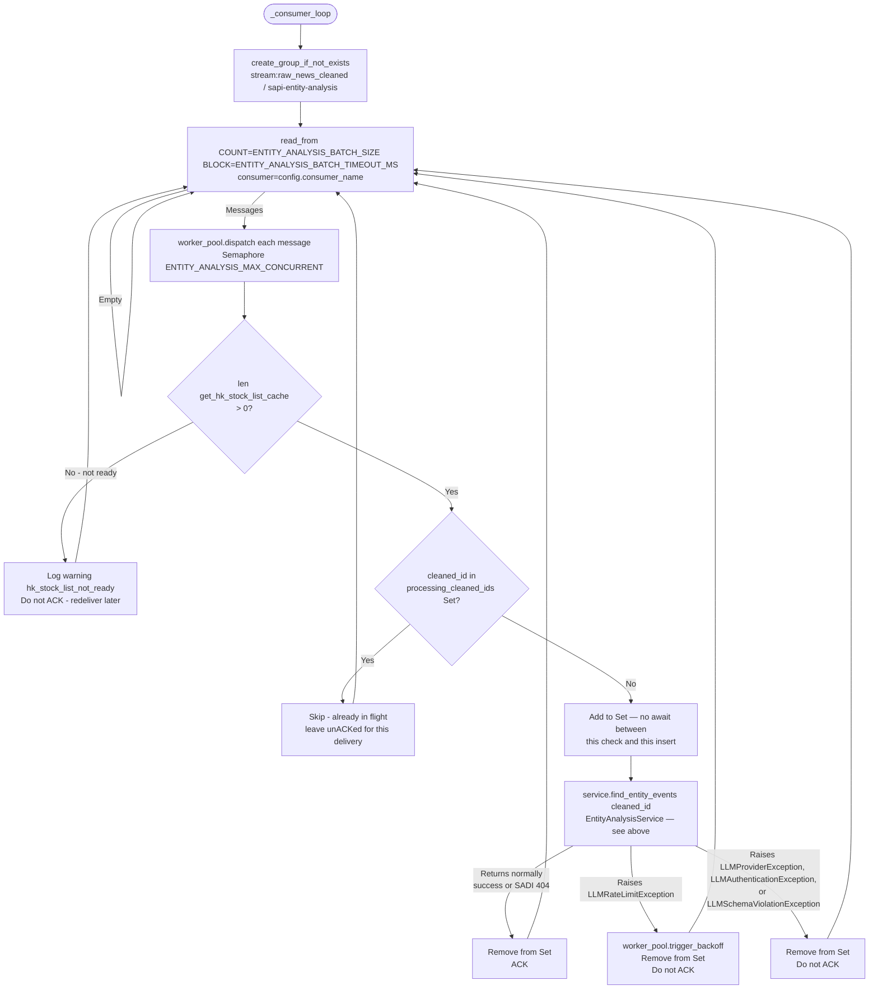
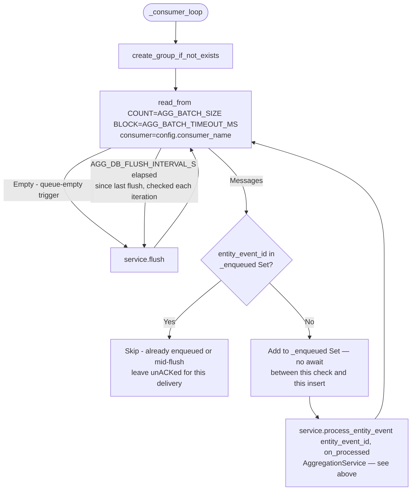
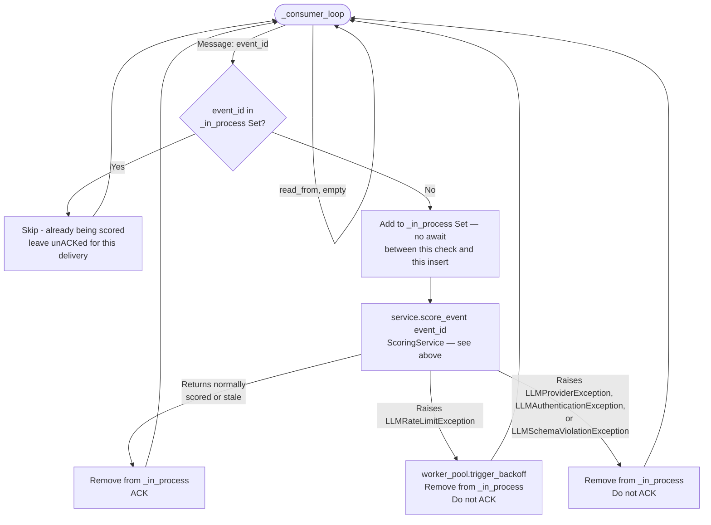
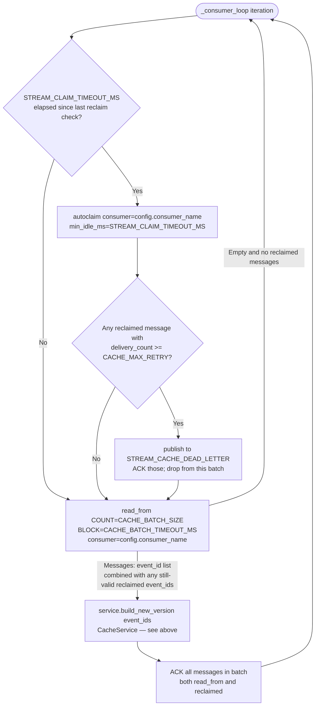

# SAPI — Implementation Guide

| Field | Detail |
|---|---|
| Service | Stock Assistant Pipeline Intelligence (SAPI) |
| Document Version | v0.1 |
| Status | DRAFT |
| Reference system-design doc | `stock-assistant-pipeline-intelligence/docs/system-design.md` |
| Reference API | `docs/api.md` |

---

## Table of Contents

1. [Development Environment Setup](#1-development-environment-setup)
2. [Project Structure](#2-project-structure)
3. [Data Models](#3-data-models)
4. [Configuration and HK Stock List](#4-configuration-and-hk-stock-list)
5. [Database Layer — `app/db/`](#5-database-layer--appdb)
6. [Redis Layer — `app/redis/`](#6-redis-layer--appredis)
7. [LLM Adapter — `app/llm/`](#7-llm-adapter--appllm)
8. [LLM Skills — `app/entity_analysis/`, `app/scoring/`](#8-llm-skills--appentity_analysis-appscoring)
9. [Clients — `app/clients/`](#9-clients--appclients)
10. [Repository — `app/persistent/`](#10-repository--apppersistent)
11. [Entity Analysis Layer — `app/entity_analysis/`](#11-entity-analysis-layer--appentity_analysis)
12. [Aggregation Layer — `app/aggregation/`](#12-aggregation-layer--appaggregation)
13. [Scoring Layer — `app/scoring/`](#13-scoring-layer--appscoring)
14. [Cache Layer — `app/cache/`](#14-cache-layer--appcache)
15. [API Layer — `app/api/`](#15-api-layer--appapi)
16. [Service Entry Point — `app/main.py`](#16-service-entry-point--appmainpy)
17. [Database Migrations — `alembic/`](#17-database-migrations--alembic)
18. [Open Questions](#18-open-questions)

---

## 1. Development Environment Setup

### Prerequisites

- Python 3.12
- Docker and Docker Compose (for PostgreSQL + Redis)
- `uv` package manager (`pip install uv`)
- A Google Cloud project with the Vertex AI API enabled, and either a service account key or `gcloud auth application-default login` for local dev

### Steps

```bash
# 1. Clone the repo and navigate to the service directory
cd stock-assistant-pipeline-intelligence

# 2. Create and activate virtual environment
uv venv
source .venv/bin/activate

# 3. Install dependencies
uv pip install -r requirements.txt

# 4. Authenticate to Vertex AI for local development
gcloud auth application-default login
# or: export GOOGLE_APPLICATION_CREDENTIALS=/path/to/service-account.json

# 5. Start local dependencies (shared with SADI; same postgres/redis instances
#    in docker-compose for local dev — see Section 13.1 of the system-design doc)
docker compose up -d postgres redis

# 6. Run database migrations
alembic upgrade head

# 7. Start the service
uvicorn app.main:app --reload --port 8001
```

### Environment Variables for Local Development

Copy `.env.example` to `.env` (gitignored — do NOT commit it) and adjust as needed:

```bash
cp .env.example .env
```

`.env.example` is the single source of truth for the full variable list and their
defaults — kept as one file rather than duplicated across this doc and `README.md`.
The full list of parameters is in Section 4 below, every one with a stated default
(`SADI_API_URL`/`MWP_ADMIN_API_URL` included — local-dev defaults only; production
values are operator-supplied per deployment).

---

## 2. Project Structure

```
sapi/
├── app/
│   ├── skills/
│   │   ├── skill_base.py                # SkillInput/SkillResult base types + LlmCallMetric/LlmErrorEntry + SkillBase: run() template method + llm_process/build_fail_result — parent of all three Skills (§8.1)
│   │   ├── entity_analysis_skill.py     # EntityAnalysisSkill; EntityAnalysisInput; LOOKUP_STOCK_TOOL; llm_process (Function Calling loop); stock verification filter; LLMOutput/EntityAnalysisResult (AnalysisOutcome itself lives in app/models/entity_event.py, §11.1)
│   │   ├── brief_summary_skill.py       # BriefSummarySkill; BriefSummaryInput; llm_process; input construction; fallback; BriefSummaryResult (BriefSummary itself now in app/models/event.py)
│   │   └── event_scoring_skill.py       # EventLLMScoringSkill; EventLLMScoringInput; llm_process; fallback; EventLLMScoringResult (LLMScore itself now in app/models/event_score.py)
│   ├── entity_analysis/
│   │   ├── entity_analysis_service.py   # EntityAnalysisService: find_entity_events() business logic; EntityEvent
│   │   ├── cleaned_news_consumer.py  # CleanedNewsConsumer: XREADGROUP consumer; idempotency Set; WorkerPool dispatch; ACK/backoff
│   │   └── worker_pool.py               # WorkerPool: asyncio.Semaphore concurrency control + rate-limit-backoff coordination
│   ├── aggregation/
│   │   ├── aggregation_service.py       # AggregationService: process_entity_event() business logic; coroutine manager; flush()
│   │   ├── aggregation_consumer.py      # AggregationConsumer: XREADGROUP consumer; _enqueued Set; on_processed callback; ACK
│   │   ├── group_coroutine.py           # GroupCoroutine: per-group asyncio.Queue, strictly-serial execution — no business logic
│   │   ├── sliding_window.py            # Pure sliding-window merge algorithm (no I/O)
│   │   └── event_aggregation_store.py   # EventAggregationStore: Redis active-Event HASH read/write/scan (agg:event:*)
│   ├── scoring/
│   │   ├── scoring_service.py           # ScoringService: score_event() business logic; Score Fusion; stale-data detection
│   │   ├── scoring_consumer.py          # ScoringConsumer: XREADGROUP consumer; _in_process guard; WorkerPool dispatch; ACK/backoff
│   │   └── rule_score.py                # Rule Score (excl. recency/direction) + Sentiment Aggregation (§5.6, §5.8)
│   ├── cache/
│   │   ├── cache_service.py             # CacheService: build_new_version() business logic; incremental merge; recency recomputation; atomic versioned replacement; orphan_cleanup_loop
│   │   └── cache_consumer.py            # CacheConsumer: XREADGROUP consumer; inline reclaim; dead-letter; batch ACK
│   ├── api/
│   │   ├── routes/
│   │   │   ├── morning_brief.py         # GET /v1/morning-brief
│   │   │   ├── health.py                # GET /v1/health
│   │   │   └── hk_stock_list_sync.py # POST /v1/hk-stock-list-sync (delegates to common/hk_stock_list.py)
│   │   ├── schemas.py                   # Pydantic request/response schemas
│   │   ├── dependencies.py              # FastAPI Depends() helper: get_layer_tasks only — every infra getter is Depends()-compatible directly from its owning module
│   │   └── main.py                      # FastAPI app factory
│   ├── llm/
│   │   ├── adapter.py                   # LLMAdapter ABC; standard data structures
│   │   ├── vertex_adapter.py            # Vertex AI implementation: generate_raw (google-genai SDK), generate_structured (Instructor)
│   │   └── exceptions.py                # LLMException base + LLMRateLimitException / LLMProviderException / LLMAuthenticationException / LLMSchemaViolationException
│   ├── clients/
│   │   ├── exceptions.py                # NewsClientException, AdminClientException — both SAPIException subclasses (§9)
│   │   ├── news_client.py              # httpx client: fetch cleaned article content from SADI (Entity Analysis Layer input)
│   │   └── admin_client.py              # httpx client: fetch source authority config from Admin (§1.5)
│   ├── db/
│   │   ├── connection.py                # asyncpg connection pool + DatabaseClient
│   │   ├── utils.py                     # _db_write_with_retry() unified write utility (system-design.md §12.1)
│   │   └── exceptions.py                # UniqueConstraintException / DatabaseException (driver-agnostic)
│   ├── redis/
│   │   ├── stream_client.py             # RedisStreamClient — messaging + reconnect logic; stream name constants
│   │   └── state_client.py              # RedisStateClient — thin generic Redis primitives (get/set/hash/scan/multi_exec); no business logic
│   ├── persistent/
│   │   ├── entity_event_repository.py   # EntityEventRepository: persist_entities(), fetch_entity_event() — entity_events reads/writes
│   │   ├── event_repository.py          # EventRepository: persist_events(), fetch_event(), fetch_events(), fetch_aggregation_updated_at(), update_brief_summary() — events/event_entity_map reads/writes
│   │   ├── event_score_repository.py    # EventScoreRepository: persist_score_if_not_stale(), fetch_scores() — event_scores reads/writes
│   │   └── cache_store.py                # CacheStore: morning_brief:* key ownership — version counter, versioned SET/DEL, orphan scan (§10.4)
│   ├── models/
│   │   ├── enums.py                     # EventTypeEnum, SentimentEnum — shared domain vocabulary
│   │   ├── versioned_metadata.py        # VersionedMetadata[T] (no serialization method — each write site builds its own dict) — shared by entity_event.py/event.py/event_score.py
│   │   ├── entity_event.py              # AnalysisOutcome (EntityAnalysisSkill's output schema, §8.2) + EntityEvent — the entity_events row itself: Skill-output hand-off, persist target, and read-back shape (§11.1, §12.1)
│   │   ├── event.py                     # Event dataclass + BriefSummary (BriefSummarySkill's output type, reused directly)
│   │   ├── event_score.py               # EventScore dataclass + RuleScore (compute_rule_score()'s own return type, reused directly) + LLMScore (Skill's own output type, reused directly)
│   │   └── event_entity_map.py          # EventEntityMap dataclass
│   ├── common/
│   │   ├── error_codes.py               # ErrorCode base + CommonErrorCode / SAPIErrorCode catalogs
│   │   ├── exceptions.py                # SAPIException base + NotFoundException / ServiceUnavailableException / ...
│   │   ├── http_client.py               # get_http_client()/create_http_client() — shared httpx.AsyncClient singleton (§4.2)
│   │   ├── stock.py                     # Stock dataclass — cross-module shape shared by lookup_stock.py, hk_stock_list.py's HKStockListCache, and EntityAnalysisSkill (§4.2)
│   │   ├── lookup_stock.py              # lookup_stock tool: exact code + fuzzy name matching, both against the in-process HKStockListCache (§4.2)
│   │   ├── hk_stock_list.py          # HKStockListCache + get_hk_stock_list_cache(); HKEXnews fetch + equity filter; startup load + sync handler, no Redis (§4.2.1)
│   │   └── supervised.py                # run_supervised() — leak-free concurrent-coroutine supervision, used by every layer's start() (§6.1)
│   ├── logger.py                        # Unified system logger; structlog; stdout JSON output
│   ├── config.py                        # App config: env var loading
│   └── main.py                          # Service entry point (lifespan): eager HK Stock List load; 4 layer Tasks + done_callback monitoring
├── alembic/
│   └── versions/
│       └── 001_create_tables.py         # entity_events + events + event_entity_map + event_scores schema
├── Dockerfile
├── requirements.txt
└── docker-compose.yml
```

---

## 3. Data Models

> **On UUID collision:** as in SADI, all primary keys use `uuid.uuid4()`. No collision-handling code is needed.

Data models are plain Python dataclasses used internally, one per DB table (system-design.md §10). Pydantic schemas for API request/response validation are kept separately in `app/api/schemas.py`. Pydantic schemas for LLM Skill inputs and Result wrappers are kept inside each Skill's own module (`entity_analysis_skill.py`, `brief_summary_skill.py`, `event_scoring_skill.py`) — see Section 8. Three Skills' own *output* schemas (`AnalysisOutcome`, `BriefSummary`, `LLMScore`) are the exception: each is also the type its Skill's DB-model field wraps directly, so it's defined in `app/models/` instead (§11.1, §3.3, §13.1) and imported back into the Skill's module.

### 3.1 `app/models/enums.py`

`EventTypeEnum` and `SentimentEnum` are core domain vocabulary — attributes of `EntityEvent`/`Event` rows (§11.1, §3.3) as much as they are API response fields — so they're defined in `app/models/`, not `app/api/schemas.py`. Keeping them in the API layer would put the dependency backwards: `app/models/` (§3.3–§3.4, the shared domain layer every other module depends on — `entity_event.py`'s `AnalysisOutcome`, §11.1, included) would have to import a domain enum from `app/api/`, an outer layer that is supposed to depend on it, not the reverse. `app/api/schemas.py` (§3.5) now imports these from here instead of defining them.

```python
from enum import Enum

class EventTypeEnum(str, Enum):
    EARNINGS = "EARNINGS"
    BUYBACK = "BUYBACK"
    MA = "MA"
    REGULATORY = "REGULATORY"
    MANAGEMENT_CHANGE = "MANAGEMENT_CHANGE"
    ANALYST_RATING = "ANALYST_RATING"
    DIVIDEND = "DIVIDEND"
    GENERAL_ANNOUNCEMENT = "GENERAL_ANNOUNCEMENT"

class SentimentEnum(str, Enum):
    POSITIVE = "POSITIVE"
    NEUTRAL = "NEUTRAL"
    NEGATIVE = "NEGATIVE"
```

### 3.2 `app/models/versioned_metadata.py`

`VersionedMetadata[T]` lives in its own module in `app/models/`, since it's shared across four separate JSONB columns spanning three tables (`entity_events.additional_outcome`, `events.brief_summary`, `event_scores.rule_score_detail`, `event_scores.llm_score_detail`) — it belongs to no single one of them. `event.py` (§3.3), `event_score.py` (§13.1), and `entity_event.py` (§11.1) all import it directly.

**All four columns wrap the type their originating computation already returns, directly — no separate persisted-shape type anywhere in this doc's models.** `entity_events.additional_outcome` wraps `AnalysisOutcome` (§8.2/§11.1 — Instructor validates `EntityAnalysisSkill`'s structured-output call against it, but it's defined in `app/models/`, alongside `EntityEvent`, the one type that wraps it); `events.brief_summary` wraps `BriefSummary`, and `event_scores.rule_score_detail`/`llm_score_detail` wrap `RuleScore`/`LLMScore` (§3.3, §13.1) — all three moved *into* `app/models/` the same way, with their originating module (`entity_analysis_skill.py`, `brief_summary_skill.py`, `rule_score.py`, `event_scoring_skill.py`) importing the type back instead of defining its own duplicate. `rule_score.py` is the one of these that lives in a restricted package (`app/scoring/`) — but that only constrains which direction the *import* can go (never `app/models/` → `app/scoring/`); it doesn't stop `RuleScore`'s own definition from living in `app/models/` and being imported the other way.

**No shared serialization method, and no generic `dataclasses.asdict()`/`.model_dump()` call anywhere either.** Each write site hand-builds its own `{"version": ..., "output": {...}}` dict, naming every field explicitly, the same way `entity_events.additional_outcome` always had to (§11.1) — it's a narrower, hand-picked projection (`{company_name, event_type_secondary, headline, entity_summary}`, not all seven of `AnalysisOutcome`'s fields, plus `company_name`, which isn't on `AnalysisOutcome` at all since the LLM never produces it, §8.2), so a generic full-object dump was never going to work for it regardless. The other three columns' `output` *does* happen to include every field of its type today, but they're still built the same explicit, named-field way (§10.2, §10.3) rather than via `.model_dump()`/`dataclasses.asdict()` — so a field silently added to `BriefSummary`/`RuleScore`/`LLMScore` later doesn't silently start appearing in the DB (or vice versa) just because a generic dump happened to pick it up; every key persisted is named at the call site that persists it, matching what `_row_to_entity_event()`'s equally explicit, field-by-field reconstruction already does on the read side.

```python
from dataclasses import dataclass
from typing import Generic, TypeVar

T = TypeVar("T")

@dataclass
class VersionedMetadata(Generic[T]):
    """Generic wrapper for the {"version": ..., "output": {...}} JSONB shape shared
    by every Skill/computation output column: entity_events.additional_outcome,
    events.brief_summary, event_scores.rule_score_detail, event_scores.llm_score_detail
    (§11.1, §3.3, §13.1). No to_dict() or other serialization method here — each
    write site knows its own .output's actual shape and builds its own dict,
    since that shape genuinely differs per column (see this section's intro)."""
    version: str
    output: T
```

### 3.3 `app/models/event.py`

```python
from dataclasses import dataclass
from datetime import datetime
from uuid import UUID
from typing import Optional

from pydantic import BaseModel

from app.models.versioned_metadata import VersionedMetadata   # §3.2

class BriefSummary(BaseModel):
    """Instructor-validated output of BriefSummarySkill.run() (§8.3) — moved into
    app/models/ alongside Event, since Event.brief_summary wraps it directly, no
    separate persisted-shape type (§3.2's intro). app/skills/brief_summary_skill.py
    imports it from here instead of defining it; it's still what generate_structured()
    (§7.3) validates the LLM's output against — moving its home doesn't change that."""
    summary_short: str      # <=30 Traditional Chinese characters
    summary_full: str       # <=150 Traditional Chinese characters
    key_numbers: list[str]  # max 3 items; may be empty

@dataclass
class SourceListItem:
    source_name: str        # e.g. "HKEX", "MINGPAO"; matches entity_events.source_name / source:config keys
    url: str                # Original article URL for this source's constituent EntityEvent
    published_at: datetime  # UTC

@dataclass
class Event:
    event_id: UUID                       # Primary key; generate with uuid.uuid4() on first creation
    exchange: str                        # Morning Brief API filter
    stock_code: str                      # Morning Brief API filter
    event_type_primary: str              # Morning Brief API filter
    first_seen_at: datetime              # published_at of earliest constituent EntityEvent
    last_seen_at: datetime               # published_at of most recent constituent EntityEvent
    event_type_secondary: Optional[list[str]] = None       # Up to 2 secondary types, frequency-ranked (PRD §OQ-8) — None until persisted; the UPSERT computes it (§10.2), so whatever's set pre-persist is never read
    source_list: Optional[list[SourceListItem]] = None      # One entry per distinct source reporting this Event — None until persisted, same as event_type_secondary
    brief_summary: Optional[VersionedMetadata[BriefSummary]] = None  # NULL until the Scoring Layer's first pass (§13.1)
    aggregation_updated_at: Optional[datetime] = None       # Written by Aggregation Layer only — set by merge_or_create() (§12.4) the moment a merge/create actually happens, not by the DB write; still None only before the first-ever merge for a group
    updated_at: Optional[datetime] = None                    # same
    created_at: Optional[datetime] = None                    # same — preserved across re-flushes of the same event_id by the UPSERT's own ON CONFLICT clause, which never re-sets it
    entity_event_ids: Optional[list[UUID]] = None            # Aggregation Layer-only, pre-persist: drives EventRepository.persist_events()'s event_entity_map write (§10.2). Never populated by fetch_event() — nothing reads it back off a persisted Event.

    @property
    def source_count(self) -> Optional[int]:
        """Number of distinct sources — always len(source_list), never a
        second value to keep in sync. No backing events.source_count column
        (§17) — a denormalized copy was tried and removed: nothing on the
        Python side ever read it independently of source_list (_row_to_event(),
        §10.2, never touched it), so it was a second value that could only
        ever drift, never help. A future caller wanting a cheap, no-deserialize
        DB-level count can use jsonb_array_length(source_list) directly, or an
        expression index on it if that ever matters at scale — both give the
        same answer as this property with no separate column to keep in sync."""
        return len(self.source_list) if self.source_list is not None else None
```

`Event` is deliberately one type across all three of its lifecycle stages — Redis-active/in-progress (§12.3–§12.5), the input to `EventRepository.persist_events()` (§10.2), and a fully-persisted row read back by Scoring/Cache (§13.1/§14.1) — rather than a separate `ActiveEvent` shape for the first two. `event_id`/`exchange`/`stock_code`/`event_type_primary`/`first_seen_at`/`last_seen_at`/`aggregation_updated_at` are known from the moment `merge_or_create()` (§12.4) first creates an `Event` — `aggregation_updated_at` is business logic, not DB bookkeeping, which is why it's set there and not left for the DB write to stamp (§10.2). Everything below them (`event_type_secondary`, `source_list`, `brief_summary`, `updated_at`, `created_at`) is `Optional` because it genuinely isn't known until the DB write itself computes or generates it. By the time Scoring or Cache reads an `Event` back, every field except `entity_event_ids` is always populated in practice; the type stays `Optional` because nothing in this layer enforces that invariant at compile time, only the DB's own `NOT NULL` constraints (§17) do.

> `source_list` is stored as `events.source_list` JSONB (§17) — `[{"source_name": ..., "url": ..., "published_at": ...}, ...]` on the wire/in the DB — but modelled here as `list[SourceListItem]` rather than `list[dict]` so code reading `event.source_list` gets attribute access (`item.source_name`) with type-checker support, instead of untyped dict-key lookups. Serialize with `dataclasses.asdict()` (or a small `to_dict()`) when writing the JSONB column or the Morning Brief cache payload (§14.5); deserialize into `SourceListItem` instances when reading rows back — `_fetch_event()`-style helpers should not hand callers raw dicts here. This is a plain dataclass, not a Pydantic model, consistent with the rest of `app/models/` (§3) — validation of this shape happens once, at the Aggregation Layer write boundary that constructs it, not on every read.

> **`brief_summary` is `BriefSummarySkill`'s own output type, reused as-is — no separate persisted-shape type.** `BriefSummarySkill.run()` (§8.3) returns a `BriefSummaryResult` whose `output` field is an *Instructor-validated* `BriefSummary` (a Pydantic `BaseModel`) — the LLM call's direct, schema-enforced result. `Event.brief_summary` above wraps that exact same type, `VersionedMetadata[BriefSummary]` (§3.2) — `ScoringService` just wraps it, no field-by-field conversion:
> ```python
> brief_summary = VersionedMetadata(version=result.skill_log.skill_version, output=result.output)
> ```
> Persisting it hand-builds `{"version": ..., "output": {...}}` with each `BriefSummary` field named explicitly (§3.2's intro) — no `VersionedMetadata` serialization method, no `.model_dump()` — see `EventRepository.update_brief_summary()` (§10.2).

### 3.4 `app/models/event_entity_map.py`

```python
from dataclasses import dataclass
from datetime import datetime
from uuid import UUID

@dataclass
class EventEntityMap:
    event_id: UUID           # FK -> events.event_id
    entity_event_id: UUID    # FK -> entity_events.entity_event_id; unique constraint
    created_at: datetime     # UTC; time this EntityEvent was aggregated into the Event
```

### 3.5 `app/api/schemas.py` — Pydantic Schemas

These are the request/response shapes for the FastAPI routes; they mirror `docs/api.md` §3 exactly. `EventTypeEnum` and `SentimentEnum` are imported from `app.models.enums` (§3.1) rather than defined here — see that section for why they belong to the domain-model layer, not the API layer.

```python
from pydantic import BaseModel, Field
from uuid import UUID
from typing import List, Optional, Union
from datetime import datetime
from enum import Enum

from app.models.enums import EventTypeEnum, SentimentEnum

class HealthStatus(str, Enum):
    HEALTHY = "healthy"
    DEGRADED = "degraded"
    UNHEALTHY = "unhealthy"

class ComponentStatus(str, Enum):
    OK = "ok"
    ERROR = "error"

class HKStockListStatus(str, Enum):
    OK = "ok"
    NOT_READY = "not_ready"

# ── GET /v1/health ────────────────────────────────────────────────────────────

class LayerStatus(BaseModel):
    entity_analysis: ComponentStatus
    aggregation: ComponentStatus
    scoring: ComponentStatus
    cache: ComponentStatus

class HealthResponse(BaseModel):
    status: HealthStatus
    database: ComponentStatus
    redis_stream: ComponentStatus
    redis_state: ComponentStatus
    hk_stock_list: HKStockListStatus
    layers: LayerStatus

# ── GET /v1/morning-brief ──────────────────────────────────────────────────────

class MorningBriefQuery(BaseModel):
    stocks: str = Field(..., min_length=1)      # comma-separated, split by the route handler
    k: int = Field(default=20, ge=1, le=50)

class SourceListEntry(BaseModel):
    source_name: str
    url: str
    published_at: datetime

class EventDetail(BaseModel):
    event_type_secondary: List[EventTypeEnum]    # empty list if none
    source_count: int
    source_list: List[SourceListEntry]
    summary_short: str
    summary_full: str
    key_numbers: List[str]                       # empty list if none

class RuleScoreDetail(BaseModel):
    event_type_score: float
    source_authority_score: float
    sentiment_strength_score: float
    source_heat_score: float

class LLMScoreDetail(BaseModel):
    adjustment_reason: str
    score_version: str
    scored_at: datetime

class ScoreDetail(BaseModel):
    stock_impact_score: float
    llm_fallback: bool
    rule_score_detail: RuleScoreDetail
    llm_score_detail: LLMScoreDetail

class ScoredEventRecord(BaseModel):
    event_id: UUID
    exchange: str
    stock_code: str
    event_type_primary: EventTypeEnum
    abs_final_score: float          # includes real-time recency (§6.3)
    base_rule_score: float          # signed; includes real-time recency
    first_seen_at: datetime
    last_seen_at: datetime
    event: EventDetail
    score: ScoreDetail

class MorningBriefResponse(BaseModel):
    cache_version: Optional[int]
    last_updated: Optional[datetime]
    events: List[ScoredEventRecord]

# ── POST /v1/hk-stock-list-sync ────────────────────────────────────────────

class HKStockListSyncResponse(BaseModel):
    status: str = "success"
    entries_loaded: int

# ── Error Response (used by all routes) ───────────────────────────────────────

class ErrorResponse(BaseModel):
    error_code: str
    message: str
    detail: Union[str, dict] = {}
```

---

## 4. Configuration and HK Stock List

### 4.1 Configuration — `app/config.py`

#### Purpose

Loads all environment variables into a single `AppConfig` object. All other modules import config from here — never use `os.environ` directly in business code (same rule as SADI).

#### Class: `DatabaseConfig`

```python
@dataclass
class DatabaseConfig:
    url: str                # env: DATABASE_URL
    pool_size: int           # env: DB_POOL_SIZE (default 10) — asyncpg pool sizing; plumbing detail
                             # added by this doc, same class of addition as SADI's DatabaseConfig.pool_size
    max_retry: int           # env: DB_WRITE_MAX_RETRY
    retry_base_wait_ms: int  # env: DB_RETRY_BASE_WAIT_MS
```

#### Class: `RedisConfig`

```python
@dataclass
class RedisConfig:
    stream_url: str                 # env: REDIS_STREAM_URL
    state_url: str                  # env: REDIS_STATE_URL
    reconnect_interval_s: int       # env: REDIS_RECONNECT_INTERVAL_S
    stream_claim_timeout_ms: int    # env: STREAM_CLAIM_TIMEOUT_MS
```

#### Class: `LLMConfig`

```python
@dataclass
class LLMConfig:
    vertex_project: str            # env: VERTEX_AI_PROJECT
    vertex_location: str           # env: VERTEX_AI_LOCATION
    api_timeout_s: int             # env: LLM_API_TIMEOUT_S
    instructor_max_retries: int    # env: INSTRUCTOR_MAX_RETRIES
    rate_limit_backoff_s: int      # env: RATE_LIMIT_BACKOFF_S
```

#### Class: `EntityAnalysisConfig`

```python
@dataclass
class EntityAnalysisConfig:
    batch_size: int                       # env: ENTITY_ANALYSIS_BATCH_SIZE
    batch_timeout_ms: int                 # env: ENTITY_ANALYSIS_BATCH_TIMEOUT_MS
    max_concurrent: int                   # env: ENTITY_ANALYSIS_MAX_CONCURRENT
    max_retry: int                        # env: ENTITY_ANALYSIS_MAX_RETRY
    name_match_min_overlap_ratio: float   # env: NAME_MATCH_MIN_OVERLAP_RATIO
    max_fc_rounds: int                    # env: MAX_FC_ROUNDS
    max_fc_retries_per_entity: int        # env: MAX_FC_RETRIES_PER_ENTITY
    sadi_api_url: str                     # env: SADI_API_URL — local dev default: http://localhost:8000
                                           # (SADI's own quickstart port, stock-assistant-data-ingestion/docs/implementation.md §1);
                                           # excludes "/v1" — NewsClient appends it per-call (§9.1)
    sadi_api_timeout_s: int               # env: SADI_API_TIMEOUT_S
    consumer_name: str                    # env: HOSTNAME, fallback "sapi-entity-analysis-1" — see §6.1's Reclaim pattern
```

#### Class: `AggConfig`

```python
@dataclass
class AggConfig:
    batch_size: int                 # env: AGG_BATCH_SIZE
    batch_timeout_ms: int           # env: AGG_BATCH_TIMEOUT_MS
    max_concurrent: int             # env: AGG_MAX_CONCURRENT
    group_idle_timeout_s: int       # env: AGG_GROUP_IDLE_TIMEOUT_S
    db_flush_interval_s: int        # env: AGG_DB_FLUSH_INTERVAL_S
    max_retry: int                  # env: AGG_MAX_RETRY
    sliding_window_hours: int       # env: SLIDING_WINDOW_HOURS
    event_max_timespan_hours: int   # env: EVENT_MAX_TIMESPAN_HOURS
    consumer_name: str               # env: HOSTNAME, fallback "sapi-aggregation-1" — see §6.1's Reclaim pattern
```

#### Class: `EventTypeScore`

```python
@dataclass
class EventTypeScore:
    """One (event_type, score) pair — a Rule Score dimension input (§13.3's
    compute_rule_score()). Pairs the type with its score as one value,
    rather than the type being encoded only in a Python field name
    (event_type_score_earnings, ...) that a separate lookup table then has
    to reconnect to the right EventTypeEnum member (§3.1) — that was this
    data's original shape in this doc; this dataclass replaces it. Lives in
    app/config.py, not app/models/ — it shapes one config field's
    env-var-assembled value, not a persisted or Skill-produced domain object,
    so it's owned by config the same way DatabaseConfig/RedisConfig are."""
    event_type: str    # one of EventTypeEnum's 8 values (§3.1)
    score: float         # [0, 10]
```

#### Class: `ScoringConfig`

```python
@dataclass
class ScoringConfig:
    batch_size: int                        # env: SCORING_BATCH_SIZE
    batch_timeout_ms: int                  # env: SCORING_BATCH_TIMEOUT_MS
    max_concurrent: int                    # env: SCORING_MAX_CONCURRENT
    max_retry: int                         # env: SCORING_MAX_RETRY
    source_config_ttl_s: int               # env: SOURCE_CONFIG_TTL_S
    admin_api_url: str                     # env: MWP_ADMIN_API_URL — local dev default: http://localhost:8080
                                            # (Spring Boot's conventional port; admin/ doesn't exist yet, confirm
                                            # once application.yml is written, admin-tad.md). Excludes "/v1" —
                                            # AdminClient appends it per-call (§9.2)
    total_active_sources_default: int      # env: TOTAL_ACTIVE_SOURCES_DEFAULT
    consumer_name: str                     # env: HOSTNAME, fallback "sapi-scoring-1" — see §6.1's Reclaim pattern
    event_type_score: list[EventTypeScore]  # 8 entries, one per EventTypeEnum member (§3.1) — Rule Score
                                             # dimension input (§13.3's compute_rule_score()). Each entry is
                                             # sourced from its own EVENT_TYPE_WEIGHT_* env var (PRD §12.1),
                                             # assembled by load_config() (below) into this one list field —
                                             # the one ScoringConfig field built from more than a single env
                                             # var. PRD only names the original four (EARNINGS/MA/REGULATORY/
                                             # GENERAL) — the other four were added during design review
                                             # (system-design.md §5.6) and get the same env-var-backed,
                                             # operator-configurable treatment.
```

> **Like every other value in this config, startup-loaded, not truly live-reloadable.** PRD §12.1 marks the `EVENT_TYPE_WEIGHT_*` family "Hot-reload: Yes," but `load_config()` (below) runs once, at service startup — no SAPI config value has an actual runtime-reload path today (`source:config`, §1.5/§13.5, is the one exception, and it's Admin-API-backed Redis state, not an env var). This gap predates and is broader than `event_type_score` specifically — closing it for real (e.g. `SIGHUP`-triggered reload) is a separate, later change to `app/config.py`'s loading model, out of scope here; what this fix closes is narrower: `event_type_score` previously had *no* config path at all, not even a restart-to-change one, unlike every other Rule Score dimension input.

#### Class: `CacheConfig`

```python
@dataclass
class CacheConfig:
    batch_size: int                          # env: CACHE_BATCH_SIZE
    batch_timeout_ms: int                    # env: CACHE_BATCH_TIMEOUT_MS
    max_retry: int                           # env: CACHE_MAX_RETRY
    noise_filter_threshold: float            # env: NOISE_FILTER_THRESHOLD
    orphan_cleanup_interval_s: int           # env: CACHE_ORPHAN_CLEANUP_INTERVAL_S
    recency_decay_lambda: float              # env: RECENCY_DECAY_LAMBDA
    top_k_default: int                       # env: TOP_K_DEFAULT
    full_fetch_page_size: int                # env: CACHE_FULL_FETCH_PAGE_SIZE — EventScoreRepository.fetch_scores()'s (§10.3) page size, used only by build_initial_version()'s (§14.1) full fetch
    consumer_name: str                       # env: HOSTNAME, fallback "sapi-cache-1" — see §6.1's Reclaim pattern
```

> **`consumer_name` sourcing (all four configs).** `load_config()` (below) sets each of these to `os.environ.get("HOSTNAME", "<layer-specific fallback>")` — Kubernetes sets `HOSTNAME` to the pod's own unique name automatically, and consumer-name uniqueness only needs to hold *within* a consumer group (§6.1), which each layer already has its own of. The per-layer fallback string just keeps local/docker-compose `XPENDING` output readable, where `HOSTNAME` isn't meaningfully unique. Not a dedicated env var like `ENTITY_ANALYSIS_CONSUMER_NAME`, since that would require an operator to manually vary it per replica; `HOSTNAME` is unique with no action required. A changing identity across restarts is fine — `_reclaim_loop()` (§6.1) recovers a previous identity's abandoned entries after `STREAM_CLAIM_TIMEOUT_MS`.

#### Class: `AppConfig`

```python
@dataclass
class AppConfig:
    db: DatabaseConfig
    redis: RedisConfig
    llm: LLMConfig
    entity_analysis: EntityAnalysisConfig
    agg: AggConfig
    scoring: ScoringConfig
    cache: CacheConfig
```

#### Function: `load_config() -> AppConfig`

```
Purpose : Read environment variables; construct and return a validated AppConfig.
Called  : Once at service startup in app/main.py lifespan.
Raises  : ValueError if a required env var is missing.
```

Implementation notes:
- Use `os.environ` here only (not in business code)
- Build each sub-config from its respective env var group (tables above), then compose into `AppConfig`
- `consumer_name` on all four sub-configs is the one field not sourced from its own dedicated env var — read `os.environ.get("HOSTNAME", "<layer fallback>")` once per sub-config (four calls, four different fallback strings) rather than requiring `HOSTNAME` outright; see the note under §4.1's four config classes for why
- `ScoringConfig.event_type_score` is the other field built from more than a single env var — 8 separate reads (`EVENT_TYPE_WEIGHT_EARNINGS`/`_MA`/`_REGULATORY`/`_BUYBACK`/`_MANAGEMENT_CHANGE`/`_DIVIDEND`/`_ANALYST_RATING`/`_GENERAL`, defaults 9.0/8.5/8.0/7.0/7.0/6.0/5.0/4.0), each becoming one `EventTypeScore(event_type=..., score=...)` entry in the list, in `EventTypeEnum` order (§3.1)
- Store the loaded `AppConfig` as a module-level singleton so routes can import it

```python
# Usage in other modules:
from app.config import get_config
config = get_config()
```

---

### 4.2 HK Stock List — `app/common/hk_stock_list.py`

Broken out as its own top-level section, not folded into §8 (LLM Skills), since it isn't only an LLM concern: besides being the reference data `EntityAnalysisSkill`'s `lookup_stock` tool (below) reads, it's also its own API-facing surface — `POST /hk-stock-list-sync` (§15.5) triggers a refresh directly, and `GET /health` (§15.2) gates readiness on it — neither of which has anything to do with an LLM call. `lookup_stock` itself lives here too, for the same reason — it's cache-reading logic, not LLM-specific logic; `EntityAnalysisSkill`'s Function Calling loop (§8.2) is just its first and only caller today.

**No Redis involvement — in-process only.** Design rationale (why Redis would be pure round-trip overhead here, when to revisit for multi-replica): system-design.md §9.2.1. The fetch result is held directly in a single shared mutable `HKStockListCache` instance (below) — there is only ever one copy, so the propagation gap that rationale warns against can't arise — matching this doc's "one consumer in MVP; expand for horizontal scaling" treatment elsewhere (§6.1).

#### `app/common/stock.py` — `Stock`

A cross-module shape, not owned by `lookup_stock.py` itself — both `lookup_stock()` (below) and `EntityAnalysisSkill`'s Function Calling loop (§8.2) import it directly, so it gets its own tiny module rather than living inside whichever file happens to produce it first, the same reasoning `app/common/http_client.py` (above) already applies to the shared `httpx.AsyncClient`. Not a DB-persisted shape (unlike `VersionedMetadata`/`RuleScore` and the other output-shape dataclasses in `app/models/`, §3.2/§13.1), so it stays in `app/common/` rather than `app/models/` — nothing here is written to a JSONB column or a DB row. The shape of a *found* match only — `lookup_stock()` (below) returns `None` for a miss instead of a "found" flag with all-`None` fields, so every field here is unconditionally present.

`stock_code` is the **bare native code** (e.g. `"00700"`, no exchange suffix) — the same format HKEXnews's feed and `name_or_code` normalization both already use, with no conversion at this boundary. `exchange` (currently always `"HKEX"`) is its own typed field rather than baked into the code string via a `.HK` suffix. This is a **deliberate, confirmed deviation from an earlier system-design draft's `.HK`-suffixed `stock_code`** — every other persisted stock-bearing model in this doc (`EntityEvent`, `Event`, `ScoredEventRecord`, §3) already carries its own separate `exchange` field alongside `stock_code`, so the suffix was redundant. system-design.md §9.2 and `docs/api.md`'s Morning Brief schema have been updated to match (bare codes throughout).

```python
from dataclasses import dataclass

@dataclass
class Stock:
    stock_code: str          # bare native code, e.g. "00700" — no exchange suffix
    exchange: str             # e.g. "HKEX" — currently always "HKEX", single-exchange MVP scope
    company_name_zh: str
    company_name_en: str

    @property
    def company_name(self) -> str:
        """Single resolved display name — company_name_zh, falling back to
        company_name_en when the Chinese name is empty (e.g. a recently-listed
        or foreign-incorporated company whose Chinese registration name
        hasn't been filed). Computed, not stored, so callers needing one name
        never have to duplicate this fallback themselves."""
        return self.company_name_zh or self.company_name_en
```

#### `app/common/http_client.py` — the one other new getter this module needs

`refresh_hk_stock_list()` (below) is called from an API route (§15.5) — a genuinely deep call site relative to `main.py`. It needs the shared `httpx.AsyncClient` main.py constructs at startup (the same one `NewsClient`/`AdminClient` wrap, §9), so that client gets the same `get_X()` treatment (§5.1), in its own tiny module rather than living inside `hk_stock_list.py`:

```python
# app/common/http_client.py
_http_client: Optional[httpx.AsyncClient] = None

def get_http_client() -> httpx.AsyncClient:
    if _http_client is None:
        raise ServiceUnavailableException("get_http_client() called before create_http_client() initialized it")
    return _http_client

def create_http_client(**kwargs) -> httpx.AsyncClient:
    global _http_client
    _http_client = httpx.AsyncClient(**kwargs)
    return _http_client
```

#### Class: `HKStockListCache`

**No separate `MasterListEntry` type — `entries` holds `Stock` (below) directly.** `Stock.stock_code` is the bare native code, matching `entries`' own dict key, so `entries[k].stock_code == k` holds cleanly for every `k`, with no wrapping type needed.

The one shared, mutable holder for the in-process HK Stock List — process-wide infra, so it gets the same `get_X()` treatment as `DatabaseClient`/`RedisStreamClient`/`RedisStateClient`/`LLMAdapter` (§5.1). `app/main.py` (§16) constructs exactly one instance at startup; `EntityAnalysisSkill` (§8.2) and the `POST /hk-stock-list-sync` route (§15.5) both call `get_hk_stock_list_cache()` to reach *that same instance* — so a later refresh's rebind of `.entries` (`refresh_hk_stock_list()`, below) is immediately visible to `EntityAnalysisSkill`'s next `lookup_stock()` call, with no propagation step and no risk of the two disagreeing (there is only ever one copy).

No `.replace()` method — `refresh_hk_stock_list()` (below) is the only caller that ever updates `.entries` after construction, so the rebind lives directly in that one call site with a comment, rather than a single-purpose method wrapping a one-line assignment.

```python
class HKStockListCache:
    def __init__(self, entries: dict[str, Stock]):
        self.entries = entries

    def __len__(self) -> int:
        """Lets GET /health's readiness gate (§15.2) just do len(cache) > 0."""
        return len(self.entries)

_hk_stock_list_cache: Optional[HKStockListCache] = None

def get_hk_stock_list_cache() -> HKStockListCache:
    if _hk_stock_list_cache is None:
        raise ServiceUnavailableException("get_hk_stock_list_cache() called before refresh_hk_stock_list() initialized it")
    return _hk_stock_list_cache
```

#### Function: `lookup_stock(name_or_code: str, min_overlap_ratio: float) -> Optional[Stock]`

```
Purpose : Resolve a company name or stock code against the HK Stock List.
          Called by EntityAnalysisSkill's Function Calling loop (§8.2)
          as the handler for the LLM's lookup_stock tool calls.
Params  : name_or_code       — raw string from the LLM's tool_call arguments
          min_overlap_ratio    — NAME_MATCH_MIN_OVERLAP_RATIO
Returns : Stock on a match, None on a miss. Unchanged by the
          Performance verification note below; that instrumentation is a
          self-contained logging side effect, not a return-value change.
          This is not system-design.md §9.2's full wire-format tool-result shape
          ({"found": ..., "stock_code": ..., ...}, optionally with
          "instruction") — building that dict, including the "found": False
          case and the retry-triggered "instruction" field, is entirely the
          FC loop's job (§8.2), since neither is something lookup_stock()
          itself ever produces or needs to know about.
```

No `hk_stock_list_cache` parameter — `HKStockListCache` is process-wide infra (above), so `lookup_stock()` calls `get_hk_stock_list_cache()` directly, the same as it would call `get_db_client()` if it needed DB access. No Redis dependency either way — fuzzy matching requires the full set in-process regardless (system-design.md §9.2: Redis has no native fuzzy text search), so the exact-code path piggybacks on the same in-memory data.

```python
from app.common.hk_stock_list import get_hk_stock_list_cache
```

**Format detection and code normalization** (system-design.md §9.2): strip non-digit characters from `name_or_code`, zero-pad to 5 digits; if the result is entirely digits and the original contained at least 2 digits, treat as a code lookup — `get_hk_stock_list_cache().entries.get(normalized)` — a hit returns the `Stock` already stored there directly (no wrapping step; see above's note on `entries`' value type), a miss returns `None`. Otherwise, treat as a name query and run fuzzy matching against the same `get_hk_stock_list_cache().entries`.

**Fuzzy name matching** (design rationale — overlap-ratio normalization, `NAME_MATCH_MIN_OVERLAP_RATIO` calibration: system-design.md §9.2):

```python
def _fuzzy_match(query: str, candidates: dict[str, Stock], min_overlap_ratio: float) -> Optional[str]:
    scored = []
    for code, entry in candidates.items():
        for candidate_name in (entry.company_name_zh, entry.company_name_en):
            overlap = len(set(query) & set(candidate_name))  # multiset overlap per system-design.md §9.2
            overlap_ratio = overlap / len(query)
            if overlap_ratio >= min_overlap_ratio:
                lcs = _lcs_length(query, candidate_name)
                scored.append((overlap, lcs, code))
    if not scored:
        return None
    scored.sort(key=lambda t: (-t[0], -t[1]))  # char_overlap_count DESC, then lcs_length DESC
    return scored[0][2]
```

> Implementation note: `set(query) & set(candidate_name)` above is a simplification of system-design.md §9.2's `multiset(query) ∩ multiset(candidate)` for the common case of few repeated characters in HK company names; if repeated-character precision matters in practice (e.g. a query with a doubled character should count that character twice), use `collections.Counter` intersection instead of `set` intersection. Flag this as a Week 2 validation item alongside Q-16 (§18) if fuzzy-match quality issues trace back to it.

**Outbound formatting:** `_fuzzy_match` returns a bare native `code` (a dict key, matching `candidates`' own key format) — the caller resolves it back to a `Stock` via `candidates[code]` (i.e. `get_hk_stock_list_cache().entries[code]`) exactly like the exact-code path above. `Stock.stock_code` is that same bare code — no format conversion happens at this boundary.

#### Performance verification — `lookup_stock_completed` log event

`_fuzzy_match` is an O(N) synchronous scan over the ~2,000–2,600-entry HK Stock List (system-design.md §9.2.1) with no `await` in it — called from inside `EntityAnalysisSkill`'s Function Calling loop, which runs on the *same* event loop as all four SAPI layers (§16). A slow call doesn't just delay the one article being processed; it blocks Aggregation/Scoring/Cache's own consumer loops in the same process for its duration. Real-volume impact hasn't been measured (§18's I-1), so `lookup_stock` logs its own timing directly as a self-contained side effect, rather than threading that data through the FC loop into some other event.

```python
import time
import logging

_SLOW_CALL_THRESHOLD_MS = 20   # escalates this call's log line to WARNING instead of
                                # INFO; an instrumentation knob, not a business-tuning
                                # one — no env var, same treatment as fc_rounds_exceeded

async def lookup_stock(name_or_code, min_overlap_ratio) -> Optional[Stock]:
    start = time.perf_counter()
    hk_stock_list_cache = get_hk_stock_list_cache()
    # ... existing exact-code / fuzzy-name branches build `result: Optional[Stock]`
    # and set local `path` ("exact_code" | "fuzzy_name") and `candidates_scanned`
    # (0 for exact_code — an O(1) dict lookup; len(hk_stock_list_cache) for
    # fuzzy_name — _fuzzy_match has no short-circuit, always a full scan;
    # HKStockListCache.__len__ makes this len() call work directly) ...

    latency_ms = (time.perf_counter() - start) * 1000
    level = logging.WARNING if latency_ms > _SLOW_CALL_THRESHOLD_MS else logging.INFO
    logger.log(level, "lookup_stock_completed", name_or_code=name_or_code, path=path,
               candidates_scanned=candidates_scanned, latency_ms=latency_ms, found=result is not None)
    return result
```

`name_or_code` in the log line is what makes an individual slow call actionable (which entity name triggered it), without needing to correlate back to the specific article or `entity_analysis_completed` invocation it came from — aggregate analysis (p50/p95/p99 across many `lookup_stock_completed` lines, `fuzzy_name`-path frequency) doesn't need that correlation either, so none is added. `logger` is the shared structlog logger (`app/logger.py`).

Once SAPI processes real articles, p50/p95/p99 latency and the `fuzzy_name`-path frequency are already sitting in `lookup_stock_completed` log lines, ready to query — no dedicated collection step to remember to add later.

#### Exception: `ParseException`

```python
class ParseException(SAPIException):
    """Generic "fetch succeeded but the response couldn't be parsed into the
    expected shape" exception — a code/schema issue, not a resource/
    availability one. Most SAPIException subclasses in this doc fix error_code
    as a class attribute — one exception type per error code, e.g.
    MorningBriefCacheUnavailableException (§15.4). This one takes error_code
    as a constructor argument instead — the same reason ServiceUnavailableException
    (§15.1) does too — so any parsing domain can reuse the same class with its
    own SAPIErrorCode rather than defining a near-identical subclass just to
    vary which code gets attached — parsing failures are structurally
    identical across domains (HK Stock List today, potentially others later);
    only the error_code and detail message differ per call site."""
    def __init__(self, detail: str, error_code: ErrorCode):
        super().__init__(detail)
        self.error_code = error_code
```

Lives here, in `app/common/hk_stock_list.py`, rather than in the shared `app/common/exceptions.py` — the same reasoning SADI's `LLMRateLimitException`/`LLMProviderException`/`LLMSchemaViolationException`-style domain exceptions (§7.1) and its own `app/crawl/exceptions.py` follow: an exception tied to one specific fetch/parse operation belongs next to that operation, not in the generic cross-app exceptions module (`ServiceUnavailableException`/`NotFoundException` stay there because many unrelated modules raise them; this one has exactly one raise site).

#### Function: `_fetch_and_filter_hk_stock_list(http_client: httpx.AsyncClient) -> dict[str, Stock]`

```
Purpose : Fetch HKEXnews's bilingual JSON endpoints (system-design.md §9.2.1), match
          entries index-for-index by stock code across both files, filter
          to Category=Equity only via the official "List of Securities"
          download, and return {native_code: Stock(stock_code=native_code,
          exchange="HKEX", company_name_zh=..., company_name_en=...)}. No
          format conversion happens here — the dict key and
          result[native_code].stock_code are the same bare native code.
Sources : https://www1.hkexnews.hk/ncms/script/eds/activestock_sehk_e.json
          https://www1.hkexnews.hk/ncms/script/eds/activestock_sehk_c.json
Raises  : Every failure this function can hit is translated into exactly one
          of two buckets before it leaves this function — refusing to let a
          raw httpx/json/parsing exception escape uncategorized, the same
          anti-corruption-layer discipline DatabaseClient (§5.1) already
          applies to asyncpg.
            - Resource issue (HKEXnews itself is unreachable, slow, or
              erroring — not a SAPI code problem): any httpx.HTTPError
              (connection failure, timeout, non-2xx status from
              raise_for_status()) is re-raised as ServiceUnavailableException
              — the exact same "upstream dependency down" bucket
              NewsClient/AdminClient failures already use (§9.1, §9.2),
              mapping to HTTP 503 COMMON-5002 (§15.1).
            - Code issue (the fetch succeeded, but the response couldn't be
              understood — HKEXnews changed its JSON schema, the two
              bilingual files' entry counts/order diverged, or the equity-
              filter "List of Securities" file's format changed): ANY
              exception while parsing a successful response (deliberately
              `except Exception`, not an enumerated list, so no unanticipated
              exception type can escape untranslated) is re-raised as
              ParseException(detail, error_code=SAPIErrorCode.HK_STOCK_LIST_PARSE_ERROR)
              — a general, reusable exception (§4.2) that takes its error_code
              as a constructor argument rather than fixing one per subclass,
              so other parsing domains can reuse it with their own code. A
              genuine SAPI-side bug or an upstream schema break, not an
              availability problem, so it maps to its own error code
              (SAPI-5002) rather than being folded into the generic 503
              bucket above. Mirrors SADI's CrawlErrorCode/DocumentParseErrorCode
              fetch-vs-parse split (`stock-assistant-data-ingestion/docs/implementation.md`
              §8.5b) — SAPI's sync route (§15.5) is a synchronous HTTP handler
              though, so the code-issue case here needs its own HTTP mapping
              too, not just a log line.
```

Private — pure fetch+filter, no cache side effects, so it stays directly testable with a mock `http_client`. `refresh_hk_stock_list()` (below) is its only caller.

```python
async def _fetch_and_filter_hk_stock_list(http_client: httpx.AsyncClient) -> dict[str, Stock]:
    try:
        en_resp = await http_client.get(_ACTIVESTOCK_EN_URL)
        en_resp.raise_for_status()
        zh_resp = await http_client.get(_ACTIVESTOCK_ZH_URL)
        zh_resp.raise_for_status()
        securities_resp = await http_client.get(_LIST_OF_SECURITIES_URL)
        securities_resp.raise_for_status()
    except httpx.HTTPError as exc:
        # Resource issue — HKEXnews unreachable/erroring. HKEXnews has no
        # dedicated client class of its own (unlike NewsClient/AdminClient,
        # §9, which wrap this same kind of failure into their own typed
        # exception) — ServiceUnavailableException's error_code override
        # covers it instead: COMMON-5002, upstream unreachable, not the
        # COMMON-5001 default (DB/Redis/getter-ordering, §15.1).
        raise ServiceUnavailableException("HKEXnews unreachable", error_code=CommonErrorCode.UPSTREAM_UNAVAILABLE) from exc

    try:
        en_entries, zh_entries = en_resp.json(), zh_resp.json()
        equity_codes = _parse_equity_codes(securities_resp)   # Category == "Equity" only
        # ... match en_entries/zh_entries index-for-index by "c", filter to
        # equity_codes, build the {native_code: Stock(...)} result ...
    except Exception as exc:
        # Code issue — fetch succeeded, but turning the response into the
        # expected shape failed. Deliberately `except Exception`, not an
        # enumerated list: this function's contract (Raises, above) is that
        # NOTHING escapes untranslated. A schema break (ours or HKEXnews's),
        # not an availability problem — gets its own exception/error code,
        # not the generic 503 bucket above.
        raise ParseException(
            f"HK Stock List response shape mismatch: {exc}",
            error_code=SAPIErrorCode.HK_STOCK_LIST_PARSE_ERROR,
        ) from exc

    return result
```

#### Function: `refresh_hk_stock_list() -> int`

```
Purpose : The one function that fetches the HK Stock List from HKEXnews and
          loads it into the process-wide HKStockListCache — no separate
          "startup load" vs. "sync" function, since the only difference
          between those two cases is whether a cache is already registered.
          First call (none registered yet): constructs a fresh
          HKStockListCache and registers it as get_hk_stock_list_cache()'s
          singleton, exactly like create_db_client() (§5.1). Every call
          after that: rebinds .entries on that SAME existing instance (a
          plain attribute rebind, never an in-place mutation — see the
          warning comment at the call site below), immediately visible to
          EntityAnalysisSkill's next lookup_stock() call with no propagation
          step. Used identically by two call sites: app/main.py's eager
          startup load (system-design.md §9.2.1: a missing HK Stock List silently fails
          every entity in the first Entity Analysis batch, so this cannot be
          lazy-on-first-call) and the POST /hk-stock-list-sync route (§15.5).
On fetch failure : Any exception — resource issue or code issue alike —
          installs an empty HKStockListCache({}) as a fallback before
          re-raising, if no cache was registered yet (the startup call
          site), so get_hk_stock_list_cache() stays usable elsewhere (GET
          /health's len(cache) > 0 gate reports not_ready until a later call
          succeeds) instead of every caller hitting
          ServiceUnavailableException from an unregistered singleton.
          Startup must never let this one optional dependency's failure
          prevent the whole process from coming up — Aggregation, Scoring,
          Cache, and the Morning Brief API don't depend on it at all.
          Distinguishing "will self-heal via retry" from "needs a code fix"
          still matters, but the right place for that is observability (the
          distinct exception type, log line, and HTTP status below), not
          which one gets to crash the process. If a cache already existed
          (the sync call site), it is left untouched either way, and the
          exception simply propagates.
Raises  : Propagates whichever of _fetch_and_filter_hk_stock_list()'s two
          exception types (§4.2 above) the failure translated into — this
          function does not distinguish between them; the fallback-cache-
          install behavior is identical either way. app/main.py's startup
          catches it, logs hk_stock_list_startup_load_failed, and continues
          (§16) — the fallback empty cache is already in place by then. The
          sync route (§15.5) lets it propagate into either HTTP 503
          COMMON-5002 (ServiceUnavailableException — resource issue) or HTTP
          500 SAPI-5002 (ParseException — code issue), per §15.1's exception
          table; the cache is left untouched either way on that call site.
          Separately, §11.2/§11.4's EntityAnalysisService gate means no article is ever
          processed against an empty HK Stock List regardless of which
          failure caused it — messages are held (not ACKed) for redelivery
          instead, so a degraded process never silently produces
          permanently-wrong (empty-entity) results for real articles.
Returns : entries_loaded count (len(new_entries)) on success.
```

```python
async def refresh_hk_stock_list() -> int:
    global _hk_stock_list_cache
    try:
        new_entries = await _fetch_and_filter_hk_stock_list(get_http_client())
        if _hk_stock_list_cache is None:
            _hk_stock_list_cache = HKStockListCache(new_entries)
        else:
            # WARNING: must be a full rebind of .entries, never an in-place mutation
            # (e.g. .entries.update(...) / .entries.clear() then refill). A rebind
            # is what lets a lookup_stock() call already mid-iteration over the OLD
            # dict (holding its own reference from before this line runs) keep
            # seeing a complete, consistent snapshot instead of entries changing
            # underneath it. This is the one correctness rule this function exists
            # to uphold — do not "simplify" it into an in-place update.
            _hk_stock_list_cache.entries = new_entries
    except Exception:
        # Deliberately bare — the process must never crash over this one
        # dependency, regardless of *why* it failed, including a bug in the
        # trivial construct/rebind lines just above. Still `raise`s
        # unconditionally afterward, so the caller (app/main.py's own log
        # line, or the sync route's error response) always finds out
        # something went wrong — only the fallback-cache-install side
        # effect, and NOT crashing the whole process, are unconditional here.
        if _hk_stock_list_cache is None:
            _hk_stock_list_cache = HKStockListCache({})
        raise

    return len(new_entries)
```

Zero-argument (§5.1's pattern) — reaches `get_http_client()` (§4.2 above) itself, so it's callable identically from `main.py`'s lifespan and from the deep `POST /hk-stock-list-sync` route handler with nothing to thread through either call site.

---

## 5. Database Layer — `app/db/`

### 5.1 `app/db/connection.py`

#### Purpose

Exposes a `DatabaseClient` class encapsulating the `asyncpg` connection pool and all retry logic. Business code receives a `DatabaseClient` instance and calls methods on it — the pool and config are never passed around by callers. Design mirrors SADI's `DatabaseClient` (`stock-assistant-data-ingestion/docs/implementation.md` §5.1) exactly, since both services share the same asyncpg-based retry/exception-translation contract described in system-design.md §12.1.

**Module-level singleton, not constructor-injected into consumers.** This is the standard shape for every process-wide infrastructure resource in SAPI (`DatabaseClient`, `RedisStreamClient`/`RedisStateClient` §6, `LLMAdapter` §7.3, `HKStockListCache` §4.2, `EventAggregationStore` §12.5, `CacheStore` §10.4, `NewsClient`/`AdminClient` §9.1/§9.2, `EntityEventRepository` §10.1) — and, the same way, for each layer's own `Service` (`EntityAnalysisService`/`AggregationService`/`ScoringService`/`CacheService`, §11.1/§12.1/§13.1/§14.1): a `create_X()` function constructs the resource once and registers it as that module's singleton; every consumer — a route, a layer's own `Consumer`, a deeply-nested leaf function — calls the matching `get_X()` directly rather than receiving it threaded through its own constructor, the same shape `app/config.py`'s `get_config()` already uses for `AppConfig`. The payoff: a function three layers below `main.py` that newly needs DB access adds one import and one call — no constructor signature on any class between it and `main.py` has to change. `main.py` (§16) still decides when each is constructed and in what order wherever a real data dependency exists (e.g. `http_client` before `NewsClient`, or `DatabaseClient` before `EntityEventRepository`); only how the result is *handed off* to consumers changes. Explicitly out of this scope: Skills and `WorkerPool` instances stay layer-owned collaborators, constructed directly in `main.py` and passed into their layer's `Consumer` constructor as explicit parameters (§16) — these are per-layer, independently-configured instances, not one process-wide instance every consumer reaches for by the same name.

Every `get_X()` raises `ServiceUnavailableException` (`app/common/exceptions.py`) if called before its `create_X()` counterpart has run — reusing the same exception type a genuinely unreachable DB/Redis raises (§5.2, §15.1), since both mean "this resource is not currently usable" and a caller has no way to (or need to) tell the two apart.

#### Class: `DatabaseClient`

```python
class DatabaseClient:
    def __init__(self, pool: asyncpg.Pool, config: DatabaseConfig):
        self._pool = pool
        self._config = config
```

#### Function: `get_db_client() -> DatabaseClient`

```
Purpose : Return the process's one DatabaseClient instance.
Raises  : ServiceUnavailableException if called before create_db_client() has
          run — should only happen if something ran ahead of app/main.py's
          lifespan startup, or a test forgot to initialize/override it.
```

```python
_db_client: Optional[DatabaseClient] = None

def get_db_client() -> DatabaseClient:
    if _db_client is None:
        raise ServiceUnavailableException("get_db_client() called before create_db_client() initialized it")
    return _db_client
```

Used directly — `from app.db.connection import get_db_client` — by any module that needs DB access, including as a FastAPI route dependency (`Depends(get_db_client)`, §15.6): the function takes no arguments, so it's usable both ways with no wrapper needed.

---

#### Method: `execute(query: str, *args) -> None`

```
Purpose : Execute a write query (INSERT / UPDATE / UPSERT) with transient-failure
          retry and exponential backoff, via _db_write_with_retry() (§5.2). Use
          this for all single-statement writes.
Params  : query — SQL string with positional placeholders ($1, $2, ...)
          *args — query parameter values in positional order
Raises  : UniqueConstraintException (app.db.exceptions) on a unique-constraint
          violation, DatabaseException (app.db.exceptions) on other data-integrity
          failures, or ServiceUnavailableException (app.common.exceptions) on
          a connection failure / after all retries exhausted.
```

Exception translation and retry classification are identical to SADI's `DatabaseClient.execute()` (transient asyncpg errors retried with backoff `wait_ms = config.retry_base_wait_ms × 2^(attempt-1)`, capped at 3 attempts; `UniqueViolationError → UniqueConstraintException` with no retry; connection failures → `ServiceUnavailableException`). See SADI's implementation doc §5.1 for the full classification table — asyncpg is an implementation detail of this module exactly as it is there; no other module may import `asyncpg` or catch its exception types directly.

> **Unique constraint violations are expected, not errors.** As system-design.md §12.1 states: a duplicate `(source_url, stock_code)` in `entity_events`, or a duplicate `(event_id, entity_event_id)` in `event_entity_map`, is a successful idempotent no-op. All such writes use `INSERT ... ON CONFLICT ... DO NOTHING` at the SQL level so they never raise `UniqueConstraintException` in the first place — see `execute_returning()` below.

---

#### Method: `execute_returning(query: str, *args) -> Optional[asyncpg.Record]`

```
Purpose : Execute a write query with a RETURNING clause (e.g. an
          INSERT ... ON CONFLICT DO NOTHING RETURNING <col>), with the same
          retry-on-transient-failure and exception-translation semantics as
          execute().
Returns : The first returned row, or None if the statement affected no rows
          (an ON CONFLICT DO NOTHING no-op — e.g. EntityAnalysisService detects a
          (source_url, stock_code) retry/redelivery this way and skips
          publishing an entity_event_id that was never actually written).
Raises  : Same as execute() above.
```

---

#### Method: `fetch_one(query: str, *args) -> Optional[asyncpg.Record]`

```
Purpose : Execute a SELECT query and return the first matching row, or None if not found.
          No retry logic — reads are safe to re-issue by the caller if needed.
Raises  : DatabaseException or ServiceUnavailableException (same translation as
          execute(), minus the retry loop).
```

#### Method: `fetch_all(query: str, *args) -> list[asyncpg.Record]`

```
Purpose : Execute a SELECT query and return all matching rows. No retry logic.
Returns : List of asyncpg.Record; empty list if no rows found
```

---

#### Method: `transaction() -> AsyncContextManager[TransactionConnection]`

```
Purpose : Acquire a dedicated pool connection and open an asyncpg transaction,
          yielding a thin wrapper exposing execute()/execute_returning() bound
          to that single connection (same retry/exception-translation
          semantics, applied per-statement inside the open transaction).
          Commits on clean exit; rolls back on any exception.
Used by : EventRepository's persist_events() (§10.2) — Upserting every active
          Redis Event to `events` and writing all of its entity_event_map
          rows must commit together as one unit, so a mid-flush failure
          never leaves a partially-persisted Event.
```

```python
async with db.transaction() as tx:
    await tx.execute(_UPSERT_EVENT_SQL, ...)
    for entity_event_id in group.entity_event_ids:
        await tx.execute(_UPSERT_EVENT_ENTITY_MAP_SQL, ...)
# commits here; raises and rolls back if any statement inside failed all retries
```

---

#### Function: `create_db_client(config: DatabaseConfig) -> DatabaseClient`

```
Purpose : Create the asyncpg pool, wrap it in a DatabaseClient, and register
          it as this module's singleton (get_db_client() serves it from
          then on). This is the only place asyncpg.create_pool() is called.
Called  : Once in the FastAPI lifespan startup handler (app/main.py).
Returns : The same instance get_db_client() will now return — main.py keeps
          this return value only for its own local wiring within the
          lifespan function (e.g. passing db into services that still take
          it as an explicit argument at their one construction site) and for
          the shutdown call below; it is not threaded any further than that.
```

```python
_db_client: Optional[DatabaseClient] = None

async def create_db_client(config: DatabaseConfig) -> DatabaseClient:
    global _db_client
    pool = await asyncpg.create_pool(
        dsn=config.url,
        min_size=2,
        max_size=config.pool_size,
    )
    _db_client = DatabaseClient(pool, config)
    return _db_client
```

(`_db_client` and `get_db_client()` are declared once, above — this constructor just populates the same module-level variable.)

#### Method: `close() -> None`

```
Purpose : Gracefully close the underlying connection pool.
Called  : In the FastAPI lifespan shutdown handler, via get_db_client().close().
```

### 5.2 `app/db/utils.py` — `_db_write_with_retry()`

Per system-design.md §12.1: "All DB write operations across all layers use a unified retry utility `_db_write_with_retry()`. Retry logic is handled at the asyncpg connection pool layer; business code does not implement retry logic directly — it is a private helper internal to `app/db/`, called only by `DatabaseClient`'s own write methods (`execute()`, `execute_returning()`, `execute_conditional_update()`), never by business-logic layers directly." Leading-underscore naming makes that boundary explicit in code, not just in prose: `DatabaseClient.execute()` and `execute_returning()` (§5.1) are the only two call sites, both within `app/db/` — this keeps the retry policy defined exactly once, whether the caller writes through the pool directly or through an open `transaction()` connection, and gives a business-logic layer no signature (`conn_or_pool`, `DatabaseConfig`) it would ever need to reach for directly.

#### Function: `_db_write_with_retry(conn_or_pool, config: DatabaseConfig, query: str, args: tuple, *, returning: bool = False) -> Optional[asyncpg.Record]`

```
Purpose : Execute one write statement against either a Pool or a single
          Connection (transaction() passes its held Connection through here
          so retries inside a transaction retry the same statement on the
          same connection, not a fresh one from the pool).
Params  : conn_or_pool — asyncpg.Pool or asyncpg.Connection
          config       — DatabaseConfig (retry_base_wait_ms, max_retry)
          query, args  — the statement to execute
          returning    — if True, return the first row (or None on a
                         no-op ON CONFLICT DO NOTHING); if False, return None
Raises  : UniqueConstraintException / DatabaseException / ServiceUnavailableException
          (app.db.exceptions) — same classification as SADI's DatabaseClient.execute()
```

Retry/backoff formula and asyncpg exception classification: identical to SADI's `DatabaseClient.execute()` — see `stock-assistant-data-ingestion/docs/implementation.md` §5.1 for the full table (`TooManyConnectionsError`/`ConnectionDoesNotExistError` retried; `UniqueViolationError`/`DataError`/`NotNullViolationError` not retried; `PostgresConnectionError`/`InterfaceError` → `ServiceUnavailableException`; any other `PostgresError` → `DatabaseException` as a safety net).

### 5.3 `app/db/exceptions.py`

```python
from app.common.exceptions import SAPIException   # §15.1

class UniqueConstraintException(SAPIException):
    """Raised on a unique-constraint violation not already absorbed by ON CONFLICT DO NOTHING."""
    def __init__(self, constraint_name: str):
        self.constraint_name = constraint_name

class DatabaseException(SAPIException):
    """Raised on any other data-integrity failure."""
```

Both subclass `SAPIException` (§15.1), not the bare `Exception` builtin — same rule every custom exception in this doc follows, so a catch-all `except Exception` anywhere in the codebase can never accidentally swallow one of these as if it were a genuinely unanticipated bug.

`ServiceUnavailableException` lives in `app/common/exceptions.py` alongside the other `SAPIException` subclasses (§15.1) since it is also raised outside the DB layer (e.g. Redis reconnect exhaustion) — every infra `get_X()` accessor reuses this one type (§5.1) rather than a getter-specific exception.

### 5.4 Dependency injection in routes

No `app/api/dependencies.py` wrapper needed for this — `get_db_client()` (above) takes no arguments, so it's directly usable as a FastAPI route dependency:

```python
from fastapi import Depends
from app.db.connection import get_db_client, DatabaseClient

async def get_cleaned_news(cleaned_id: UUID, db: DatabaseClient = Depends(get_db_client)):
    row = await db.fetch_one("SELECT ... WHERE cleaned_id = $1", cleaned_id)
```

§15.6 covers why `app/api/dependencies.py` is now a thin wrapper — every infra getter doubles as its own route dependency.

> **Why `Depends(get_db_client)` here, rather than a plain `db = get_db_client()` call in the body.** Same singleton, identical runtime behavior either way — what `Depends()` buys is `app.dependency_overrides`: FastAPI lets tests do `app.dependency_overrides[get_db_client] = lambda: fake_db` for a `TestClient` session, swapping in a fake `DatabaseClient` without monkeypatching the module-level global directly.

---

## 6. Redis Layer — `app/redis/`

Per system-design.md §1.4 / §11.1, SAPI opens **two independent Redis connections**, even when both point at the same physical Redis instance in MVP: `RedisStreamClient` for all `stream:*` keys, `RedisStateClient` for everything else. Business code never calls `redis-py` directly — always go through one of these two wrappers.

### 6.1 `app/redis/stream_client.py`

#### Stream Name Constants

```python
# app/redis/stream_client.py

STREAM_RAW_NEWS_CLEANED         = "stream:raw_news_cleaned"          # produced by SADI; consumed by Entity Analysis Layer
STREAM_ENTITY_EVENT_COMPLETED   = "stream:entity_event_completed"    # produced by Entity Analysis Layer; consumed by Aggregation Layer
STREAM_EVENT_AGGREGATED         = "stream:event_aggregated"          # produced by Aggregation Layer; consumed by Scoring Layer
STREAM_EVENT_SCORED             = "stream:event_scored"              # produced by Scoring Layer; consumed by Cache Layer

STREAM_ENTITY_ANALYSIS_DEAD_LETTER          = "stream:entity_analysis_dead_letter"
STREAM_AGGREGATION_DEAD_LETTER  = "stream:aggregation_dead_letter"
STREAM_SCORING_DEAD_LETTER      = "stream:scoring_dead_letter"
STREAM_CACHE_DEAD_LETTER        = "stream:cache_dead_letter"

CONSUMER_GROUP_ENTITY_ANALYSIS          = "sapi-entity-analysis"
CONSUMER_GROUP_AGGREGATION  = "sapi-aggregation"
CONSUMER_GROUP_SCORING      = "sapi-scoring"
CONSUMER_GROUP_CACHE        = "sapi-cache"
```

| Constant | Producer | Consumer Group |
|---|---|---|
| `STREAM_RAW_NEWS_CLEANED` | SADI | `sapi-entity-analysis` |
| `STREAM_ENTITY_EVENT_COMPLETED` | Entity Analysis Layer | `sapi-aggregation` |
| `STREAM_EVENT_AGGREGATED` | Aggregation Layer | `sapi-scoring` |
| `STREAM_EVENT_SCORED` | Scoring Layer | `sapi-cache` |

> **`v` field — message schema versioning (system-design.md §2.3).** Every published message includes `v` (current value: `"1"`). Each layer's consumer checks `fields["v"]` immediately after `read_from()`/`autoclaim()` returns and before touching any other field; an unrecognised value routes the message straight to that layer's Dead Letter Stream (§11–§14's per-layer error handling) without a processing attempt, rather than raising deep inside business logic on a shape it doesn't understand.

**Module-level singleton, same pattern as `DatabaseClient`** (§5.1). `create_stream_client()` constructs and registers it; every consumer calls `get_redis_stream_client()` directly rather than taking `redis_stream` as a constructor parameter.

#### Class: `RedisStreamClient`

```python
class RedisStreamClient:
    def __init__(self, client: redis.asyncio.Redis): ...
```

**Constructor:** accepts an already-connected `redis.asyncio.Redis` instance. Use `create_stream_client()` instead of calling this directly.

#### Data Structures: `StreamMessage`, `ReclaimedMessage`

`read_from()`/`autoclaim()` return these rather than a bare `dict` — every call site below (§11–§14's `_process_one()`/`_route_one()` methods, the reclaim-loop pseudocode further down) gets attribute access (`message.id`, `message.fields`) with type-checker support instead of untyped `message["id"]` lookups. `fields` itself stays `dict[str, str]` — unlike `id`/`delivery_count`, its key set is genuinely dynamic (it's whatever business fields that stream's producer put on the message, per stream), so a fixed dataclass shape doesn't fit there; only the wrapper around it does.

```python
@dataclass
class StreamMessage:
    id: str
    fields: dict[str, str]

@dataclass
class ReclaimedMessage(StreamMessage):
    delivery_count: int   # XAUTOCLAIM's native redelivery counter — system-design.md §12.1's "Retry Count via delivery_count"
```

#### Function: `get_redis_stream_client() -> RedisStreamClient`

Same shape as `get_db_client()` (§5.1): raises `ServiceUnavailableException` if called before `create_stream_client()` has run.

#### Function: `create_stream_client(redis_url: str) -> RedisStreamClient`

```
Purpose : Create a Redis connection pool, verify connectivity with PING,
          wrap it in a RedisStreamClient, and register it as this module's
          singleton (get_redis_stream_client() serves it from then on).
Called  : Once in the FastAPI lifespan startup handler (app/main.py).
Raises  : ConnectionError if Redis is unreachable.
```

Implementation is identical to SADI's `create_stream_client()` (`decode_responses=True`, PING to force a real connection) — see `stock-assistant-data-ingestion/docs/implementation.md` §6.1 — plus the same `_redis_stream_client = ...; return _redis_stream_client` registration `create_db_client()` (§5.1) uses.

#### Method: `publish(stream: str, fields: dict) -> str`

```
Purpose : Write a message to a Redis Stream (XADD). All fields must be strings
          — convert UUIDs, floats, etc. before calling. Callers always include
          "v": "1" alongside the business fields.
Returns : The Redis message ID.
```

#### Method: `read_from(stream, group, consumer, count, block_ms) -> list[StreamMessage]`

```
Purpose : Read messages from a stream as part of a consumer group (XREADGROUP).
          This single call provides both batch-size and timeout triggers
          natively (system-design.md §2.3) — no separate polling loop is needed.
Returns : List of StreamMessage; empty list if block_ms elapses with no
          messages (this is also each layer's "queue empty" / flush trigger
          signal — see §12.2, §14.2).
```

#### Method: `ack(stream: str, group: str, message_id: str) -> None`

```
Purpose : Acknowledge a processed message (XACK). Call ONLY after every write
          this message's processing implies has committed (DB write(s),
          downstream stream publish). ACKing before that risks silent data
          loss on a crash between ACK and the writes it was gating.
```

#### Method: `autoclaim(stream, group, consumer, min_idle_ms, count) -> list[ReclaimedMessage]`

```
Purpose : Reclaim messages pending (unACKed) longer than min_idle_ms (XAUTOCLAIM).
Returns : List of ReclaimedMessage. delivery_count is XAUTOCLAIM's native
          redelivery counter — system-design.md §12.1's "Retry Count via delivery_count"
          policy reads this directly, no separate Redis state is needed to
          track attempts.
```

#### Method: `create_group_if_not_exists(stream: str, group: str) -> None`

```
Purpose : XGROUP CREATE ... MKSTREAM, catching BUSYGROUP if it already exists.
Called  : Once per stream/group pair, at each layer service's startup.
```

#### Method: `close() -> None`

```
Purpose : Close the Redis connection. Called in the service shutdown handler.
```

#### Reconnect behaviour

Per system-design.md §12.1 "RedisStreamClient Reconnect": when the underlying connection is unreachable, `read_from()`/`autoclaim()`/`publish()` catch `redis.ConnectionError`, log a warning, sleep `REDIS_RECONNECT_INTERVAL_S`, and retry — indefinitely, at the call site's loop level (each layer's consumer loop already retries its own `read_from()` call every iteration, so no separate reconnect loop is needed inside `RedisStreamClient` itself). Consumer Group position is preserved server-side across the outage; processing resumes from the last ACKed message once the connection returns.

#### Reclaim and Dead Letter pattern

`autoclaim()` alone (§6.1 above) is not sufficient — something has to call it periodically, decide when a reclaimed message has exhausted its retries, and route it to that layer's Dead Letter Stream. All four layers (§11–§14) implement the *same* pattern, specified once here rather than four times:

- **`config.consumer_name`** — each layer's own config (`EntityAnalysisConfig`/`AggConfig`/`ScoringConfig`/`CacheConfig`, §4.1) carries a `consumer_name` field, sourced from the `HOSTNAME` env var with a layer-specific fallback string for local/docker-compose runs (§4.1's note), so it's automatically unique per pod under horizontal scaling with no operator action required. Passed as the `consumer` argument to every `read_from()`/`autoclaim()` call that layer makes.
- **`_reclaim_loop()`** — a coroutine each layer's `start()` runs alongside its main consumer loop via `asyncio.gather()` (**except Cache Layer — see §14.2's note; its reclaim step runs inside the single serial loop, not as a separate coroutine**). Wakes every `STREAM_CLAIM_TIMEOUT_MS` milliseconds and calls `autoclaim(stream, group, config.consumer_name, min_idle_ms=STREAM_CLAIM_TIMEOUT_MS, count=<layer's batch size>)`.
- **Retry-exhaustion check, per reclaimed message, before anything else:**
  ```python
  if reclaimed.delivery_count >= config.max_retry:   # ENTITY_ANALYSIS_MAX_RETRY / AGG_MAX_RETRY / SCORING_MAX_RETRY / CACHE_MAX_RETRY
      await redis_stream.publish(STREAM_<LAYER>_DEAD_LETTER, {
          "message_id": reclaimed.id, "fields": json.dumps(reclaimed.fields),
          "delivery_count": str(reclaimed.delivery_count), "failed_at": datetime.utcnow().isoformat(),
          "v": "1",
      })
      await redis_stream.ack(stream, group, reclaimed.id)
      continue   # never enters the layer's normal processing path
  ```
  This is system-design.md §12.1's "Retry Count via delivery_count" policy — `delivery_count` comes from `autoclaim()` natively, so no separate Redis state tracks attempt counts.
- **Below the retry-exhaustion check, a reclaimed message that still has budget left is routed through *the exact same synchronous check-then-insert entry point* as a freshly `read_from()`'d message** — never a second, separately-written processing path. This is not a style preference: the in-memory Set each layer uses to detect an already-in-flight duplicate (§11.2's `processing_cleaned_ids`, §12.2's `_enqueued`, §13.2's `_in_process`) is only a correctness guarantee if there is exactly one code path where a message can be marked "in progress," with no `await` between checking and marking it. A reclaimed message calling into a *different* function — even one that "does the same thing" — reopens exactly the race the guard exists to close. See each layer's own section for its specific entry-point method and why a duplicate delivery is safe.

#### Layer Supervision — `app/common/supervised.py` — `run_supervised()`

Every layer's `start()` runs its main consumer loop alongside one secondary background loop (`_reclaim_loop()` for three layers, `orphan_cleanup_loop()` for Cache Layer, §14.2's note) concurrently via what used to be a bare `asyncio.gather()`. That's not safe as-is: `asyncio.gather()`, on default settings, propagates the first exception raised by either coroutine but does **not** cancel the other one — it keeps running, orphaned, with nothing left awaiting it. `main.py`'s Coroutine Monitoring (§16) then sees the failed `start()` Task, logs CRITICAL, and calls `start()` again on the same Consumer instance — which launches a **second** main consumer loop, while the first one, never cancelled, is still running. For three of the four layers that's merely wasteful (the in-memory dedup guard — `processing_cleaned_ids`/`_enqueued`/`_in_process` — makes a duplicate consumer loop safe, just redundant). For Cache Layer it's a correctness bug: `CacheService.build_new_version()` has a hard serial-writer requirement (§14.5) that two concurrently-running `_consumer_loop()`s would violate — a lost-update race on the cache version, the exact thing §14.2's note says the whole inline-reclaim design exists to prevent.

`run_supervised()` closes this gap — a drop-in replacement for `asyncio.gather()` at each of the four `start()` call sites (§11.2, §12.2, §13.2, §14.2) that guarantees no sibling coroutine survives past the point where one of them fails:

```python
# app/common/supervised.py
import asyncio
from typing import Coroutine

async def run_supervised(*coros: Coroutine) -> None:
    """Runs coroutines concurrently as one unit. If any one raises, every
    other is cancelled and awaited before re-raising — unlike a bare
    asyncio.gather(), which leaves an unfinished sibling running in the
    background when one of the group fails. Used in place of
    asyncio.gather() by every layer's start() (§11.2/§12.2/§13.2/§14.2) so
    a layer-Task restart (system-design.md §12.1 Coroutine Monitoring) always begins
    from a clean slate — no orphaned loop left over from the crash."""
    tasks = [asyncio.create_task(c) for c in coros]
    done, pending = await asyncio.wait(tasks, return_when=asyncio.FIRST_EXCEPTION)
    for t in pending:
        t.cancel()
    if pending:
        await asyncio.gather(*pending, return_exceptions=True)
    for t in done:
        if (exc := t.exception()) is not None:
            raise exc
```

This is one half of a two-part fix — the other half is that `_reclaim_loop()`/`orphan_cleanup_loop()` themselves should never let an *anticipated* failure (a transient Redis error, one bad sweep) reach this point at all; each catches its own per-iteration exceptions and logs a warning instead of raising (see each loop's own Purpose block, and §14.6 for `orphan_cleanup_loop()`). `run_supervised()` is the backstop for the remaining case — a genuinely unanticipated bug inside either loop — not a substitute for that per-loop handling.

### 6.2 `app/redis/state_client.py`

Wraps a second, independent `redis.asyncio.Redis` connection (constructed from `config.redis.state_url`) for every non-stream key in system-design.md §11.2–§11.4.

**Deliberately a thin, generic wrapper — no business logic.** None of the Aggregation/Source-Config/Cache-specific operations that use this client are general Redis behaviour; each is tied to exactly one consumer's key format and business rules, so that logic lives with its owning consumer instead — `EventAggregationStore` (§12.5), `get_source_weights()`/`count_active_sources()` (§13.5), `CacheStore` (§10.4). `RedisStateClient` itself only ever exposes generic, domain-agnostic Redis primitives, the same shape `RedisStreamClient` (§6.1) already has with `publish`/`read_from`/`ack`/`autoclaim`. The HK Stock List (§4.2) doesn't use this client at all — it needs no Redis, and is held in a purely in-process `HKStockListCache` instead.

#### Class: `RedisStateClient`

```python
class RedisStateClient:
    def __init__(self, client: redis.asyncio.Redis): ...

    async def get(self, key: str) -> Optional[str]: ...
    async def set(self, key: str, value: str) -> None: ...
    async def incr(self, key: str) -> int: ...
    async def delete(self, key: str) -> None: ...
    async def exists(self, key: str) -> bool: ...
    async def expire(self, key: str, ttl_s: int) -> None: ...
    async def rename(self, src: str, dst: str) -> None: ...
    async def hget(self, key: str, field: str) -> Optional[str]: ...
    async def hgetall(self, key: str) -> Optional[dict[str, str]]: ...
    async def hmget(self, key: str, fields: list[str]) -> dict[str, Optional[str]]: ...
    async def hset(self, key: str, fields: dict[str, str]) -> None: ...
    async def hlen(self, key: str) -> int: ...
    async def scan(self, pattern: str) -> list[str]: ...
    async def multi_exec(self, build: Callable[[redis.asyncio.client.Pipeline], None]) -> None: ...
    async def close(self) -> None: ...
```

**Module-level singleton** (§5.1's pattern), constructed via `create_state_client(redis_url: str) -> RedisStateClient` (PING on startup, same as `RedisStreamClient`); `get_redis_state_client()` is what `EventAggregationStore` (§12.5), `CacheStore` (§10.4), `get_source_weights()`/`count_active_sources()` (§13.5), and any other consumer call directly.

| Method | Wraps | Notes |
|---|---|---|
| `get`/`set`/`incr`/`delete`/`exists`/`expire`/`rename` | `GET`/`SET`/`INCR`/`DEL`/`EXISTS`/`EXPIRE`/`RENAME` | — |
| `hget`/`hgetall`/`hmget`/`hset`/`hlen` | `HGET`/`HGETALL`/`HMGET`/`HSET`/`HLEN` | `hgetall` returns `None` if the key doesn't exist (vs. redis-py's empty-dict default) so callers can distinguish "no such key" from "empty hash" |
| `scan(pattern)` | `SCAN` (cursor loop, collected) | Returns the full matching key list — every current caller (§12.5, §10.4) consumes the whole result anyway, so there's no streaming/cursor-exposing variant |
| `multi_exec(build)` | `MULTI`/`EXEC` | `build` receives a `redis.asyncio.client.Pipeline` and queues commands on it (`pipe.set(...)`, `pipe.delete(...)`, `pipe.rename(...)`, ...) — nothing is sent to Redis until `EXEC`, so every queued command commits atomically together. This is the primitive `CacheStore.write_cache_version()` (§10.4) builds its atomic swap on |

There is deliberately no `hset_and_expire` combination method — `HSET` then `EXPIRE` as two separate awaited calls is what every current caller needs (EventAggregationStore's TTL refresh, source-config's cache-miss write), and neither needs true multi-command atomicity for it (a crash between the two just means the key briefly has no TTL, not a corrupted read) — unlike `multi_exec`'s callers, which do need atomicity (a visible half-swapped cache is the failure mode being avoided).

---

## 7. LLM Adapter — `app/llm/`

### 7.1 `app/llm/adapter.py` — Standard Data Structures and Interface

Per system-design.md §8, all LLM interactions go through a provider-agnostic `LLMAdapter`. Skill code (Section 8) never imports `google.genai` or `instructor` directly — only `app.llm.adapter`.

```python
from abc import ABC, abstractmethod
from dataclasses import dataclass
from enum import Enum
from typing import Any, Generic, Optional, TypeVar
from pydantic import BaseModel

T = TypeVar("T", bound=BaseModel)

class Role(str, Enum):
    SYSTEM = "system"
    USER = "user"
    ASSISTANT = "assistant"
    TOOL = "tool"

@dataclass
class ToolCall:
    tool_call_id: str        # Provider-generated; echo back in the tool result
    tool_name: str
    arguments: dict

@dataclass
class ToolResultMessage:
    tool_call_id: str        # Matches ToolCall.tool_call_id
    tool_name: str
    result: dict

@dataclass
class ToolDefinition:
    name: str
    description: str
    parameters: dict         # JSON Schema
    strict: bool = False

@dataclass
class Message:
    role: Role
    content: Optional[str] = None
    tool_calls: Optional[list[ToolCall]] = None       # ASSISTANT tool-call round only
    tool_results: Optional[list[ToolResultMessage]] = None  # TOOL role only

@dataclass
class LLMResponse:
    tool_calls: list[ToolCall]   # non-empty when the LLM requests tool execution; empty on final output
    raw_response: Any            # provider raw response — debugging only, never used in business logic
    input_tokens: int            # measured by the Adapter from the provider response — see §7.3
    output_tokens: int
    latency_ms: int

@dataclass
class StructuredLLMResponse(Generic[T]):
    """Return shape for generate_structured() — the validated output plus the
    same per-call metrics LLMResponse carries, so the calling Skill can build
    its own LlmCallMetric (§8.1) without the Adapter ever touching skill_log
    itself (§7.3)."""
    output: T
    input_tokens: int
    output_tokens: int
    latency_ms: int
    instructor_retries: int      # 0 for a call with no Instructor-triggered retries


class LLMAdapter(ABC):
    """Provider-agnostic interface. Switching providers means a new subclass, no Skill changes."""

    @abstractmethod
    async def generate_raw(self, messages: list[Message], tools: list[ToolDefinition]) -> LLMResponse:
        """
        Single LLM call returning the raw response. Used by EntityAnalysisSkill
        for Function Calling loop control (§8.3 below). `tools` is required —
        this method is not used for tool-less calls. The returned LLMResponse
        carries input_tokens/output_tokens/latency_ms, measured here — the
        only place these numbers are actually knowable (§7.3) — so the calling
        Skill can build its own LlmCallMetric without this Adapter ever
        touching skill_log itself.
        Raises: LLMRateLimitException, LLMProviderException, LLMAuthenticationException.
        """
        ...

    @abstractmethod
    async def generate_structured(self, messages: list[Message], output_schema: type[T]) -> StructuredLLMResponse[T]:
        """
        Single LLM call with Instructor-enforced schema validation. Used by
        EntityAnalysisSkill (final structured output, after its Function
        Calling loop), BriefSummarySkill, and EventLLMScoringSkill. Returns the
        validated instance of output_schema plus the same per-call metrics
        LLMResponse carries (input_tokens/output_tokens/latency_ms), and
        instructor_retries — Instructor's own internal retry count for this
        one call, which only Instructor's wrapper (inside this method) knows.
        Raises: LLMRateLimitException, LLMProviderException, LLMAuthenticationException,
        LLMSchemaViolationException.
        """
        ...

    @abstractmethod
    async def close(self) -> None:
        """Release underlying provider client resources."""
        ...
```

### 7.2 `app/llm/exceptions.py`

Plain signaling exceptions — no attached business/log data; an exception should never carry data the catching code already has in local scope. These four exist purely so `VertexAIAdapter` (§7.3) has a way to tell its caller *why* one LLM call failed; every Skill's `run()` (§8.2–§8.4) catches all four **internally** and never lets any of them propagate past `run()`'s own return — see each Skill's `run()` for the scenario classification (retry vs. fallback vs. genuine bug) this enables.

```python
from app.common.exceptions import SAPIException   # §15.1

class LLMException(SAPIException):
    """Common base for the four typed exceptions below — lets callers that
    genuinely don't care which of the four occurred (e.g. a bare
    `except LLMException`) catch them as one group. Subclasses SAPIException,
    not the bare Exception builtin, same as every other custom exception in
    this doc (§5.3)."""

class LLMRateLimitException(LLMException):
    """Provider rate limit hit. Retryable — triggers Worker Pool backoff (system-design.md §12.1)."""

class LLMProviderException(LLMException):
    """Provider-side error: 5xx, network timeout, or LLM_API_TIMEOUT_S exceeded. Retryable."""

class LLMAuthenticationException(LLMException):
    """Provider rejected the call as unauthenticated/unauthorized: 401/403 (invalid or
    expired credentials, revoked service account, missing IAM role, API not enabled).
    Retryable at the message level like LLMProviderException, but not self-healing — every
    subsequent call fails identically until an operator fixes the underlying credential/
    IAM problem. The calling Skill logs CRITICAL the moment it catches this —
    inlined in SkillBase.run() (§8.1), shared by all three Skills."""

class LLMSchemaViolationException(LLMException):
    """Instructor's internal retries (INSTRUCTOR_MAX_RETRIES) exhausted; output still
    does not conform to the Pydantic schema's business-logic validators. Not retryable
    at this layer — the calling Skill applies its own fallback policy (§5.9, §8.4–8.5)."""
```

The shared `except` block every Skill's `run()` uses to turn one of these four exceptions into an `LlmErrorEntry` (plus the CRITICAL alert for `LLMAuthenticationException`) is specified in §8.1 (`SkillBase.run()`) rather than here. It's Skill-side machinery, not part of the LLM Adapter itself, so it lives in `app/skills/` rather than in `app/llm/`.

### 7.3 `app/llm/vertex_adapter.py` — `VertexAIAdapter(LLMAdapter)`

```python
class VertexAIAdapter(LLMAdapter):
    def __init__(self, config: LLMConfig):
        # google-genai client, vertexai=True, project=config.vertex_project,
        # location=config.vertex_location
        # instructor.from_genai(client, mode=instructor.Mode.GENAI_STRUCTURED_OUTPUTS)
        # wrapped for generate_structured() — see below
        ...
```

**Module-level singleton** (§5.1's pattern). `VertexAIAdapter.__init__` itself stays a plain, directly-constructible class (so a test can build one standalone with a fake `LLMConfig`, no global registration involved). Registration is a separate, thin factory:

```python
_llm_adapter: Optional[LLMAdapter] = None

def get_llm_adapter() -> LLMAdapter:
    if _llm_adapter is None:
        raise ServiceUnavailableException("get_llm_adapter() called before create_llm_adapter() initialized it")
    return _llm_adapter

def create_llm_adapter(config: LLMConfig) -> LLMAdapter:
    global _llm_adapter
    _llm_adapter = VertexAIAdapter(config)
    return _llm_adapter
```

Every Skill (`EntityAnalysisSkill`, `BriefSummarySkill`, `EventLLMScoringSkill`, §8) calls `get_llm_adapter()` — typically once, in its own `__init__`, storing `self._adapter = get_llm_adapter()` — rather than taking `adapter` as a constructor parameter. `main.py` calls `create_llm_adapter(config.llm)` once at startup; nothing else ever constructs a `VertexAIAdapter` directly.

#### Method: `generate_raw(messages, tools) -> LLMResponse`

```
Purpose : Translate `messages`/`tools` to the google-genai SDK's Content/
          FunctionDeclaration shapes and issue one generate_content call.
          `tools[].strict=True` sets `function_calling_config.mode = ANY`.
          Measures input_tokens/output_tokens from the provider response and
          latency_ms as wall-clock around the call — this is the one place
          these numbers are actually knowable, so they're returned on
          LLMResponse itself rather than logged here or passed back via any
          accumulator; the calling Skill reads them off the return value to
          build its own LlmCallMetric (§8.1).
Timeout : config.api_timeout_s (LLM_API_TIMEOUT_S) wraps the call —
          asyncio.wait_for or the SDK's own request timeout param.
Raises  : LLMRateLimitException on a 429 from the provider.
          LLMAuthenticationException on a 401/403 from the provider.
          LLMProviderException on any other 5xx, network error, or timeout —
          i.e. the catch-all for anything not otherwise classified above,
          so nothing from this call ever escapes as an unclassified exception.
```

#### Method: `generate_structured(messages, output_schema) -> StructuredLLMResponse[T]`

```
Purpose : Issue one generate_content call through the Instructor-wrapped
          client, with response_schema derived from output_schema via
          output_schema.model_json_schema() (Gemini's response_schema
          parameter — prevents missing-field/type errors at the API level).
          Same input_tokens/output_tokens/latency_ms measurement as
          generate_raw, plus instructor_retries (Instructor's own internal
          retry count for this call) — all returned on StructuredLLMResponse
          alongside the validated output, same reasoning as generate_raw.
          Instructor additionally re-invokes the LLM up to
          INSTRUCTOR_MAX_RETRIES times if the Pydantic model's own business
          validators (value ranges, cross-field constraints) reject the
          parsed output — this is separate from and in addition to
          Gemini's schema-level enforcement (system-design.md §8.5).
Timeout : Same config.api_timeout_s wraps each individual call, including
          Instructor-triggered retries.
Raises  : LLMRateLimitException, LLMAuthenticationException, LLMProviderException — same
          mapping as generate_raw.
          LLMSchemaViolationException once Instructor's internal retries are
          exhausted and the output still fails Pydantic validation.
```

Every call through either method contributes one `llm_calls[]` entry (system-design.md §9.8: `call_index`, `purpose`, `input_tokens`, `output_tokens`, `latency_ms`, `instructor_retries`) to the calling Skill's log — `VertexAIAdapter` is where token counts and latency are actually measured (from the provider response and wall-clock timing), so it returns them on `LLMResponse`/`StructuredLLMResponse` rather than logging them itself or reaching into any Skill-owned accumulator; the calling Skill builds its own `LlmCallMetric` from the returned values (`call_index`/`purpose` are the caller's own bookkeeping, not something the Adapter could know). See §8.2 (the fullest worked example) and §8.3–§8.4 for where each Skill does this. `VertexAIAdapter` does nothing special for `LLMAuthenticationException` beyond raising it — its CRITICAL alert lives on the Skill side (§8.1), not here.

#### Method: `close() -> None`

Releases the underlying `google-genai` client's HTTP session.

---

## 8. LLM Skills — `app/entity_analysis/`, `app/scoring/`

Three Skills (design rationale: system-design.md §9.1). Each is a Python module owning its own prompt text, output schema, and business-constraint validation — Skill modules are the single place prompt engineering happens; do not duplicate prompt text elsewhere. **Full system prompt text and few-shot examples are given below, under each Skill's own "System Prompt" subsection (§8.2/§8.3/§8.4) — copy them into the corresponding module's `_SYSTEM_PROMPT` constant verbatim rather than re-deriving new wording.** This section also specifies each Skill's I/O contract, control flow, fallback policy, and business validation.

| Skill | Module | Adapter Method(s) | Temperature | Max Tokens |
|---|---|---|---|---|
| EntityAnalysisSkill | `app/skills/entity_analysis_skill.py` | `generate_raw` (FC loop) + `generate_structured` (final) | 0 | 8192 |
| BriefSummarySkill | `app/skills/brief_summary_skill.py` | `generate_structured` | 0.1 | 4096 |
| EventLLMScoringSkill | `app/skills/event_scoring_skill.py` | `generate_structured` | 0 | 2048 |

Each module defines its own version constant (`ENTITY_SKILL_VERSION`, `BRIEF_SKILL_VERSION`, `SCORING_SKILL_VERSION`, all `"v1.0.0"` at MVP) per the bump rules in system-design.md §9.1.1, and sets it as `skill_log.skill_version` (§8.6) on every invocation — this is the one place each value flows from at persist time: `entity.analysis_outcome.version` (§11.1) is set once, at construction, straight from `result.skill_log.skill_version`, and written through unchanged at insert time; `ScoringService` (§13.4) reads `result.skill_log.skill_version` directly when building `events.brief_summary`/`event_scores.rule_score_detail`/`event_scores.llm_score_detail`'s `VersionedMetadata` (§3.3, §13.1) at persist time. Neither path re-imports the constant.

### 8.1 `app/skills/skill_base.py` — Skill Base Types

Everything shared across Skills lives in this one file: `SkillInput`, `SkillResult`, `LlmCallMetric`/`LlmErrorEntry`, and `SkillBase`.

`SkillInput`/`SkillResult` are empty marker bases for `__init__`'s input parameter and `run()`'s return type — the three Skills share no common fields, so each Skill's own subclass lives in its own module instead: `EntityAnalysisInput`/`EntityAnalysisResult` in `entity_analysis_skill.py` (§8.2), `BriefSummaryInput`/`BriefSummaryResult` in `brief_summary_skill.py` (§8.3), `EventLLMScoringInput`/`EventLLMScoringResult` in `event_scoring_skill.py` (§8.4). All three Skills' result types subclass `SkillResult`.

`LlmCallMetric`/`LlmErrorEntry` are `SkillBase._llm_calls`/`_llm_errors`'s element types — one per LLM call/error, reused as-is across all three Skills' completion logs (§8.2–§8.4, system-design.md §9.8).

Every Skill instance is constructed fresh per `run()` call (§11.1, §13.1) — never shared across concurrent calls — so `input` is taken as an `__init__` parameter and stashed on `self._input`, rather than passed separately to `run()`/`llm_process()`. `SkillBase` owns `run()` as a template method: `try: return await llm_process()`, `except` the four typed exceptions (§7.2): classify the error (CRITICAL for `LLMAuthenticationException`, ERROR otherwise; append an `LlmErrorEntry` to `self._llm_errors`), then `build_fail_result(err)`. There's no `build_success_result()` — the success shape varies per Skill in a way `SkillBase` can't usefully type (an untyped `output` parameter defeats the point of an abstract method), so `llm_process()` returns the final `SkillResult` directly on success instead of handing an untyped value back to `run()`. All three Skills (`EntityAnalysisSkill`/`BriefSummarySkill`/`EventLLMScoringSkill`) subclass `SkillBase` and share this one `except` block. `__init__` stores `input` and sets up `rounds`/`llm_calls`/`llm_errors` — bookkeeping every Skill's completion log needs. A subclass with its own `__init__` (every Skill, §8.2–§8.4) must call `super().__init__(input)`.

`failure_reason` on each Skill's result type is simply `type(err)`, set by this one `except` block, with no lookup step in between. The two callers that read `failure_reason` (`EntityAnalysisService` §11.1, `ScoringService` §13.1) only ever make *one* distinction: `failure_reason is LLMRateLimitException` (triggers `WorkerPool.trigger_backoff()`) or not (every other type gets identical treatment — no ACK, no backoff).

> **Why `LLMAuthenticationException` is its own type rather than folding into `LLMProviderException`.** Every other exception here means "this one call failed, retry later" — a one-off or self-resolving condition. An auth failure isn't: it means the configured credentials/IAM are broken, so it will fail identically for every subsequent call until an operator fixes it, and that needs to page someone immediately rather than surface only as elevated dead-letter volume some time later. Keeping it a distinct type is what lets this one `except` block condition the CRITICAL alert on it specifically, instead of three separate auth-specific branches across the Skills. Rate-limiting/deduping this CRITICAL log across a sustained outage (so it doesn't fire once per message) is deliberately deferred, not implemented here.

```python
@dataclass
class SkillInput:
    pass

class SkillResult(BaseModel):
    pass

@dataclass
class LlmCallMetric:
    call_index: int
    purpose: str              # "fc_round" | "structured_output"
    input_tokens: int
    output_tokens: int
    latency_ms: int
    instructor_retries: int

@dataclass
class LlmErrorEntry:
    call_index: int
    error_type: str           # "LLMRateLimitException" | "LLMProviderException" | "LLMAuthenticationException" | "LLMSchemaViolationException" | "BusinessValidationException"
    error_detail: str
    retried: bool

class SkillBase(ABC):
    def __init__(self, input: SkillInput):
        self._input = input
        self._rounds = 0
        self._llm_calls: list[LlmCallMetric] = []
        self._llm_errors: list[LlmErrorEntry] = []

    async def run(self) -> SkillResult:
        try:
            return await self.llm_process()
        except LLMException as err:
            if isinstance(err, LLMAuthenticationException):
                logger.critical("llm_authentication_failed", skill=type(self).__name__,
                                 error_detail=str(err))
            else:
                logger.error("llm_call_failed", skill=type(self).__name__,
                              call_index=len(self._llm_calls) + 1,
                              error_type=type(err).__name__, error_detail=str(err))
            self._llm_errors.append(LlmErrorEntry(call_index=len(self._llm_calls) + 1,
                                                   error_type=type(err).__name__,
                                                   error_detail=str(err), retried=False))
            return self.build_fail_result(err)

    @abstractmethod
    async def llm_process(self) -> SkillResult:
        """Runs the Skill's own LLM call(s) — reading input off self._input,
        set by __init__ — and returns the final SkillResult directly on
        success — no separate build_success_result(): the success shape
        varies per Skill (e.g. list[AnalysisOutcome] vs. a single
        structured output) in a way SkillBase can't usefully type, so each
        Skill builds its own SkillResult here instead of handing an untyped
        value back to run(). Raises one of the four typed LLM exceptions
        (§7.2) on failure — run()'s except block appends the LlmErrorEntry
        to self._llm_errors itself, so build_fail_result() only needs to
        build the final SkillResult from self + err."""
        ...

    @abstractmethod
    def build_fail_result(self, err: Exception) -> SkillResult:
        ...
```

---

### 8.2 `app/skills/entity_analysis_skill.py` — EntityAnalysisSkill

Identifies the stock entities mentioned in one cleaned article and classifies each into an event: a Function Calling loop lets the LLM call `lookup_stock` to verify candidate company names/codes against the HKEX list, then a final structured-output call produces `event_type_primary`/`event_type_secondary`, `sentiment_label`/`sentiment_score`, `headline`, and `entity_summary` per entity. Only entities that verified against `lookup_stock` make it into the result — unverified ones are dropped, not guessed at. `EntityAnalysisService` (§11.1) is its only caller, constructing a fresh instance per `run()` call.

#### Input Schema

```python
@dataclass
class EntityAnalysisInput(SkillInput):
    title: str
    body: str
```

#### System Prompt

Design rationale for the extraction rules and edge cases below: system-design.md §9.4.

*Part 1 — Role and Task Definition:*
```
你是香港股票市場新聞分析助手。你的任務是從財經新聞文章中提取所有提及的上市公司實體，
並為每個實體分析對應的事件類型、市場情緒與事件摘要。

規則：
- 只提取在香港交易所（HKEX）上市的公司實體
- 每個實體必須通過 lookup_stock 工具驗證後方可納入輸出
- 未能通過驗證的實體必須從輸出中排除
```

*Part 2 — Analysis Dimensions:*
```
對每個已驗證實體，輸出以下分析：

【event_type_primary】主要事件類型，從以下選項中選擇最符合的一個：
EARNINGS / BUYBACK / MA / REGULATORY / MANAGEMENT_CHANGE /
ANALYST_RATING / DIVIDEND / GENERAL_ANNOUNCEMENT

【event_type_secondary】次要事件類型（可為空），與 primary 不同的第二相關類型

【sentiment_label】情緒方向：POSITIVE / NEUTRAL / NEGATIVE
- POSITIVE：對該股票具明確正面影響
- NEGATIVE：對該股票具明確負面影響
- NEUTRAL：影響不明確或屬常規公告

【sentiment_score】情緒強度 [0.0, 1.0]
- 0.0-0.3：弱信號（措辭謹慎、影響有限）
- 0.4-0.6：中等信號
- 0.7-1.0：強信號（明確財務數據、重大事件）

【headline】繁體中文事件標題，≤20字，概括該實體最重要的事件

【entity_summary】針對該實體在本文中相關內容的摘要，繁體中文，≤100字
- 只包含與該實體直接相關的事件、數據、管理層表態
- 不包含其他實體的信息或與該實體無關的市場背景
```

*Part 3 — Few-shot Examples:* (below)

*Part 4 — Edge Case Rules:*
```
1. 文章未提及任何 HKEX 上市公司 → 輸出 entities: []
2. lookup_stock 返回 found=false：嘗試不同名稱或代碼格式重新查詢（最多兩次）；多次仍無法驗證 → 排除
3. 文章同時提及 A 股和 H 股：只提取 HKEX 上市的 H 股實體；stock_code 一律使用 lookup_stock 返回的裸代碼（不帶交易所後綴）
4. 文章提及公司但確認非 HKEX 上市（純 A 股、美股、未上市）→ 從輸出中排除，不體現於 entities
5. event_type_secondary 只在確實存在明確次要事件時填寫，不確定時留空優於猜測
6. 同一 stock_code 在文章中對應多個事件時，只能輸出一筆記錄：最重要的事件填入 event_type_primary，次重要的填入 event_type_secondary；不得為同一 stock_code 輸出多筆記錄
```

**Few-shot Example 1 — Multi-entity, different event types:**
```
INPUT:
標題：騰訊控股公佈第四季業績，廣告收入按年增長32%；阿里巴巴電商業務遭監管調查
內文：騰訊控股（00700.HK）第四季廣告收入錄得強勁增長，超出市場預期。
     監管機構宣佈就阿里巴巴（09988.HK）電商業務展開正式調查。

TOOL CALLS:
lookup_stock("騰訊控股") → {found: true, stock_code: "00700", exchange: "HKEX"}
lookup_stock("阿里巴巴") → {found: true, stock_code: "09988", exchange: "HKEX"}

OUTPUT:
entities: [
  {
    stock_code: "00700",
    event_type_primary: "EARNINGS", event_type_secondary: null,
    sentiment_label: "POSITIVE", sentiment_score: 0.85,
    headline: "騰訊Q4廣告收入超預期32%",
    entity_summary: "騰訊控股第四季廣告收入按年增長32%，大幅超出市場預期，顯示廣告業務強勁復甦。"
  },
  {
    stock_code: "09988",
    event_type_primary: "REGULATORY", event_type_secondary: null,
    sentiment_label: "NEGATIVE", sentiment_score: 0.78,
    headline: "監管機構調查阿里電商業務",
    entity_summary: "監管機構宣佈就阿里巴巴電商業務展開正式調查，涉及市場競爭行為，調查範圍及時間表未明。"
  }
]
```

**Few-shot Example 2 — Implicit negative (cautious management language):**
```
INPUT:
標題：碧桂園管理層表示對下半年市場「審慎樂觀」，將控制新項目推進節奏
內文：碧桂園（02007.HK）行政總裁表示，鑑於市場環境存在不確定性，
     集團將採取更為審慎的擴張策略，暫緩部分非核心城市項目。

TOOL CALLS:
lookup_stock("碧桂園") → {found: true, stock_code: "02007", exchange: "HKEX"}

OUTPUT:
entities: [
  {
    stock_code: "02007",
    event_type_primary: "GENERAL_ANNOUNCEMENT", event_type_secondary: null,
    sentiment_label: "NEGATIVE", sentiment_score: 0.62,
    headline: "碧桂園審慎擴張暫緩新項目",
    entity_summary: "碧桂園管理層以市場不確定性為由，宣佈採取審慎擴張策略並暫緩非核心城市項目，措辭反映隱性負面展望。"
  }
]
```

**Few-shot Example 3 — Routine boilerplate, neutral:**
```
INPUT:
標題：港交所公佈例行董事會會議日期安排
內文：香港交易所（00388.HK）公佈本年度董事會例行會議時間表，與往年安排基本一致。

TOOL CALLS:
lookup_stock("香港交易所") → {found: true, stock_code: "00388", exchange: "HKEX"}

OUTPUT:
entities: [
  {
    stock_code: "00388",
    event_type_primary: "GENERAL_ANNOUNCEMENT", event_type_secondary: null,
    sentiment_label: "NEUTRAL", sentiment_score: 0.10,
    headline: "港交所公佈例行董事會日期",
    entity_summary: "港交所公佈本年度例行董事會會議時間表，與往年安排一致，不含任何實質業務或財務信息。"
  }
]
```

**Few-shot Example 4 — Conflicting signals:**
```
INPUT:
標題：舜宇光學季度收入增長但毛利率下滑，管理層下調全年指引
內文：舜宇光學（02382.HK）季度收入按年增長15%，惟毛利率由28%收窄至23%，
     管理層同步下調全年盈利指引。

TOOL CALLS:
lookup_stock("舜宇光學") → {found: true, stock_code: "02382", exchange: "HKEX"}

OUTPUT:
entities: [
  {
    stock_code: "02382",
    event_type_primary: "EARNINGS", event_type_secondary: null,
    sentiment_label: "NEGATIVE", sentiment_score: 0.58,
    headline: "舜宇光學收入增長惟毛利率收窄",
    entity_summary: "舜宇光學季度收入按年增長15%，但毛利率由28%跌至23%，管理層下調全年盈利指引，forward-looking信號主導負面判斷。"
  }
]
```

#### Output Schemas

The binding schema, not illustrative:

`AnalysisOutcome` — the Pydantic schema Instructor validates this structured-output call against — is defined in `app/models/entity_event.py` (§11.1), not here: it's what `EntityEvent.analysis_outcome`'s `VersionedMetadata` wraps directly, the same "moved into `app/models/`, alongside the one type that wraps it" convention already applied to `RuleScore`/`LLMScore`/`BriefSummary` (§3.2's intro). It's documented here regardless, next to `EntityAnalysisSkill`, since this is the one Skill that actually constructs it — `app/models/entity_event.py`'s own write-up (§11.1) just imports it back rather than repeating its field-level rationale.

```python
from pydantic import BaseModel
from app.models.entity_event import AnalysisOutcome   # §3.2/§11.1

class LLMOutput(BaseModel):
    output_items: list[AnalysisOutcome]    # may be empty

class EntityAnalysisResult(SkillResult):   # base: app/skills/skill_base.py, §8.1
    """run()'s entire return value (§11.1 reads skill_log/failure_reason
    directly off this)."""
    model_config = {"arbitrary_types_allowed": True}   # failure_reason: type[Exception] isn't natively Pydantic-validatable

    entity_events: Optional[list[AnalysisOutcome]]   # None unless failure_reason is None — bare LLM output,
                                                     # no merged company_name/exchange (§11.1 looks up Stock
                                                     # by stock_code itself, an O(1) cache hit, §4.2)
    skill_log: EntityAnalysisSkillLog                          # always populated, every outcome (§8.2, below)
    failure_reason: Optional[type[Exception]] = None           # None on success; else the caught
                                                                 # exception's class (§8.1 — no
                                                                 # separate classification type)
```

#### Skill Log Schema

`LlmCallMetric`/`LlmErrorEntry` live in `skill_base.py` (§8.1); these are specific to this Skill's FC loop:

```python
@dataclass
class UnverifiedEntity:
    name_or_code: str
    attempts: list[str]
    reason: str                # e.g. "not_found_in_hkex"

@dataclass
class FcSummary:
    rounds: int
    max_rounds_reached: bool
    per_entity_retries: dict[str, int]

@dataclass
class EntityAnalysisSkillLog:
    skill_version: str
    verified_entities: list[str]                 # verified stock_codes
    unverified_entities: list[UnverifiedEntity]
    fc_summary: FcSummary
    llm_calls: list[LlmCallMetric]
    total_input_tokens: int
    total_output_tokens: int
    total_latency_ms: int
    llm_errors: list[LlmErrorEntry]
    timestamp: datetime
```

#### Class: `EntityAnalysisSkill`

```python
class EntityAnalysisSkill(SkillBase):   # SkillBase — app/skills/skill_base.py, §8.1
    def __init__(self, input: EntityAnalysisInput, config: EntityAnalysisConfig):
        super().__init__(input)   # sets self._input/_rounds/_llm_calls/_llm_errors (§8.1)
        self._adapter = get_llm_adapter()               # §7.3
        self._hk_stock_list_cache = get_hk_stock_list_cache()  # §4.2
        self._config = config
        # FC-loop-only state — safe on self for the same reason as
        # SkillBase's own state (§8.1, §11.1): fresh instance per run() call.
        self._entity_retry_count: dict[str, int] = {}
        self._verified_stocks: dict[str, Stock] = {}
        self._unverified: list[UnverifiedEntity] = []
        self._max_rounds_reached = False
```

`run()` is inherited from `SkillBase` (§8.1) — not redefined here.

#### `llm_process()` — the Function Calling Loop

Matches system-design.md §9.3's control flow; `self`-side bookkeeping is this doc's own addition, not spelled out there. Tool-result wire shape (both branches below build this dict): `found: bool`; on a match, `stock_code: str` (bare native code), `exchange: str` (always `"HKEX"` at MVP scope), `company_name_zh: str`, `company_name_en: str`; on a miss, those four are `null`, with `instruction: str` added only once `MAX_FC_RETRIES_PER_ENTITY` is hit (below).

```
LOOP:
    self._rounds += 1
    if self._rounds > MAX_FC_ROUNDS:
        self._max_rounds_reached = True
        break                                          # log fc_rounds_exceeded

    response = generate_raw(messages, tools=[LOOKUP_STOCK_TOOL])
    append LlmCallMetric(purpose="fc_round", ...from response) to self._llm_calls

    if not response.tool_calls:
        break                                          # normal termination

    FOR each tool_call in response.tool_calls:
        name_or_code = tool_call.arguments["name_or_code"]
        self._entity_retry_count[name_or_code] += 1
        verified_stock = lookup_stock(name_or_code, self._config.name_match_min_overlap_ratio)

        if verified_stock found:
            self._verified_stocks[stock_code] = verified_stock
            tool_result = {"found": True, **verified_stock fields}      # wire shape above
        else:
            tool_result = {"found": False, ...all fields null}
            if self._entity_retry_count[name_or_code] >= MAX_FC_RETRIES_PER_ENTITY:
                tool_result["instruction"] = "此實體經多次查詢仍無法驗證，請在最終輸出中排除此實體"
                append UnverifiedEntity(name_or_code, attempts, reason="not_found_in_hkex") to self._unverified

        append ToolResultMessage(...) to tool_results

    messages += [assistant tool_calls message, tool results message]

# Final structured output call
structured = generate_structured(messages, output_schema=LLMOutput)
append LlmCallMetric(purpose="structured_output", ...from structured) to self._llm_calls
output = structured.output

apply Business Constraint Validation (table below) to output.output_items
output.output_items = [e for e in output.output_items if e.stock_code in self._verified_stocks]  # only verified
seen_stock_codes = set()
deduped = []
for e in output.output_items:
    if e.stock_code in seen_stock_codes:
        log BusinessValidationException (duplicate stock_code, dropped)  # does not set failure_reason — same
        continue                                                          # non-fatal treatment as every other
    seen_stock_codes.add(e.stock_code)                                   # row in the table below
    deduped.append(e)
output.output_items = deduped  # keep first occurrence per stock_code — the LLM is instructed
                            # not to do this (system-design.md §9.4 Edge Case Rule 6), this is the backstop

return EntityAnalysisResult(output.output_items, skill_log=self._skill_log(), failure_reason=None)
    # output.output_items: bare AnalysisOutcomes, already filtered to verified-only stock_codes
    # above — no merged Stock data here; find_entity_events() (§11.1) looks each one
    # up by stock_code itself, an O(1) cache hit (§4.2), no need to pass self._verified_stocks along
```

Raises one of the four typed exceptions (§7.2) on any failure above — `SkillBase.run()` (§8.1) catches them, not this method.

`LOOKUP_STOCK_TOOL` — module-level constant in this file, the tool schema given to the LLM (design rationale: system-design.md §9.2):

```python
LOOKUP_STOCK_TOOL = ToolDefinition(
    name="lookup_stock",
    description="根據公司名稱或股票代碼查詢HKEx股票主列表，驗證股票是否存在並返回標準化信息。識別到文章中的公司實體時必須調用此工具。",
    parameters={
        "type": "object",
        "properties": {
            "name_or_code": {
                "type": "string", 
                "description": "Company name (Chinese or English) or stock code"
                }
            },
        "required": ["name_or_code"],
    },
    strict=True,
)
```

#### `_skill_log()` / `build_fail_result()`

`_skill_log()` maps `self`'s accumulated state onto `EntityAnalysisSkillLog` (below) — called from both `llm_process()` (success) and `build_fail_result()` (failure).

```python
def _skill_log(self) -> EntityAnalysisSkillLog:
    return EntityAnalysisSkillLog(
        skill_version=ENTITY_SKILL_VERSION,
        verified_entities=list(self._verified_stocks.keys()),
        unverified_entities=self._unverified,
        fc_summary=FcSummary(rounds=self._rounds, max_rounds_reached=self._max_rounds_reached,
                              per_entity_retries=dict(self._entity_retry_count)),
        llm_calls=self._llm_calls,
        total_input_tokens=sum(c.input_tokens for c in self._llm_calls),
        total_output_tokens=sum(c.output_tokens for c in self._llm_calls),
        total_latency_ms=sum(c.latency_ms for c in self._llm_calls),
        llm_errors=self._llm_errors,
        timestamp=datetime.utcnow(),
    )

def build_fail_result(self, err: Exception) -> EntityAnalysisResult:
    return EntityAnalysisResult(entity_events=None, skill_log=self._skill_log(), failure_reason=type(err))
```


#### Business Constraint Validation (post-Instructor)

| Field | Constraint | On violation |
|---|---|---|
| `sentiment_score` | [0.0, 1.0] | Clip to boundary; log `BusinessValidationException` |
| `headline` | ≤20 chars | Truncate; log `BusinessValidationException` |
| `entity_summary` | ≤100 chars | Truncate; log `BusinessValidationException` |
| `event_type_secondary` | must differ from `event_type_primary` | Set to `null`; log `BusinessValidationException` |
| `entities[].stock_code` | must be in `verified_stocks` | Filtered out by the loop's design — not a truncation case |
| `entities[].stock_code` | no duplicates within one article | Keep the first occurrence, drop the rest; log `BusinessValidationException` |

Error handling (which exceptions get caught where, and what `EntityAnalysisService` does with each `failure_reason`) is covered once, in §8.5's cross-Skill table and §11.2's flowchart callouts — not repeated here.

---

### 8.3 `app/skills/brief_summary_skill.py` — BriefSummarySkill

Generates the Traditional-Chinese Morning Brief summary for one `Event`: from the event's constituent `EntityEvent` records, it selects and caps a subset of their `entity_summary` text (per-source and total-character caps, "Input construction" below) and makes a single LLM call producing `summary_short` (≤30 chars), `summary_full` (≤150 chars), and up to 3 `key_numbers`. Always returns a fully-populated result — schema violations fall back to an extractive, non-LLM summary rather than failing outright. `ScoringService` (§13) is its only caller.

#### Input Schema

```python
@dataclass
class BriefSummaryInput(SkillInput):   # base: app/skills/skill_base.py, §8.1
    event: Event
    constituent_entity_events: list[EntityEvent]
```

#### System Prompt

Design rationale for the input-selection rules below ("Input construction") and the edge cases: system-design.md §9.5.

*Part 1 — Role and Task Definition:*
```
你是香港股票市場新聞摘要專家。你的任務是為已聚合的股票事件生成結構化摘要，
供專業投資者在晨報中快速閱讀。

所有輸出必須使用繁體中文，無論來源文章語言為何。
摘要必須基於輸入內容，不得添加輸入中未提及的信息或數據。
```

*Part 2 — Output Specification:*
```
【summary_short】≤30繁體中文字；包含核心事件+最重要數據（如有）；不得為純描述性語句
【summary_full】≤150繁體中文字；涵蓋事件背景、核心數據、潛在影響；整合多來源主要觀點
【key_numbers】最多3個；格式：數字+單位+方向（如適用）；例："廣告收入+32% YoY"
              只提取與 event_type_primary 直接相關的數據；無明確數字時輸出 []
```

*Part 3 — Few-shot Examples:* 3 examples covering financial data events, regulatory events without numbers, and conflicting signals (not reproduced here — same style as §8.2's four EntityAnalysisSkill examples).

*Part 4 — Edge Case Rules:*
```
1. 輸入內容無明確數字 → key_numbers 輸出 []，不得估算或捏造
2. 多來源報導角度存在明顯差異 → 在 summary_full 中整合主要觀點，不偏向單一來源
3. 來源文章為英文 → 所有輸出仍使用繁體中文，數字和專有名詞保持原格式
```

#### Output Schemas

`BriefSummary` itself is imported, not defined here — `from app.models.event import BriefSummary` (§3.3) — since it's also the type `Event.brief_summary` wraps directly, no separate persisted-shape type (§3.2's intro). It's still the literal `output_schema` handed to `generate_structured()` below; moving its module doesn't change what validates the LLM's output.

```python
class BriefSummaryResult(SkillResult):   # base: app/skills/skill_base.py, §8.1
    model_config = {"arbitrary_types_allowed": True}   # failure_reason: type[Exception] isn't natively Pydantic-validatable

    output: Optional[BriefSummary]   # None only when failure_reason is set
    skill_log: BriefSummarySkillLog   # always populated, every outcome (below)
    failure_reason: Optional[type[Exception]] = None   # LLMRateLimitException, LLMProviderException,
                                                         # or LLMAuthenticationException; None on
                                                         # success or fallback (§8.1)
```

#### Class: `BriefSummarySkill`

```python
class BriefSummarySkill(SkillBase):   # base: app/skills/skill_base.py, §8.1
    def __init__(self, input: BriefSummaryInput):
        super().__init__(input)   # sets self._input/_llm_calls/_llm_errors (§8.1); self._rounds unused here
        self._adapter = get_llm_adapter()   # §7.3
        self._input_summary, self._messages = build_prompt()   # Input construction, below — reads self._input
```

`run()` is inherited from `SkillBase` (§8.1) — not redefined here.

#### `llm_process()`

Only `LLMSchemaViolationException` is caught here, to run this Skill's own fallback (below) instead of failing — `LLMRateLimitException`/`LLMProviderException`/`LLMAuthenticationException` are left to propagate; `SkillBase.run()` (§8.1) catches those and builds the same classification/logging every Skill gets.

```
try:
    structured = generate_structured(self._messages, output_schema=BriefSummary)
    append LlmCallMetric(purpose="structured_output", ...from structured) to self._llm_calls
    output = structured.output
    apply Business Constraint Validation (table below) to output
    fallback, fallback_reason = False, None
except LLMSchemaViolationException as err:
    append LlmErrorEntry(call_index=len(self._llm_calls) + 1, error_type="LLMSchemaViolationException",
                          error_detail=str(err), retried=False) to self._llm_errors
    output = fallback_output()                            # Fallback, below — reads self._input
    fallback, fallback_reason = True, "schema_violation"
    log warning brief_summary_fallback

return BriefSummaryResult(output, skill_log=self._skill_log(fallback, fallback_reason), failure_reason=None)
```

#### `_skill_log()` / `build_fail_result()`

```python
def _skill_log(self, fallback: bool, fallback_reason: Optional[str]) -> BriefSummarySkillLog:
    return BriefSummarySkillLog(
        event_id=self._input.event.event_id,
        skill_version=BRIEF_SKILL_VERSION,
        fallback=fallback,
        fallback_reason=fallback_reason,
        input_summary=self._input_summary,
        llm_calls=self._llm_calls,
        total_input_tokens=sum(c.input_tokens for c in self._llm_calls),
        total_output_tokens=sum(c.output_tokens for c in self._llm_calls),
        total_latency_ms=sum(c.latency_ms for c in self._llm_calls),
        llm_errors=self._llm_errors,
        timestamp=datetime.utcnow(),
    )

def build_fail_result(self, err: Exception) -> BriefSummaryResult:
    return BriefSummaryResult(output=None, skill_log=self._skill_log(False, None), failure_reason=type(err))
```

#### Data Structures

```python
@dataclass
class InputSummary:
    entity_summary_count: int
    entity_summary_total_chars: int
    truncated_by_source_cap: bool
    truncated_by_char_cap: bool

@dataclass
class BriefSummarySkillLog:
    event_id: UUID
    skill_version: str
    fallback: bool
    fallback_reason: Optional[str]
    input_summary: InputSummary
    llm_calls: list[LlmCallMetric]
    total_input_tokens: int
    total_output_tokens: int
    total_latency_ms: int
    llm_errors: list[LlmErrorEntry]
    timestamp: datetime
```

**Input construction** — `build_prompt()`, called from `llm_process()` above (design rationale: system-design.md §9.5):

```
1. Per-source cap: retain at most 3 articles per source_name;
   when exceeded, keep the 3 with latest published_at, discard the rest.
2. Total character cap: sort retained articles by source authority
   (P1 -> P2 -> P3; same source by latest published_at first);
   accumulate entity_summary strings; discard an entry entirely once
   including it would push the total over 200 characters.
```

`input_summary` fields (`entity_summary_count`, `entity_summary_total_chars`, `truncated_by_source_cap`, `truncated_by_char_cap`) are recorded during this construction and included in the `brief_summary_completed` log event (system-design.md §9.8).

#### Business Constraint Validation (post-Instructor)

Instructor's schema-level validation (via `generate_structured`, §7.3) only enforces `BriefSummary`'s field *types*; the length/count constraints noted in its field comments above (Output Schemas) are business rules, checked and enforced separately, same as the other two Skills (§8.2, §8.4):

| Field | Constraint | On violation |
|---|---|---|
| `summary_short` | ≤30 chars | Truncate to 30 chars; log `BusinessValidationException` |
| `summary_full` | ≤150 chars | Truncate to 150 chars; log `BusinessValidationException` |
| `key_numbers` | Max 3 items | Retain first 3; discard remainder; log `BusinessValidationException` |

Applied to the Instructor-validated `BriefSummary`, right after `generate_structured()` returns and before `skill_log` is built:

```
if len(summary_short) > 30: truncate to 30 chars; log BusinessValidationException
if len(summary_full) > 150: truncate to 150 chars; log BusinessValidationException
if len(key_numbers) > 3: retain first 3, discard remainder; log BusinessValidationException
```

#### Fallback (system-design.md §5.9, applies on `LLMSchemaViolationException` per §9.7's error table — the only Skill besides EventLLMScoringSkill with a defined fallback)

`fallback_output()`, called from `llm_process()` above:

```
summary_short = headline of the constituent EntityEvent with the highest
                source_authority_weight; ties broken by latest published_at
summary_full   = summary_short
key_numbers    = []
return BriefSummary(summary_short, summary_full, key_numbers)
```

Processing continues — `llm_process()` returns normally with `skill_log.fallback=True` and a real (fallback) `output`, `failure_reason=None`, rather than raising.

---

### 8.4 `app/skills/event_scoring_skill.py` — EventLLMScoringSkill

#### Input Schema

```python
@dataclass
class EventLLMScoringInput(SkillInput):   # base: app/skills/skill_base.py, §8.1
    event: Event
    brief_output: VersionedMetadata[BriefSummary]
    input_from_fallback: bool
```

#### System Prompt

Design rationale (why direction is derived here rather than from `sentiment_label`, why this Skill reads `BriefSummarySkill`'s output instead of raw article text): system-design.md §9.6/§5.7.

*Part 1 — Role and Task Definition:*
```
你是香港股票市場影響力評估專家。你的任務是評估一則財經新聞事件對特定上市公司股價的潛在影響方向與幅度。
你的評估必須獨立於任何預設情緒判斷，直接基於事件內容對股價的實際影響進行分析。
```

*Part 2 — Scoring Reference:*
```
輸出 stock_impact_score，範圍 [-5, +5]：
+5：重大正面事件（顯著超預期業績、高溢價被收購）
+3：明確正面事件（派息增加、分析師升評、業績符合預期）
+1：輕微正面、影響有限
 0：常規公告、影響不明確、正負信號相互抵消
-1：輕微負面、影響有限
-3：明確負面事件（盈利預警、監管調查）
-5：存亡威脅（清盤風險、重大欺詐指控）

評分優先原則：
1. Forward-looking 信號（管理層指引、展望）優先於 backward-looking 數據
2. 明確財務數據優先於定性描述
3. key_numbers 中多個數據點方向一致時，信號強度相應提升
```

*Part 3 — Few-shot Examples:* 5 examples covering earnings beat, implicit negative guidance, conflicting signals, neutral boilerplate, and regulatory investigation (not reproduced here — same style as §8.2's four EntityAnalysisSkill examples).

*Part 4 — Output Constraints:*
```
adjustment_reason 要求：
- 繁體中文，≤80字
- 必須說明評分方向的主要依據
- 若存在衝突信號，必須說明哪個信號主導及理由
- 不得重複輸入內容，需提供判斷性陳述
```

#### Output Schemas

`LLMScore` itself is imported, not defined here — `from app.models.event_score import LLMScore` (§13.1) — since it's also the type `EventScore.llm_score_detail` wraps directly, no separate persisted-shape type (§3.2's intro). It's still the literal `output_schema` handed to `generate_structured()` below.

```python
class EventLLMScoringResult(SkillResult):   # base: app/skills/skill_base.py, §8.1
    model_config = {"arbitrary_types_allowed": True}   # failure_reason: type[Exception] isn't natively Pydantic-validatable

    output: Optional[LLMScore]   # None only when failure_reason is set
    skill_log: EventLLMScoringSkillLog   # always populated, every outcome (below)
    failure_reason: Optional[type[Exception]] = None   # LLMRateLimitException, LLMProviderException,
                                                         # or LLMAuthenticationException; None on
                                                         # success or fallback (§8.1)
```

#### Class: `EventLLMScoringSkill`

```python
class EventLLMScoringSkill(SkillBase):   # base: app/skills/skill_base.py, §8.1
    def __init__(self, input: EventLLMScoringInput):
        super().__init__(input)   # sets self._input/_llm_calls/_llm_errors (§8.1); self._rounds unused here
        self._adapter = get_llm_adapter()   # §7.3
        self._messages = build_prompt()   # Input construction, below — reads self._input
```

`run()` is inherited from `SkillBase` (§8.1) — not redefined here. Reads `input.brief_output` (produced by `BriefSummarySkill`, possibly itself a fallback) to construct its input — never re-reads raw article text (system-design.md §9.6's stated rationale: avoids re-interpretation, reduces tokens, keeps `sentiment_label`/`sentiment_score` out of the prompt entirely to prevent anchoring bias on direction).

#### `llm_process()`

Two distinct triggers reach this Skill's own fallback (below), both handled here rather than in `SkillBase.run()`: `LLMSchemaViolationException` (caught, like `BriefSummarySkill`, §8.3), and a non-error case — `adjustment_reason` coming back empty, which Instructor's type-only validation doesn't catch. `LLMRateLimitException`/`LLMProviderException`/`LLMAuthenticationException` are left to propagate to `SkillBase.run()`.

```
try:
    structured = generate_structured(self._messages, output_schema=LLMScore)
    append LlmCallMetric(purpose="structured_output", ...from structured) to self._llm_calls
    output = structured.output
    apply Business Constraint Validation (table below) to output   # clip/truncate in place

    if output.adjustment_reason is empty:
        output = fallback_output()                        # Fallback, below
        fallback, fallback_reason = True, "empty_adjustment_reason"
        log warning event_scoring_fallback
    else:
        fallback, fallback_reason = False, None
except LLMSchemaViolationException as err:
    append LlmErrorEntry(call_index=len(self._llm_calls) + 1, error_type="LLMSchemaViolationException",
                          error_detail=str(err), retried=False) to self._llm_errors
    output = fallback_output()                            # Fallback, below
    fallback, fallback_reason = True, "schema_violation"
    log warning event_scoring_fallback

return EventLLMScoringResult(output, skill_log=self._skill_log(fallback, fallback_reason), failure_reason=None)
```

#### `_skill_log()` / `build_fail_result()`

```python
def _skill_log(self, fallback: bool, fallback_reason: Optional[str]) -> EventLLMScoringSkillLog:
    return EventLLMScoringSkillLog(
        event_id=self._input.event.event_id,
        skill_version=SCORING_SKILL_VERSION,
        fallback=fallback,
        fallback_reason=fallback_reason,
        input_from_fallback=self._input.input_from_fallback,
        llm_calls=self._llm_calls,
        total_input_tokens=sum(c.input_tokens for c in self._llm_calls),
        total_output_tokens=sum(c.output_tokens for c in self._llm_calls),
        total_latency_ms=sum(c.latency_ms for c in self._llm_calls),
        llm_errors=self._llm_errors,
        timestamp=datetime.utcnow(),
    )

def build_fail_result(self, err: Exception) -> EventLLMScoringResult:
    return EventLLMScoringResult(output=None, skill_log=self._skill_log(False, None), failure_reason=type(err))
```

#### Data Structures

```python
@dataclass
class EventLLMScoringSkillLog:
    """system-design.md §9.8's event_scoring_completed record, in full — same reasoning
    as BriefSummarySkillLog (§8.3): input.event.event_id is already
    available via run()'s input parameter, so _skill_log() can build the
    complete record directly, no two-tier split needed."""
    event_id: UUID
    skill_version: str
    fallback: bool
    fallback_reason: Optional[str]
    input_from_fallback: bool
    llm_calls: list[LlmCallMetric]
    total_input_tokens: int
    total_output_tokens: int
    total_latency_ms: int
    llm_errors: list[LlmErrorEntry]
    timestamp: datetime
```

**Input construction** — `build_prompt()`, called from `llm_process()` above (system-design.md §9.6): `stock_code`, `company_name`, `event_type_primary`, `event_type_secondary` from `input.event`; `summary_full` and `key_numbers` from `input.brief_output.output`. `input.input_from_fallback` is recorded (not used in the prompt) purely for the `event_scoring_completed` log event, flagging a potentially-degraded input for monitoring.

#### Business Constraint Validation

| Field | Constraint | On violation |
|---|---|---|
| `stock_impact_score` | [-5.0, +5.0] | Clip to boundary; log `BusinessValidationException` |
| `adjustment_reason` | ≤80 chars | Truncate; log `BusinessValidationException` |
| `adjustment_reason` | non-empty | Trigger fallback (below); log warning |

The clip/truncate rows are applied to the Instructor-validated `LLMScore`, right after `generate_structured()` returns and before `skill_log` is built:

```
if stock_impact_score outside [-5.0, +5.0]: clip to boundary; log BusinessValidationException
if len(adjustment_reason) > 80: truncate to 80 chars; log BusinessValidationException
```

The third row (`adjustment_reason` non-empty) isn't a truncation case — it's this Skill's own fallback trigger, already shown in `llm_process()` above; not repeated here.

#### Fallback (system-design.md §5.9)

`fallback_output()`, called from `llm_process()` above:

```
stock_impact_score = 0
adjustment_reason  = ""
return LLMScore(stock_impact_score, adjustment_reason)
```

`direction` is **not** set here — it is derived later in Score Fusion (§13.4) from Sentiment Aggregation's `weighted_signed_score` whenever `stock_impact_score == 0` and `result.skill_log.fallback == True` (system-design.md §5.7's `llm_fallback`). Processing continues — `llm_process()` returns normally with `skill_log.fallback=True`, `failure_reason=None`, rather than raising.

---

### 8.5 Skill Error Handling Summary (system-design.md §9.7)

None of the four exceptions ever propagates out of any Skill's `run()` anymore — all three Skills catch them internally and return a typed result (`EntityAnalysisResult`/`BriefSummaryResult`/`EventLLMScoringResult`, §8.2–§8.4) instead, each subclassing `SkillResult` (§8.1). `EntityAnalysisResult` carries `skill_log`/`failure_reason` directly, with no separate `output` field. `BriefSummaryResult`/`EventLLMScoringResult` each still wrap their Instructor-validated result in a dedicated `output` field, since `BriefSummary`/`LLMScore` are also the literal `output_schema` handed to `generate_structured()` and can't carry orchestration fields the same way. The caller (`EntityAnalysisService` for EntityAnalysisSkill, `ScoringService` for the other two) inspects `failure_reason`/`fallback`, never a `try`/`except` around the call itself.

| Skill | `LLMRateLimitException` | `LLMProviderException` / `LLMAuthenticationException` | `LLMSchemaViolationException` |
|---|---|---|---|
| EntityAnalysisSkill | `failure_reason=LLMRateLimitException`, `output=None`; caller: backoff, no ACK | `failure_reason=type(err)`, `output=None`; caller: no ACK | `failure_reason=LLMSchemaViolationException`, `output=None` (no fallback exists, system-design.md §9.7); caller: no ACK |
| BriefSummarySkill | `failure_reason=LLMRateLimitException`, `output=None`; caller: backoff, no ACK | `failure_reason=type(err)`, `output=None`; caller: no ACK | Fallback applied; `output` set, `failure_reason=None`; continues |
| EventLLMScoringSkill | `failure_reason=LLMRateLimitException`, `output=None`; caller: backoff, no ACK | `failure_reason=type(err)`, `output=None`; caller: no ACK | Fallback applied; `output` set, `failure_reason=None`; continues |

`LLMAuthenticationException` is folded into the same column as `LLMProviderException` here since the caller treats them identically (no ACK, no backoff) — but `failure_reason` itself still holds whichever of the two was actually caught (`type(err)`). It's still a distinct exception type from `LLMProviderException` because every Skill's failure path — `SkillBase.run()` (§8.1), shared by all three Skills — logs CRITICAL specifically on it.

### 8.6 Skill Completion Log Events

Each Skill builds a structured completion-log record as part of its result on every invocation — success, fallback, or `failure_reason` set — but does not log it itself: the calling Service does, via the shared logger (`app/logger.py`, structlog, JSON to stdout), reading it straight off `result.skill_log`. `EntityAnalysisService` (§11.1) logs `entity_analysis_completed`; `ScoringService` (§13) logs `brief_summary_completed`/`event_scoring_completed`. Full per-event field specs are each Skill's own `*SkillLog` dataclass above (`EntityAnalysisSkillLog` §8.2, `BriefSummarySkillLog` §8.3, `EventLLMScoringSkillLog` §8.4), sharing the common `llm_calls[]`/`llm_errors[]` structure from `LlmCallMetric`/`LlmErrorEntry` (§8.1) — design rationale for the business-key/JOIN strategy behind this shape: system-design.md §9.8. `VertexAIAdapter` (§7.3) surfaces per-call `input_tokens`/`output_tokens`/`latency_ms`/`instructor_retries` back to the calling Skill, which accumulates them into `llm_calls[]` across the whole invocation (multiple `generate_raw` rounds for EntityAnalysisSkill, one `generate_structured` call for the others) before returning the completion log as part of its result. `lookup_stock` (§4.2) logs its own `lookup_stock_completed` event per call, independently of this mechanism — it is not one of the three Skills and does not feed `entity_analysis_completed`.

---

## 9. Clients — `app/clients/`

Process-wide, outbound HTTP clients to SAPI's two upstream services — SADI (`NewsClient`) and Admin (`AdminClient`). Both follow the same module-level singleton + getter shape as every other infra resource (§5.1): a `create_X()` function constructs the resource once at `main.py` startup and registers it as that module's singleton; every consumer calls the matching `get_X()` directly.

#### `app/clients/exceptions.py`

```python
from app.common.exceptions import SAPIException   # §15.1

class NewsClientException(SAPIException):
    """Wraps a network failure or non-404 error status from a NewsClient call."""

class AdminClientException(SAPIException):
    """Wraps a network failure or non-2xx error status from an AdminClient call."""
```

Neither `NewsClient` nor `AdminClient` lets a raw `httpx` exception escape to its caller — each catches `httpx.HTTPError` at its one call site and re-raises the wrapped type instead, same convention `DatabaseClient.execute()`'s asyncpg-to-`DatabaseException`/`UniqueConstraintException` translation already follows (§5.2) applied to this layer's own upstream dependency: a caller here should never need to import `httpx` or catch its exception types directly, and — per the project rule every custom exception in this doc follows — neither of these is the bare `Exception` builtin.

### 9.1 `app/clients/news_client.py` — `NewsClient`

```python
class NewsClient:
    def __init__(self, http_client: httpx.AsyncClient, base_url: str, timeout_s: int): ...

    async def fetch_cleaned_news(self, cleaned_id: UUID) -> Optional[CleanedNews]:
        """
        GET {base_url}/v1/cleaned_news/{cleaned_id} (docs/api.md §2.4).
        Returns None on HTTP 404 (COMMON-4004) — not an error, see system-design.md §3.6.
        Raises NewsClientException (app.clients.exceptions) on network failure
        or any other non-404 error status — the caller's error table (§11.4)
        treats this as a generic "SADI API failure".
        """
```

#### Data Structure: `CleanedNews` — `app/clients/news_client.py`

SAPI's own model for a `GET /v1/cleaned_news/{cleaned_id}` response (docs/api.md §2.4) — not a literal mirror of the wire JSON. `fetch_cleaned_news()` maps the response's `title_cleaned`/`body_cleaned` fields onto this model's `title`/`body`, since every call site in §11.1 reads them under those shorter names. `cleaned_id` is carried too — `EntityAnalysisService.find_entity_events()` (§11.1) reads it off `article.cleaned_id` when building each `EntityEvent.source_id`, and `EntityEventRepository.persist_entities()` (§10.1) writes it from there straight into `entity_events.metadata`. `raw_id`/`created_at` on the wire response stay excluded — SADI-side bookkeeping nothing in SAPI needs. Unrelated to SADI's own `CleanedNews` class (`stock-assistant-data-ingestion/docs/implementation.md`) despite the shared name — that one is SADI's internal row model (`title_cleaned`/`body_cleaned` field names, matching its own DB columns), defined in a different service's codebase and never imported here.

```python
@dataclass
class CleanedNews:
    cleaned_id: UUID
    title: str
    body: str
    source_url: str
    source_name: str
    published_at: Optional[datetime]   # null on the wire if unavailable in source (docs/api.md §2.4)
```

`NewsClient` is process-wide infrastructure — module-level singleton + getter (§5.1), same shape as every other client in this section:

```python
_news_client: Optional[NewsClient] = None

def get_news_client() -> NewsClient:
    if _news_client is None:
        raise ServiceUnavailableException("get_news_client() called before create_news_client() initialized it")
    return _news_client

def create_news_client(http_client: httpx.AsyncClient, base_url: str, timeout_s: int) -> NewsClient:
    global _news_client
    _news_client = NewsClient(http_client, base_url, timeout_s)
    return _news_client
```

`create_news_client()` is still called explicitly from `main.py` (§16) with the shared `http_client` (§4.2) and `config.entity_analysis.sadi_api_url`/`config.entity_analysis.sadi_api_timeout_s` — construction stays where it is; only the *consumption* side changes, from a constructor parameter to `get_news_client()`.

### 9.2 `app/clients/admin_client.py` — `AdminClient`

```python
class AdminClient:
    def __init__(self, http_client: httpx.AsyncClient, base_url: str): ...

    async def fetch_sources(self) -> list[dict]:
        """GET {base_url}/v1/sources (docs/api.md §4.3). Returns
        [{"source_name": ..., "authority_weight": ...}, ...] for all active sources.
        Raises AdminClientException (app.clients.exceptions) on network failure
        or a non-2xx response — never a raw httpx exception."""
```

`AdminClient` is process-wide infrastructure — module-level singleton + getter (§5.1), same shape as `NewsClient` (§9.1):

```python
_admin_client: Optional[AdminClient] = None

def get_admin_client() -> AdminClient:
    if _admin_client is None:
        raise ServiceUnavailableException("get_admin_client() called before create_admin_client() initialized it")
    return _admin_client

def create_admin_client(http_client: httpx.AsyncClient, base_url: str) -> AdminClient:
    global _admin_client
    _admin_client = AdminClient(http_client, base_url)
    return _admin_client
```

`ScoringService`'s own use of `get_source_weights()`/`count_active_sources()` built on top of this client is covered in §13.5, alongside `compute_rule_score()` — the sole consumer of both.

---

## 10. Repository — `app/persistent/`

### 10.1 `app/persistent/entity_event_repository.py` — `EntityEventRepository`

#### Class: `EntityEventRepository`

Persistence, split out of `EntityAnalysisService` — the same rationale as the Service/Consumer split (§11.1's intro): `EntityAnalysisService` doesn't need to know *how* an `EntityEvent` gets written, only that `persist_entities()` does it. Process-wide infrastructure, same shape as every other client in this doc — module-level singleton + getter (§5.1) — rather than a plain per-Service collaborator, matching `NewsClient`/`AdminClient` (§9.1/§9.2) rather than the Skills/`WorkerPool` pattern (§16).

```python
class EntityEventRepository:
    def __init__(self, db: DatabaseClient):
        self._db = db
```

```python
_entity_event_repository: Optional[EntityEventRepository] = None

def get_entity_event_repository() -> EntityEventRepository:
    if _entity_event_repository is None:
        raise ServiceUnavailableException("get_entity_event_repository() called before create_entity_event_repository() initialized it")
    return _entity_event_repository

def create_entity_event_repository() -> EntityEventRepository:
    global _entity_event_repository
    _entity_event_repository = EntityEventRepository(get_db_client())
    return _entity_event_repository
```

`create_entity_event_repository()` is called explicitly from `main.py` (§16), after `create_db_client()` has already registered `DatabaseClient`'s own singleton (§5.1) — construction stays where it is; only the *consumption* side changes, from a constructor parameter to `get_entity_event_repository()`.

#### Method: `persist_entities(entities: list[EntityEvent]) -> list[EntityEvent]`

Takes the `EntityEvent` list above, not `EntityAnalysisResult` — `EntityAnalysisSkill`'s own internal result type (§8.2) is never named here.

```
Purpose :
for entity in entities:
    entity.entity_event_id, entity.created_at = uuid.uuid4(), datetime.utcnow()
    inserted = await db.execute_returning(_INSERT_ENTITY_EVENT_SQL, ...)
        # INSERT ... ON CONFLICT (source_url, stock_code) DO NOTHING RETURNING entity_event_id (§5.1)
        # no intermediate row object, values passed straight through
        # (same convention as EventRepository.persist_events()'s _UPSERT_EVENT_SQL call, §10.2)
    if inserted is None:
        entity.entity_event_id, entity.created_at = None, None
        # conflict — not published, dropped from the result

Returns : entities where entity_event_id is not None (i.e. not no-op'd by the conflict clause).
```

Module-level SQL constant `_INSERT_ENTITY_EVENT_SQL` lives at the top of `entity_event_repository.py` — not inlined inside the method body (same convention as SADI's `_INSERT_RAW_NEWS_SQL`).

For each `EntityEvent` in `entities`, the row is inserted as:

```python
new_id = uuid.uuid4()
now = datetime.utcnow()
llm = entity.analysis_outcome.output   # AnalysisOutcome — stock_code/event_type_primary/sentiment_label/sentiment_score/headline/entity_summary all live here, not on EntityEvent itself
additional_outcome_payload = {
    "version": entity.analysis_outcome.version,
    "output": {
        # these four keys only — llm's other four fields
        # (stock_code, event_type_primary, sentiment_label, sentiment_score)
        # already has its own flat column below, so it isn't repeated here
        "company_name": entity.stock.company_name,   # §4.2 — never from the LLM (system-design.md §9.4/§9.6)
        "event_type_secondary": llm.event_type_secondary,
        "headline": llm.headline,
        "entity_summary": llm.entity_summary,
    },
}
values = {
    "entity_event_id": new_id,
    "exchange": entity.stock.exchange,
    "source_url": entity.source_url,
    "source_name": entity.source_name,
    "published_at": entity.published_at,
    "stock_code": entity.stock.stock_code,
    "event_type_primary": llm.event_type_primary,
    "sentiment_label": llm.sentiment_label,
    "sentiment_score": llm.sentiment_score,
    "headline": llm.headline,
    "entity_summary": llm.entity_summary,
    "additional_outcome": additional_outcome_payload,
    "metadata": {"cleaned_id": str(entity.source_id)},
    "created_at": now,
    "updated_at": now,
}
inserted = await self._db.execute_returning(_INSERT_ENTITY_EVENT_SQL, *values.values())
```

`values`' key order must match `_INSERT_ENTITY_EVENT_SQL`'s `$1...$15` column order exactly — `asyncpg` binds positionally, with no named-parameter support, so this dict doesn't remove that coupling, only makes it legible: every value sits next to the column name it fills, instead of a bare positional list a reviewer has to cross-reference against the SQL by counting.

`entity.analysis_outcome` is a `VersionedMetadata[AnalysisOutcome]` (§11.1) in Python, persisted under the `additional_outcome` column (renamed from an earlier `llm_output` — system-design.md §10.1 updated to match) — `llm` above is just its `.output`, read once and reused for all five of `AnalysisOutcome`'s fields this method needs (`values`' own `stock_code`/`event_type_primary`/`sentiment_label`/`sentiment_score`/`headline`/`entity_summary` columns, plus `event_type_secondary` inside the JSONB). `additional_outcome_payload` itself is built by hand, naming every persisted key explicitly (§3.2's intro — no `VersionedMetadata` serialization method exists for any of the four JSONB columns), since `output` here is a narrower projection than `AnalysisOutcome`'s own seven fields, plus `company_name`, which isn't one of them at all. `event_type_secondary` (an `EventTypeEnum | None`, §3.1, itself a `str` subclass so it needs no extra serialization) is the only field that has no flat column and so must come from `llm` inside the JSONB; `exchange`/`stock_code` come from `entity.stock` instead (§4.2 — `AnalysisOutcome` has no `exchange` field at all). No `ENTITY_SKILL_VERSION` import needed here either — `entity.analysis_outcome.version` already carries it, set once by `find_entity_events()` (above) from `result.skill_log.skill_version`.

On success (`inserted` is not `None`): `entity.entity_event_id = new_id` and `entity.created_at = now`, and `entity` is kept in the returned list; on conflict (`inserted is None`), `entity` is dropped from the returned list and its `entity_event_id`/`created_at` stay unset.

#### Method: `fetch_entity_event(entity_event_id: UUID) -> Optional[EntityEvent]`

The one read path back into `entity_events` — `AggregationService.process_entity_event()` (§12.1) is its only caller, reading back the same row `persist_entities()` (above) wrote. Lives here rather than on a separate repository because it's the same table and row shape `EntityEventRepository` already owns.

```python
_SELECT_ENTITY_EVENT_SQL = "SELECT * FROM entity_events WHERE entity_event_id = $1"

def _row_to_entity_event(row: asyncpg.Record) -> EntityEvent:
    return EntityEvent(
        source_id=UUID(row["metadata"]["cleaned_id"]),
        source_url=row["source_url"],
        source_name=row["source_name"],
        published_at=row["published_at"],
        # AnalysisOutcome(**row["additional_outcome"]["output"]) would fail here — that dict only
        # holds the four keys above (company_name/event_type_secondary/headline/
        # entity_summary), not AnalysisOutcome's other three required fields.
        # Rebuild it field-by-field instead: stock_code/event_type_primary/sentiment_label/
        # sentiment_score come from their own flat columns (already read above); only
        # event_type_secondary is genuinely JSONB-only, with no column of its own.
        # company_name has no field on AnalysisOutcome at all — stock (below) is where a
        # fresh, current company name comes from instead, never from this snapshot.
        analysis_outcome=VersionedMetadata(
            version=row["additional_outcome"]["version"],
            output=AnalysisOutcome(
                stock_code=row["stock_code"],
                event_type_primary=row["event_type_primary"],
                event_type_secondary=row["additional_outcome"]["output"]["event_type_secondary"],
                sentiment_label=row["sentiment_label"],
                sentiment_score=row["sentiment_score"],
                headline=row["headline"],
                entity_summary=row["entity_summary"],
            ),
        ),
        stock=get_hk_stock_list_cache().entries[row["stock_code"]],   # §4.2 — same O(1) lookup as the write path, never itself persisted
        entity_event_id=row["entity_event_id"],
        created_at=row["created_at"],
    )

async def fetch_entity_event(self, entity_event_id: UUID) -> Optional[EntityEvent]:
    row = await self._db.fetch_one(_SELECT_ENTITY_EVENT_SQL, entity_event_id)
    return _row_to_entity_event(row) if row is not None else None
```

`source_id` comes back out of the `metadata` JSONB column (`{"cleaned_id": ...}`, written by `persist_entities()` above) — `entity_events` carries no separate `source_id` column of its own. `fetch_entity_events_for_event()` below shares `_row_to_entity_event()`.

> **`published_at` is read here exactly as stored — `NULL` and all.** `entity_events.published_at` is nullable (system-design.md §10.1: SADI doesn't always resolve one), and this repository's job is to return what the row actually holds, not to decide what to do about a missing value — that's `merge_or_create()`'s call (§12.4), the one place `EntityEvent.published_at` actually feeds business logic. Baking a fallback into this shared read path would apply it unconditionally to every caller (`AggregationService.process_entity_event()` here, `ScoringService.score_event()` via `fetch_entity_events_for_event()` below), including ones that have no reason to want it.

#### Method: `fetch_entity_events_for_event(event_id: UUID) -> list[EntityEvent]`

`ScoringService.score_event()` (§13.1)'s `constituent_entity_events` — every `EntityEvent` an `event_id` was ever merged from, via the `event_entity_map` join. Reuses `_row_to_entity_event()` above; only the query differs.

```python
_SELECT_ENTITY_EVENTS_FOR_EVENT_SQL = """
    SELECT ee.* FROM entity_events ee
    JOIN event_entity_map m ON m.entity_event_id = ee.entity_event_id
    WHERE m.event_id = $1
"""

async def fetch_entity_events_for_event(self, event_id: UUID) -> list[EntityEvent]:
    rows = await self._db.fetch_all(_SELECT_ENTITY_EVENTS_FOR_EVENT_SQL, event_id)
    return [_row_to_entity_event(row) for row in rows]
```

### 10.2 `app/persistent/event_repository.py` — `EventRepository`

#### Class: `EventRepository`

Persistence for `events`/`event_entity_map`, split out of `AggregationService` — same rationale as `EntityEventRepository` (§10.1): different tables from `entity_events`, so a separate repository rather than a second responsibility bolted onto §10.1's class. `AggregationService.flush()` (§12.1) doesn't need to know *how* an aggregated Event gets written, only that `persist_events()` does it.

```python
class EventRepository:
    def __init__(self, db: DatabaseClient):
        self._db = db
```

```python
_event_repository: Optional[EventRepository] = None

def get_event_repository() -> EventRepository:
    if _event_repository is None:
        raise ServiceUnavailableException("get_event_repository() called before create_event_repository() initialized it")
    return _event_repository

def create_event_repository() -> EventRepository:
    global _event_repository
    _event_repository = EventRepository(get_db_client())
    return _event_repository
```

`create_event_repository()` is called explicitly from `main.py` (§16), after `create_db_client()` has already registered `DatabaseClient`'s own singleton (§5.1) — construction stays where it is; only the *consumption* side changes, from a constructor parameter to `get_event_repository()`.

#### Method: `persist_events(active: list[Event]) -> list[Event]`

Takes exactly what `EventAggregationStore.scan_all()` (§12.5) returns — `Event`, in its Redis-active stage (§3.3), in; a fully-populated `Event` out — same pattern as `EntityEventRepository.persist_entities()` (§10.1): one type in both directions, the caller gets back the same rich shape it would read on any other fetch, not a bare id. Each field the input `Event` doesn't fully own gets one of four treatments, not one blanket rule:
- `created_at` — never written by this UPSERT at all; the row's original `INSERT` is the only thing that ever sets it.
- `aggregation_updated_at` — taken directly from the input `Event` and written as-is; `merge_or_create()` (§12.4) is what actually sets it, the moment a merge/create happens, so by the time an `Event` reaches this method it's always populated. This UPSERT never computes its own value for it — doing so would stamp `now()` on every flush, including flushes of groups nothing changed in since the last cycle.
- `updated_at` — always self-calculated as `now()`, unconditionally, on every call — a generic "last touched by any write" audit column, unrelated to `aggregation_updated_at`'s specific staleness-detection meaning.
- `event_type_secondary`/`source_list` — `COALESCE`d: the input's value is used if it's not `NULL`, and only computed via a subquery against `entity_events` (below — not a join through `event_entity_map`) when it is. Today's one caller (`AggregationService.flush()`) always passes `None` here, so in practice these are always computed this way — but that's this caller's behavior, not a constraint the method itself imposes. There is no `source_count` column to independently maintain — `events` has none (§17); `Event.source_count` (§3.3) is a pure `len(source_list)` computed property, so this UPSERT never needs a fourth treatment for it.

```
Purpose : One DB transaction per call: UPSERT every currently-active Event
          into `events` (field treatments above), INSERT its
          entity_event_ids into `event_entity_map`, and return the
          fully-populated Event rows actually flushed. AggregationService.
          flush() (§12.1) decides *when* to call this and publishes
          stream:event_aggregated afterward — this method has no opinion
          on timing or on what happens after commit.
```

```python
_SELECT_EVENT_SQL = "SELECT * FROM events WHERE event_id = $1"

def _row_to_event(row: asyncpg.Record) -> Event:
    return Event(
        event_id=row["event_id"],
        exchange=row["exchange"],
        stock_code=row["stock_code"],
        event_type_primary=row["event_type_primary"],
        first_seen_at=row["first_seen_at"],
        last_seen_at=row["last_seen_at"],
        event_type_secondary=row["event_type_secondary"],
        source_list=[SourceListItem(**item) for item in row["source_list"]],   # source_count derives from this at read time too — no row["source_count"] column exists (§3.3)
        brief_summary=VersionedMetadata(version=row["brief_summary"]["version"], output=BriefSummary(**row["brief_summary"]["output"]))
                     if row["brief_summary"] is not None else None,
        aggregation_updated_at=row["aggregation_updated_at"],
        updated_at=row["updated_at"],
        created_at=row["created_at"],
        # entity_event_ids stays None — nothing reads it back off a persisted Event (§3.3)
    )

async def persist_events(self, active: list[Event]) -> list[Event]:
    flushed_events = []
    async with self._db.transaction() as tx:
        for e in active:
            values = {
                "event_id": e.event_id,
                "exchange": e.exchange,
                "stock_code": e.stock_code,
                "event_type_primary": e.event_type_primary,
                "first_seen_at": e.first_seen_at,
                "last_seen_at": e.last_seen_at,
                "aggregation_updated_at": e.aggregation_updated_at,
                "event_type_secondary": e.event_type_secondary,
                "source_list": [dataclasses.asdict(item) for item in e.source_list] if e.source_list is not None else None,
                "entity_event_ids": e.entity_event_ids,
            }
            row = await tx.execute_returning(_UPSERT_EVENT_SQL, *values.values())
            for entity_event_id in e.entity_event_ids:
                await tx.execute(_UPSERT_EVENT_ENTITY_MAP_SQL, e.event_id, entity_event_id)
            flushed_events.append(_row_to_event(row))
    return flushed_events
```

`values`' key order must match `_UPSERT_EVENT_SQL`'s `$1...$10` column order exactly — `asyncpg` binds positionally, with no named-parameter support, so this dict doesn't remove that coupling, only makes it legible, same convention as `EntityEventRepository.persist_entities()` (§10.1). `_UPSERT_EVENT_SQL` and `_UPSERT_EVENT_ENTITY_MAP_SQL` are module-level SQL constants at the top of `event_repository.py`. `_UPSERT_EVENT_SQL` is an `INSERT ... ON CONFLICT (event_id) DO UPDATE SET ... RETURNING *`. Its `SET` clause: `aggregation_updated_at = $n` (bound to `values["aggregation_updated_at"]`, from `merge_or_create()`, §12.4 — not computed here); `updated_at = now()` unconditionally (system-design.md §4.5's generic audit-column convention, distinct from `aggregation_updated_at`); `event_type_secondary = COALESCE($n, <computed>)` and `source_list = COALESCE($n, <computed>)`, where both `<computed>` subqueries filter on `entity_events WHERE entity_event_id = ANY($n)` — `$n` bound to `values["entity_event_ids"]` directly, **not** a join through `event_entity_map`. No `source_count` field appears anywhere in this statement — `events` has no such column (§17); a caller wanting one reads `jsonb_array_length(source_list)` directly rather than a second, independently-maintained value. That distinction matters within this one transaction: this `events` UPSERT runs *before* the `event_entity_map` INSERT loop below it, so on a brand-new `event_id`'s first-ever flush, no `event_entity_map` rows for it exist yet — a join through that table would see zero rows and compute an empty `source_list`. Going through `entity_event_ids` directly (already fully known in Python — the same list the loop below inserts) sidesteps that ordering dependency entirely; the reverse order (`event_entity_map` first) isn't an option either, since `event_entity_map.event_id` is a foreign key into `events` (§17) and can't reference a row that doesn't exist yet. `created_at` is absent from the `SET` clause entirely — only the row's original `INSERT` ever sets it, so a later re-flush of the same `event_id` preserves it untouched. The `RETURNING *` is what lets `_row_to_event()` build a complete `Event` from the same round-trip, no follow-up `SELECT` needed.

`event_type_secondary`'s `<computed>` aggregation (PRD §OQ-8, Closed): every entity in the group shares the same `event_type_primary` — that's the merge key (`GroupCoroutine`'s `group_key`, §12.3) — so `entity.event_type_primary` is never a secondary-type candidate; only each constituent `entity_events.additional_outcome.output.event_type_secondary` (nullable, at most one per entity, system-design.md §9.4/OQ-8) is. Count frequency of each distinct non-`NULL` value among the matched rows, take the top 2. OQ-8 covers per-article ties (none possible — one value per entity) but not an Event-level frequency tie between two distinct types with only one slot left; that residual case is resolved here as most-recent `published_at` wins.

`source_list`'s `<computed>` aggregation: one entry per distinct `source_name` among the matched rows (§3.3's own definition). When the same source reports more than one constituent entity, its entry carries that source's most-recent `published_at`/`source_url` — the freshest report from that source, not the first.

> **Idempotency across flushes** (system-design.md §11.2's note): `entity_event_ids` in Redis is never cleared after a flush, so the same `(event_id, entity_event_id)` pair is re-attempted on every subsequent flush of that still-active group — `INSERT ... ON CONFLICT DO NOTHING` on `event_entity_map` absorbs this by design.

#### Method: `fetch_event(event_id: UUID) -> Optional[Event]`

`ScoringService.score_event()` (§13.1)'s only read of an `Event` row — reuses `_row_to_event()` above, the same row-shape reconstruction `persist_events()` uses after its own UPSERT.

```python
async def fetch_event(self, event_id: UUID) -> Optional[Event]:
    row = await self._db.fetch_one(_SELECT_EVENT_SQL, event_id)
    return _row_to_event(row) if row is not None else None
```

#### Method: `fetch_events(event_ids: list[UUID]) -> list[Event]`

`CacheService.build_new_version()`'s (§14.1) batch read — the `Event` half of each candidate, fetched separately from `EventScoreRepository.fetch_scores()`'s `EventScore` half (§10.3) rather than via a cross-table join, so each repository stays inside its own table (rule 9). `event_ids` here is always the exact set `fetch_scores()` just returned — this method never decides on its own which Events count as "scored," it only fetches whatever `event_id`s it's given. No full-table-scan mode: unlike `fetch_scores()`, this method's one caller never has a reason to fetch every row — it only ever wants the Events matching a set of already-known-scored ids, so there's no `event_ids=None` branch to accidentally invite an unbounded `SELECT * FROM events` on a large table.

```python
_SELECT_EVENTS_SQL = "SELECT * FROM events WHERE event_id = ANY($1)"

async def fetch_events(self, event_ids: list[UUID]) -> list[Event]:
    rows = await self._db.fetch_all(_SELECT_EVENTS_SQL, event_ids)
    return [_row_to_event(row) for row in rows]
```

#### Method: `fetch_aggregation_updated_at(event_id: UUID) -> Optional[datetime]`

The single-column re-fetch `ScoringService._is_stale()` (§13.4) uses at each staleness checkpoint — cheaper than `fetch_event()` above for a check that only ever looks at one column.

```python
_SELECT_AGGREGATION_UPDATED_AT_SQL = "SELECT aggregation_updated_at FROM events WHERE event_id = $1"

async def fetch_aggregation_updated_at(self, event_id: UUID) -> Optional[datetime]:
    row = await self._db.fetch_one(_SELECT_AGGREGATION_UPDATED_AT_SQL, event_id)
    return row["aggregation_updated_at"] if row is not None else None
```

#### Method: `update_brief_summary(event_id: UUID, brief_summary: VersionedMetadata[BriefSummary]) -> None`

`ScoringService.score_event()` (§13.1)'s step 5 write, once `BriefSummarySkill` succeeds — genuinely unconditional, not merely staleness-checked-first: the Skill's success is independent of whatever `_is_stale()` (§13.1's step 6, positioned *after* this write) finds next, so this write always happens once the Skill itself has succeeded, whether or not the Event turns out to be stale by the time step 6 checks.

```python
_UPDATE_BRIEF_SUMMARY_SQL = "UPDATE events SET brief_summary = $2, updated_at = now() WHERE event_id = $1"

async def update_brief_summary(self, event_id: UUID, brief_summary: VersionedMetadata[BriefSummary]) -> None:
    payload = {
        "version": brief_summary.version,
        "output": {
            "summary_short": brief_summary.output.summary_short,
            "summary_full": brief_summary.output.summary_full,
            "key_numbers": brief_summary.output.key_numbers,
        },
    }
    await self._db.execute(_UPDATE_BRIEF_SUMMARY_SQL, event_id, payload)
```

### 10.3 `app/persistent/event_score_repository.py` — `EventScoreRepository`

#### Class: `EventScoreRepository`

Persistence for `event_scores`, split out of `ScoringService` — same rationale as §10.1/§10.2: a different table again, so its own repository. `ScoringService.score_event()` (§13.1) doesn't need to know *how* a score gets written, only that `persist_score_if_not_stale()` does it and tells it whether the write actually landed.

```python
class EventScoreRepository:
    def __init__(self, db: DatabaseClient):
        self._db = db
```

```python
_event_score_repository: Optional[EventScoreRepository] = None

def get_event_score_repository() -> EventScoreRepository:
    if _event_score_repository is None:
        raise ServiceUnavailableException("get_event_score_repository() called before create_event_score_repository() initialized it")
    return _event_score_repository

def create_event_score_repository() -> EventScoreRepository:
    global _event_score_repository
    _event_score_repository = EventScoreRepository(get_db_client())
    return _event_score_repository
```

`create_event_score_repository()` is called explicitly from `main.py` (§16), after `create_db_client()` has already registered `DatabaseClient`'s own singleton (§5.1) — construction stays where it is; only the *consumption* side changes, from a constructor parameter to `get_event_score_repository()`.

#### Method: `persist_score_if_not_stale(score: EventScore, expected_aggregation_updated_at: datetime) -> Optional[EventScore]`

Same shape as `EventRepository.persist_events()` (§10.2): takes `EventScore` (§13.1), returns `EventScore` — one type both directions, not a flat parameter list. A genuine INSERT-or-UPDATE, not an UPDATE-only write. `event_scores` has no row for an `event_id` until it's scored for the first time — `ScoringService.score_event()` (§13.1) hits exactly that case on the very first `stream:event_aggregated` delivery for a newly-flushed Event (`AggregationService.flush()` publishes it once per Event on *every* flush cycle it appears in, §12.1/§12.2 — not just the first, so this method has to handle a first-ever score and every later re-score through the identical call). `stock_impact_score` (`event_scores.stock_impact_score FLOAT NOT NULL`, §17) is its own column, promoted out of `llm_score_detail.output` the same way `entity_events`' promoted columns are (§10.1) — it was missing from this method entirely before this fix.

`expected_aggregation_updated_at` stays a separate parameter, not an `EventScore` field — it's a concurrency guard on the *caller's* read of `events`, not part of the score being written. Of `EventScore`'s twelve fields, only nine are actually used: `updated_at`/`created_at` are never read off `score` at all (the `SET`/`INSERT` always compute their own `now()`, same generic-audit treatment `events.updated_at` gets, §10.2) — the caller passes something for them only because `EventScore` (§13.1) has no `Optional` fields by design, not because this method needs a value.

```
Purpose : INSERT a new event_scores row, or UPDATE the existing one on
          conflict, guarded either way by events.aggregation_updated_at
          still matching expected_aggregation_updated_at (system-design.md §5.5's
          optimistic concurrency check). score.score_id/scored_at are
          used as given on the INSERT branch; score_id is left out of
          the ON CONFLICT DO UPDATE SET clause entirely, so a re-score
          preserves the row's original score_id — same treatment
          EventRepository.persist_events() (§10.2) gives events.created_at.
          scored_at *does* update on conflict (EXCLUDED.scored_at) — a
          re-score genuinely happened at a new time, unlike score_id
          which names a row that already exists.
Returns : The written EventScore (inserted or updated) — caller publishes
          stream:event_scored, then returns normally. None if nothing was
          written — expected_aggregation_updated_at no longer matches
          (the Event was re-aggregated mid-scoring); caller does not
          publish, does not raise, just returns normally (§13.1) — both
          outcomes are ACKed identically by ScoringConsumer (§13.2).
```

```python
_UPSERT_EVENT_SCORE_SQL = """
    INSERT INTO event_scores (score_id, event_id, base_rule_score, abs_final_score,
        stock_impact_score, direction, llm_fallback, rule_score_detail, llm_score_detail,
        scored_at, updated_at, created_at)
    SELECT $9, events.event_id, $2, $3, $4, $5, $6, $7, $8, $10, now(), now()
    FROM events
    WHERE events.event_id = $1 AND events.aggregation_updated_at = $11
    ON CONFLICT (event_id) DO UPDATE SET
        base_rule_score = EXCLUDED.base_rule_score,
        abs_final_score = EXCLUDED.abs_final_score,
        stock_impact_score = EXCLUDED.stock_impact_score,
        direction = EXCLUDED.direction,
        llm_fallback = EXCLUDED.llm_fallback,
        rule_score_detail = EXCLUDED.rule_score_detail,
        llm_score_detail = EXCLUDED.llm_score_detail,
        scored_at = EXCLUDED.scored_at,
        updated_at = now()
    RETURNING *
"""

def _row_to_event_score(row: asyncpg.Record) -> EventScore:
    return EventScore(
        score_id=row["score_id"],
        event_id=row["event_id"],
        abs_final_score=row["abs_final_score"],
        base_rule_score=row["base_rule_score"],
        stock_impact_score=row["stock_impact_score"],
        direction=row["direction"],
        llm_fallback=row["llm_fallback"],
        rule_score_detail=VersionedMetadata(version=row["rule_score_detail"]["version"], output=RuleScore(**row["rule_score_detail"]["output"])),
        llm_score_detail=VersionedMetadata(version=row["llm_score_detail"]["version"], output=LLMScore(**row["llm_score_detail"]["output"])),
        scored_at=row["scored_at"],
        updated_at=row["updated_at"],
        created_at=row["created_at"],
    )

async def persist_score_if_not_stale(self, score: EventScore, expected_aggregation_updated_at: datetime) -> Optional[EventScore]:
    values = {
        "event_id": score.event_id,
        "base_rule_score": score.base_rule_score,
        "abs_final_score": score.abs_final_score,
        "stock_impact_score": score.stock_impact_score,
        "direction": score.direction,
        "llm_fallback": score.llm_fallback,
        "rule_score_detail": {
            "version": score.rule_score_detail.version,
            "output": {
                "event_type_score": score.rule_score_detail.output.event_type_score,
                "source_authority_score": score.rule_score_detail.output.source_authority_score,
                "sentiment_strength_score": score.rule_score_detail.output.sentiment_strength_score,
                "source_heat_score": score.rule_score_detail.output.source_heat_score,
            },
        },
        "llm_score_detail": {
            "version": score.llm_score_detail.version,
            "output": {
                "stock_impact_score": score.llm_score_detail.output.stock_impact_score,
                "adjustment_reason": score.llm_score_detail.output.adjustment_reason,
            },
        },
        "score_id": score.score_id,
        "scored_at": score.scored_at,
        "expected_aggregation_updated_at": expected_aggregation_updated_at,
    }
    row = await self._db.execute_returning(_UPSERT_EVENT_SCORE_SQL, *values.values())
    return _row_to_event_score(row) if row is not None else None
```

`values`' key order matches `_UPSERT_EVENT_SCORE_SQL`'s `$1...$11` exactly, same convention as `EntityEventRepository.persist_entities()` (§10.1). `execute_returning()` (§5.1) is what makes the staleness gate work: when `events.aggregation_updated_at` no longer matches `expected_aggregation_updated_at`, the `SELECT ... FROM events WHERE ...` sourcing the `INSERT` returns zero rows — nothing is inserted, `ON CONFLICT` never even triggers, and `RETURNING` yields nothing, which `execute_returning()` reports as `None` — the exact same "`None` means no-op" contract `EntityEventRepository.persist_entities()` (§10.1) already relies on for its own `ON CONFLICT DO NOTHING` case, just reached through a `WHERE`-gated source instead of a `DO NOTHING` clause. On success, `_row_to_event_score()` — reused nowhere else today, but named and shaped the same as `_row_to_event()`/`_row_to_entity_event()` (§10.1/§10.2) in case a future read method needs it.

#### Method: `fetch_scores(event_ids: Optional[list[UUID]] = None, page_size: int = 1000) -> list[EventScore]`

`CacheService`'s (§14.1) source-of-truth read for which Events have actually been scored — `event_ids=None` is the full fetch, called only from `build_initial_version()`; a provided list is the incremental fetch, called only from `build_new_version()` (`page_size` unused on that path). Reads only `event_scores` — no join against `events`; `CacheService` fetches the matching `Event` rows itself, via `EventRepository.fetch_events()` (§10.2), using the `event_id`s this method's results come back with. Reuses `_row_to_event_score()` (above, `persist_score_if_not_stale()`'s own reconstruction helper) — same row shape either way.

The full fetch is keyset-paginated on `event_id` (indexed via `uq_event_scores_event_id`, §17), not one unbounded `SELECT *` — `event_scores` only grows over this service's lifetime, and a single-shot full-table read would get slower and riskier (memory, connection hold time, timeout risk) the longer the service runs. Keyset, not `LIMIT`/`OFFSET`: `OFFSET` forces the DB to scan and discard every already-seen row on each page, which gets worse every page — `WHERE event_id > :last_seen` costs the same on page 1 and page 10,000. `page_size` defaults to `1000` so the method is safe even if a caller omits it; `CacheService` passes `self._config.full_fetch_page_size` (`CACHE_FULL_FETCH_PAGE_SIZE`, §4.1) so it's operator-tunable without a code change.

```python
_SELECT_EVENT_SCORES_BY_IDS_SQL = "SELECT * FROM event_scores WHERE event_id = ANY($1)"
_SELECT_EVENT_SCORES_PAGE_SQL = "SELECT * FROM event_scores WHERE event_id > $1 ORDER BY event_id LIMIT $2"

async def fetch_scores(self, event_ids: Optional[list[UUID]] = None, page_size: int = 1000) -> list[EventScore]:
    if event_ids is not None:
        rows = await self._db.fetch_all(_SELECT_EVENT_SCORES_BY_IDS_SQL, event_ids)
        return [_row_to_event_score(row) for row in rows]

    results = []
    last_id = UUID(int=0)   # smaller than any real UUID — the first page starts here
    while True:
        page = await self._db.fetch_all(_SELECT_EVENT_SCORES_PAGE_SQL, last_id, page_size)
        results.extend(_row_to_event_score(row) for row in page)
        if len(page) < page_size:
            break
        last_id = page[-1]["event_id"]
    return results
```

---

### 10.4 `app/persistent/cache_store.py` — `CacheStore`

Owns the `morning_brief:*` key names entirely, the same reasoning as `EventAggregationStore` (§12.5) and `app/common/hk_stock_list.py`'s cache-access functions (§4.2) — `RedisStateClient` (§6.2) has no method specific to the Morning Brief cache. Built entirely on `RedisStateClient`'s generic primitives. Lives in `app/persistent/` alongside the three DB Repositories above, not in `app/cache/` — it's a data-access component like them (Redis-backed rather than Postgres-backed), owned by no business logic of its own; `CacheService` (§14.1) is its only consumer, the same relationship `EntityEventRepository`/`EventRepository`/`EventScoreRepository` have with their own owning Services.

```python
_VERSION_COUNTER_KEY = "morning_brief:version_counter"
_CURRENT_VERSION_KEY = "morning_brief:current_version"
_LAST_UPDATED_KEY = "morning_brief:last_updated"

def _version_key(version: int) -> str:
    return f"morning_brief:v{version}"

class CacheStore:
    def __init__(self):
        self._state_client = get_redis_state_client()   # §6.2

    async def get_current_version(self) -> Optional[int]:
        """GET morning_brief:current_version; None before the first successful cache build."""
        raw = await self._state_client.get(_CURRENT_VERSION_KEY)
        return int(raw) if raw is not None else None

    async def incr_version_counter(self) -> int:
        """Atomic INCR morning_brief:version_counter; returns the new version number."""
        return await self._state_client.incr(_VERSION_COUNTER_KEY)

    async def write_cache_version(self, version: int, events_json: str, updated_at: datetime, old_version: Optional[int]) -> None:
        """
        Atomic pipeline (multi_exec, §6.2): SET morning_brief:v{version},
        SET current_version, DEL morning_brief:v{old_version} (omitted if
        old_version is None — first-ever build), SET last_updated. This is
        the "Atomic Pipeline" step of system-design.md §6.5 — readers never observe a
        version between "new written" and "pointer switched", and v{old} is
        never visible as deleted before the pointer has already moved off it.
        """
        def _build(pipe):
            pipe.set(_version_key(version), events_json)
            pipe.set(_CURRENT_VERSION_KEY, str(version))
            if old_version is not None:
                pipe.delete(_version_key(old_version))
            pipe.set(_LAST_UPDATED_KEY, updated_at.isoformat())
        await self._state_client.multi_exec(_build)

    async def read_cache_version(self, version: int) -> Optional[str]:
        """GET morning_brief:v{version} — raw JSON string, parsed by the caller."""
        return await self._state_client.get(_version_key(version))

    async def get_last_updated(self) -> Optional[datetime]:
        """GET morning_brief:last_updated."""
        raw = await self._state_client.get(_LAST_UPDATED_KEY)
        return datetime.fromisoformat(raw) if raw is not None else None

    async def scan_orphaned_versions(self, current_version: int) -> list[str]:
        """SCAN over morning_brief:v*, excluding morning_brief:v{current_version} —
        feeds the periodic orphan cleanup coroutine (§14.6, system-design.md §12.1)."""
        keys = await self._state_client.scan("morning_brief:v*")
        return [k for k in keys if k != _version_key(current_version)]
```

`CacheStore` is process-wide infrastructure (built on `RedisStateClient`, no constructor args of its own) — module-level singleton + getter (§5.1), same shape as `EventAggregationStore` (§12.5):

```python
_cache_store: Optional[CacheStore] = None

def get_cache_store() -> CacheStore:
    if _cache_store is None:
        raise ServiceUnavailableException("get_cache_store() called before create_cache_store() initialized it")
    return _cache_store

def create_cache_store() -> CacheStore:
    global _cache_store
    _cache_store = CacheStore()
    return _cache_store
```

> **`write_cache_version()` takes `old_version` as a required (if `Optional`) parameter** — `_write_new_version()` (§14.5) computes it and passes it in explicitly at its call site.

---

## 11. Entity Analysis Layer — `app/entity_analysis/`

### 11.1 `app/entity_analysis/entity_analysis_service.py` — `EntityAnalysisService`

Split into two classes, not one: `EntityAnalysisService` is pure business logic — one method, `find_entity_events()`, with no ordering requirements and no consumer-loop concerns, safe to call directly any number of times once constructed. `CleanedNewsConsumer` (§11.2) owns everything about consuming `stream:raw_news_cleaned` — the consumer/reclaim loops, the in-memory dedup guard, `WorkerPool` dispatch, and ACK/backoff/dead-letter decisions — calling `EntityAnalysisService.find_entity_events()` for the actual work and reacting to how it returns: normally (ACK), raising `LLMRateLimitException` (no ACK, trigger backoff), raising any other `LLMException` (`LLMProviderException`/`LLMAuthenticationException`/`LLMSchemaViolationException` — no ACK, no additional log, already anticipated), or raising anything else (no ACK, treated as a genuinely unanticipated bug — logged as ERROR, §11.2).

Exceptions, not a status value, because `find_entity_events()` can't actually enumerate every way it might fail (a DB write failure, a bug in `EntityEventRepository.persist_entities()` — genuinely unanticipated cases already had to fall back to a raised exception even before this, so a status enum was never a complete picture). No wrapper type of its own: every `failure_reason` from `EntityAnalysisSkill` is re-raised as itself (`raise result.failure_reason()`), so `CleanedNewsConsumer` tells outcomes apart by the original exception's own type. Only two things it needs to tell apart: `LLMRateLimitException` specifically (needs `trigger_backoff()`) and every other `LLMException` this method already anticipated (`LLMProviderException`/`LLMAuthenticationException`/`LLMSchemaViolationException` — no special handling beyond "don't ACK," and already logged, so no additional ERROR log either). Anything that isn't an `LLMException` at all (a SADI fetch failure, a DB write failure) is a bug this method didn't anticipate, and gets treated as one.

#### Class: `EntityAnalysisService`

```python
class EntityAnalysisService:
    def __init__(self, config: EntityAnalysisConfig):
        self._news_client = get_news_client()               # §9.1
        self._redis_stream = get_redis_stream_client()     # §6.1 — publish only, never consumes here
        self._repo = get_entity_event_repository()          # §10.1
        self._config = config

    async def find_entity_events(self, cleaned_id: UUID) -> list[EntityEvent]:
        """Pure business logic for one cleaned_id — see Purpose below."""
```

`EntityAnalysisService` is itself a module-level singleton + getter (§5.1), same shape as every infra resource it depends on:

```python
_entity_analysis_service: Optional[EntityAnalysisService] = None

def get_entity_analysis_service() -> EntityAnalysisService:
    if _entity_analysis_service is None:
        raise ServiceUnavailableException("get_entity_analysis_service() called before create_entity_analysis_service() initialized it")
    return _entity_analysis_service

def create_entity_analysis_service(config: EntityAnalysisConfig) -> EntityAnalysisService:
    global _entity_analysis_service
    _entity_analysis_service = EntityAnalysisService(config)
    return _entity_analysis_service
```

`create_entity_analysis_service()` is still called explicitly from `main.py` (§16) with `config.entity_analysis` — construction stays where it is; only the *consumption* side changes, from a constructor parameter on `CleanedNewsConsumer` (§11.2) to `get_entity_analysis_service()`.

#### Method: `find_entity_events(cleaned_id: UUID) -> list[EntityEvent]`

```
Purpose : 
1. article = await news_client.fetch_cleaned_news (cleaned_id)

2. article is None: SADI 404 (silently omitted per api.md §2.5) — not an error (system-design.md §3.6); log warning; return [].

3. result = await EntityAnalysisSkill(EntityAnalysisInput(article.title, article.body), self._config).run() — a fresh instance per call (§8.2).

4. result.failure_reason set: log entity_analysis_completed (below, entity_event_ids=[]); raise result.failure_reason() — the original exception, re-raised as itself in every case.

5. result.failure_reason is None (incl. entity_events=[]): build one EntityEvent per item (below), reading source_id/source_url/source_name/published_at off article (still a separate CleanedNews variable — never nested onto EntityEvent itself), and stock = get_hk_stock_list_cache().entries[item.stock_code] (§4.2) — an O(1) dict lookup, guaranteed present since EntityAnalysisSkill's own Function Calling loop (§8.2) already verified this exact stock_code against the same cache; {
    6. self._repo.persist_entities() (below) writes each via INSERT ... ON CONFLICT (source_url, stock_code)

    7. DO NOTHING RETURNING entity_event_id, setting entity_event_id onto each EntityEvent actually inserted and filtering out the rest;

    8. publish stream:entity_event_completed for each one inserted;

    9. log entity_analysis_completed; return that list.
}
```

> **`entity_events=[]` is a valid, ACKed outcome** (system-design.md §3.6) — no HK-listed entity mentioned in an article is not an error. `self._repo.persist_entities()` writes zero rows in this case; nothing is published to `stream:entity_event_completed`; `find_entity_events()` still returns normally (an empty list) and the article is still ACKed.

> **`entity_skill.run()` only ever raises something outside `LLMException`.** `SkillBase.run()`'s one `except` clause (§8.1) — `except LLMException` — catches all four typed LLM failures and converts them to `result.failure_reason` instead of raising. Anything else escaping `llm_process()` is an unanticipated bug, and propagates straight out of `run()` uncaught, the same as a SADI fetch or DB write failure (§11.4).

> **Row-per-entity, not row-per-article.** `entity_events`'s composite unique index on `(source_url, stock_code)`, rather than `source_url` alone (§17's DDL — full rationale there), depends on `output.output_items` never carrying two items for the same `stock_code` within one article. The LLM is instructed not to (system-design.md §9.4 Edge Case Rule 6 — fold a second event for the same stock into `event_type_secondary` on one row); `EntityAnalysisSkill`'s Business Constraint Validation (§8.2) is the backstop, dropping any duplicate before `find_entity_events()` ever builds an `EntityEvent` for it — so a same-stock duplicate never reaches `EntityEventRepository.persist_entities()` to be silently no-op'd by the conflict clause.

#### Data Structure: `EntityEvent` — `app/models/entity_event.py`

The one shape for an `entity_events` row, used on both sides: `EntityAnalysisService.find_entity_events()` builds one of these per verified entity, right after a successful `run()`, by pairing each `AnalysisOutcome` with `source_id`/`source_url`/`source_name`/`published_at` read off `article` — the `CleanedNews` it already fetched in its own step 1, kept as its own separate variable rather than nested onto `EntityEvent` — with `entity_event_id`/`created_at` both left unset; `EntityEventRepository.persist_entities()` (§10.1) sets them once its insert actually succeeds; and `AggregationService.process_entity_event()` (§12.1) later reads the same persisted row back into a fresh `EntityEvent` too — one type, no separate DB-row class. `analysis_outcome` is wrapped in `VersionedMetadata` (§3.2) at construction time — `version=result.skill_log.skill_version` — so `EntityEventRepository.persist_entities()` never needs to import `ENTITY_SKILL_VERSION` itself; it just reads `entity.analysis_outcome.version`, the same source every Skill's completion log already reads it from (§8.6). `EntityAnalysisService` (`app/entity_analysis/`) and `AggregationService` (`app/aggregation/`) are its consumers.

```python
from pydantic import BaseModel

from app.common.stock import Stock   # §4.2
from app.models.enums import EventTypeEnum, SentimentEnum   # §3.1

class AnalysisOutcome(BaseModel):
    """The binding schema Instructor validates
    EntityAnalysisSkill's (§8.2) structured-output call against; that Skill
    is the only place one gets constructed. Moved here rather than into
    app/skills/entity_analysis_skill.py, since EntityEvent.analysis_outcome below
    wraps it directly — same convention as RuleScore/LLMScore/BriefSummary
    (§3.2's intro)."""
    stock_code: str
    event_type_primary: EventTypeEnum
    event_type_secondary: EventTypeEnum | None
    sentiment_label: SentimentEnum
    sentiment_score: float             # [0.0, 1.0]
    headline: str                      # <=20 Traditional Chinese characters
    entity_summary: str                # <=100 Traditional Chinese characters

@dataclass
class EntityEvent:
    source_id: UUID              # CleanedNews.cleaned_id — which article this came from, nothing else
    source_url: str
    source_name: str
    published_at: Optional[datetime]   # nullable in entity_events (system-design.md §10.1) — CleanedNews.published_at is Optional too; merge_or_create() (§12.4) applies the created_at fallback, not this repository
    analysis_outcome: VersionedMetadata[AnalysisOutcome]   # §3.2/§8.2 — version=result.skill_log.skill_version;
                                                     # persisted under the additional_outcome column (renamed
                                                     # from an earlier llm_output); stock_code/
                                                     # event_type_primary/sentiment_label/sentiment_score/
                                                     # headline/entity_summary all read off .output, not
                                                     # duplicated as their own fields here
    stock: Stock                                    # §4.2 — get_hk_stock_list_cache().entries[analysis_outcome.output.stock_code],
                                                       # an O(1) lookup; also where exchange/stock_code
                                                       # come from (§10.1's promoted-fields note, below) —
                                                       # never itself persisted (see below) — recomputed
                                                       # fresh on both write (find_entity_events()) and
                                                       # read-back (_row_to_entity_event(), §10.1)
    entity_event_id: Optional[UUID] = None       # set by EntityEventRepository.persist_entities() only if this row's insert actually succeeds
    created_at: Optional[datetime] = None        # mirrors the row's created_at — same datetime.utcnow() value, set alongside entity_event_id
```

No nested `CleanedNews` field: `source_id`/`source_url`/`source_name`/`published_at` are the only four `CleanedNews` fields anything ever reads off a persisted `EntityEvent` — `title`/`body` never are, on either the write side (`find_entity_events()` already reads them straight off its own `article` variable, before `EntityEvent` is even built) or the read side (`AggregationService.process_entity_event()`, `ScoringService.score_event()`). Carrying a full `CleanedNews` here just to leave `title`/`body` unset on every read-back (`entity_events` never stores them) bought nothing; four flat fields do.

No `exchange`/`stock_code`/`event_type_primary`/`sentiment_label`/`sentiment_score`/`headline`/`entity_summary` fields on `EntityEvent` itself — every one of them is already reachable, with nothing lost: `event_type_primary`/`sentiment_label`/`sentiment_score`/`headline`/`entity_summary` off `analysis_outcome.output` (`AnalysisOutcome` has all five), `exchange`/`stock_code` off `stock` (`Stock` has both, §4.2). Carrying a duplicate flat field for each just to avoid one extra attribute hop would be the "separate persisted-shape type" §3.2's intro warns against, applied to an in-Python convenience field instead of a DB column. The DB row still has its own independent columns for all seven, though (system-design.md §10.1, unaffected by this) — `EntityEventRepository.persist_entities()`/`_row_to_entity_event()` (below) read/write those columns directly off `entity.stock`/`entity.analysis_outcome.output` rather than off `EntityEvent` itself.

`stock` as a whole still isn't persisted — no `entity_events` column, no JSONB key holds a `Stock`. One derived value from it is, though: `entity.stock.company_name` (§4.2 — `company_name_zh`, falling back to `company_name_en` when empty) is snapshotted into `additional_outcome.output.company_name` at write time (below), matching system-design.md §10.1's documented structure for the one field there the LLM never produces. That snapshot is deliberately historical — a later HK Stock List correction (a company rename, say) won't reach rows already written — but that's the right trade-off for a JSONB traceability field recording the name as of scoring time, not a live-lookup field. It's a separate concern from `EntityEvent.stock` itself: anything needing the *current* company name (or `exchange`/`stock_code`) reads `stock` fresh off the live `HKStockListCache` (§4.2), keyed by `analysis_outcome.output.stock_code` — both when `find_entity_events()` first builds this `EntityEvent` and again in `_row_to_entity_event()` (below), which never reads `company_name` back off the row at all — `AnalysisOutcome` has no field for it, so reconstruction gets it exclusively from `stock`, never from the snapshot.

No `metadata`/`updated_at` fields: `metadata` on the wire is only ever `{"cleaned_id": ...}`, already fully recoverable from `source_id`, so there's nothing it carries that `EntityEvent` doesn't already have; `updated_at` is written once at INSERT and never read anywhere in this doc — DB-only bookkeeping, not something any consumer needs on the Python side.

#### Logging: `entity_analysis_completed`

The full `entity_analysis_completed` log event (system-design.md §9.8) is logged directly — no intermediate type. `EntityAnalysisService.find_entity_events()` calls `logger.info("entity_analysis_completed", **dataclasses.asdict(result.skill_log), cleaned_id=cleaned_id, source_url=article.source_url, entity_event_ids=entity_event_ids)`, where `entity_event_ids` is `[]` for any `failure_reason` outcome (logged immediately, before `self._repo.persist_entities()` is ever reached) and `[e.entity_event_id for e in persisted]` on success, after `self._repo.persist_entities()` returns `persisted`. `result.skill_log` is unconditionally present either way, so this call needs no special-casing per outcome.

`EntityEventRepository` (§10.1) is what actually persists these — `EntityAnalysisService` only calls `self._repo.persist_entities()`, described in `find_entity_events()`'s Purpose block above.

### 11.2 `app/entity_analysis/cleaned_news_consumer.py` — `CleanedNewsConsumer`

#### Class: `CleanedNewsConsumer`

Owns everything about consuming `stream:raw_news_cleaned`: the consumer/reclaim loops, `WorkerPool` dispatch, the in-memory dedup guard, and ACK/backoff/dead-letter decisions — calling into `EntityAnalysisService.find_entity_events()` (§11.1) for the actual work and reacting to how it returns. Full split rationale is in §11.1's intro.

```python
class CleanedNewsConsumer:
    def __init__(self, worker_pool: WorkerPool, config: EntityAnalysisConfig):
        self._service = get_entity_analysis_service()       # §11.1
        self._redis_stream = get_redis_stream_client()     # §6.1 — consumes, reclaims, ACKs
        self._worker_pool = worker_pool
        self._config = config
        self._processing_cleaned_ids: set[UUID] = set()

    async def start(self) -> None:
        """Entry point — called once from main.py's lifespan (§16). Creates
        the consumer group, then runs _consumer_loop() and _reclaim_loop()
        concurrently via run_supervised() (§6.1) — a plain asyncio.gather()
        would leave one loop orphaned if the other raised."""
        await self._redis_stream.create_group_if_not_exists(STREAM_RAW_NEWS_CLEANED, CONSUMER_GROUP_ENTITY_ANALYSIS)
        await run_supervised(self._consumer_loop(), self._reclaim_loop())

    async def _consumer_loop(self) -> None:
        """Reads batches from stream:raw_news_cleaned and dispatches each
        message to worker_pool — see Flowchart below."""

    async def _reclaim_loop(self) -> None:
        """Every STREAM_CLAIM_TIMEOUT_MS, reclaims timed-out messages via
        autoclaim(), dead-lettering ones past ENTITY_ANALYSIS_MAX_RETRY —
        see below."""

    async def _process_one(self, cleaned_id: UUID, message_id: str) -> None:
        """The shared per-message entry point both loops dispatch into —
        gates on HK Stock List readiness and the dedup guard, calls
        EntityAnalysisService.find_entity_events(), and decides
        ACK/backoff — see Flowchart and Purpose block below."""
```

`self` is what takes the orchestration action throughout this class — `CleanedNewsConsumer` owns the stream client, the worker pool, the dedup guard, and both loops below; nothing external drives it once `start()` is called. `_consumer_loop()`/`_reclaim_loop()` are each described in their own subsection below (Flowchart, `_reclaim_loop()`) rather than inlined here, since both are non-trivial control flow in their own right — `start()` itself is just the two-line wiring that launches them concurrently (§6.1's Reclaim and Dead Letter pattern).

> **Why `start()` is a separate method — neither folded into `EntityAnalysisService`, `__init__()`, nor inlined in `main.py`.** Not on `EntityAnalysisService`: `start()` is entirely about *when and how often* to call `find_entity_events()`, which is the whole point of the Service/Consumer split (§11.1's intro). Not folded into `__init__()`: `main.py`'s Coroutine Monitoring (§16) auto-restarts a crashed layer by calling `cleaned_news_consumer.start()` again on the *same* already-constructed instance, so folding `start()` into `__init__()` would force a crash recovery to construct a whole new `CleanedNewsConsumer` — discarding and rebuilding `self._redis_stream`/`self._worker_pool`/`self._processing_cleaned_ids` for nothing — just to retry; `__init__()` is also synchronous and can't `await`. Not inlined in `main.py`: that would break the uniform restart wrapper (`_make_monitored`, §16), which only works identically across all four layers because each layer's own startup sequence — genuinely different per layer — stays encapsulated in that layer's own `start()`.

#### `_consumer_loop()` (see Flowchart, below)

Reads batches from `stream:raw_news_cleaned` (`read_from()`) and dispatches each message to `worker_pool` (`WorkerPool.dispatch()`, §11.3) — nodes `A`–`D` of the Flowchart below are this loop's entire body; from node `D` onward, dispatch lands in the same `_process_one()` both this loop and `_reclaim_loop()` (below) call into. No separate Purpose block: unlike `_reclaim_loop()`, there's nothing here beyond what the diagram already shows.

#### Method: `CleanedNewsConsumer._process_one(cleaned_id: UUID, message_id: str) -> None`

Both `_consumer_loop()` (above) and `_reclaim_loop()` (below) dispatch into this **same** method — the diagram below is system-design.md §3.2's flowchart, with implementation-level detail added; only how a message arrives at `worker_pool.dispatch(...)` differs between the two loops. Node `H` is the single call into `EntityAnalysisService.find_entity_events(cleaned_id)`, described above — its own internal steps aren't redrawn here.



> **`hk_stock_list_not_ready` gate — checked before the in-flight Set, not after, and before `EntityAnalysisService` is even called.** `len(get_hk_stock_list_cache())` is a synchronous, side-effect-free read (no `await`), so checking it first costs nothing and means a message that isn't going to be attempted never touches `processing_cleaned_ids` at all. Deliberately **not ACKed**: an empty HK Stock List means every entity in this article would resolve to `found=false` regardless of what the article actually says, silently producing a permanently-wrong (empty) result once ACKed — there's no way to distinguish "genuinely no HK-listed company mentioned" from "the reference data just wasn't loaded yet" after the fact. Leaving it unACKed means the existing reclaim-loop machinery (§6.1) redelivers it automatically once `STREAM_CLAIM_TIMEOUT_MS` elapses, at which point this gate is checked again.

> **`CleanedNewsConsumer._process_one()`'s entire body, from the Set-insert onward, is wrapped in `try`/`except LLMRateLimitException`/`except LLMException`/`except Exception` — only the last of these is genuinely unanticipated, and it's the only one not drawn as its own flowchart branch, since it can trigger from anywhere inside the `service.find_entity_events()` call, not just from a case this method already planned for.** `except LLMException` (matched only if `except LLMRateLimitException` didn't already catch it — `LLMRateLimitException` is itself an `LLMException` subclass, so it must be listed first) covers `LLMProviderException`/`LLMAuthenticationException`/`LLMSchemaViolationException` together, all three re-raised as themselves by `find_entity_events()` rather than wrapped. On that last, catch-all case: log ERROR `entity_analysis_process_one_crashed` with full `exc_info`, remove `cleaned_id` from `processing_cleaned_ids` in a `finally`, and leave the message unACKed for the reclaim loop to redeliver — **not** re-raised. The other two `except` clauses skip that ERROR log entirely — `find_entity_events()` already logged `entity_analysis_completed` for every `LLMException` before raising it, so there's nothing unanticipated left to alert on. This narrows the blast radius of a genuinely unanticipated bug from "the entire Entity Analysis layer's `asyncio.Task` crashes and auto-restarts" (system-design.md §12.1's Coroutine Monitoring — still the fallback for a bug anywhere *outside* this wrapper) down to "this one message fails and redelivers." A message that keeps hitting the same bug still self-quarantines via `delivery_count >= ENTITY_ANALYSIS_MAX_RETRY` routing it to `stream:entity_analysis_dead_letter` (§6.1).

```
Purpose : The single shared entry point for dispatching one message,
          whether it arrived via _consumer_loop()'s read_from() or
          _reclaim_loop()'s autoclaim() (§6.1). Implements the flowchart
          above from the hk_stock_list_not_ready gate onward (gate's own
          rationale is in the callout above). Check-then-insert into
          processing_cleaned_ids is the next thing this method does, with
          no `await` between the check and the insert — this is what
          makes it safe for both loops to call it concurrently without a
          race, and what lets a genuinely still-in-flight duplicate (Set
          entry present) be distinguished from a truly orphaned one (Set
          entry absent — e.g. the original worker's process crashed and
          the in-memory Set was wiped) using only the existing Set, no
          new state. Everything from the Set-insert onward — the single
          call to self._service.find_entity_events(cleaned_id) — runs
          inside try/except LLMRateLimitException/except
          LLMException/except Exception (see callout above)
          — a genuinely unanticipated bug fails only this message, not
          the whole layer.
```

#### `_reclaim_loop()` (§6.1's Reclaim and Dead Letter pattern, applied here)

```
Purpose : while True: await asyncio.sleep(STREAM_CLAIM_TIMEOUT_MS / 1000);
          try: autoclaim(stream=STREAM_RAW_NEWS_CLEANED,
          group=CONSUMER_GROUP_ENTITY_ANALYSIS, consumer=config.consumer_name,
          min_idle_ms=STREAM_CLAIM_TIMEOUT_MS, count=ENTITY_ANALYSIS_BATCH_SIZE).
          For each reclaimed message: if delivery_count >= ENTITY_ANALYSIS_MAX_RETRY,
          publish to STREAM_ENTITY_ANALYSIS_DEAD_LETTER and ACK (never reaches
          _process_one()). Otherwise, extract cleaned_id from fields and call
          worker_pool.dispatch(lambda: self._process_one(cleaned_id, message_id))
          — identical dispatch call as _consumer_loop() uses.
          except Exception: log warning entity_analysis_reclaim_sweep_failed
          with exc_info, do not re-raise — retried next tick.
```

`except Exception`, not bare `except:` — `asyncio.CancelledError` must still propagate uncaught so `main.py`'s shutdown (`task.cancel()` per layer, §16) still stops this loop. The try/except wraps the whole sweep body, not just `autoclaim()` itself, so a bug anywhere in the per-message dead-letter/dispatch logic above is caught the same way a transient Redis error would be — this loop should never be the thing that takes down the layer's Task (§6.1's `run_supervised()` is the backstop for the case where it does anyway).

#### Idempotency (system-design.md §3.4)

Two layers, both required, one per class:
1. **In-memory `Set[str]` `processing_cleaned_ids`, owned by `CleanedNewsConsumer`** — guards concurrent duplicate dispatch, whether the duplicate arrives from the same batch, a later `read_from()` batch, or `_reclaim_loop()`. Safe with no locking (single-threaded asyncio) precisely because check-and-insert has no `await` between them (see `_process_one()` above).
2. **DB composite unique index on `entity_events (source_url, stock_code)`, enforced inside `EntityEventRepository.persist_entities()`**, `INSERT ... ON CONFLICT (source_url, stock_code) DO NOTHING` — guards cross-batch/cross-restart redelivery, per-entity. This is the layer that actually saves you if a duplicate *does* get past the Set (e.g. a genuine crash-and-restart, where the Set was wiped) — the DB write, not the Set, is the real correctness guarantee, the same relationship the Set/DB-constraint pair always has.

### 11.3 `app/entity_analysis/worker_pool.py` — `WorkerPool`

```python
class WorkerPool:
    def __init__(self, max_concurrent: int, rate_limit_backoff_s: int): ...

    async def dispatch(self, coro_factory: Callable[[], Awaitable[None]]) -> None:
        """Acquire the semaphore, check rate_limit_until, run coro_factory()."""

    def trigger_backoff(self) -> None:
        """Set self._rate_limit_until = now() + rate_limit_backoff_s.
        Called by any worker whose Skill call returned
        failure_reason is LLMRateLimitException — the exception itself never
        reaches this level; each Skill's own run() catches it and reports
        the outcome normally."""
```

Per system-design.md §12.1's Rate Limit Backoff mechanism: backoff is layer-Pool-level, not per-worker — `dispatch()` checks `self._rate_limit_until` *before* acquiring the semaphore and, if still within the backoff window, awaits `asyncio.sleep()` until it elapses before proceeding. This is the same `WorkerPool` class reused (with independent instances/config) by the Entity Analysis Layer here and the Scoring Layer (§13).

### 11.4 Error Handling (system-design.md §3.6 table — implementation cross-reference)

| Scenario | Where handled |
|---|---|
| LLM API call failure (`LLMProviderException`/`LLMAuthenticationException`) | Caught inside `SkillBase.run()` (§8.1, inherited by `EntityAnalysisSkill`) → `result.failure_reason=type(err)`, never raised; `EntityAnalysisService.find_entity_events()` logs `entity_analysis_completed` from `result.skill_log` with `entity_event_ids=[]` (nothing was persisted) and re-raises the original exception directly (`raise result.failure_reason()`); `CleanedNewsConsumer` does not ACK. `LLMAuthenticationException` additionally triggers a CRITICAL alert, inlined in `run()`'s `except` block (§8.1) |
| LLM schema violation | Same, `result.failure_reason=LLMSchemaViolationException` (no fallback exists for this Skill, system-design.md §9.7) — never raised, same logging/outcome/no-ACK treatment |
| `LLMRateLimitException` | Caught inside `run()` → `result.failure_reason=LLMRateLimitException`, never raised; `EntityAnalysisService.find_entity_events()` logs `entity_analysis_completed` and re-raises `LLMRateLimitException` itself; `CleanedNewsConsumer` calls `WorkerPool.trigger_backoff()`, does not ACK |
| All entities filtered out | Valid `output_items=[]`; one row written, `find_entity_events()` returns normally, `CleanedNewsConsumer` ACKs |
| `cleaned_id` missing from SADI | `NewsClient.fetch_cleaned_news()` returns `None`; `EntityAnalysisService.find_entity_events()` logs warning, returns normally (not an error, system-design.md §3.6); `CleanedNewsConsumer` ACKs (retry can't help) |
| DB write failure | `DatabaseClient.execute_returning()` raises `ServiceUnavailableException` after retries exhausted; `EntityAnalysisService.find_entity_events()` doesn't catch this itself — propagates uncaught to `CleanedNewsConsumer`'s outer `except Exception`, no ACK, logs ERROR (genuinely unanticipated by this method) |
| SADI API failure | `NewsClient` raises `NewsClientException` (§9.1); `EntityAnalysisService.find_entity_events()` doesn't catch this itself — propagates uncaught to `CleanedNewsConsumer`'s outer `except Exception`, no ACK, logs ERROR (genuinely unanticipated by this method, same as a DB write failure above) |
| `RedisStreamClient` unreachable | Handled inside `read_from()`/`publish()` per §6.1's reconnect behaviour |
| HK Stock List not ready (`len(get_hk_stock_list_cache()) == 0`) | `CleanedNewsConsumer._process_one()`'s first check, before the in-flight Set and before `EntityAnalysisService` is called at all (§11.1); log warning `hk_stock_list_not_ready`; no ACK — never reaches `news_client.fetch_cleaned_news()` or `entity_skill.run()` at all, so no entity ever gets a permanently-wrong empty-result outcome from this cause |

---

## 12. Aggregation Layer — `app/aggregation/`

### 12.1 `app/aggregation/aggregation_service.py` — `AggregationService`

Split three ways, not two — a stricter version of Entity Analysis's split (§11.1/§11.2): `AggregationConsumer` (§12.2) owns `stream:entity_event_completed` consumption (the consumer/reclaim loops, the `_enqueued` dedup guard, ACK, and deciding when to flush); `AggregationService` owns *all* business logic — choosing/creating the right `GroupCoroutine` for an `EntityEvent`, running the merge (`sliding_window.merge_or_create()`, §12.4) and the Redis write (`EventAggregationStore.upsert_active_event()`, §12.5), and flushing active state to the DB; `GroupCoroutine` (§12.3) is pure scheduling — it enforces strictly-serial per-group execution and holds no business logic, no `EventAggregationStore` reference, and no knowledge of merging at all.

ACK doesn't fit the simple "call the Service, get an outcome back, ACK" shape used in §11.1/§13.1 — a routed `EntityEvent` isn't ACKed when `process_entity_event()` returns; it's ACKed later, whenever its `GroupCoroutine` actually gets to it (system-design.md §4.3: one group processes strictly serially, so a busy group can leave an entry queued for a while). `AggregationConsumer` exposes a stable method, `_on_processed(entity_event_id, message_id)` (§12.2), that ACKs and clears `_enqueued`. `process_entity_event()` itself only ever sees a zero-arg `on_processed: Callable[[], Awaitable[None]]` — the same shape as its own `_process` closure (below) — because `message_id` has no other use inside `process_entity_event()`'s own business logic; `AggregationConsumer._route_one()` wraps `self._on_processed` in a thin per-call lambda closing over `entity_event_id`/`message_id` before passing it in, the same parameter-binding-only shape as `worker_pool.dispatch(lambda: ...)` (§11.2/§13.2). `GroupCoroutine` itself never holds a `redis_stream` reference, touches `_enqueued`, or even knows `on_processed` exists — it only ever awaits the opaque `work` callable each queued item carries, whatever that callable happens to do.

#### Class: `AggregationService`

```python
class AggregationService:
    def __init__(self, config: AggConfig):
        self._entity_event_repo = get_entity_event_repository()   # §10.1 — process_entity_event()'s read
        self._event_repo = get_event_repository()         # §10.2 — flush()'s write
        self._redis_stream = get_redis_stream_client()    # §6.1 — publish only, never consumes here
        self._event_store = get_event_aggregation_store()   # §12.5
        self._config = config
        self._groups: dict[GroupKey, GroupCoroutine] = {}   # the Coroutine Manager (§12.3)
        self._group_semaphore = asyncio.Semaphore(config.max_concurrent)

    async def process_entity_event(self, entity_event_id: UUID, on_processed: Callable[[], Awaitable[None]]) -> None:
        """All business logic for one EntityEvent lives here — GroupCoroutine
        (§12.3) runs none of it. No ordering requirements beyond __init__ —
        safe to call directly, any number of times, concurrently. on_processed
        is zero-arg — the caller (AggregationConsumer._route_one(), §12.2)
        has already bound whatever data it needs (entity_event_id, message_id)
        into it, since this method's own business logic has no use for
        message_id beyond forwarding it."""
        entity_event = await self._entity_event_repo.fetch_entity_event(entity_event_id)   # §10.1 — same row EntityEventRepository.persist_entities() wrote
        group_key = GroupKey(entity_event.stock.exchange, entity_event.stock.stock_code, entity_event.analysis_outcome.output.event_type_primary)   # §10.1 — EntityEvent has no flat fields of its own for these
        group = self._groups.get(group_key)
        if group is None:
            # Not dict.setdefault(...) — that would build the GroupCoroutine
            # (and spawn its _run() Task, §12.3) unconditionally, even when
            # group_key is already present, orphaning a spurious task whose
            # eventual idle-timeout would pop the real, active group instead.
            await self._group_semaphore.acquire()   # one permit per live group, held for its lifetime — released by _on_idle
            group = self._groups.get(group_key)   # re-check: acquire() awaits, so another call may have
            if group is None:                     # created group_key's GroupCoroutine while this one was waiting
                def _on_idle(gk: GroupKey) -> None:
                    self._groups.pop(gk, None)
                    self._group_semaphore.release()
                group = GroupCoroutine(group_key, self._config, _on_idle)
                self._groups[group_key] = group
            else:
                self._group_semaphore.release()   # lost the race — give back the permit; group already exists

        async def _process() -> None:
            active_event = await self._event_store.get_active_event(entity_event.stock.exchange, entity_event.stock.stock_code, entity_event.analysis_outcome.output.event_type_primary)
            updated = merge_or_create(active_event, entity_event, self._config)
            await self._event_store.upsert_active_event(updated, ttl_for(updated, self._config))
            await on_processed()

        await group.enqueue(_process)

    async def flush(self) -> None:
        """Pure business logic: self._event_repo.persist_events() (§10.2)
        writes every currently-active Redis Event to DB in one
        transaction and returns the flushed Events, then this method
        publishes stream:event_aggregated once per Event.event_id. No
        consumer-loop concerns — AggregationConsumer decides *when* to
        call this (queue-empty, interval timer, or graceful shutdown,
        §12.2); this method just does it."""
```

`AggregationService` is itself a module-level singleton + getter (§5.1), same shape as `EntityAnalysisService` (§11.1):

```python
_aggregation_service: Optional[AggregationService] = None

def get_aggregation_service() -> AggregationService:
    if _aggregation_service is None:
        raise ServiceUnavailableException("get_aggregation_service() called before create_aggregation_service() initialized it")
    return _aggregation_service

def create_aggregation_service(config: AggConfig) -> AggregationService:
    global _aggregation_service
    _aggregation_service = AggregationService(config)
    return _aggregation_service
```

`create_aggregation_service()` is still called explicitly from `main.py` (§16) with `config.agg` — construction stays where it is; only the *consumption* side changes, from a constructor parameter on `AggregationConsumer` (§12.2) to `get_aggregation_service()`.

### 12.2 `app/aggregation/aggregation_consumer.py` — `AggregationConsumer`

Owns `stream:entity_event_completed` consumption: the consumer/reclaim loops, the `_enqueued` dedup guard, and deciding when to flush — calling into `AggregationService.process_entity_event()`/`flush()` (§12.1) for the actual work. Full split rationale is in §12.1's intro.

```python
class AggregationConsumer:
    def __init__(self, config: AggConfig):
        self._service = get_aggregation_service()          # §12.1
        self._redis_stream = get_redis_stream_client()    # §6.1 — consumes, reclaims, ACKs
        self._config = config
        self._enqueued: set[UUID] = set()

    async def start(self) -> None:
        """Entry point — called once from main.py's lifespan (§16). Same
        rationale as CleanedNewsConsumer.start() (§11.2) for why this
        lives here rather than on AggregationService, __init__(), or
        main.py. Graceful shutdown's final flush (system-design.md §4.5) is the one
        addition beyond that shared rationale — see below. Uses
        run_supervised() (§6.1), not a bare asyncio.gather(), for the same
        leak-free-restart reason as every other layer."""
        await self._redis_stream.create_group_if_not_exists(STREAM_ENTITY_EVENT_COMPLETED, CONSUMER_GROUP_AGGREGATION)
        try:
            await run_supervised(self._consumer_loop(), self._reclaim_loop())
        finally:
            await self._service.flush()

    async def _consumer_loop(self) -> None:
        """Reads batches from stream:entity_event_completed and routes
        each message — see Flowchart below."""

    async def _reclaim_loop(self) -> None:
        """Every STREAM_CLAIM_TIMEOUT_MS, reclaims timed-out messages via
        autoclaim(), dead-lettering ones past AGG_MAX_RETRY — see below."""
```

> **Graceful shutdown** triggers the same `self._service.flush()` immediately before the Task is cancelled (system-design.md §4.5) — the `try`/`finally` around `asyncio.gather()` above means a normal `asyncio.Task.cancel()` from `app/main.py`'s shutdown handler still runs one final flush before exiting.

#### `_consumer_loop()` (see Flowchart, below)

Reads batches from `stream:entity_event_completed` (`read_from()`) and calls `_route_one()` for each message, plus the queue-empty/interval flush triggers — nodes `A`–`D` and `FLUSH` of the Flowchart below are this loop's entire body. No separate Purpose block: unlike `_reclaim_loop()`, there's nothing here beyond what the diagram already shows.

#### Flowchart (system-design.md §4.2 + §4.5, with the Coroutine Manager and flush triggers made explicit) — `AggregationConsumer._route_one()`

`_consumer_loop()` (above) and `_reclaim_loop()` (below) call `_route_one(entity_event_id, message_id)` — the diagram below is that shared method's body (steps `RTE` onward); the two loops differ only in how they obtain `(entity_event_id, message_id)` pairs to feed it. Node `D` is the call into `AggregationService.process_entity_event()`, described above — its own internal steps (fetch, route, enqueue) aren't redrawn here.



> **`D` returns as soon as the entity_event is enqueued onto its `GroupCoroutine` — it does not wait for that group to actually process it.** The corresponding ACK happens later, asynchronously, when the `on_processed` lambda — and, through it, `self._on_processed(entity_event_id, message_id)` — runs (from inside the unit of work `AggregationService.process_entity_event()` built, once `GroupCoroutine._run()`, §12.3, gets to it) — not drawn as a node here since it isn't on `_consumer_loop()`'s own call stack; `SKIP` is the only outcome `_route_one()` itself produces synchronously.

#### Method: `AggregationConsumer._on_processed(entity_event_id: UUID, message_id: str) -> None`

```python
async def _on_processed(self, entity_event_id: UUID, message_id: str) -> None:
    self._enqueued.discard(entity_event_id)
    await self._redis_stream.ack(STREAM_ENTITY_EVENT_COMPLETED, CONSUMER_GROUP_AGGREGATION, message_id)
```

A stable method with an explicit, plain-argument signature — fully testable in isolation by calling it directly, no closure needed to exercise it. `AggregationService.process_entity_event()` (§12.1) never sees this method directly, though: its own `on_processed` parameter is zero-arg (matching `process_entity_event()`'s own `_process` closure's shape), because `process_entity_event()`'s business logic has no use for `message_id` beyond forwarding it. `_route_one()` (below) bridges the two by wrapping `self._on_processed` in a thin per-call lambda that closes over this one call's `entity_event_id`/`message_id` and takes no arguments itself — the same parameter-binding-only shape as `worker_pool.dispatch(lambda: ...)` (§11.2/§13.2).

#### Method: `AggregationConsumer._route_one(entity_event_id: UUID, message_id: str) -> None`

```
Purpose : Shared entry point for routing one EntityEvent id, whether it
          arrived via _consumer_loop()'s read_from() or _reclaim_loop()'s
          autoclaim() (§6.1). Implements the flowchart above from the
          _enqueued check onward, then calls
          self._service.process_entity_event(entity_event_id, lambda: self._on_processed(entity_event_id, message_id)).
Why the _enqueued guard exists : merge_or_create() (§12.4) does an
          unconditional entity_event_ids.append() with no dedup check — it's
          not safe to call twice for the same entity_event_id. A busy
          GroupCoroutine (system-design.md §4.3: one group processes strictly serially)
          can leave a message queued, unACKed, past STREAM_CLAIM_TIMEOUT_MS.
          Without this guard, _reclaim_loop() would redeliver and re-route
          it, double-appending once both copies drain. The check-then-insert
          here, with no `await` in between, closes that gap — same pattern
          as CleanedNewsConsumer's processing_cleaned_ids (§11.2) and
          ScoringConsumer's _in_process (§13.2), now applied to this layer too.
```

`_enqueued` entries are removed by `_on_processed()` above, called from inside the unit of work `AggregationService.process_entity_event()` builds (§12.1), once `GroupCoroutine._run()` (below) actually gets to it and the merge+upsert for that specific `entity_event_id` completes — not on enqueue, so a message genuinely still waiting in the group's backlog continues to correctly read as "already enqueued" and any redelivery of it keeps no-op'ing until it's actually processed.

#### `_reclaim_loop()` (§6.1's Reclaim and Dead Letter pattern, applied here)

```
Purpose : while True: await asyncio.sleep(STREAM_CLAIM_TIMEOUT_MS / 1000);
          try: autoclaim(stream=STREAM_ENTITY_EVENT_COMPLETED,
          group=CONSUMER_GROUP_AGGREGATION, consumer=config.consumer_name,
          min_idle_ms=STREAM_CLAIM_TIMEOUT_MS, count=AGG_BATCH_SIZE).
          For each reclaimed message: if delivery_count >= AGG_MAX_RETRY,
          publish to STREAM_AGGREGATION_DEAD_LETTER and ACK (never reaches
          _route_one()). Otherwise, extract entity_event_id from fields and
          call _route_one(entity_event_id, message_id) — identical call as
          _consumer_loop() uses.
          except Exception: log warning aggregation_reclaim_sweep_failed
          with exc_info, do not re-raise — retried next tick.
```

`except Exception`, not bare `except:` — `asyncio.CancelledError` must still propagate uncaught so `main.py`'s shutdown (`task.cancel()` per layer, §16) still stops this loop, and so does `AggregationConsumer.start()`'s own `finally: await self._service.flush()` above still run on a genuine cancellation. Same reasoning as `CleanedNewsConsumer._reclaim_loop()` (§11.2) — this loop should never be what takes down the layer's Task.

> **Tuning note:** `STREAM_CLAIM_TIMEOUT_MS` must be set comfortably above the worst realistic backlog depth × per-item processing time for the busiest group, not just above a single item's own processing latency — otherwise the reclaim loop steals legitimately in-progress (not crashed) work from a hot `GroupCoroutine` under normal load, which the `_enqueued` guard prevents from corrupting state but still wastes a redundant DB round-trip per false reclaim.

### 12.3 `app/aggregation/group_coroutine.py` — `GroupCoroutine`

```python
@dataclass(frozen=True)
class GroupKey:
    exchange: str
    stock_code: str
    event_type_primary: str

class GroupCoroutine:
    def __init__(self, group_key: GroupKey, config: AggConfig, on_idle: Callable[[GroupKey], None]):
        self._group_key = group_key
        self._config = config   # only for AGG_GROUP_IDLE_TIMEOUT_S — no merge/EventAggregationStore knowledge
        self._on_idle = on_idle
        self._queue: asyncio.Queue[Callable[[], Awaitable[None]]] = asyncio.Queue()
        self._task = asyncio.create_task(self._run())   # starts draining immediately — no separate start() call needed

    async def enqueue(self, work: Callable[[], Awaitable[None]]) -> None:
        """Put a fully self-contained unit of work — built by
        AggregationService.process_entity_event() (§12.1) — onto self._queue. The
        coroutine's own run loop processes its queue strictly serially —
        this is what prevents concurrent modification of one group's
        sliding-window state (system-design.md §4.3). GroupCoroutine never inspects
        what work does."""
        await self._queue.put(work)

    async def _run(self) -> None:
        """Purely a serial scheduler: no merge_or_create(), no EventAggregationStore,
        no ACK logic of its own; whatever work does (merge, DB write,
        on_processed call) is AggregationService's business, not this
        class's."""
        while True:
            try:
                work = await asyncio.wait_for(self._queue.get(), timeout=self._config.group_idle_timeout_s)
            except asyncio.TimeoutError:
                if not self._queue.empty():
                    # enqueue() landed an item in the gap between the timer
                    # firing and this handler running — go collect it instead
                    # of abandoning it into a queue nobody will ever drain.
                    continue
                # Empty queue for AGG_GROUP_IDLE_TIMEOUT_S — self-destruct:
                # remove this group from the Coroutine Manager's dict
                # (AggregationService._groups, §12.1) and let this Task end.
                self._on_idle(self._group_key)
                return
            try:
                await work()
            except Exception:
                # Tear the group down on the same path as idle-timeout: an
                # unhandled exception from work() must not leave a dead
                # entry in AggregationService._groups (§12.1) — otherwise
                # every future EntityEvent for this group_key would be routed
                # to this crashed GroupCoroutine's abandoned queue instead of
                # a fresh one.
                self._on_idle(self._group_key)
                raise
```

`GroupKey` is `frozen=True` so it can be used as a `dict` key (`self._groups`, below) and passed around by value — the same triple as `Event.exchange`/`stock_code`/`event_type_primary` (§3.3), since a group's key and the `Event` it produces always share those three fields.

`work` is a per-call closure built fresh in `AggregationService.process_entity_event()` (§12.1), not a constructor-level dependency — each `enqueue()` call supplies its own, capturing that one `EntityEvent` and the `on_processed` reference needed to finish it. `GroupCoroutine` takes no `EventAggregationStore`, `on_processed`, or `redis_stream` in its constructor: it stays independently testable, with zero knowledge of merging, Redis state, `AggregationConsumer`'s internals, or Redis Streams — it only ever awaits whatever opaque zero-arg callable each queued item carries. This is a different use of a closure than the one rejected for `on_processed` (§12.2): there, the closure only ever carried two fixed, nameable pieces of data better passed as explicit arguments to a stable method; here, `work` *is* the business logic itself, and `GroupCoroutine` is required to never know what that logic is — a generic serial scheduler can only take something opaque. `on_idle` is the one constructor parameter that *is* a callback (`AggregationService.process_entity_event()`'s `_on_idle(gk)`, §12.1) — but it carries no business logic either, only lifecycle bookkeeping (removing this one entry from the dict and releasing its semaphore permit), the same class of thing `_on_processed` (§12.2) already is on the Consumer side. `_run()` calls it on both of its exit paths — clean idle-timeout and an unhandled exception from `work()` — so a crashed group never leaves a dead entry in `AggregationService._groups` for a later `EntityEvent` to be silently routed into.

> **Invariant: this race-freedom depends on two things staying true that aren't visible from the code alone.** `self._queue` must stay unbounded (`asyncio.Queue()`, no `maxsize`) — an unbounded queue's `put()` never suspends, which is what makes a caller's "look up group → enqueue → put on queue" one uninterruptible stretch relative to `_run()`'s own "check `queue.empty()` → evict" stretch; either can run first safely, but only because neither can be interrupted mid-way. `_on_idle` (§12.1's `_on_idle`) must also stay fully synchronous — no `await` inside it — for the same reason: an `await` there would let another task interleave between the empty-check and the dict `pop()`, reopening the exact race this design closes. If `self._queue` ever gets a `maxsize` (e.g. for backpressure) or `_on_idle` ever needs to `await` something, this section's whole safety argument needs revisiting, not just a local tweak.

> **Trade-off: opaque `work` hides context from the stack trace.** When `work()` raises, the exception surfaces at `GroupCoroutine._run()`'s `await work()` — the traceback shows nothing about *which* business step failed (fetch, merge, upsert, or the `on_processed` ACK) or which `entity_event_id`/group it belonged to, since none of that is visible to `_run()`. This is inherent to the pattern (any command/executor design pays this price for the decoupling), not a defect introduced here — but it means `AggregationService.process_entity_event()`'s `_process()` closure (§12.1) must log enough context itself (`entity_event_id`, `group_key`, and which step was in progress) before propagating, typically by wrapping its body in a `try`/`except` that logs and re-raises — otherwise a `GroupCoroutine` crash is nearly undiagnosable from the stack trace alone.

The Coroutine Manager (`self._groups: dict[GroupKey, GroupCoroutine]`, gated by `self._group_semaphore = asyncio.Semaphore(config.max_concurrent)` on creation — both on `AggregationService`, §12.1) is not a separate module — it is state and logic living directly in `AggregationService`, since its only job is routing and lifecycle, both trivial dict operations; §2's project structure does not name it as a separate file either.

### 12.4 `app/aggregation/sliding_window.py` — pure merge algorithm

#### Function: `merge_or_create(active_event: Optional[Event], entity_event: EntityEvent, config: AggConfig) -> Event`

```
Purpose : Given the current active-Event for this group (§3.3's Event, in
          its Redis-active stage — or None if this is the first EntityEvent
          in the group) and one incoming EntityEvent, decide merge vs
          new-Event and return the updated Event ready for
          EventAggregationStore.upsert_active_event(). Pure function — no I/O, fully
          unit-testable in isolation. published_at fallback (system-design.md §4.4/§10.1):
          entity_event.published_at is nullable (entity_events.published_at,
          system-design.md §10.1); this function — not EntityEventRepository, §10.1 —
          is what falls back to entity_event.created_at, since it's the one
          place that value actually feeds business logic (the merge
          window/hard-cap math below). "Source data is not modified" (system-design.md
          §4.4) — entity_events.published_at itself stays NULL in the DB;
          this is a local substitution for this computation only.
          aggregation_updated_at is set here — datetime.utcnow(), on every
          returned Event, both branches — not left for EventRepository's
          UPSERT (§10.2) to stamp at flush time: it's a business-logic
          timestamp (Scoring's staleness key, system-design.md §10.2) meaning "this
          Event's aggregation state actually changed," and flush is a
          periodic batch that can run over Events nothing changed since
          the last cycle — stamping now() there would mark those as
          changed when they weren't.
```

Merge/hard-cap/TTL algorithm (rationale — out-of-order arrival, `published_at` fallback — in system-design.md §4.4):

```python
def merge_or_create(active_event: Optional[Event], entity_event: EntityEvent, config: AggConfig) -> Event:
    published_at = entity_event.published_at or entity_event.created_at
    aggregation_updated_at = datetime.utcnow()

    if active_event is None:
        return Event(
            event_id=uuid4(),
            exchange=entity_event.stock.exchange, stock_code=entity_event.stock.stock_code,
            event_type_primary=entity_event.analysis_outcome.output.event_type_primary,
            first_seen_at=published_at,
            last_seen_at=published_at,
            aggregation_updated_at=aggregation_updated_at,
            entity_event_ids=[entity_event.entity_event_id],
        )

    gap_hours = abs((published_at - active_event.last_seen_at).total_seconds()) / 3600
    span_hours = (max(published_at, active_event.last_seen_at) - min(published_at, active_event.first_seen_at)).total_seconds() / 3600
    remaining_lifespan = config.event_max_timespan_hours - span_hours

    if gap_hours <= config.sliding_window_hours and remaining_lifespan > 0:
        return Event(
            event_id=active_event.event_id,
            exchange=active_event.exchange, stock_code=active_event.stock_code,
            event_type_primary=active_event.event_type_primary,
            # max/min, never blind overwrite — out-of-order arrival (system-design.md §4.4)
            first_seen_at=min(active_event.first_seen_at, published_at),
            last_seen_at=max(active_event.last_seen_at, published_at),
            aggregation_updated_at=aggregation_updated_at,
            entity_event_ids=[*active_event.entity_event_ids, entity_event.entity_event_id],
        )

    # No merge: hard cap breached or outside sliding window -> new Event
    return Event(
        event_id=uuid4(),
        exchange=entity_event.stock.exchange, stock_code=entity_event.stock.stock_code,
        event_type_primary=entity_event.analysis_outcome.output.event_type_primary,
        first_seen_at=published_at,
        last_seen_at=published_at,
        aggregation_updated_at=aggregation_updated_at,
        entity_event_ids=[entity_event.entity_event_id],
    )
```

#### Function: `ttl_for(active_event: Event, config: AggConfig) -> int`

`remaining_lifespan = EVENT_MAX_TIMESPAN_HOURS - (entity_event.published_at - event.first_seen_at)`, TTL `= min(SLIDING_WINDOW_HOURS, remaining_lifespan)` — same formula `merge_or_create()` above already applies, expressed there in terms of the raw incoming `entity_event.published_at`. That value is no longer in scope by the time `ttl_for()` runs — it's called on `updated`, the `Event` `merge_or_create()` (§12.4) already returned, after `entity_event` has gone out of scope. The equivalent value here is `active_event.last_seen_at`: `merge_or_create()` already set it to `max(old last_seen_at, entity_event.published_at)`, which equals `entity_event.published_at` exactly in the normal in-order-arrival case, and is the best available substitute (the most recent timestamp actually known for this Event) on the rare out-of-order path, where `entity_event.published_at` itself is no longer the most current reference point anyway.

```python
def ttl_for(active_event: Event, config: AggConfig) -> int:
    span_hours = (active_event.last_seen_at - active_event.first_seen_at).total_seconds() / 3600
    remaining_lifespan_hours = config.event_max_timespan_hours - span_hours
    return int(min(config.sliding_window_hours, remaining_lifespan_hours) * 3600)
```

Called by `AggregationService.process_entity_event()`'s unit-of-work closure (§12.1) immediately after `merge_or_create()`, passed to `EventAggregationStore.upsert_active_event()`'s `ttl_s` parameter.

### 12.5 `app/aggregation/event_aggregation_store.py` — `EventAggregationStore`

Owns the `agg:event:*` key format, TTL computation, and the Redis-active-stage `Event` (§3.3) ↔ Redis-hash-string encode/decode entirely — `RedisStateClient` (§6.2) has no method that knows this key format exists; `EventAggregationStore` builds everything it needs from `RedisStateClient`'s generic `hgetall`/`hset`/`expire`/`scan` primitives. `AggregationService` (both `process_entity_event()`'s unit-of-work closure and `flush()`) only ever sees typed `Event`s, never raw hash strings or key names — `GroupCoroutine` doesn't touch `EventAggregationStore` at all (§12.3). The hash itself only ever stores five fields (`event_id`, `first_seen_at`, `last_seen_at`, `aggregation_updated_at`, `entity_event_ids`) — `aggregation_updated_at` is tracked here because `merge_or_create()` (§12.4) sets it, and it has to survive the Redis round-trip to reach `EventRepository.persist_events()` (§10.2) unchanged. `Event`'s remaining fields (`source_list`, `brief_summary`, ...) are never written here and come back `None` on every read from this class, exactly as `Event`'s own field comments (§3.3) already say.

```python
def _key(exchange: str, stock_code: str, event_type_primary: str) -> str:
    return f"agg:event:{exchange}:{stock_code}:{event_type_primary}"

def _decode(exchange: str, stock_code: str, event_type_primary: str, fields: dict) -> Event:
    return Event(
        event_id=UUID(fields["event_id"]),
        exchange=exchange, stock_code=stock_code, event_type_primary=event_type_primary,
        first_seen_at=datetime.fromisoformat(fields["first_seen_at"]),
        last_seen_at=datetime.fromisoformat(fields["last_seen_at"]),
        aggregation_updated_at=datetime.fromisoformat(fields["aggregation_updated_at"]),
        entity_event_ids=[UUID(i) for i in json.loads(fields["entity_event_ids"])],
    )

class EventAggregationStore:
    def __init__(self):
        self._state_client = get_redis_state_client()   # §6.2

    async def get_active_event(self, exchange, stock_code, event_type_primary) -> Optional[Event]:
        fields = await self._state_client.hgetall(_key(exchange, stock_code, event_type_primary))
        if fields is None:
            return None
        return _decode(exchange, stock_code, event_type_primary, fields)

    async def upsert_active_event(self, active_event: Event, ttl_s: int) -> None:
        key = _key(active_event.exchange, active_event.stock_code, active_event.event_type_primary)
        encoded = {
            "event_id": str(active_event.event_id),
            "first_seen_at": active_event.first_seen_at.isoformat(),
            "last_seen_at": active_event.last_seen_at.isoformat(),
            "aggregation_updated_at": active_event.aggregation_updated_at.isoformat(),
            "entity_event_ids": json.dumps([str(i) for i in active_event.entity_event_ids]),
        }
        await self._state_client.hset(key, encoded)
        await self._state_client.expire(key, ttl_s)   # always both together — system-design.md §4.4:
                                                        # reset TTL to min(SLIDING_WINDOW_HOURS,
                                                        # remaining_lifespan) on every merge

    async def scan_all(self) -> list[Event]:
        """Parses each Redis key back into its (exchange, stock_code, event_type_primary)
        components and decodes the rest via _decode(), for flush()'s consumption.
        The Coroutine Manager's in-process dict already tracks *which* groups are
        active, but Redis remains the source of truth for each group's actual
        field values at flush time."""
        result = []
        for key in await self._state_client.scan("agg:event:*"):
            fields = await self._state_client.hgetall(key)
            if fields is None:   # expired between scan() and this hgetall() — skip, not an error
                continue
            _, _, exchange, stock_code, event_type_primary = key.split(":")
            result.append(_decode(exchange, stock_code, event_type_primary, fields))
        return result
```

`EventAggregationStore` is process-wide infrastructure (built on `RedisStateClient`, no constructor args of its own) — module-level singleton + getter (§5.1):

```python
_event_aggregation_store: Optional[EventAggregationStore] = None

def get_event_aggregation_store() -> EventAggregationStore:
    if _event_aggregation_store is None:
        raise ServiceUnavailableException("get_event_aggregation_store() called before create_event_aggregation_store() initialized it")
    return _event_aggregation_store

def create_event_aggregation_store() -> EventAggregationStore:
    global _event_aggregation_store
    _event_aggregation_store = EventAggregationStore()
    return _event_aggregation_store
```

`AggregationService.flush()`'s own persistence detail — the transaction against `events`/`event_entity_map` — now lives on `EventRepository.persist_events()` (§10.2), not here.

### 12.6 Error Handling (system-design.md §4.7)

| Scenario | Implementation |
|---|---|
| DB read failure (EntityEvent fetch) | `EntityEventRepository.fetch_entity_event()` (§10.1) raises inside `AggregationService.process_entity_event()`; propagates uncaught to `AggregationConsumer._route_one()`, the consumer/reclaim loop's caller; message left unACKed, log warning |
| `RedisStateClient` unreachable | `EventAggregationStore` methods raise, inside `AggregationService.process_entity_event()`'s unit-of-work closure; do not ACK; retry per `REDIS_RECONNECT_INTERVAL_S` at the call site |
| DB Flush failure | `EventRepository.persist_events()` (§10.2) rolls back and re-raises after `_db_write_with_retry()`'s retries are exhausted (§5.2); `AggregationService.flush()` propagates — the next scheduled flush attempt will retry the same still-active Redis state, nothing is lost |
| `GroupCoroutine` failure | Unhandled exception inside `_run()` — from `await work()`, i.e. from the unit of work's own merge/upsert/`on_processed` call, since `_run()` itself has no business logic to fail — is caught by `_run()` just long enough to call `on_idle` (§12.3: removes the dead group from `AggregationService._groups` and releases its semaphore permit, same as the clean idle-timeout exit) before re-raising and letting the Task crash; its queued messages remain unACKed and stay marked in `AggregationConsumer`'s `_enqueued` (the entries are never falsely freed by a crash — `on_processed` only runs once its enclosing `work` completes successfully, and it's the one thing that both ACKs and clears `_enqueued`, together). They are recovered once `_reclaim_loop()` (§12.2) autoclaims them past `STREAM_CLAIM_TIMEOUT_MS` and routes them back through `AggregationConsumer._route_one()` → `AggregationService.process_entity_event()`, which creates a fresh `GroupCoroutine` for the group (the dead one's dict entry was already removed, so it can never be reused) |
| `RedisStreamClient` unreachable | Per §6.1's reconnect behaviour |

---

## 13. Scoring Layer — `app/scoring/`

### 13.1 `app/scoring/scoring_service.py` — `ScoringService`

Split the same way as Entity Analysis (§11.1/§11.2): `ScoringService` is pure business logic — one method, `score_event()`, with no ordering requirements and no consumer-loop concerns, safe to call directly any number of times once constructed. `ScoringConsumer` (§13.2) owns everything about consuming `stream:event_aggregated` — the consumer/reclaim loops, the in-flight guard, `WorkerPool` dispatch, and ACK/backoff decisions — calling into `ScoringService.score_event()` for the actual work and reacting to how it returns: normally (ACK — whether the run actually produced a score or found the Event stale, §13.4, both are ACKed the same way), raising `LLMRateLimitException` (no ACK, trigger backoff), raising any other `LLMException` (`LLMProviderException`/`LLMAuthenticationException`/`LLMSchemaViolationException` — no ACK, already anticipated), or raising anything else (no ACK, treated as a genuinely unanticipated bug, §13.2).

Exceptions, not a status value — same strategy as `find_entity_events()` (§11.1), for the same reason: `score_event()` can't actually enumerate every way it might fail (a DB write failure, a bug in `EventScoreRepository.persist_score_if_not_stale()` — genuinely unanticipated cases already had to fall back to a raised exception even before this). No wrapper type of its own: every `failure_reason` from either Skill is re-raised as itself (`raise result.failure_reason()`), so `ScoringConsumer` tells outcomes apart by the original exception's own type, not a bespoke enum. Only two things it needs to tell apart: `LLMRateLimitException` specifically (needs `trigger_backoff()`) and every other `LLMException` this method already anticipated (`LLMProviderException`/`LLMAuthenticationException`/`LLMSchemaViolationException` — no special handling beyond "don't ACK," and already logged via `brief_summary_completed`/`event_scoring_completed`, so no additional ERROR log either). Staleness (§13.4) isn't a failure at all — it's a normal return, the same as a successful score, since `ScoringConsumer` treats both identically (ACK, nothing else to do); the distinction between them only ever mattered *inside* `score_event()` itself (whether to publish `stream:event_scored`), never to its caller.

#### `EventScore` — `app/models/event_score.py`

Defined in `app/models/` alongside `Event` (§3.3) — the shared domain-models layer every other module depends on, per §3.2's dependency-direction rule — but documented here, next to `ScoringService`, since this is the one layer that actually constructs it (step 10, below) and cares about its field-level rationale; `EventScoreRepository` (§10.3) imports the same type from `app/models/`, it just doesn't need its own write-up of it.

```python
from dataclasses import dataclass
from datetime import datetime
from uuid import UUID

from pydantic import BaseModel

from app.models.versioned_metadata import VersionedMetadata   # §3.2

class LLMScore(BaseModel):
    """Instructor-validated output of EventLLMScoringSkill.run() (§8.4) — moved
    into app/models/ alongside EventScore, since EventScore.llm_score_detail
    wraps it directly, no separate persisted-shape type (§3.2's intro).
    app/skills/event_scoring_skill.py imports it from here instead of defining
    it; it's still what generate_structured() (§7.3) validates the LLM's
    output against — moving its home doesn't change that."""
    stock_impact_score: float   # [-5.0, +5.0]
    adjustment_reason: str      # <=80 Traditional Chinese characters

@dataclass
class RuleScore:
    """compute_rule_score()'s (§13.3) own return type — moved here, into
    app/models/, since it's also what event_scores.rule_score_detail's
    VersionedMetadata wraps directly, no separate persisted-shape type (§3.2's
    intro): app/scoring/rule_score.py imports it from here instead of defining
    its own RuleScoreOutput, the same relationship BriefSummary/LLMScore
    have with their own modules. Unlike those two, nothing here needs Instructor
    validation — compute_rule_score() is a pure function, no LLM call behind it
    — so this stays a plain dataclass, not a BaseModel."""
    event_type_score: float
    source_authority_score: float
    sentiment_strength_score: float
    source_heat_score: float

    @property
    def base_rule_score(self) -> float:
        # weights: event_type 0.30, source_authority 0.25, sentiment_strength 0.15, source_heat 0.10
        # sums to 0.80 -> base_rule_score in [0,8]; recency's 0.20 share is
        # added back by the Cache Layer (§14.3), never re-normalized here
        return (self.event_type_score * 0.30 + self.source_authority_score * 0.25 +
                self.sentiment_strength_score * 0.15 + self.source_heat_score * 0.10)

@dataclass
class EventScore:
    score_id: UUID                # Primary key; generate with uuid.uuid4() on first creation
    event_id: UUID                # FK -> events.event_id; unique constraint
    abs_final_score: float        # Score Fusion result excluding recency
    base_rule_score: float        # Unsigned weighted rule score excluding recency and direction (∈ [0,8] — see §5.6)
    stock_impact_score: float     # EventLLMScoringSkill output; [-5, +5]
    direction: int                # ±1; sign(stock_impact_score), or sentiment-derived fallback
    llm_fallback: bool            # True if EventLLMScoringSkill failed
    rule_score_detail: VersionedMetadata[RuleScore]
    llm_score_detail: VersionedMetadata[LLMScore]
    scored_at: datetime           # EventLLMScoringSkill completion time UTC
    updated_at: datetime
    created_at: datetime
```

> **Not `Optional`, unlike `Event.brief_summary` (§3.3).** An `EventScore` row is only ever created once, by Score Fusion, after *both* `rule_score.compute_rule_score()` and `EventLLMScoringSkill.run()` (or its fallback) have completed (§13.4) — there is no intermediate state where the row exists with one populated and the other missing, so neither field needs to tolerate `NULL`. This matches the DDL (§17): both columns are `JSONB NOT NULL`.

> **Both `EventScore` fields now wrap their computation's own return type directly, no persisted-shape duplicate for either.** `RuleScore` (above) *is* `compute_rule_score()`'s (§13.3) return type — `app/scoring/rule_score.py` imports it from here rather than defining its own `RuleScoreOutput`. `LLMScore` (above) *is* what `EventLLMScoringSkill.run()` (§8.4) returns. Each still has a genuinely different, API-facing counterpart in `app/api/schemas.py` (§3.5) — `RuleScoreDetail`/`LLMScoreDetail` — since the API's `LLMScoreDetail` in particular differs on purpose (`adjustment_reason`/`score_version`/`scored_at`, no `stock_impact_score`, since the API nests that one level up under `score.stock_impact_score`); that's a real, intentional divergence, not a leftover duplicate. Neither needs field-by-field conversion before the write, though each is wrapped into its `VersionedMetadata` at a different point: `compute_rule_score()` (§13.3) returns `rule_score_detail` already fully wrapped and versioned, while `ScoringService` (§13.4) builds `llm_score_detail`'s wrapper itself, right before the write — `LLMScore`'s version comes from `EventLLMScoringResult.skill_log.skill_version`, only known after `EventLLMScoringSkill.run()` (§8.4) returns, not from `LLMScore` itself.

#### Class: `ScoringService`

```python
class ScoringService:
    def __init__(self, config: ScoringConfig):
        self._event_repo = get_event_repository()             # §10.2 — Event reads/writes
        self._entity_event_repo = get_entity_event_repository() # §10.1 — constituent_entity_events
        self._event_score_repo = get_event_score_repository() # §10.3 — the final conditional write
        self._redis_stream = get_redis_stream_client()      # §6.1 — publish only, never consumes here
        self._redis_state = get_redis_state_client()        # §6.2
        self._admin_client = get_admin_client()              # §9.2
        self._config = config

    async def score_event(self, event_id: UUID) -> None:
        """Pure business logic: fetch the Event and its constituent
        EntityEvents, then fire BriefSummarySkill (§8.3) as a background
        Task while fetching Rule Score's own inputs (§13.5) and computing
        Rule Score (§13.3, synchronous, no I/O) — neither depends on the
        other's result, and Rule Score runs as soon as its own inputs are
        ready, not gated on BriefSummarySkill's own completion (a plain
        asyncio.gather() of the two would have made it wait regardless).
        EventLLMScoringSkill (§8.4) runs after, not in parallel with the
        above — it genuinely needs BriefSummarySkill's own output as one
        of its inputs. Each Skill a fresh instance per call, same reasoning
        as EntityAnalysisSkill
        (§8.2): SkillBase state (§8.1) is only safe on self for a single
        call. Check staleness at each checkpoint (§13.4), fuse Rule Score
        and LLM Score, write event_scores, and publish stream:event_scored
        on success. Returns normally on success or staleness alike; raises
        the Skill's own failure_reason on an anticipated LLM failure — same
        exceptions-not-status-value strategy as find_entity_events()
        (§11.1). No ordering requirements — safe to call directly, any
        number of times, concurrently, with nothing beyond __init__
        required first. ScoringConsumer (§13.2) is its only caller."""
```

`ScoringService` is itself a module-level singleton + getter (§5.1), same shape as `EntityAnalysisService` (§11.1):

```python
_scoring_service: Optional[ScoringService] = None

def get_scoring_service() -> ScoringService:
    if _scoring_service is None:
        raise ServiceUnavailableException("get_scoring_service() called before create_scoring_service() initialized it")
    return _scoring_service

def create_scoring_service(config: ScoringConfig) -> ScoringService:
    global _scoring_service
    _scoring_service = ScoringService(config)
    return _scoring_service
```

`create_scoring_service()` is still called explicitly from `main.py` (§16) with `config.scoring` — construction stays where it is; only the *consumption* side changes, from a constructor parameter on `ScoringConsumer` (§13.2) to `get_scoring_service()`.

#### Method: `ScoringService.score_event()` internals

```
Purpose : 1. event = await self._event_repo.fetch_event(event_id) (§10.2);
             expected = event.aggregation_updated_at. constituent_entity_events
             = await self._entity_event_repo.fetch_entity_events_for_event(event_id)
             (§10.1). source_names = [s.source_name for s in event.source_list].
          2. brief_task = asyncio.create_task(BriefSummarySkill(
             BriefSummaryInput(event, constituent_entity_events)).run()) —
             a fresh instance per call (§8.3), never raises. Fired as a
             background Task, not awaited yet: it has nothing to do with
             source-config data, so it shouldn't hold up step 3 below, and
             deliberately not asyncio.gather()'d with it either — gather()
             only returns once *both* arguments finish, which would make
             step 3 wait for this Task too even though it doesn't need to.
          3. source_weights = await get_source_weights(self._config, source_names)
             (§13.5); total_active_sources = await count_active_sources(self._config)
             (§13.5) — two independent calls, not a matched pair; rule_score_detail
             = compute_rule_score(event,
             constituent_entity_events, source_weights, total_active_sources,
             self._config)
             (§13.3) — already the fully-versioned VersionedMetadata[RuleScore]
             EventScore.rule_score_detail wraps, no further construction needed
             later (step 10). self._config is the same ScoringConfig instance
             this Service was constructed with — only compute_rule_score()'s own
             event_type_score lookup (§13.3) reads it; source_weights/
             total_active_sources are unaffected. The latter plain, synchronous,
             pure (no I/O of its own). Runs concurrently with brief_task above
             purely by virtue of brief_task already being underway — neither this
             step nor step 2 waits on the other.
          4. result = await brief_task — picks up whatever step 2 already
             finished (the common case) or finishes waiting for it now.
             result.failure_reason set: log brief_summary_completed
             (entity_event_ids doesn't apply here — see §8.6); raise
             result.failure_reason() — same as find_entity_events() (§11.1).
             On success: brief_summary = VersionedMetadata(version=result.skill_log.skill_version,
             output=result.output) — result.output (a BriefSummary) wrapped
             as-is, no field-by-field conversion (§3.3).
          5. self._event_repo.update_brief_summary(event_id, brief_summary)
             (§10.2); log brief_summary_completed — unconditional: the
             Skill genuinely succeeded (step 4), independent of whatever
             staleness turns out to be true next.
          6. _is_stale(event_id, expected) (§13.4)? return (ACKed the same
             as success, §13.2 — nothing further to do). Positioned here,
             not before step 5, so this checkpoint protects what actually
             needs protecting: the expensive EventLLMScoringSkill LLM call
             (step 7) about to run, not the cheap write just above it.
          7. result2 = await EventLLMScoringSkill(EventLLMScoringInput(event,
             brief_summary, result.skill_log.fallback)).run() — a fresh
             instance per call (§8.4); rule_score_detail (step 3) is already
             available, so there's nothing left to gather this against
             either. scored_at = utcnow(), captured here — the moment run()
             actually returns, matching EventScore.scored_at's own
             "EventLLMScoringSkill completion time" (above) — not later,
             after step 9's DB round-trip.
          8. EventLLMScoringSkill's result.failure_reason set: log
             event_scoring_completed; raise result.failure_reason().
          9. _is_stale(event_id, expected) again? return.
          10. _score_fusion(rule_score_detail.output, result2.output, ...)
              (§13.4) — unwrapping .output here since _score_fusion() (design
              rationale: system-design.md §5.7) works on the bare RuleScore value, not
              its VersionedMetadata wrapper;
              build an EventScore (above: score_id=uuid4(), event_id,
              scored_at (from step 7), the fused fields —
              updated_at/created_at unused placeholders, ignored by
              persist_score_if_not_stale()); log event_scoring_completed;
              self._event_score_repo.persist_score_if_not_stale(score, expected)
              (§10.3). None (stale): return. EventScore (scored): publish
              stream:event_scored, then return — the caller doesn't need
              to tell these two apart (both already logged
              event_scoring_completed above), only whether to publish.
          Steps 1 onward have no outer try/except of their own — an
          unanticipated bug propagates uncaught to ScoringConsumer's own
          outer except Exception (see callout below), same split as
          EntityAnalysisService/CleanedNewsConsumer (§11.1/§11.2).
```

`LLMSchemaViolationException` never triggers a `raise` for either Skill — both have a defined fallback for it, caught in their own `llm_process()` (§8.3–§8.4), so that case is indistinguishable from success at this layer (`result.output` is set, `result.failure_reason` is `None`, `result.skill_log.fallback` is `True`) and steps 3/7 above don't trigger.

### 13.2 `app/scoring/scoring_consumer.py` — `ScoringConsumer`

Owns everything about consuming `stream:event_aggregated`: the consumer/reclaim loops, the in-flight guard, `WorkerPool` dispatch, and ACK/backoff decisions — calling into `ScoringService.score_event()` (§13.1) for the actual work and reacting to how it returns. Full split rationale is in §13.1's intro.

```python
class ScoringConsumer:
    def __init__(self, worker_pool: WorkerPool, config: ScoringConfig):
        self._service = get_scoring_service()               # §13.1
        self._redis_stream = get_redis_stream_client()      # §6.1 — consumes, reclaims, ACKs
        self._worker_pool = worker_pool
        self._config = config
        self._in_process: set[UUID] = set()   # event_id currently being scored, regardless of trigger

    async def start(self) -> None:
        """Entry point — called once from main.py's lifespan (§16). Same
        rationale as CleanedNewsConsumer.start() (§11.2) for why this
        lives here and not on ScoringService, __init__(), or main.py.
        Uses run_supervised() (§6.1), not a bare asyncio.gather()."""
        await self._redis_stream.create_group_if_not_exists(STREAM_EVENT_AGGREGATED, CONSUMER_GROUP_SCORING)
        await run_supervised(self._consumer_loop(), self._reclaim_loop())

    async def _consumer_loop(self) -> None:
        """Reads batches from stream:event_aggregated and dispatches each
        message to worker_pool — see Flowchart below."""

    async def _reclaim_loop(self) -> None:
        """Every STREAM_CLAIM_TIMEOUT_MS, reclaims timed-out messages via
        autoclaim(), dead-lettering ones past SCORING_MAX_RETRY — see
        below."""
```

#### In-flight Guard (revised from system-design.md §5.4's Processing Map — see rationale below)

In-memory, owned by `ScoringConsumer`, no locking needed (asyncio single-threaded), on the same synchronous check-then-insert pattern as `CleanedNewsConsumer`'s `processing_cleaned_ids` (§11.2) and `AggregationConsumer`'s `_enqueued` (§12.2) — checked and inserted as the first thing `_process_one()` does, with no `await` in between, so it's safe against a duplicate arriving concurrently from `_reclaim_loop()` (§6.1), not just from the same `read_from()` batch. Cleared in a `finally` when processing ends (success, drop, or error); empty on restart.

> **Why this replaces system-design.md §5.4's `dict[event_id, aggregation_updated_at]` Processing Map, not just adds to it.** The original Map served two purposes at once: (1) detect a duplicate/concurrent delivery, and (2) let a genuinely *newer* re-aggregation trigger, arriving while an older one was still being scored, update a shared value so the older attempt's later checkpoints would notice they'd gone stale. Purpose (1) needs a hard, closed-before-any-`await` gate to be race-free (§6.1's reclaim-loop discussion) — a plain `dict` keyed by `event_id` with a value written *after* the DB fetch doesn't provide that, since two deliveries can both reach the fetch before either has written the dict. Making the gate close before the fetch (as `_in_process` does) removes purpose (2) as a side effect — a second, newer trigger for the same `event_id` now simply can't get in while the first is running, so there's no second delivery left to update a shared expected-value dict with. That's fine: purpose (2) was already documented as a "fast-path optimisation to avoid wasted LLM calls," not the correctness mechanism (`EventScoreRepository.persist_score_if_not_stale()`'s conditional UPSERT, §10.3, is) — losing the early-abandon optimisation only costs, at worst, one full wasted Scoring pass on the rare re-aggregation-during-scoring race, caught at the final conditional UPSERT exactly as before. What replaces it is simpler: each checkpoint below re-reads `events.aggregation_updated_at` directly (a one-column `fetch_one`, cheap) and compares to the value captured when `_process_one()` started, rather than depending on a second concurrent delivery to push a new value in.

#### `_consumer_loop()` (see Flowchart, below)

Reads batches from `stream:event_aggregated` (`read_from()`) and dispatches each message to `worker_pool` (`WorkerPool.dispatch()`, §11.3) — nodes `A`–`ADD` of the Flowchart below are this loop's entire body. No separate Purpose block: unlike `_reclaim_loop()`, there's nothing here beyond what the diagram already shows.

#### Method: `ScoringConsumer._process_one(event_id: UUID, message_id: str) -> None`

Both `_consumer_loop()` (above) and `_reclaim_loop()` (below) call `_process_one(event_id, message_id)` — the diagram below is that shared method's body. Node `B` is the single call into `ScoringService.score_event(event_id)`, described above — its own internal steps aren't redrawn here.



> **Neither Skill's `run()` ever raises — `score_event()`'s own steps 3/7 branch on a normal return value, not a `try`/`except`.** `LLMRateLimitException`/`LLMProviderException`/`LLMAuthenticationException` are caught and turned into `result.failure_reason` inside `SkillBase.run()` (inherited, §8.1, by both `BriefSummarySkill` and `EventLLMScoringSkill`); `result.skill_log` is unconditionally populated regardless of outcome (both Skills already have `event.event_id` as a direct parameter, so — unlike `EntityAnalysisSkill`, §8.2 — there's no separate merge step: `ScoringService` logs `result.skill_log` as-is).

> **`ScoringConsumer._process_one()`'s entire body, from the `_in_process` Set-insert onward, is wrapped in `try`/`except LLMRateLimitException`/`except LLMException`/`except Exception` — same three-tier structure as `CleanedNewsConsumer` (§11.2), only the last of which is genuinely unanticipated and not drawn as its own flowchart branch, since it can trigger from anywhere inside the `service.score_event()` call.** `except LLMException` (matched only if `except LLMRateLimitException` didn't already catch it — `LLMRateLimitException` is itself an `LLMException` subclass, so it must be listed first) covers `LLMProviderException`/`LLMAuthenticationException`/`LLMSchemaViolationException` together, all three re-raised as themselves by `score_event()` rather than wrapped. `ScoringService.score_event()` doesn't catch anything itself beyond those Skill failures — same as `EntityAnalysisService.find_entity_events()` (§11.1) — every other exception it doesn't anticipate propagates straight up to this wrapper's `except Exception`. On that last, catch-all case: log ERROR `scoring_process_one_crashed` with full `exc_info`, remove `event_id` from `_in_process` in a `finally`, leave the message unACKed for the reclaim loop to redeliver — not re-raised. The other two `except` clauses skip that ERROR log entirely — `score_event()` already logged `brief_summary_completed`/`event_scoring_completed` for every `LLMException` before raising it, so there's nothing unanticipated left to alert on. Same trade-off as `CleanedNewsConsumer`'s identical wrapper: narrows a genuinely unanticipated bug's blast radius from "the whole Scoring layer's `asyncio.Task` crashes and auto-restarts" (system-design.md §12.1's Coroutine Monitoring — still the fallback for a bug outside this wrapper) down to "this one message fails and redelivers"; a message that keeps hitting the same bug still self-quarantines via `delivery_count >= SCORING_MAX_RETRY` → `stream:scoring_dead_letter` (§6.1).

#### `_reclaim_loop()` (§6.1's Reclaim and Dead Letter pattern, applied here)

```
Purpose : while True: await asyncio.sleep(STREAM_CLAIM_TIMEOUT_MS / 1000);
          try: autoclaim(stream=STREAM_EVENT_AGGREGATED,
          group=CONSUMER_GROUP_SCORING, consumer=config.consumer_name,
          min_idle_ms=STREAM_CLAIM_TIMEOUT_MS, count=SCORING_BATCH_SIZE).
          For each reclaimed message: if delivery_count >= SCORING_MAX_RETRY,
          publish to STREAM_SCORING_DEAD_LETTER and ACK (never reaches
          _process_one()). Otherwise, extract event_id from fields and call
          _process_one(event_id, message_id) — identical call as
          _consumer_loop() uses.
          except Exception: log warning scoring_reclaim_sweep_failed
          with exc_info, do not re-raise — retried next tick.
```

`except Exception`, not bare `except:` — `asyncio.CancelledError` must still propagate uncaught so `main.py`'s shutdown (`task.cancel()` per layer, §16) still stops this loop. Same reasoning as `CleanedNewsConsumer._reclaim_loop()` (§11.2) — this loop should never be what takes down the layer's Task.

### 13.3 `app/scoring/rule_score.py`

#### Function: `compute_rule_score(event: Event, constituent_entity_events: list[EntityEvent], source_weights: dict[str, float], total_active_sources: int, config: ScoringConfig) -> VersionedMetadata[RuleScore]`

Weights and `event_type_score` enum mapping per system-design.md §5.6 (design rationale there — PRD lineage, why MAX not average, cold-start fallback). Returns the fully-versioned, ready-to-persist value directly, not a bare `RuleScore` — `RULE_SCORE_VERSION` is stamped on here, at the one place that actually knows it, rather than making `ScoringService` (§13.4) reach into this module to grab the constant itself for its own separate wrap. Same "the value already carries its own version" principle already applied to `entity.analysis_outcome.version`/`llm_score_result.skill_log.skill_version` (§11.1/§13.4). `RuleScore` itself is imported, not defined here — `from app.models.event_score import RuleScore` (§13.1) — since it's also the type `EventScore.rule_score_detail` wraps directly, no separate persisted-shape type (§3.2's intro).

`event_type_score` is operator-configurable (§4.1's `ScoringConfig.event_type_score` — a list pairing each `EventTypeEnum` member directly with its score, sourced from PRD §12.1's `EVENT_TYPE_WEIGHT_*` env vars) rather than a hardcoded table — `_event_type_score_for()` below is a pure lookup against the passed-in `config`, so this function still does no I/O of its own; `config` is threaded straight through the same way `source_weights`/`total_active_sources` already are (both resolved by the caller, §13.1's step 3, before this runs).

```python
from app.models.event_score import RuleScore   # §13.1
from app.models.versioned_metadata import VersionedMetadata   # §3.2
from app.config import ScoringConfig   # §4.1

RULE_SCORE_VERSION = "v1.0.0"   # not one of the three LLM Skill versions (§8's intro) — Rule Score has no LLM
                                 # call behind it, but is still a versioned scoring model in its own right
                                 # (formula/weights can change, system-design.md §5.6's "Future enhancement" note), so it
                                 # gets the same version-in-JSONB traceability.

def _event_type_score_for(event_type_primary: str, config: ScoringConfig) -> float:
    # config.event_type_score (§4.1) already pairs each EventTypeEnum member with its
    # score directly — a plain scan over 8 EventTypeScore entries, no separate
    # field-name lookup table needed to reconnect the type to its score.
    return next(e.score for e in config.event_type_score if e.event_type == event_type_primary)

def compute_rule_score(event, constituent_entity_events, source_weights, total_active_sources, config) -> VersionedMetadata[RuleScore]:
    event_type_score = _event_type_score_for(event.event_type_primary, config)
    source_authority_score = max(source_weights.get(s.source_name, 0.0) for s in event.source_list)
    sentiment_strength_score = _weighted_sentiment_strength(constituent_entity_events, source_weights)
    source_heat_score = min(10.0, (event.source_count / total_active_sources) * 10)
    rule_score = RuleScore(event_type_score, source_authority_score, sentiment_strength_score, source_heat_score)
    return VersionedMetadata(version=RULE_SCORE_VERSION, output=rule_score)
```

> **`TOTAL_ACTIVE_SOURCES` cold-start fallback** (system-design.md §5.6): when `source:config` is cold *and* Admin API is unreachable simultaneously, `total_active_sources` passed in is `config.total_active_sources_default` (`TOTAL_ACTIVE_SOURCES_DEFAULT`) rather than a live `HLEN` — decided entirely inside `count_active_sources()` (§13.5), not by `ScoringService` and not by `compute_rule_score()` itself (keeps this function pure and side-effect-free). `source_weights` reaches its own fallback the same way, independently, inside `get_source_weights()` (§13.5) — the two aren't coordinated with each other, since neither is derived from the other (§13.5's own intro). Both `source_weights` and `total_active_sources` simply arrive already resolved, whichever path produced each.

#### Function: `compute_sentiment_aggregation(constituent_entity_events: list[EntityEvent], source_weights: dict[str, float]) -> SentimentAggregation`

Design rationale: system-design.md §5.8.

```python
@dataclass
class SentimentAggregation:
    weighted_signed_score: float     # feeds Score Fusion's direction fallback (§13.4)
    sentiment_strength_score: float  # feeds RuleScore above

_DIRECTION_COEFFICIENT = {"POSITIVE": 1, "NEUTRAL": 0, "NEGATIVE": -1}

def compute_sentiment_aggregation(constituent_entity_events, source_weights) -> SentimentAggregation:
    total_weight = 0.0
    weighted_signed_sum = 0.0
    weighted_strength_sum = 0.0
    for ee in constituent_entity_events:
        w = source_weights.get(ee.source_name, 0.0)
        signed = ee.analysis_outcome.output.sentiment_score * _DIRECTION_COEFFICIENT[ee.analysis_outcome.output.sentiment_label]
        weighted_signed_sum += signed * w
        weighted_strength_sum += ee.analysis_outcome.output.sentiment_score * w
        total_weight += w
    if total_weight == 0:
        return SentimentAggregation(0.0, 0.0)
    return SentimentAggregation(weighted_signed_sum / total_weight, weighted_strength_sum / total_weight)
```

`_weighted_sentiment_strength()` used by `compute_rule_score()` above is `compute_sentiment_aggregation(...).sentiment_strength_score` — `compute_rule_score` calls `compute_sentiment_aggregation` internally rather than duplicating the loop, since both values are computed from the same weighted pass over `constituent_entity_events`.

### 13.4 Score Fusion and Stale-Data Detection — `app/scoring/scoring_service.py`

#### Function: `_score_fusion(rule_score: RuleScore, llm_score: LLMScore, llm_fallback: bool, sentiment_agg: SentimentAggregation) -> tuple[int, float, float]`

Design rationale (direction derivation, persistence): system-design.md §5.7.

```python
def _score_fusion(rule_score, llm_score, llm_fallback, sentiment_agg) -> tuple[int, float, float]:
    if llm_score.stock_impact_score > 0:
        direction = 1
    elif llm_score.stock_impact_score < 0:
        direction = -1
    else:
        direction = 1 if sentiment_agg.weighted_signed_score >= 0 else -1

    base_rule_score = rule_score.base_rule_score          # stored, unsigned, excludes recency (∈ [0,8])
    signed_rule_score = base_rule_score * direction
    raw_final_score = signed_rule_score * 0.67 + llm_score.stock_impact_score * 0.33 * 2
    abs_final_score = abs(raw_final_score)
    return direction, base_rule_score, abs_final_score
```

> `base_rule_score` returned here is the **stored** (recency-excluded, unsigned) value written to `event_scores.base_rule_score` — not the signed, recency-inclusive value the Cache Layer exposes in the API response (§6.6/§14.3). Do not conflate the two; they share a name across sections of the system-design doc but are computed at different pipeline stages.

Immediately before the conditional-UPDATE write, `ScoringService` only builds `llm_score_detail` — `rule_score_detail` is already the finished value `compute_rule_score()` (§13.3) returned back in step 3, needing no reconstruction here at all:

```python
llm_score_detail = VersionedMetadata(
    version=llm_score_result.skill_log.skill_version,   # llm_score_result: the EventLLMScoringResult from step 7's await, not llm_score (its unwrapped .output, used above)
    output=llm_score,   # already an LLMScore — no field-by-field reconstruction, same pattern brief_summary's wrap uses (§3.3)
)
```

#### Stale-Data Detection (system-design.md §5.5) — implemented as three checkpoints inside `ScoringService`, not a separate module

```python
async def _is_stale(self, event_id: UUID, expected_aggregation_updated_at: datetime) -> bool:
    current = await self._event_repo.fetch_aggregation_updated_at(event_id)   # §10.2
    return current is None or current != expected_aggregation_updated_at
```

Checked after `BriefSummarySkill` completes (run in parallel with fetching `rule_score`'s own inputs, §13.5 — `rule_score` itself has no staleness concept of its own, being pure and synchronous), again after `EventLLMScoringSkill` completes, and enforced a third time at the DB write itself via `EventScoreRepository.persist_score_if_not_stale()`'s conditional UPSERT (§10.3, built on `execute_returning()`, §5.1 — the `INSERT ... SELECT ... FROM events WHERE aggregation_updated_at = ...` source gates both the insert and the update branches). `EventRepository.fetch_aggregation_updated_at()` (§10.2) is a single-column `SELECT aggregation_updated_at FROM events WHERE event_id = $1` — cheap enough to run as a fast-path optimisation to avoid wasted LLM calls on Events already known stale; the DB-level conditional UPSERT is still the actual correctness guarantee, just as before.

> **Revised from a Map-value comparison to a DB re-fetch** (§13.2's rationale) — since `_in_process` (§13.2) now prevents a second concurrent delivery for the same `event_id` from ever reaching this method, there is no longer a second in-flight attempt that could push a fresher `aggregation_updated_at` value into a shared in-memory structure for this one to compare against. Re-reading the single column directly is simpler, is not lost across a restart the way the old in-memory Map was, and costs one more cheap indexed read at exactly the two checkpoints where the doc already specified an in-memory check existed.

### 13.5 Source config access — `app/scoring/rule_score.py` — `get_source_weights`, `count_active_sources`

This module (`app/scoring/rule_score.py` — the orchestration lives alongside `compute_rule_score()`, §13.3, since it's the sole consumer of both) owns the `source:config` key entirely, built on `RedisStateClient`'s generic primitives — there is no `RedisStateClient` method specific to source config, same reasoning as §6.2's Aggregation/HK-Stock-List/Cache sections. `AdminClient` itself is documented in §9.2, not here.

Two independent functions, not one bundled into a tuple: `source_weights` and `total_active_sources` are genuinely unrelated facts — one is scoped to *this Event's* reporting sources, the other is a *global* count over every source SAPI tracks — not a matched pair where one determines the other, so there's no reason a caller reading either return type should have to make sense of the other alongside it. Each also has a different actual dependency: `get_source_weights()` needs live source data, so it's the one that talks to `AdminClient` on a cold miss; `count_active_sources()` only ever needs `RedisStateClient` plus its own config-value fallback — a full Admin refresh solely to obtain a count isn't worth the round-trip, so it never attempts one. That difference is why there's no shared "ensure populated" helper between them: each reads `source:config`'s own state directly and independently decides what to do about it, rather than routing through common logic neither fully needs.

```python
from app.clients.exceptions import AdminClientException   # §9

_SOURCE_CONFIG_KEY = "source:config"
_DEFAULT_TIER_WEIGHTS = {"P1": 9.0, "P2": 6.0, "P3": 4.0}   # fallback only — see below

_SOURCE_TIER = {
    "HKEX": "P1", "MINGPAO": "P2", "AASTOCKS": "P2", "YAHOO_HK": "P2",
}   # Mirrors admin-tad.md §4.1's data_sources seed data (authority_weight 9.0/6.0/6.0/6.0
    # -> P1/P2/P2/P2 under _DEFAULT_TIER_WEIGHTS above) — the same 4 canonical source_name
    # values SADI actually implements (stock-assistant-data-ingestion/docs/implementation.md
    # §8.4's CrawlSourceName), not PRD §4.1's original 6-source list, which names sources
    # (SCMP/Reuters/Bloomberg HK) SADI never built. No P3 source exists in the real seed
    # data today; SOURCE_AUTHORITY_P3's 4.0 stays defined for a future source that lands
    # in that tier. Local-only, dual-failure fallback (Admin unreachable AND source:config
    # cold) — mirrors, not replaces, admin-tad.md's data_sources table; update here if that
    # table's sources/tiers ever change, the same operational reality _DEFAULT_TIER_WEIGHTS
    # and §5.6's TOTAL_ACTIVE_SOURCES_DEFAULT=4 already live with.

def _admin_tier_for(source_name: str) -> Optional[str]:
    return _SOURCE_TIER.get(source_name)   # None for an unrecognized source_name — the
                                            # caller's _DEFAULT_TIER_WEIGHTS.get(..., 0.0)
                                            # already handles that safely (weight 0.0)

async def get_source_weights(config: ScoringConfig, source_names: list[str]) -> dict[str, float]:
    """
    Implements system-design.md §1.5's refresh-on-miss flow: read source:config from
    Redis via HMGET; on a cold/missing key, call AdminClient.fetch_sources(),
    write the result to Redis with TTL=SOURCE_CONFIG_TTL_S, then serve from
    the freshly-written data. On Admin API failure with no cached data
    available, fall back to default weights P1=9, P2=6, P3=4 per each
    source's configured tier via the local _SOURCE_TIER mirror (above) of
    admin-tad.md's data_sources seed data — Admin remains the authoritative
    owner of tier assignment; this is only the dual-failure (Admin down AND
    source:config cold) fallback copy.
    Called by ScoringService once per Event (or once per batch, caching
    within the batch, to avoid a Redis round trip per Event when scoring
    several Events from the same read_from batch).
    """
    state_client = get_redis_state_client()   # §6.2
    admin_client = get_admin_client()         # §9.2
    if not await state_client.exists(_SOURCE_CONFIG_KEY):
        try:
            sources = await admin_client.fetch_sources()
            weights = {s["source_name"]: str(s["authority_weight"]) for s in sources}
            await state_client.hset(_SOURCE_CONFIG_KEY, weights)
            await state_client.expire(_SOURCE_CONFIG_KEY, config.source_config_ttl_s)
        except AdminClientException:
            return {name: _DEFAULT_TIER_WEIGHTS.get(_admin_tier_for(name), 0.0) for name in source_names}

    raw = await state_client.hmget(_SOURCE_CONFIG_KEY, source_names)
    return {name: float(value) for name, value in raw.items() if value is not None}

async def count_active_sources(config: ScoringConfig) -> int:
    """
    The total number of sources SAPI currently tracks, globally — HLEN
    source:config — not scoped to any one Event's reporting sources, unlike
    get_source_weights() above. Never calls AdminClient itself: a cold or
    missing key (HLEN returns 0) falls straight back to
    config.total_active_sources_default (system-design.md §5.6), on the view that a full
    Admin refresh solely to obtain a count isn't worth the round-trip.
    Whatever keeps source:config actually populated is get_source_weights()'s
    own refresh (§13.1's step 3 calls both once per Event, so by the time
    this runs the hash may already be warm from that call, or from an
    earlier Event's) — this function only ever reads, never writes.
    """
    total = await get_redis_state_client().hlen(_SOURCE_CONFIG_KEY)   # §6.2 — 0 on a missing/empty key
    return total if total > 0 else config.total_active_sources_default
```

`except AdminClientException`, not `except Exception` — now that `AdminClient.fetch_sources()` (§9.2) never lets a raw `httpx` exception escape, this catch can name exactly the failure it's meant to guard against ("Admin API failure," per the docstring above), instead of also silently absorbing an unrelated bug (a `KeyError` from an unexpectedly-shaped response, say) and treating it identically to a network outage.

> **`_admin_tier_for(name)` (above) is what actually makes this fallback branch safe to call.** Tier assignment is genuinely an Admin-side concept (§1.5) — Admin's `data_sources` table (`admin-tad.md` §4.1) is the live source of truth, reached via `AdminClient.fetch_sources()` on every non-fallback path. `_SOURCE_TIER` is not a second copy of that authority — it's what this one dual-failure branch (Admin unreachable *and* `source:config` cold, the only path that ever calls it) falls back to when it has no way to ask Admin at all. Without it, this branch would raise `NameError` the moment both failures coincided — the exact gap an earlier version of this doc left as a named-but-unspecified helper.

### 13.6 Error Handling (system-design.md §5.11)

| Scenario | Implementation |
|---|---|
| DB read failure | `EventRepository.fetch_event()`/`EntityEventRepository.fetch_entity_events_for_event()` (§10.2/§10.1) raise inside `ScoringService.score_event()`; propagates uncaught to `ScoringConsumer`'s outer `except Exception` (§13.2); do not ACK |
| BriefSummarySkill: `LLMSchemaViolationException` | Fallback applied inside the Skill (§8.3) — `result.failure_reason` stays `None`; `ScoringService.score_event()` continues normally |
| EventLLMScoringSkill: `LLMSchemaViolationException` | Fallback applied inside the Skill (§8.4) — `result.failure_reason` stays `None`; `ScoringService.score_event()` continues normally |
| Either Skill: `LLMRateLimitException`/`LLMProviderException`/`LLMAuthenticationException` | Caught inside `SkillBase.run()` (§8.1, inherited by both Skills) → `result.failure_reason=type(err)` (the caught exception's own class), never raised by `run()` itself; `ScoringService.score_event()` logs the Skill's completion event from `result.skill_log` and re-raises `result.failure_reason()` directly, same as `find_entity_events()` (§11.1); `ScoringConsumer` calls `WorkerPool.trigger_backoff()` only for `LLMRateLimitException`, removes from `_in_process`, does not ACK either way. `LLMAuthenticationException` additionally triggers a CRITICAL alert, inlined in `SkillBase.run()`'s `except` block |
| `source:config` unreachable | Default weights (P1/P2/P3) used; log warning; processing continues |
| DB write failure | `_db_write_with_retry()` exhausts retries inside `EventRepository.update_brief_summary()`/`EventScoreRepository.persist_score_if_not_stale()` (§10.2/§10.3), raises; propagates uncaught to `ScoringConsumer`'s outer `except Exception` (§13.2); do not ACK |
| `RedisStreamClient` unreachable | Per §6.1 |

---

## 14. Cache Layer — `app/cache/`

### 14.1 `app/cache/cache_service.py` — `CacheService`

Split the same way as the other three layers (§11.1, §12.1, §13.1) — but Cache Layer has no per-message `find_entity_events()`/`score_event()`-equivalent at all: it processes one *batch* of `event_id`s per loop iteration, and ACKs the whole batch together, so the split falls along that same batch boundary instead. `CacheService` is pure business logic — `build_initial_version()` (called exactly once, from `main.py`'s startup, §16) and `build_new_version(event_ids)` (called by `CacheConsumer`, below, once per batch), plus the periodic `orphan_cleanup_loop()` (business-logic maintenance, not message consumption, same reasoning `AggregationService.flush()`, §12.1, applies to itself). `CacheConsumer` (§14.2) owns `stream:event_scored` consumption: the batching loop (with reclaim inline, per §14.2's note), dead-letter routing, and the batch ACK.

`CacheService`'s own working shape for the build pipeline (§14.3–§14.5): an `Event` paired with its `EventScore` by `event_id`, assembled from two separate repository reads (`EventRepository.fetch_events()`, `EventScoreRepository.fetch_scores()`, §10.2/§10.3) rather than a cross-table join, so each repository stays inside its own table (rule 9) — `events: dict[UUID, Event]` keyed for that lookup, alongside the plain `scores: list[EventScore]` `fetch_scores()` already returns. No dedicated pair-wrapping type for that: `_build_candidate_records()` (§14.3) is the only place that ever needs both halves of one Event at once, and it already has both as plain parameters.

What *does* need a real type is the cache's own record shape — this is where an earlier pass through this section reached for a bare `dict[UUID, dict]`, which loses every field name the moment it crosses from `_to_cache_record()` (§14.5) to `_incremental_merge()` (§14.4) to `_write_new_version()` (§14.5): nothing at any of those boundaries says what a "record" actually contains without reading `_to_cache_record()`'s body. `CacheRecord`/`CacheEventDetail`/`CacheScoreDetail` below fix that — they mirror `ScoredEventRecord`/`EventDetail`/`ScoreDetail` (§3.5)'s display shape exactly, plus the three internal-only fields (§14.3) nested where they belong, and carry their own `to_dict()`/`from_dict()` for the one place (§14.5's `write_cache_version()`/`read_cache_version()`) that actually needs raw JSON. Kept local to `app/cache/cache_service.py`, not `app/models/` — they're a Redis-cache-specific shape, not a DB-table row, the same reasoning that already keeps `GroupKey` in `app/aggregation/` (§12.3) rather than the shared models package:

```python
@dataclass
class CacheEventDetail:
    event_type_secondary: list[str]
    source_count: int
    source_list: list[SourceListItem]           # §3.3
    summary_short: Optional[str]
    summary_full: Optional[str]
    key_numbers: list[str]
    aggregation_updated_at: datetime            # internal-only — §14.3's recency recompute input

    def to_dict(self) -> dict:
        return {
            "event_type_secondary": self.event_type_secondary, "source_count": self.source_count,
            "source_list": [dataclasses.asdict(item) for item in self.source_list],
            "summary_short": self.summary_short, "summary_full": self.summary_full, "key_numbers": self.key_numbers,
            "aggregation_updated_at": self.aggregation_updated_at.isoformat(),
        }

    @classmethod
    def from_dict(cls, d: dict) -> "CacheEventDetail":
        return cls(
            event_type_secondary=d["event_type_secondary"], source_count=d["source_count"],
            source_list=[SourceListItem(**item) for item in d["source_list"]],
            summary_short=d["summary_short"], summary_full=d["summary_full"], key_numbers=d["key_numbers"],
            aggregation_updated_at=datetime.fromisoformat(d["aggregation_updated_at"]),
        )

@dataclass
class CacheScoreDetail:
    stock_impact_score: float
    llm_fallback: bool
    rule_score_detail: RuleScore                 # §13.1 — unwrapped: no VersionedMetadata here, system-design.md §6.6 strips the version wrapper for the cache
    llm_score_detail: LLMScore                    # §13.1
    stored_base_rule_score: float               # internal-only — unsigned, pre-recency (§14.3)
    direction: int                                 # internal-only — §14.3's recency recompute input

    def to_dict(self) -> dict:
        return {
            "stock_impact_score": self.stock_impact_score, "llm_fallback": self.llm_fallback,
            "rule_score_detail": dataclasses.asdict(self.rule_score_detail),   # plain dataclass (§13.1)
            "llm_score_detail": self.llm_score_detail.model_dump(),             # BaseModel (§13.1) — same asdict()-vs-model_dump() split VersionedMetadata.to_dict() (§3.2) already makes, just inlined here since there's no version wrapper to delegate to
            "stored_base_rule_score": self.stored_base_rule_score, "direction": self.direction,
        }

    @classmethod
    def from_dict(cls, d: dict) -> "CacheScoreDetail":
        return cls(
            stock_impact_score=d["stock_impact_score"], llm_fallback=d["llm_fallback"],
            rule_score_detail=RuleScore(**d["rule_score_detail"]), llm_score_detail=LLMScore(**d["llm_score_detail"]),
            stored_base_rule_score=d["stored_base_rule_score"], direction=d["direction"],
        )

@dataclass
class CacheRecord:
    """One entry in the Morning Brief cache — what write_cache_version()
    (§14.5) persists and read_cache_version() returns. `event`/`score` carry
    three internal-only fields ScoredEventRecord (§3.5) never declares;
    Pydantic's default extra="ignore" drops all three the moment
    get_morning_brief() (§15.4) validates one of these into that response
    type, so no explicit filtering is needed there."""
    event_id: UUID
    exchange: str
    stock_code: str
    event_type_primary: str
    abs_final_score: float          # display — recency-inclusive
    base_rule_score: float          # display — signed, recency-inclusive
    first_seen_at: datetime
    last_seen_at: datetime
    event: CacheEventDetail
    score: CacheScoreDetail

    def to_dict(self) -> dict:
        return {
            "event_id": str(self.event_id), "exchange": self.exchange, "stock_code": self.stock_code,
            "event_type_primary": self.event_type_primary,
            "abs_final_score": self.abs_final_score, "base_rule_score": self.base_rule_score,
            "first_seen_at": self.first_seen_at.isoformat(), "last_seen_at": self.last_seen_at.isoformat(),
            "event": self.event.to_dict(), "score": self.score.to_dict(),
        }

    @classmethod
    def from_dict(cls, d: dict) -> "CacheRecord":
        return cls(
            event_id=UUID(d["event_id"]), exchange=d["exchange"], stock_code=d["stock_code"],
            event_type_primary=d["event_type_primary"],
            abs_final_score=d["abs_final_score"], base_rule_score=d["base_rule_score"],
            first_seen_at=datetime.fromisoformat(d["first_seen_at"]), last_seen_at=datetime.fromisoformat(d["last_seen_at"]),
            event=CacheEventDetail.from_dict(d["event"]), score=CacheScoreDetail.from_dict(d["score"]),
        )

@dataclass
class Candidate:
    """One (record, stored_abs_final_score) pair — the stored value travels
    alongside its record only because _incremental_merge() (§14.4) needs it
    for the threshold check, which must use the stored value, never
    record.abs_final_score (already recency-adjusted). Named rather than a
    bare tuple for the same reason CacheRecord replaced a bare dict above."""
    record: CacheRecord
    stored_abs_final_score: float

class CacheService:
    def __init__(self, config: CacheConfig):
        self._event_repo = get_event_repository()               # §10.2 — Event reads
        self._event_score_repo = get_event_score_repository()  # §10.3 — EventScore reads
        self._cache_store = get_cache_store()             # §10.4
        self._config = config

    async def _refresh_cached_records(self, current_version: int) -> dict[UUID, CacheRecord]:
        """Recomputes recency for every Event already in the cache — no DB
        read. Reads back the cache's own JSON, parses each entry via
        CacheRecord.from_dict() (above), and calls _apply_recency() (§14.3)
        using only its three internal fields — aggregation_updated_at,
        score.stored_base_rule_score, score.direction — plus
        score.stock_impact_score (already a display field): fixed,
        never-mutated values that don't change unless this Event is
        genuinely re-scored. This is the fix for the recency-compounding bug
        an earlier design had (§14.3): recomputing from these same fixed
        values every time, never from a previous build's own already-adjusted
        output. Returns {event_id: record}, ready to feed
        _incremental_merge() (§14.4) as its `current` argument."""
        raw = await self._cache_store.read_cache_version(current_version)
        if raw is None:   # evicted/expired between get_current_version() and this read
            return {}
        refreshed = {}
        for item in json.loads(raw):
            record = CacheRecord.from_dict(item)
            record.base_rule_score, record.abs_final_score = _apply_recency(
                record.event.aggregation_updated_at, record.score.stored_base_rule_score,
                record.score.direction, record.score.stock_impact_score, self._config.recency_decay_lambda,
            )   # display fields only — record.score's 3 internal fields are untouched, carried forward as-is
            refreshed[record.event_id] = record
        return refreshed

    async def build_initial_version(self) -> None:
        """Bootstraps the very first cache version. Called exactly once,
        from main.py's lifespan (§16), before CacheConsumer's Task starts —
        never called from _consumer_loop() or anywhere else. This is the
        only place a full DB fetch happens; build_new_version() (below) no
        longer has any notion of "first build" and cannot do one itself.
        1. If await self._cache_store.get_current_version() (§10.4) is not
           None, return immediately — a prior run already built a version
           and it survived (Redis persisted across restart); nothing to
           bootstrap. No-op by construction, so main.py's own call site
           doesn't need its own get_current_version() check first.
        2. scores = await self._event_score_repo.fetch_scores() (§10.3) —
           the full, keyset-paginated fetch, every row in event_scores as
           of right now (zero rows on a genuinely fresh deployment).
        3. events = {e.event_id: e for e in await
           self._event_repo.fetch_events([s.event_id for s in scores])} (§10.2).
        4. candidates = _build_candidate_records(scores, events,
           self._config.recency_decay_lambda) (§14.3/§14.4).
        5. merged = _incremental_merge({}, candidates,
           self._config.noise_filter_threshold) (§14.4) — merging against
           an empty current dict reduces this to a plain threshold filter;
           reused as-is rather than duplicating that one line, since
           _incremental_merge() already handles "not present in current"
           correctly for every candidate.
        6. sorted_records = sorted(merged.values(), key=lambda r:
           r.abs_final_score, reverse=True).
        7. await self._write_new_version(sorted_records, old_version=None) (§14.5).
        Raises on failure — does not catch anything itself. main.py's
        lifespan (§16) is the sole caller and the sole catcher: logs
        CRITICAL and continues startup, leaving current_version unbuilt.
        That is a deliberate, accepted gap, not an oversight — see §16's
        own note on what happens next in that case."""

    async def build_new_version(self, event_ids: list[UUID]) -> None:
        """Pure business logic — everything from §14.2's flowchart nodes B
        onward. Unconditionally incremental now — no "first build" branch;
        that responsibility belongs entirely to build_initial_version()
        (above).
        1. current_version = await self._cache_store.get_current_version() (§10.4).
        2. current = await self._refresh_cached_records(current_version)
           (above) if current_version is not None else {} — O(cache size)
           in CPU only, zero DB reads, in the normal case. The `else {}`
           branch only fires if build_initial_version() never ran or
           failed (§16) — it is not a second full-fetch path: this method
           still only ever fetches event_ids below, so a cache built this
           way starts from whatever this one batch happens to contain,
           not the true historical state. That's the accepted cost of
           removing the full-fetch branch from this method — see
           build_initial_version()'s own docstring and §16.
        3. scores = await self._event_score_repo.fetch_scores(event_ids)
           (§10.3) — bounded to *only* this cycle's batch, always.
        4. events = {e.event_id: e for e in await
           self._event_repo.fetch_events([s.event_id for s in scores])} (§10.2).
        5. candidates = _build_candidate_records(scores, events,
           self._config.recency_decay_lambda) (§14.3/§14.4) — one Candidate
           (above) per score, recency already computed fresh.
        6. merged = _incremental_merge(current, candidates,
           self._config.noise_filter_threshold) (§14.4).
        7. sorted_records = sorted(merged.values(), key=lambda r:
           r.abs_final_score, reverse=True).
        8. await self._write_new_version(sorted_records, current_version) (§14.5).
        No ordering requirements beyond __init__ — safe to call directly,
        any number of times; the one caveat is CacheConsumer's job, not this
        method's: never call it concurrently with itself (§14.5's
        serial-writer requirement — this method has no lock of its own).
        Raises on failure; CacheConsumer decides what "do not ACK" means for
        the whole batch."""

    async def orphan_cleanup_loop(self) -> None:
        """Pure business logic, unchanged from §14.6 — still a background
        loop, but about cache correctness/cleanup, not message
        consumption, so it stays here rather than moving to
        CacheConsumer. CacheConsumer.start() launches it as one of the
        concurrent coroutines (§14.2), via run_supervised() (§6.1).
        Catches its own per-sweep exceptions internally (§14.6) — never
        raises except for a truly unanticipated bug, which run_supervised()
        is the backstop for."""
```

`CacheService` is itself a module-level singleton + getter (§5.1), same shape as `EntityAnalysisService` (§11.1):

```python
_cache_service: Optional[CacheService] = None

def get_cache_service() -> CacheService:
    if _cache_service is None:
        raise ServiceUnavailableException("get_cache_service() called before create_cache_service() initialized it")
    return _cache_service

def create_cache_service(config: CacheConfig) -> CacheService:
    global _cache_service
    _cache_service = CacheService(config)
    return _cache_service
```

`create_cache_service()` is still called explicitly from `main.py` (§16) with `config.cache` — construction stays where it is; only the *consumption* side changes, from a constructor parameter on `CacheConsumer` (§14.2) to `get_cache_service()`.

### 14.2 `app/cache/cache_consumer.py` — `CacheConsumer`

Owns `stream:event_scored` consumption: the batching loop (with reclaim inline, per the note below), dead-letter routing, and the batch ACK — calling into `CacheService.build_new_version()` (§14.1) for the actual work. Full split rationale is in §14.1's intro.

```python
class CacheConsumer:
    def __init__(self, config: CacheConfig):
        self._service = get_cache_service()                # §14.1
        self._redis_stream = get_redis_stream_client()    # §6.1 — consumes, reclaims, ACKs
        self._config = config

    async def start(self) -> None:
        """Entry point — called once from main.py's lifespan (§16). Same
        rationale as CleanedNewsConsumer.start() (§11.2) for why this
        lives here and not on CacheService, __init__(), or main.py. Uses
        run_supervised() (§6.1), not a bare asyncio.gather() — load-bearing
        here specifically, since a leaked second _consumer_loop() would
        violate build_new_version()'s serial-writer requirement (§14.5)."""
        await self._redis_stream.create_group_if_not_exists(STREAM_EVENT_SCORED, CONSUMER_GROUP_CACHE)
        await run_supervised(self._consumer_loop(), self._service.orphan_cleanup_loop())

    async def _consumer_loop(self) -> None:
        """Reads batches from stream:event_scored, reclaims inline (no
        separate _reclaim_loop() — see below), and calls
        service.build_new_version() once per iteration — see Flowchart
        below."""
```

Processes messages **serially** — no `asyncio.Semaphore`, no worker pool (system-design.md §6.1: "no concurrent cache updates"). This is deliberate: the versioned-cache-replacement scheme (§14.5) assumes one writer at a time — `CacheConsumer._consumer_loop()` never calls `build_new_version()` a second time before the first call returns.

> **Reclaim runs inside `CacheConsumer._consumer_loop()`, never as a second coroutine (§6.1's general pattern does not apply as-is here).** For the other three layers, `_reclaim_loop()` safely runs concurrently with the main consumer loop because each Consumer has a per-key in-memory guard (`processing_cleaned_ids`, `_enqueued`, `_in_process`) that makes a second, independently-scheduled caller safe. Cache Layer has no such guard *and doesn't need one for dedup* — `_incremental_merge()` is naturally idempotent (§14.4) — but `CacheService.build_new_version()` does have a hard serial-writer requirement that a second concurrently-running coroutine calling into it would violate: two builds racing would let a later build, computed from a `current_version` read *before* an earlier build committed, silently overwrite that earlier build's contribution (a lost-update race). So instead of a separate `_reclaim_loop()` Task, the single consumer loop below performs both roles itself, sequentially, once per iteration.

#### Flowchart (system-design.md §6.2, with method-level detail) — `CacheConsumer._consumer_loop()`

Node `BUILD` is the single call into `CacheService.build_new_version(event_ids)` — always incremental now (§14.1); its own internal steps (fetch, merge, recency, write) are each their own subsection below (§14.3–§14.5) rather than redrawn here. `build_initial_version()` (§14.1) is never called from this loop — it runs once, at startup, before this loop ever starts (§16).



Combining reclaimed `event_id`s into the *same* batch as the current `read_from()` read — rather than processing them as a separate pass — means at most one `build_new_version()` call, and therefore at most one version bump, per loop iteration, preserving the single-writer invariant even though two message sources feed it.

### 14.3 Recency Computation (design rationale: system-design.md §6.3)

#### Function: `_apply_recency(aggregation_updated_at: datetime, stored_base_rule_score: float, direction: int, stock_impact_score: float, decay_lambda: float) -> tuple[float, float]`

Pure — no I/O, no mutation, returns `(final_base_rule_score, final_abs_final_score)` rather than overwriting anything on a domain object. Deliberately takes four primitives — it has exactly two call sites, `_refresh_cached_records()` and `_build_candidate_records()` below (the latter called from both `build_initial_version()` and `build_new_version()`, §14.1), and they source these four values from two different typed objects (a `CacheRecord`'s `event`/`score` vs. a freshly-fetched `Event`/`EventScore` pair); a primitives-in signature means neither call site has to fake up a shared object shape just to call this:

```python
def _apply_recency(aggregation_updated_at: datetime, stored_base_rule_score: float, direction: int, stock_impact_score: float, decay_lambda: float) -> tuple[float, float]:
    hours_elapsed = (datetime.utcnow() - aggregation_updated_at).total_seconds() / 3600
    recency_score = 10 * math.exp(-decay_lambda * hours_elapsed)
    final_base_rule_score = (stored_base_rule_score + recency_score * 0.20) * direction
    final_abs_final_score = abs(final_base_rule_score * 0.67 + stock_impact_score * 0.33 * 2)
    return final_base_rule_score, final_abs_final_score
```

> This runs for **every** Event in the cache on **every** build — not only the Events in the current batch — since every Event's recency has decayed further since the last build regardless of whether it was itself updated. Correctness here rests on one invariant: `stored_base_rule_score`/`direction`/`aggregation_updated_at` passed in are always the fixed, never-recency-adjusted values (§14.1's `_refresh_cached_records()` reads them from the three internal fields `_to_cache_record()`, §14.5, wrote for exactly this; `_build_candidate_records()` below reads them straight off a fresh `EventScore`/`Event`, before any recency is applied). Neither call site ever feeds this function a *previous* call's own `final_base_rule_score`/`final_abs_final_score` output — that's what would compound the decay term indefinitely, the bug an earlier design here had.

#### Function: `_build_candidate_records(scores: list[EventScore], events: dict[UUID, Event], decay_lambda: float) -> dict[UUID, Candidate]`

Converts this cycle's freshly-fetched scores (the full table, from `build_initial_version()`; just the batch, from every `build_new_version()` call after, §14.1) into `CacheRecord` shape, recency already applied. Returns `{event_id: Candidate}` — `Candidate.stored_abs_final_score` travels alongside each record only because `_incremental_merge()` (§14.4) needs it for the threshold check, which must use the stored value, never the `final_abs_final_score` already baked into `Candidate.record.abs_final_score`:

```python
def _build_candidate_records(scores: list[EventScore], events: dict[UUID, Event], decay_lambda: float) -> dict[UUID, Candidate]:
    result = {}
    for score in scores:
        event = events[score.event_id]
        final_base, final_abs = _apply_recency(event.aggregation_updated_at, score.base_rule_score, score.direction, score.stock_impact_score, decay_lambda)
        result[score.event_id] = Candidate(_to_cache_record(event, score, final_base, final_abs), score.abs_final_score)
    return result
```

### 14.4 Incremental Merge Rules (system-design.md §6.4 — reproduced verbatim as binding table)

Uses the **stored** `abs_final_score` from `event_scores` (pre-recency) for inclusion/exclusion decisions — never `final_abs_final_score`:

| Condition | Action |
|---|---|
| Updated Event, stored `abs_final_score >= NOISE_FILTER_THRESHOLD`, already in cache | Replace |
| Updated Event, stored `abs_final_score >= NOISE_FILTER_THRESHOLD`, not in cache | Insert |
| Updated Event, stored `abs_final_score < NOISE_FILTER_THRESHOLD`, already in cache | Remove |
| Updated Event, stored `abs_final_score < NOISE_FILTER_THRESHOLD`, not in cache | Ignore |

```python
def _incremental_merge(current: dict[UUID, CacheRecord], candidates: dict[UUID, Candidate], threshold: float) -> dict[UUID, CacheRecord]:
    merged = dict(current)
    for event_id, candidate in candidates.items():
        if candidate.stored_abs_final_score >= threshold:
            merged[event_id] = candidate.record   # replace or insert
        else:
            merged.pop(event_id, None)              # remove if present, else no-op
    return merged
```

`current` is untouched for every `event_id` not present in `candidates` — an Event that wasn't updated this cycle keeps whatever inclusion status `_refresh_cached_records()` (§14.1) already gave it, exactly reproducing system-design.md §6.4's own stated invariant: "decay alone can never silently remove an Event; only a genuine re-score... can change inclusion status." This is also why `_refresh_cached_records()` doesn't need a `stored_abs_final_score` of its own to re-check — membership for those Events was already decided on a previous build and is never revisited here, only their display values are.

**Why the DB fetch (§14.1) only ever needs the batch, not every id in `current`.** An earlier version of this design had `build_new_version()` fetch a fresh DB row for every `event_id` already in the cache too, specifically so recency could be recomputed correctly — at the time, the cache's own stored shape had nowhere to keep `aggregation_updated_at`/`stored_base_rule_score`/`direction`, so refreshing an unchanged Event's recency seemingly required going back to the DB for it. That doesn't scale: the Morning Brief cache has no retention policy (system-design.md's Open Questions, Q-17) — an Event, once included, stays until a genuine re-score removes it — so "every id already in the cache" grows without bound over the service's lifetime, and a per-build DB read proportional to that is a real, ever-increasing cost. `_to_cache_record()` (§14.5) closes that gap by caching the three inputs `_apply_recency()` actually needs, directly, so `_refresh_cached_records()` (§14.1) never touches the DB at all — the DB fetch above is bounded by batch size alone, forever, exactly matching "incremental."

### 14.5 Versioned Cache Replacement (system-design.md §6.5)

```python
async def _write_new_version(self, sorted_records: list[CacheRecord], old_version: Optional[int]) -> None:
    new_version = await self._cache_store.incr_version_counter()
    await self._cache_store.write_cache_version(
        new_version, json.dumps([r.to_dict() for r in sorted_records]), datetime.utcnow(), old_version,
    )
    # write_cache_version (§10.4) performs SET v{new}, SET current_version, DEL v{old}, SET last_updated
    # as one atomic MULTI/EXEC pipeline — readers never observe a version between "new written" and
    # "pointer switched", and v{old} is never visible as deleted before the pointer has already moved off it.
```

`sorted_records` arrives as typed `CacheRecord`s (§14.1) — each one built by `_to_cache_record()` (below) inside `_build_candidate_records()`, or refreshed in place by `_refresh_cached_records()` (§14.1/§14.3) — `.to_dict()` (§14.1) is the one place that turns them into the raw JSON `write_cache_version()` actually stores. `old_version` is passed in by `build_new_version()` (§14.1) — the same `current_version` it already read at the start of the build — rather than re-fetched here; `get_current_version()` can't have changed in between, since the serial-writer requirement (this section) guarantees nothing else calls `write_cache_version()` concurrently, so there's no reason to pay for a second Redis round-trip to re-read a value already in hand.

#### Function: `_to_cache_record(event: Event, score: EventScore, final_base_rule_score: float, final_abs_final_score: float) -> CacheRecord`

Builds one `CacheRecord` (§14.1) from a fresh `Event`/`EventScore` pair — `abs_final_score`/`base_rule_score` are set from this call's `final_abs_final_score`/`final_base_rule_score` arguments (never `score.abs_final_score`/`score.base_rule_score` directly — those stay the stored, pre-recency values, carried into `CacheScoreDetail.stored_base_rule_score` instead). `event.brief_summary` unwraps to `CacheEventDetail`'s `summary_short`/`summary_full`/`key_numbers` — `None`/empty when an Event hasn't reached the Scoring Layer's `BriefSummarySkill` pass yet (§3.3), though in practice `_to_cache_record()` is only ever called on Events that already have an `EventScore`, which never happens before that pass completes:

```python
def _to_cache_record(event: Event, score: EventScore, final_base_rule_score: float, final_abs_final_score: float) -> CacheRecord:
    brief = event.brief_summary.output if event.brief_summary else None
    return CacheRecord(
        event_id=event.event_id, exchange=event.exchange, stock_code=event.stock_code,
        event_type_primary=event.event_type_primary,
        abs_final_score=final_abs_final_score, base_rule_score=final_base_rule_score,
        first_seen_at=event.first_seen_at, last_seen_at=event.last_seen_at,
        event=CacheEventDetail(
            event_type_secondary=event.event_type_secondary or [], source_count=event.source_count,
            source_list=event.source_list or [],
            summary_short=brief.summary_short if brief else None,
            summary_full=brief.summary_full if brief else None,
            key_numbers=brief.key_numbers if brief else [],
            aggregation_updated_at=event.aggregation_updated_at,
        ),
        score=CacheScoreDetail(
            stock_impact_score=score.stock_impact_score, llm_fallback=score.llm_fallback,
            rule_score_detail=score.rule_score_detail.output, llm_score_detail=score.llm_score_detail.output,
            stored_base_rule_score=score.base_rule_score, direction=score.direction,
        ),
    )
```

> **These three are internal-only, and need no explicit filtering anywhere.** `CacheEventDetail.aggregation_updated_at`/`CacheScoreDetail.stored_base_rule_score`/`CacheScoreDetail.direction` exist purely so `_refresh_cached_records()` (§14.1) can recompute recency on a later build without a DB read (§14.4's note on why that matters) — no API consumer should ever see them. `ScoredEventRecord`/`EventDetail`/`ScoreDetail` (§3.5) don't declare them and don't set `model_config = {"extra": "forbid"}`, so Pydantic's default `extra="ignore"` behavior drops all three the moment `get_morning_brief()` (§15.4) validates one of `CacheRecord.to_dict()`'s outputs into `MorningBriefResponse`'s `events: List[ScoredEventRecord]` field — the same mechanism that already silently ignores anything else this doc might one day add to the cache's stored shape without a matching API schema change. Nothing in `get_morning_brief()` itself needed to change for this.

### 14.6 Orphaned Cache Cleanup (system-design.md §12.1)

#### Method: `CacheService.orphan_cleanup_loop() -> None`

```
Purpose : while True: await asyncio.sleep(CACHE_ORPHAN_CLEANUP_INTERVAL_S);
          try: cache_store.scan_orphaned_versions(current_version), delete
          every key returned. Handles the case where a crash between
          "write v{N}" and "delete v{N-1}" leaves v{N-1} behind forever
          without this sweep (write_cache_version's own pipeline is atomic,
          so this specifically covers a crash *before* that pipeline runs
          at all, or an old version from many builds ago if a prior
          build's own delete step somehow failed to run to completion
          under a partial Redis outage).
          except Exception: log warning orphan_cleanup_sweep_failed with
          exc_info, do not re-raise — retried next tick.
On failure : Caught inside the loop itself (above) — log warning; retry on
             the next interval tick; no special handling needed, this is a
             best-effort sweep. `except Exception`, not bare `except:` —
             `asyncio.CancelledError` must still propagate so main.py's
             shutdown (§16) still stops this loop. This loop should never
             be what crashes CacheConsumer's Task — a leaked, uncancelled
             second _consumer_loop() from a restart would violate
             build_new_version()'s serial-writer requirement (§14.5);
             run_supervised() (§6.1) is only the backstop for a genuinely
             unanticipated bug that gets past this try/except.
```

### 14.7 Error Handling (system-design.md §6.8)

| Scenario | Implementation |
|---|---|
| DB read failure | `EventScoreRepository.fetch_scores()` (§10.3) or `EventRepository.fetch_events()` (§10.2) raises inside `CacheService.build_new_version()`; propagates uncaught to `CacheConsumer`; do not ACK; log warning |
| `RedisStateClient` unreachable | Do not ACK; retry per `REDIS_RECONNECT_INTERVAL_S` |
| Atomic pipeline failure | `_db_write_with_retry()`-style retry/backoff applies equally to the Redis pipeline write — retry, then do not ACK if exhausted |
| Orphan cleanup failure | `CacheService.orphan_cleanup_loop()` (§14.6) logs warning; retry next interval — its own concern, unrelated to `build_new_version()`'s error handling above |
| Initial cache build failure (startup) | `CacheService.build_initial_version()` raises; caught in `main.py`'s lifespan (§16), not here — logs CRITICAL, startup continues, `current_version` stays unbuilt. Not retried automatically; the next `build_new_version()` call (§14.1's step 2) proceeds anyway, starting from an empty cache |
| `RedisStreamClient` unreachable | Per §6.1 |

---

## 15. API Layer — `app/api/`

### 15.1 `app/api/main.py` — FastAPI App Factory

```python
def create_app() -> FastAPI:
    app = FastAPI(title="SAPI", version="1.0.0")
    app.include_router(health_router, prefix="/v1")
    app.include_router(morning_brief_router, prefix="/v1")
    app.include_router(hk_stock_list_sync_router, prefix="/v1")
    return app
```

#### `app/common/error_codes.py` — Error Code Catalog

Mirrors SADI's structure exactly (`stock-assistant-data-ingestion/docs/implementation.md` §8.5b) — same `ErrorCode` frozen-dataclass shape, same namespace-class-of-constants pattern, codes drawn straight from `docs/api.md`'s Appendix registry:

```python
import logging
from dataclasses import dataclass

@dataclass(frozen=True)
class ErrorCode:
    """Base error code record. One frozen instance per distinct code."""
    error_type: str    # "COMMON" | "SAPI"
    error_code: str    # Unique identifier, e.g. "SAPI-5001"
    dev_message: str   # Static technical description, for debugging
    message: str       # Short, generic, public-facing summary
    log_level: int = logging.WARNING


class CommonErrorCode:
    """COMMON-4xxx / COMMON-5xxx — shared HTTP error responses."""
    MALFORMED_REQUEST     = ErrorCode("COMMON", "COMMON-4000", ...)
    VALIDATION_FAILED     = ErrorCode("COMMON", "COMMON-4001", ...)
    NOT_FOUND             = ErrorCode("COMMON", "COMMON-4004", ...)
    INTERNAL_ERROR        = ErrorCode("COMMON", "COMMON-5000", ..., log_level=logging.ERROR)
    SERVICE_UNAVAILABLE   = ErrorCode("COMMON", "COMMON-5001", ..., log_level=logging.ERROR)   # DB/Redis unreachable
    UPSTREAM_UNAVAILABLE  = ErrorCode("COMMON", "COMMON-5002", ..., log_level=logging.ERROR)   # SADI/Admin/HKEXnews unreachable


class SAPIErrorCode:
    """SAPI-5xxx — SAPI-specific codes."""
    CACHE_UNAVAILABLE        = ErrorCode("SAPI", "SAPI-5001", ..., log_level=logging.ERROR)
    HK_STOCK_LIST_PARSE_ERROR = ErrorCode("SAPI", "SAPI-5002", ..., log_level=logging.ERROR)
```

> `CommonErrorCode`/`SAPIErrorCode` are namespace classes holding constants — not exception classes, never raised/caught (same rule SADI's catalog states, §8.5b).

#### `app/common/exceptions.py` — Base Exceptions

Only the exceptions that actually reach the API's exception handler (the table below) or need to carry a specific error code get one attached — the same line SADI draws (§8.5): its own `DatabaseError`/`UniqueConstraintError` carry no `error_code`, and neither do `UniqueConstraintException`/`DatabaseException` (§5.3), `LLMException`'s family (§7.2), or `NewsClientException`/`AdminClientException` (§9) here — all four are caught internally and never surface as an API response or a catalogued log field.

```python
class SAPIException(Exception):
    """Base for every custom exception in this doc. A catch-all `except
    Exception` (§11.2/§13.2's outer wrapper, this file's own general-Exception
    handler below) can never mistake one of these for a genuinely
    unanticipated bug."""

class NotFoundException(SAPIException):
    error_code = CommonErrorCode.NOT_FOUND   # COMMON-4004

class ServiceUnavailableException(SAPIException):
    """Reused across every process-wide get_X() accessor's "called before
    create_X()" case (§5.1's intro) and a genuinely unreachable DB/Redis
    (§5.2) — both default to COMMON-5001, since neither the exception-handler
    layer nor a caller has any reason to tell them apart (§5.1). An
    unreachable upstream service (SADI/Admin/HKEXnews, e.g. §4.2's
    HKEXnews fetch) passes error_code explicitly instead — the same
    constructor-argument pattern ParseException (§4.2) already uses, and for
    the same reason: one exception type, reused across call sites, with only
    the attached code differing."""
    def __init__(self, detail: str, error_code: ErrorCode = CommonErrorCode.SERVICE_UNAVAILABLE):
        super().__init__(detail)
        self.error_code = error_code
```

**Exception handlers** — same pattern as SADI (`stock-assistant-data-ingestion/docs/implementation.md` §7.1): every handler below reads `exc.error_code.error_code`/`.dev_message`/`.log_level` directly off the caught exception rather than re-deriving them, the one exception being `RequestValidationError` (a third-party Pydantic type, never given an `error_code` attribute of its own) and the general-`Exception` catch-all (nothing to read a code off):

| Exception | Response |
|---|---|
| `RequestValidationError` (Pydantic) | HTTP 400; field failure → `COMMON-4001` with `detail.errors`; malformed JSON (`type == "json_invalid"`) → `COMMON-4000` |
| `NotFoundException` | HTTP 404, `COMMON-4004` |
| `ServiceUnavailableException` | HTTP 503, `exc.error_code.error_code` — `COMMON-5001` by default, `COMMON-5002` at the one call site that passes it explicitly (§4.2) |
| `MorningBriefCacheUnavailableException` | HTTP 503, `SAPI-5001` (§15.3 below) |
| `ParseException` | HTTP 500, `SAPI-5002` (§4.2 — HKEXnews response fetched ok but couldn't be parsed; a code/schema issue, not an availability one, so it gets its own code rather than folding into `COMMON-5000` below) |
| General `Exception` | HTTP 500, `COMMON-5000` |

See SADI's implementation doc §8.5b and §7.1 for the full `message`/`dev_message`/`detail` usage rule and logging-exactly-once policy, both of which apply here unchanged (SAPI has no authentication in MVP either, and is only ever called by other internal MWP services).

### 15.2 `app/api/routes/health.py` — `GET /v1/health`

#### Handler: `get_health() -> HealthResponse`

```
Purpose : Check DB, both Redis connections, HK Stock List readiness, and
          all four layer Tasks' liveness. Returns overall status per system-design.md §7.1
          / api.md §3.2's rules.
Returns : HTTP 200 (healthy or degraded) or HTTP 503 (unhealthy)
```

```
database    = ok   if `SELECT 1` succeeds, else error
redis_stream = ok  if RedisStreamClient PING succeeds, else error
redis_state  = ok  if RedisStateClient PING succeeds, else error
hk_stock_list = ok if len(hk_stock_list_cache) > 0, else not_ready   # §4.2 — in-process, no
    Redis; hk_stock_list_cache injected via Depends(get_hk_stock_list_cache),
    imported directly from app.common.hk_stock_list (§4.2), not §15.6
layers.{entity_analysis,aggregation,scoring,cache} = ok if the corresponding asyncio.Task
    is still running (not done()), else error — Task liveness is read from
    app.state (via Depends(get_layer_tasks), never app.state directly per the
    same routes-never-touch-app.state-directly rule as SADI, §15.5 below)

status = unhealthy (HTTP 503) if database=error OR any redis=error OR hk_stock_list=not_ready
status = degraded  (HTTP 200) if any layers.*=error (database/Redis/HK-Stock-List are all fine,
                    but a layer Task has crashed and not yet been auto-restarted — system-design.md §12.1
                    "Coroutine Monitoring": a done_callback restarts it, so this is
                    self-healing and transient)
status = healthy   (HTTP 200) otherwise
```

> This matches system-design.md §7.1's HTTP-status rule, which states the same condition explicitly: `degraded` fires only when DB/Redis/HK-Stock-List are all healthy but a layer's consumer coroutine has crashed and not yet been auto-restarted by Coroutine Monitoring's `done_callback` (§12.1) — self-healing and transient, so still `200`, not `503`.

### 15.3 `app/api/routes/morning_brief.py` — `GET /v1/morning-brief`

#### Handler: `get_morning_brief(query: MorningBriefQuery = Depends(), cache_store: CacheStore = Depends(get_cache_store)) -> MorningBriefResponse`

`get_cache_store` here is `app.persistent.cache_store.get_cache_store` (§10.4), imported directly — not from `app/api/dependencies.py` (§15.6 no longer carries it; see that section's note).

```
Purpose : Serve the current Morning Brief cache, filtered/ranked per stocks
          and k (system-design.md §7.3, api.md §3.3).
Errors  : HTTP 400 COMMON-4001 on validation (stocks empty, k out of [1,50])
          HTTP 503 SAPI-5001 if no cache version has ever been built successfully
          HTTP 503 COMMON-5001 if Redis is unreachable
```

#### Server processing logic (design rationale: system-design.md §7.3)

```python
async def get_morning_brief(stocks: str, k: int, cache_store: CacheStore) -> MorningBriefResponse:
    current_version = await cache_store.get_current_version()
    if current_version is None:
        # No cache version has ever been built (system-design.md §7.4, api.md §3.3) —
        # SAPI-5001, HTTP 503. Distinct from a built cache that just has no
        # events matching this query, which is a plain 200 with an empty
        # events array (see §15.4 note below).
        raise MorningBriefCacheUnavailableException()

    raw = await cache_store.read_cache_version(current_version)
    all_events = json.loads(raw) if raw else []

    stock_set = set(stocks.split(","))
    matched = sorted(
        (e for e in all_events if e["stock_code"] in stock_set),
        key=lambda e: e["abs_final_score"], reverse=True,
    )[:k]

    if len(matched) < k:
        matched_ids = {e["event_id"] for e in matched}
        remainder = sorted(
            (e for e in all_events if e["event_id"] not in matched_ids),
            key=lambda e: e["abs_final_score"], reverse=True,
        )
        matched += remainder[: k - len(matched)]

    last_updated = await cache_store.get_last_updated()
    return MorningBriefResponse(cache_version=current_version, last_updated=last_updated, events=matched)
```

> **`SAPI-5001` vs. the empty-cache response.** `current_version is None` (no cache version has ever been built) is the sole `SAPI-5001` trigger; a built cache with zero matching Events after `NOISE_FILTER_THRESHOLD` filtering is a plain `200` with a non-null `cache_version`/`last_updated` and an empty `events` array — `cache_version`/`last_updated` are never null on a `200` response. system-design.md §7.4 and `docs/api.md` §3.3 match this.

### 15.4 `app/common/exceptions.py` addition

```python
class MorningBriefCacheUnavailableException(SAPIException):
    error_code = SAPIErrorCode.CACHE_UNAVAILABLE   # SAPI-5001
```

### 15.5 `app/api/routes/hk_stock_list_sync.py` — `POST /v1/hk-stock-list-sync`

#### Handler: `post_hk_stock_list_sync() -> HKStockListSyncResponse`

```
Purpose : Synchronously re-run the HK Stock List fetch/filter/write by
          calling §4.2's refresh_hk_stock_list() and returning the
          entries_loaded count. No request body (api.md §3.4).
          refresh_hk_stock_list() takes no arguments — it reaches its own
          http_client/cache via get_http_client()/get_hk_stock_list_cache()
          internally, so unlike §15.3 this handler needs no Depends() at
          all; it is the thinnest possible wrapper. This is the exact same
          function app/main.py's startup calls (§16) — a sync is just a
          later call to the one function that already knows how to both do
          the first load and refresh an existing cache.
Returns : HTTP 200 HKStockListSyncResponse
Errors  : Two distinct failure modes, per §4.2's resource-vs-code classification
          (§15.1's exception table) — HTTP 503 COMMON-5002 (ServiceUnavailableException)
          if HKEXnews itself is unreachable/erroring, or HTTP 500 SAPI-5002
          (ParseException) if HKEXnews responded but its shape
          didn't match what this parses — no Redis write in either path
          (§4.2); the existing cache is left untouched either way, since the
          .entries rebind is only ever reached after a successful fetch AND
          a successful parse.
```

### 15.6 `app/api/dependencies.py`

**Drastically smaller than a constructor-injected design would leave it.** Every infrastructure resource (`DatabaseClient`, `RedisStreamClient`, `RedisStateClient`, `CacheStore`, `HKStockListCache`, the shared `httpx.AsyncClient`, ...) has its own no-argument `get_X()` in its owning module (§5.1, §6.1, §6.2, §10.4, §4.2), and a no-argument function is already a valid `Depends()` target — FastAPI calls it with no arguments either way. Routes that need one of these (§15.3) import the getter directly from its owning module and pass it to `Depends()` there; this file is no longer the place that happens. What's left here is exactly the one thing that is genuinely `app.state`-shaped and outside the infra-getter list: layer-Task liveness, which has no "owning module" of its own — it's bookkeeping `main.py`'s lifespan creates and only `GET /health` reads.

```python
from fastapi import Request

def get_layer_tasks(request: Request) -> dict[str, asyncio.Task]:
    """{"entity_analysis": ..., "aggregation": ..., "scoring": ..., "cache": ...} — for GET
    /health's liveness check (§15.2). Deliberately still app.state-based: the
    four Tasks are wiring `main.py`'s lifespan owns for the process's whole
    life, not a construct-once-elsewhere resource any lower-level function
    would ever need injected. Routes still never touch app.state directly
    (same rule as SADI); this Depends()-wrapped getter is the one remaining
    reason this file exists."""
    return request.app.state.layer_tasks
```

---

## 16. Service Entry Point — `app/main.py`

**Almost entirely a sequence of `create_X()` registration calls, not constructor wiring.** Every infra resource, and now every layer's own `Service` too, registers itself into its own module-level singleton the moment it's created (§5.1, §6.1, §6.2, §7.3, §9.1, §9.2, §10.2, §10.3, §10.4, §12.5, §4.2, §11.1, §12.1, §13.1, §14.1) — `main.py` still decides *when* each is constructed and in what order (dependencies between infra resources, e.g. `NewsClient` needing `http_client` first, still have to be sequenced correctly here), but it no longer needs to *thread* any of them into the layer classes below — each Service pulls its own infra deps via `get_X()` internally, and each layer's `Consumer` pulls its own `Service` the same way (§11.1/§11.2, §12.1/§12.2, §13.1/§13.2, §14.1/§14.2). What `main.py` still constructs and passes explicitly: `WorkerPool` instances (layer-owned collaborators, §5.1, rather than process-wide singletons — Entity Analysis and Scoring only, §11.3). The three Skills are the one thing *nothing* in `main.py` constructs — each Service builds a fresh instance per call, inside its own `find_entity_events()`/`score_event()`/equivalent (§11.1, §13.1, §8.1).

```python
from contextlib import asynccontextmanager
from fastapi import FastAPI
import asyncio, logging

from app.config import load_config
from app.db.connection import create_db_client
from app.redis.stream_client import create_stream_client
from app.redis.state_client import create_state_client
from app.llm.vertex_adapter import create_llm_adapter
from app.common.http_client import create_http_client
from app.clients.news_client import create_news_client
from app.clients.admin_client import create_admin_client
from app.common.hk_stock_list import refresh_hk_stock_list
from app.common.lookup_stock import lookup_stock  # bound into EntityAnalysisSkill's tool dispatch
from app.skills.entity_analysis_skill import EntityAnalysisSkill
from app.entity_analysis.worker_pool import WorkerPool
from app.persistent.entity_event_repository import create_entity_event_repository
from app.persistent.event_repository import create_event_repository
from app.entity_analysis.entity_analysis_service import create_entity_analysis_service
from app.entity_analysis.cleaned_news_consumer import CleanedNewsConsumer
from app.aggregation.event_aggregation_store import create_event_aggregation_store
from app.aggregation.aggregation_service import create_aggregation_service
from app.aggregation.aggregation_consumer import AggregationConsumer
from app.skills.brief_summary_skill import BriefSummarySkill
from app.skills.event_scoring_skill import EventLLMScoringSkill
from app.persistent.event_score_repository import create_event_score_repository
from app.scoring.scoring_service import create_scoring_service
from app.scoring.scoring_consumer import ScoringConsumer
from app.persistent.cache_store import create_cache_store
from app.cache.cache_service import create_cache_service
from app.cache.cache_consumer import CacheConsumer
from app.api.main import create_app

logger = logging.getLogger(__name__)

@asynccontextmanager
async def lifespan(app: FastAPI):
    # ── Startup ─────────────────────────────────────────────────────────────
    # Every create_X() below both constructs its resource AND registers it as
    # that module's singleton — from this point on, any function anywhere in
    # the call graph can reach it via get_X() with no parameter threading.
    # Order still matters exactly where a real data dependency exists (e.g.
    # http_client must exist before create_news_client()/create_admin_client()
    # can use it) — that ordering constraint hasn't changed, only how the
    # result is *handed off* afterward.
    config = load_config()

    db = await create_db_client(config.db)
    redis_stream = await create_stream_client(config.redis.stream_url)
    redis_state = await create_state_client(config.redis.state_url)
    http_client = create_http_client(timeout=config.llm.api_timeout_s)

    llm_adapter = create_llm_adapter(config.llm)
    news_client = create_news_client(http_client, config.entity_analysis.sadi_api_url, config.entity_analysis.sadi_api_timeout_s)
    admin_client = create_admin_client(http_client, config.scoring.admin_api_url)
    entity_event_repository = create_entity_event_repository()
    event_repository = create_event_repository()
    event_score_repository = create_event_score_repository()
    event_aggregation_store = create_event_aggregation_store()
    cache_store = create_cache_store()

    # Eager, BLOCKING HK Stock List load — before any layer Task starts
    # (system-design.md §9.2.1: a missing HK Stock List silently fails every entity in the
    # first Entity Analysis batch). If this raises, startup continues with an empty
    # (not_ready) cache rather than crashing the whole service — GET /health
    # reports 503 until the daily POST /hk-stock-list-sync (or a manual
    # retry) succeeds. No Redis involved — this IS the one
    # HKStockListCache instance the rest of the service shares for the
    # process's whole life; refresh_hk_stock_list() (§4.2) both registers it
    # as get_hk_stock_list_cache()'s singleton (same as every create_X()
    # above) AND — on this first call specifically — already installs the
    # empty-cache fallback itself before re-raising on failure, so there is
    # nothing left for this except block to construct.
    try:
        await refresh_hk_stock_list()
    except Exception:
        logger.critical("hk_stock_list_startup_load_failed", exc_info=True)

    # Skills and WorkerPools are layer-owned collaborators, NOT infra —
    # main.py constructs these directly and passes them into their layer
    # service's constructor explicitly. All three Skills are the exception:
    # EntityAnalysisService/ScoringService each construct a fresh instance
    # of their Skill(s) themselves per run() call (§11.1, §13.1, §8.1), so
    # none of the three is ever constructed here.

    entity_analysis_worker_pool = WorkerPool(config.entity_analysis.max_concurrent, config.llm.rate_limit_backoff_s)
    scoring_worker_pool = WorkerPool(config.scoring.max_concurrent, config.llm.rate_limit_backoff_s)

    # Each layer's Service now only takes its own config — no
    # DatabaseClient/RedisStreamClient/RedisStateClient/EventAggregationStore/CacheStore/
    # AdminClient/NewsClient/WorkerPool parameter anywhere below; every one of
    # those is pulled via get_X() inside the Service's own __init__, or
    # (WorkerPool) belongs to the Consumer instead (§11.1, §12.1, §13.1, §14.1).
    # Each create_X_service() call is itself just another singleton
    # registration (§5.1), same as the infra resources above — the matching
    # Consumer below pulls its Service back out via get_X_service() inside
    # its own __init__ rather than receiving it here, so nothing constructed
    # in this function is threaded into a Consumer by hand any more.
    create_entity_analysis_service(config.entity_analysis)
    cleaned_news_consumer = CleanedNewsConsumer(entity_analysis_worker_pool, config.entity_analysis)
    create_aggregation_service(config.agg)
    agg_consumer = AggregationConsumer(config.agg)
    create_scoring_service(config.scoring)
    scoring_consumer = ScoringConsumer(scoring_worker_pool, config.scoring)
    cache_service = create_cache_service(config.cache)

    # Eager, BLOCKING initial cache build — before CacheConsumer's Task starts
    # (must complete before, not concurrently with, _consumer_loop(): both methods
    # write through the same serial-writer path, §14.5, so CacheConsumer's Task must
    # not exist yet when this runs). Closes the gap
    # where GET /health reports healthy but GET /morning-brief 503s because nothing has
    # streamed through the pipeline yet (or Redis lost its cache state while Postgres
    # survived) — see §14.1's build_initial_version(). A true zero-row DB just produces
    # an empty-but-built cache (200, events: []), a more honest response than 503
    # "pipeline never run". Unlike refresh_hk_stock_list() above, build_initial_version()
    # does not catch anything itself (§14.1) — this is the one and only catch site. If
    # this raises, startup continues with current_version still unbuilt: GET /health is
    # unaffected (it doesn't check cache readiness), and the next build_new_version()
    # call proceeds anyway, starting from an empty cache rather than the true historical
    # state (§14.1's build_new_version() docstring) — an accepted gap, not retried here.
    try:
        await cache_service.build_initial_version()
    except Exception:
        logger.critical("cache_startup_build_failed", exc_info=True)

    cache_consumer = CacheConsumer(config.cache)

    # app.state is not how routes reach infra resources (§15.6) — the one
    # thing still stored here is layer_tasks, which has no owning module of
    # its own.
    layer_tasks: dict[str, asyncio.Task] = {}

    # Launch each layer as a monitored background Task (system-design.md §12.1 Coroutine Monitoring).
    # `coro_factory` is each Consumer's own start() (§11.2/§12.2/§13.2/§14.2), which
    # itself uses run_supervised() (§6.1) rather than a bare asyncio.gather() — so by
    # the time _on_done fires below, both of a layer's coroutines (main + secondary
    # loop) are already guaranteed stopped, and this restart never races a still-live
    # sibling from before the crash.
    def _make_monitored(name: str, coro_factory):
        task = asyncio.create_task(coro_factory())
        def _on_done(t: asyncio.Task):
            if t.cancelled():
                return
            exc = t.exception()
            if exc is not None:
                logger.critical("layer_task_crashed", layer=name, exc_info=exc)
                layer_tasks[name] = _make_monitored(name, coro_factory)  # auto-restart
        task.add_done_callback(_on_done)
        return task

    layer_tasks["entity_analysis"] = _make_monitored("entity_analysis", cleaned_news_consumer.start)
    layer_tasks["aggregation"] = _make_monitored("aggregation", agg_consumer.start)
    layer_tasks["scoring"] = _make_monitored("scoring", scoring_consumer.start)
    layer_tasks["cache"] = _make_monitored("cache", cache_consumer.start)
    app.state.layer_tasks = layer_tasks

    yield  # Service is running here

    # ── Shutdown ────────────────────────────────────────────────────────────
    for task in layer_tasks.values():
        task.cancel()
    await asyncio.gather(*layer_tasks.values(), return_exceptions=True)
    await llm_adapter.close()
    await http_client.aclose()
    await redis_stream.close()
    await redis_state.close()
    await db.close()

app = create_app()
app.router.lifespan_context = lifespan
```

> **Graceful shutdown and Aggregation's final flush:** `AggregationConsumer.start()`'s `try/finally` (§12.2) calls `self._service.flush()` when its Task is cancelled — `task.cancel()` above raises `asyncio.CancelledError` inside the Task, which the `finally` block catches long enough to flush before letting the cancellation propagate. No special-casing is needed here in `main.py` beyond the plain `task.cancel()` + `gather()` pattern.

> **Accessing shared resources in routes:** infra resources are reached via each owning module's `get_X()`, used directly as a `Depends()` target (§5.4, §15.3); routes still never touch `app.state` directly — the one narrow exception is `get_layer_tasks` (§15.6), for the layer-Task liveness bookkeeping that has no owning module of its own.

---

## 17. Database Migrations — `alembic/`

### Setup

Same Alembic workflow as SADI:

```bash
alembic upgrade head
alembic revision --autogenerate -m "description"
alembic downgrade -1
```

### `alembic/versions/001_create_tables.py`

**`entity_events`**
```sql
CREATE TABLE entity_events (
    entity_event_id     UUID PRIMARY KEY,
    exchange            VARCHAR(10) NOT NULL,
    source_url          TEXT NOT NULL,
    source_name         VARCHAR(50) NOT NULL,
    published_at        TIMESTAMPTZ,
    stock_code          VARCHAR(20) NOT NULL,
    event_type_primary  VARCHAR(50) NOT NULL,
    sentiment_label     VARCHAR(10) NOT NULL,
    sentiment_score     FLOAT NOT NULL,
    headline            TEXT NOT NULL,
    entity_summary      TEXT NOT NULL,
    additional_outcome  JSONB NOT NULL,
    metadata            JSONB NOT NULL,
    created_at          TIMESTAMPTZ NOT NULL,
    updated_at          TIMESTAMPTZ NOT NULL,
    CONSTRAINT uq_entity_events_source_url_stock_code UNIQUE (source_url, stock_code)
    -- Composite, not source_url alone — one article can produce multiple
    -- entity_events rows (one per verified entity, system-design.md §9.4's
    -- EntityAnalysisResult.entity_events), so a single-column unique index on
    -- source_url would silently drop every entity past the first for a
    -- multi-entity article (system-design.md §10.1).
);

CREATE INDEX idx_entity_events_exchange ON entity_events (exchange);
CREATE INDEX idx_entity_events_stock_event_type ON entity_events (stock_code, event_type_primary);
```

**`events`**
```sql
CREATE TABLE events (
    event_id                 UUID PRIMARY KEY,
    exchange                 VARCHAR(10) NOT NULL,
    stock_code                VARCHAR(20) NOT NULL,
    event_type_primary        VARCHAR(50) NOT NULL,
    event_type_secondary       JSONB,
    source_list                JSONB NOT NULL,   -- source_count intentionally not a column; derive via jsonb_array_length(source_list) — see §3.3
    first_seen_at               TIMESTAMPTZ NOT NULL,
    last_seen_at                 TIMESTAMPTZ NOT NULL,
    brief_summary                 JSONB,
    aggregation_updated_at        TIMESTAMPTZ NOT NULL,
    updated_at                    TIMESTAMPTZ NOT NULL,
    created_at                    TIMESTAMPTZ NOT NULL
);

CREATE INDEX idx_events_exchange ON events (exchange);
CREATE INDEX idx_events_stock_event_type ON events (stock_code, event_type_primary);
CREATE INDEX idx_events_aggregation_updated_at ON events (aggregation_updated_at);
CREATE INDEX idx_events_stock_code ON events (stock_code);
```

**`event_scores`**
```sql
CREATE TABLE event_scores (
    score_id             UUID PRIMARY KEY,
    event_id              UUID NOT NULL REFERENCES events(event_id),
    abs_final_score        FLOAT NOT NULL,
    base_rule_score         FLOAT NOT NULL,
    stock_impact_score       FLOAT NOT NULL,
    direction                 SMALLINT NOT NULL,
    llm_fallback               BOOLEAN NOT NULL,
    rule_score_detail           JSONB NOT NULL,
    llm_score_detail             JSONB NOT NULL,
    scored_at                     TIMESTAMPTZ NOT NULL,
    updated_at                     TIMESTAMPTZ NOT NULL,
    created_at                      TIMESTAMPTZ NOT NULL,
    CONSTRAINT uq_event_scores_event_id UNIQUE (event_id)
);

CREATE INDEX idx_event_scores_abs_final_score ON event_scores (abs_final_score);
CREATE INDEX idx_event_scores_base_rule_score ON event_scores (base_rule_score);
CREATE INDEX idx_event_scores_llm_fallback ON event_scores (llm_fallback);
```

**`event_entity_map`**
```sql
CREATE TABLE event_entity_map (
    event_id          UUID NOT NULL REFERENCES events(event_id),
    entity_event_id     UUID NOT NULL REFERENCES entity_events(entity_event_id),
    created_at            TIMESTAMPTZ NOT NULL,
    CONSTRAINT pk_event_entity_map PRIMARY KEY (event_id, entity_event_id),
    CONSTRAINT uq_event_entity_map_entity_event_id UNIQUE (entity_event_id)
    -- "one EntityEvent belongs to exactly one Event" (system-design.md §10.4)
);

CREATE INDEX idx_event_entity_map_event_id ON event_entity_map (event_id);
```

---

## 18. Open Questions

Per the top-level `CLAUDE.md` working rule: check open questions in the system-design doc before implementing; do not implement around them, flag instead. The system-design doc's own §14 open questions carry forward unresolved below. This document also surfaces implementation-level gaps discovered while writing this doc that the system-design doc does not currently address — these are flagged, not resolved.

### Carried forward from system-design.md §14 (unresolved there)

| # | Question | Impact | Target |
|---|---|---|---|
| Q-1 | Validate batch size and timeout defaults against real throughput | Latency and efficiency tuning | Week 1 |
| Q-2 | Validate `SCORING_MAX_CONCURRENT` against LLM API rate limits | Scoring Layer throughput | Week 1 |
| Q-3 | Post-MVP: Dead Letter Stream consumption and reprocessing pipeline | Service reliability | Post-MVP |
| Q-6 | Post-MVP: `entity_event_processing_status` table for state machine tracking and quality monitoring | Observability | Post-MVP |
| Q-7 | Validate `MAX_FC_ROUNDS=3` and `MAX_FC_RETRIES_PER_ENTITY=2` against real HK news data | EntityAnalysisSkill accuracy | Week 2 |
| Q-8 | Validate BriefSummarySkill's 200-char input cap against real aggregated Events | BriefSummarySkill output quality | Week 2 |
| Q-9 | Validate `RATE_LIMIT_BACKOFF_S=60` against actual Vertex AI rate limit reset window | LLM throughput | Week 1 |
| Q-10 | Post-MVP: quality monitoring Service design (log ingestion, LLM-as-Judge, post-event price correlation) | LLM quality improvement | Post-MVP |
| Q-11 | Validate `LLM_API_TIMEOUT_S=30` and `SADI_API_TIMEOUT_S=10` against real latency measurements | Latency tuning | Week 1 |
| Q-15 | Validate `source_heat_score`'s `source_count / TOTAL_ACTIVE_SOURCES` formula against real cross-source corroboration rates | `source_heat_score` calibration | Week 1-2 |
| Q-16 | Validate `lookup_stock`'s fuzzy name-matching against real HK news article entity mentions | EntityAnalysisSkill accuracy | Week 2 |

(Q-4, Q-5, Q-12, Q-13, Q-14 are marked Resolved in system-design.md §14 and are not repeated here.)

### New — implementation-doc-level gaps found while writing this document

| # | Gap | Where | Recommended resolution |
|---|---|---|---|
| I-1 | **`_fuzzy_match`'s (§4.2) real-world performance is unverified** — an O(N) synchronous scan over the ~2,000–2,600-entry HK Stock List, with no `await`, running on the same event loop as all four SAPI layers (§16). Whether its per-call latency and event-loop-blocking impact are actually negligible at real concurrency (`ENTITY_ANALYSIS_MAX_CONCURRENT`, multiple `lookup_stock` calls per article across `MAX_FC_ROUNDS`) hasn't been measured — only reasoned about. | §4.2 | This doc adds the instrumentation needed to answer it (`lookup_stock_completed` log event, logged by `lookup_stock()` itself on every call, §4.2) but does not itself run the verification — that needs (a) a synthetic micro-benchmark with a realistic-sized candidate set plus an event-loop-blocking check (heartbeat-gap test), doable pre-traffic, and (b) real p50/p95/p99 latency from `lookup_stock_completed` log lines once SAPI processes real articles. If either shows meaningful event-loop blocking, wrap `_fuzzy_match` in `asyncio.to_thread()` (the same pattern SADI already uses for `feedparser`) — but not before the data says it's actually needed, since `to_thread()` dispatch has its own overhead that could net-lose on a call this cheap. |
| I-2 | **`LLMResponse.input_tokens`/`output_tokens` and `StructuredLLMResponse.instructor_retries` (§7.1, §7.3) are reasoned about, not verified against real code.** `latency_ms` is safe (self-measured wall-clock in the Adapter, no SDK dependency), but the token counts assume Gemini's `usage_metadata` is exposed in a known shape by the pinned `google-genai` SDK version, and `instructor_retries` assumes Instructor cleanly surfaces a per-call retry count when wrapping `google-genai` specifically (`instructor.from_genai(...)`) — neither has been confirmed against the actual SDKs, and no version is pinned yet. | §7.1 (`LLMResponse`/`StructuredLLMResponse`), §7.3 (`VertexAIAdapter`) | Not blocking the design — `latency_ms` needs no verification at all. Before `VertexAIAdapter` is actually implemented: a small standalone spike script against the real, pinned `google-genai`/`instructor` versions, hitting live Vertex AI, printing the raw response object, to confirm the exact attribute path for token counts and whether Instructor exposes a retry count cleanly. Token counts are the higher priority to confirm (`total_input_tokens`/`total_output_tokens` feed cost monitoring); `instructor_retries` is pure observability — nothing downstream branches on it — so if the spike shows it's awkward to obtain cleanly, shipping with a documented placeholder `0` is an acceptable fallback rather than something worth blocking on. |
| I-3 | **Each Skill's `Max Tokens` (§8's table: `8192`/`4096`/`2048` for EntityAnalysisSkill/BriefSummarySkill/EventLLMScoringSkill) has no stated derivation in either document.** system-design.md §9.1 defines the same three numbers with no rationale given there either — this doc reproduces them as a given, binding constant rather than re-deriving new values, per this doc's own convention of treating system-design-doc-specified values as authoritative unless flagged. The values are at least internally consistent with each Skill's relative output-schema size (EntityAnalysisSkill's unbounded entity list > BriefSummarySkill's three-field object > EventLLMScoringSkill's two-field object, a straight halving 8192→4096→2048), but nothing ties the *absolute* numbers to a computed worst-case output size or a real measurement — they read as round-number placeholders, not a token budget derived from Gemini's actual JSON-schema-constrained output size for these Pydantic models. | §8 (table), system-design.md §9.1 | Same class of fix as `Q-7`/`Q-8`/`Q-9`/`Q-11` (§18's carried-forward list): validate against real `output_tokens` measurements from the `llm_calls[]` log event (§7.3 already logs `output_tokens` per call, system-design.md §9.8) once SAPI processes real articles — specifically check for any call that hit the configured max (a truncated/incomplete JSON parse failure would be the symptom) versus how much headroom is actually unused at p95/p99. Adjust per-Skill if the data shows either a truncation risk (raise it) or persistently oversized headroom (lower it, since a smaller `max_tokens` also caps worst-case latency/cost per call). Not blocking implementation — the current values are large enough relative to each schema's own char-length constraints that under-truncation is the more likely failure mode to watch for than over-truncation. |
---

*— End of Document | SAPI Implementation Guide v0.1 —*
