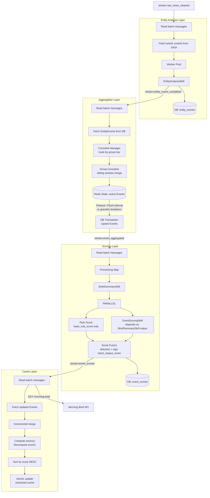
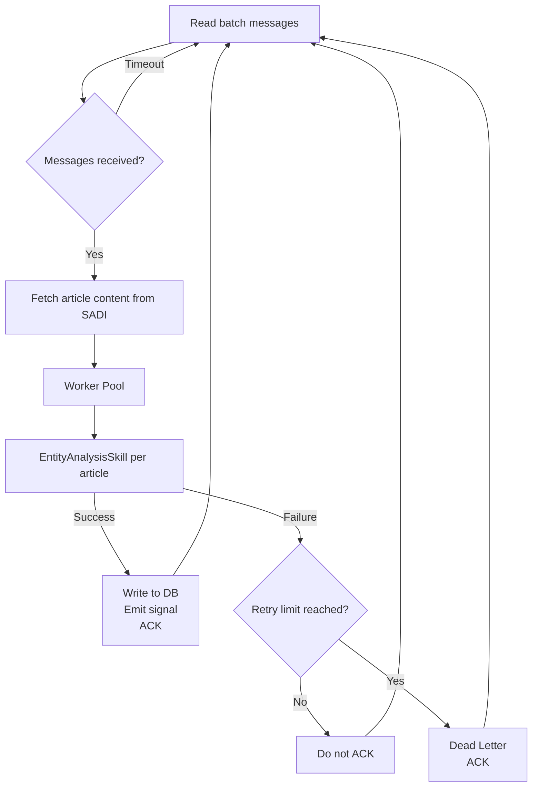
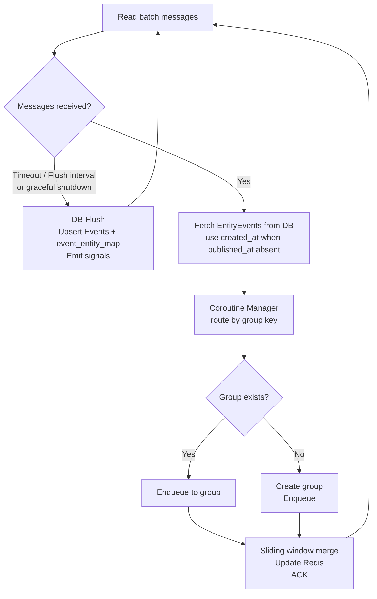
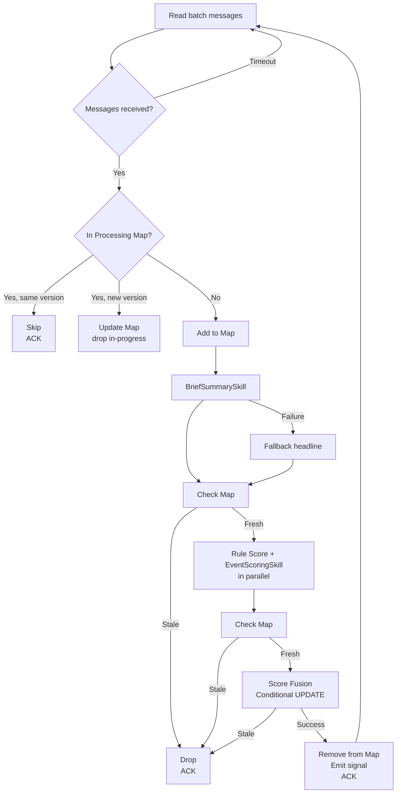
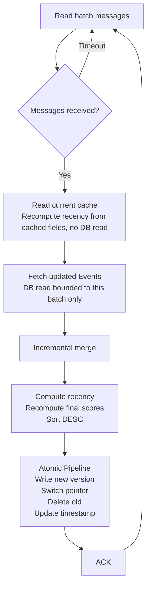

# Stock Assistant Pipeline Intelligence (SAPI)
## System Design

| Field | Detail |
|---|---|
| Service Name | Stock Assistant Pipeline Intelligence (SAPI) |
| Parent System | HK Stock AI Research Assistant |
| Service Responsibility | Entity Analysis enrichment, event aggregation, scoring, and cache population |
| Tech Stack | Python + asyncio + Redis |
| Dependencies | PostgreSQL 16, Redis, LLM API (Vertex AI), SADI (via API + Redis Streams), Admin API |
| Document Status | DRAFT — Work in progress |

---

## Table of Contents

1. [Service Overview](#1-service-overview)
2. [System Architecture](#2-system-architecture)
3. [Entity Analysis Layer](#3-entity-analysis-layer)
4. [Aggregation Layer](#4-aggregation-layer)
5. [Scoring Layer](#5-scoring-layer)
6. [Cache Layer](#6-cache-layer)
7. [Morning Brief API](#7-morning-brief-api)
8. [LLM Adapter](#8-llm-adapter)
9. [LLM Skills](#9-llm-skills)
10. [Database Design](#10-database-design)
11. [Redis Design](#11-redis-design)
12. [Error Handling](#12-error-handling)
13. [Deployment](#13-deployment)
14. [Open Questions](#14-open-questions)

---

## 1. Service Overview

### 1.1 Responsibility Boundary

SAPI is the intelligence layer of the HK Stock AI Research Assistant. It consumes cleaned news records from SADI and produces a scored, ranked Morning Brief cache ready for frontend consumption.

> **Core Principle:** SAPI does not perform data acquisition or cleaning. Its input contract is `cleaned_news` records from SADI. Its output contract is a scored Event cache in Redis for the Morning Brief API.

| Layer | Input | Output |
|---|---|---|
| Entity Analysis Layer | `cleaned_news` records via SADI API | `EntityEvent` records in DB |
| Aggregation Layer | `EntityEvent` records | `Event` records in DB and Redis |
| Scoring Layer | `Event` records | Scored `Event` records in DB |
| Cache Layer | Scored `Event` records | Morning Brief cache in Redis |

### 1.2 Naming Conventions

| Term | Definition |
|---|---|
| **EntityEvent** | Entity-level event extracted from a single article by EntityAnalysisSkill. One article may produce multiple EntityEvents, one per identified entity. |
| **Event** | Aggregated unit grouping multiple EntityEvents with the same `(stock_code, event_type_primary)` within a sliding time window. Equivalent to "Entity-Event Pair" in the PRD. |
| **Scored Event** | A fully scored Event record combining Event metadata and all scoring dimensions. The atomic unit stored in the Morning Brief cache. |

### 1.3 Tech Stack

| Component | Choice | Rationale |
|---|---|---|
| Runtime | Python 3.12 | Consistent with SADI; best ecosystem for LLM integration |
| Async framework | asyncio | Optimal for IO-intensive LLM API calls; single-threaded concurrency is safe for shared in-memory state |
| API framework | FastAPI | Native async support; automatic OpenAPI documentation |
| Messaging | Redis Streams | Persistent; Consumer Group guarantees at-least-once delivery; `XREADGROUP COUNT+BLOCK` provides native batching with timeout; `XAUTOCLAIM` provides delivery_count for retry management |
| LLM provider | Vertex AI (Gemini) | Enterprise data isolation; no training data usage; asia-east1 region; unified SDK with `vertexai=True` |
| LLM structured output | Instructor | Pydantic-based schema enforcement and automatic retry for structured output; used by BriefSummarySkill and EventScoringSkill via `generate_structured`; EntityAnalysisSkill uses raw SDK for Function Calling loop control |
| Database client | asyncpg | Native asyncio driver |
| Cache | Redis | Existing dependency; low-latency Morning Brief serving |

### 1.4 Redis Connection Separation

Redis serves two independent purposes in SAPI, managed via separate connection pools to ensure infrastructure substitutability.

| Client | Purpose | Can be replaced by |
|---|---|---|
| `RedisStreamClient` | Inter-service and inter-layer messaging via Redis Streams | Kafka or any message broker |
| `RedisStateClient` | Runtime state storage (active Events, scores, cache) | Remains unaffected by messaging changes |

Both connections may point to the same Redis instance in MVP. Configuration is separated via distinct environment variables `REDIS_STREAM_URL` and `REDIS_STATE_URL`.

### 1.5 Source Configuration

Source authority weights are stored in an Admin database and accessed via Admin API. SAPI caches the configuration in `RedisStateClient` with TTL-based auto-refresh — no dedicated refresh coroutine required.

```
Rule Score requires source:config:
├── Redis key exists → read directly via HGET / HMGET
└── Redis key expired or missing
    → fetch from Admin API
    → write to Redis with TTL = SOURCE_CONFIG_TTL_S
    → fallback if Admin API unreachable: use default weights P1=9, P2=6, P3=4
```

> **Query pattern:** Rule Score computation uses `HMGET source:config source1 source2 ...` to fetch all required weights in a single Redis call.

### 1.6 Recency Score Design

`recency_score` is a time-dependent value that decays continuously:

```
recency_score = 10 × e^(-λ × hours_elapsed)
hours_elapsed = now() - event.aggregation_updated_at
```

**Design decision:** `recency_score` is never stored. The Cache Layer computes it in real time using `event.aggregation_updated_at` as the reference timestamp when building each Morning Brief version. This correctly reflects the freshness of each Event's content at the time it was last aggregated.

Stored scores (`base_rule_score`, `abs_final_score`) exclude `recency_score` and serve as historical snapshots only.

**Design rationale:** All Events' recency scores decay at the same rate between cache updates, so relative ranking is stable. Recomputing only when new scored Events arrive is sufficient — no periodic refresh needed.

---

## 2. System Architecture

### 2.1 Pipeline Design Principle

Each layer is an **independent continuous processor**. No layer waits for upstream completion. Each layer processes what is available and delivers results downstream immediately. The system naturally degrades gracefully — when upstream is slow, downstream still serves users with the most recently available data.

### 2.2 Complete Data Flow



### 2.3 Inter-Layer Signals

All signals use Redis Streams via `RedisStreamClient`. Each stream serves as both the signal and the persistent queue for the receiving layer. All messages include a `v` field for message schema versioning — consumers check `v` before parsing and route to Dead Letter on version mismatch.

| Stream | Producer | Consumer Group | Message Fields | Role |
|---|---|---|---|---|
| `stream:raw_news_cleaned` | SADI | `sapi-entity-analysis` | `cleaned_id`, `v` | Entity Analysis Layer input queue |
| `stream:entity_event_completed` | Entity Analysis Layer | `sapi-aggregation` | `entity_event_id`, `v` | Aggregation Layer input queue |
| `stream:event_aggregated` | Aggregation Layer | `sapi-scoring` | `event_id`, `v` | Scoring Layer input queue |
| `stream:event_scored` | Scoring Layer | `sapi-cache` | `event_id`, `v` | Cache Layer input queue |

> **No `execution_id` traceability.** SADI's `raw_news` table has no `execution_id` column — it's only recorded for failed crawl attempts (`crawl_error_log`), not successfully-ingested articles. There is no way to join a `cleaned_id`/`entity_event_id`/`event_id` back to the specific crawl execution that produced it. If this is ever needed for debugging a specific pipeline run, approximate it via `published_at`/`created_at` falling within that execution's known time window (Admin's `job_executions` tracks start/end time per run) rather than an exact join.

> **Persistence guarantee:** Redis Streams persist messages until ACKed. On service restart, each layer resumes from its last consumed position via Consumer Group with no data loss.

> **Batching mechanism:** Each layer uses `XREADGROUP COUNT {BATCH_SIZE} BLOCK {TIMEOUT_MS}`. This single command handles both batch size and timeout triggers natively.

---

## 3. Entity Analysis Layer

### 3.1 Responsibility

Consume `cleaned_news` records from SADI, invoke EntityAnalysisSkill per article, and write `EntityEvent` records to DB.

### 3.2 Processing Flow



### 3.3 Batching and Concurrency

`XREADGROUP COUNT ENTITY_ANALYSIS_BATCH_SIZE BLOCK ENTITY_ANALYSIS_BATCH_TIMEOUT_MS` handles both triggers natively:
- Returns up to `ENTITY_ANALYSIS_BATCH_SIZE` messages immediately when available
- Returns whatever is available after `ENTITY_ANALYSIS_BATCH_TIMEOUT_MS` if batch size not reached

`asyncio.Semaphore(ENTITY_ANALYSIS_MAX_CONCURRENT)` limits concurrent LLM API calls within each batch.

### 3.4 Idempotency

Two-layer protection prevents duplicate processing:

**Layer 1 — In-memory Set (concurrent deduplication):**

An in-memory Set `processing_cleaned_ids` prevents the same article from being processed concurrently within the same service instance. Before invoking EntityAnalysisSkill, the worker checks the Set:

```
if cleaned_id in processing_cleaned_ids → skip
else → add to Set → process → remove from Set
```

Safe for asyncio single-threaded concurrency — no locking required.

**Layer 2 — DB unique constraint (cross-batch deduplication):**

`entity_events` has a composite unique index on `(source_url, stock_code)`, not `source_url` alone — one article can produce multiple `entity_events` rows, one per verified entity (§9.4's `EntityAnalysisResult.entity_events`), so a single-column unique index on `source_url` would silently drop every entity past the first for a multi-entity article. All DB inserts use `INSERT ON CONFLICT (source_url, stock_code) DO NOTHING`, ensuring redelivered messages never produce duplicate `(article, entity)` records.

### 3.5 Configuration Parameters

Defined as `EntityAnalysisConfig`: implementation.md §4.1.

### 3.6 Error Handling

| Scenario | Strategy |
|---|---|
| LLM API call failure | No DB record written; log error; do not ACK → redelivery → Dead Letter at `ENTITY_ANALYSIS_MAX_RETRY` |
| LLM schema violation (Instructor exhausted retries) | No DB record written; log error; do not ACK → redelivery → Dead Letter at `ENTITY_ANALYSIS_MAX_RETRY` |
| `LLMRateLimitError` | Pause entire Worker Pool for `RATE_LIMIT_BACKOFF_S`; do not ACK → redelivery after backoff; see Section 12.1 Rate Limit Backoff policy |
| All entities filtered by stock verification | Write empty `entities=[]` record; emit signal; ACK — valid outcome |
| `cleaned_id` missing from SADI's `cleaned_news` response (silently omitted per `api.md` §2.5, not an HTTP error) | Log warning with `cleaned_id`; ACK — skip this article. Retrying would not recover an ID that isn't in SADI's response. Not expected in normal operation today (SADI has no `cleaned_news` retention/purge job as of this writing) — the log exists to surface it if that changes |
| DB write failure | See Section 12.1 DB Write Failure policy |
| SADI API failure | Do not ACK → redelivery → Dead Letter at `ENTITY_ANALYSIS_MAX_RETRY` |
| RedisStreamClient unreachable | See Section 12.1 RedisStreamClient policy |

---

## 4. Aggregation Layer

### 4.1 Responsibility

Consume `EntityEvent` records, route to per-group coroutines for sliding window merging, maintain active Event state in Redis, and persist Events to DB periodically.

### 4.2 Processing Flow



### 4.3 Coroutine Manager and Concurrency

The Coroutine Manager maintains a dict of active group coroutines:

```
coroutines: Dict[(exchange, stock_code, event_type_primary), GroupCoroutine]
```

- `asyncio.Semaphore(AGG_MAX_CONCURRENT)` limits the number of concurrently active Group Coroutines, controlling Redis and DB concurrent request load
- Each Group Coroutine contains an internal `asyncio.Queue` — EntityEvents for the same group are processed strictly serially, preventing concurrent modification of the same sliding window state
- Group Coroutine is destroyed after `AGG_GROUP_IDLE_TIMEOUT_S` of inactivity; removed from manager dict on destruction

### 4.4 Sliding Window Algorithm

Within each Group Coroutine, EntityEvents are processed in arrival order from the internal queue: each incoming EntityEvent either merges into the group's current active Event (extending `first_seen_at`/`last_seen_at` and resetting its Redis TTL) or starts a new one, decided by a time-gap merge window plus a hard cap on the Event's total span, so a slow-burning story can't accrete forever. Exact merge/hard-cap formula and TTL computation: implementation.md §12.4 (`merge_or_create()`, `ttl_for()`).

> **Out-of-order arrival:** messages are processed in the order they're read from the Stream, not article publication order — a crawler batch, retry, or multi-source timing skew can deliver an EntityEvent whose `published_at` is *earlier* than one already merged into the same group. `last_seen_at`/`first_seen_at` must therefore be updated via `max`/`min`, not blind overwrite — a blind overwrite would let `last_seen_at` regress, and never updating `first_seen_at` after Event creation would understate the group's true elapsed span in the hard-cap calculation, letting merges through that `EVENT_MAX_TIMESPAN_HOURS` should have rejected.

> **`published_at` fallback:** Retrieved via `COALESCE(published_at, created_at)` at query time. Source data is not modified.

### 4.5 DB Flush

DB Flush is triggered by three conditions:

- **XREADGROUP timeout:** No new messages arrive within `AGG_BATCH_TIMEOUT_MS` — equivalent to the input queue being empty.
- **`AGG_DB_FLUSH_INTERVAL_S` elapsed:** Maximum interval between flushes, ensuring timely delivery to downstream layers during continuous high-volume ingestion.
- **Graceful shutdown:** Immediate flush before service exit to persist all in-memory state.

On each flush, within a single DB transaction:
- All active Events in Redis are Upserted to the `events` table
- `aggregation_updated_at` is written as-is from each in-memory `Event` — it is business logic, set the moment a merge/create actually happens (§4.4), not a value the UPSERT computes itself; a group untouched since the last flush keeps its prior value rather than being re-stamped with the current time
- All EntityEvent-to-Event mappings written to `event_entity_map` via `INSERT ON CONFLICT DO NOTHING`

After transaction commits, `stream:event_aggregated` is emitted per event_id.

> **TTL safety constraint:** `AGG_BATCH_TIMEOUT_MS` and `AGG_DB_FLUSH_INTERVAL_S` must be significantly smaller than `SLIDING_WINDOW_HOURS` converted to milliseconds to ensure all active Events are persisted to DB before their Redis TTL expires.

> **Crash recovery:** If the service crashes after ACKing messages but before DB Flush, Redis still holds the active Event state. On restart, the next DB Flush will persist the pre-crash state correctly, maintaining data consistency. The only unrecoverable scenario is simultaneous failure of both the service and Redis — treated as a service quality monitoring event, with remediation deferred to Post-MVP.

### 4.6 Configuration Parameters

Defined as `AggConfig`: implementation.md §4.1.

### 4.7 Error Handling

| Scenario | Strategy |
|---|---|
| DB read failure | Do not ACK; log warning |
| RedisStateClient unreachable | Do not ACK; retry with fixed interval |
| DB Flush failure | See Section 12.1 DB Write Failure policy |
| Group Coroutine failure | UnACked messages redelivered via XAUTOCLAIM → group recreated → reprocessed |
| RedisStreamClient unreachable | See Section 12.1 RedisStreamClient policy |

---

## 5. Scoring Layer

### 5.1 Responsibility

Score Events pushed by the Aggregation Layer. Execute BriefSummarySkill, then Rule Score and EventScoringSkill in parallel. Apply direction in Score Fusion. Persist score records to DB via conditional update.

Each Skill is responsible for constructing its own input from raw DB data. The Scoring Layer passes constituent EntityEvent records and Event metadata to each Skill; the Skill applies its own input selection and formatting rules internally. This ensures input construction logic and prompt design remain co-located within the same module.

### 5.2 Processing Flow



### 5.3 Scoring Layer Execution Sequence

BriefSummarySkill executes first. Rule Score and EventScoringSkill execute in parallel after BriefSummarySkill completes.

```
BriefSummarySkill
    ↓
Rule Score (parallel)    EventScoringSkill (parallel, uses BriefSummarySkill output)
    ↓                              ↓
                Score Fusion
```

**Rationale:** EventScoringSkill takes `summary_full` and `key_numbers` from BriefSummarySkill as input — these are the distilled, structured representations of the Event content. This avoids requiring EventScoringSkill to re-interpret raw article content, reduces token consumption, and produces more consistent scoring inputs. Rule Score does not depend on BriefSummarySkill and runs in parallel with EventScoringSkill.

### 5.4 Processing Map

An in-memory Map prevents duplicate processing across concurrent triggers and detects mid-processing data changes:

```
processing_events: Dict[event_id, aggregation_updated_at]
```

- Safe for asyncio single-threaded concurrency — no locking required
- On service restart: Map is empty; in-progress Events are redelivered from Redis Stream and reprocessed normally

### 5.5 Stale Data Detection

| Check Point | Mechanism |
|---|---|
| After BriefSummarySkill | Compare `processing_events[event_id]` with current `aggregation_updated_at` |
| After Rule Score + EventScoringSkill | Same in-memory comparison |
| Score Fusion write | Conditional `UPDATE event_scores WHERE event_id = :id AND events.aggregation_updated_at = :expected`; 0 rows = stale |

### 5.6 Rule Score — Dimensions, Weights, and Recency/Direction Exclusion

`recency_score` and direction coefficient are both excluded from Rule Score computation — recency is computed live by the Cache Layer (§6.3); direction is applied in Score Fusion (§5.7). `base_rule_score` is a pure unsigned weighted sum of the remaining four dimensions.

**Weights** — PRD §8.2 weights five dimensions as a single weighted average summing to 1.0 (dimension range `[0,10]`), including `recency_score` at 0.20. SAPI computes this in two steps instead of one: the four non-recency weights below **keep their original PRD values** (summing to 0.80, so `stored_base_rule_score ∈ [0,8]`); the Cache Layer (§6.3) adds recency's exact remaining share back in via `recency_score × recency_weight(0.20)` (∈ `[0,2]`), reconstructing the PRD's `[0,10]` range at that point. The four weights are **not** re-normalized to sum to 1.0 on their own — doing so would double-count against `recency_weight(0.20)` in §6.3 and push the combined range to `[0,12]`.

| Dimension | Weight (unchanged from PRD §8.2) |
|---|---|
| `event_type_score` | 0.30 |
| `source_authority_score` | 0.25 |
| `sentiment_strength_score` | 0.15 |
| `source_heat_score` | 0.10 |

`stored_base_rule_score` is the weighted sum of the four dimensions below, each in `[0,10]` — giving a `[0,8]` range; recency's 0.20 share is added back later by the Cache Layer (§6.3). Exact formula: implementation.md §13.3.

**`event_type_score` enum mapping:**

| `event_type_primary` | `event_type_score` |
|---|---|
| EARNINGS | 9.0 |
| MA | 8.5 |
| REGULATORY | 8.0 |
| BUYBACK | 7.0 |
| MANAGEMENT_CHANGE | 7.0 |
| DIVIDEND | 6.0 |
| ANALYST_RATING | 5.0 |
| GENERAL_ANNOUNCEMENT | 4.0 |

> EARNINGS/MA/REGULATORY/GENERAL_ANNOUNCEMENT come from PRD §12.1. BUYBACK/MANAGEMENT_CHANGE/DIVIDEND/ANALYST_RATING were added during design review, anchored to the existing four by typical HK-market price-impact materiality (BUYBACK/MANAGEMENT_CHANGE: strong but often secondary/variable-impact signals; DIVIDEND: meaningful but usually anticipated; ANALYST_RATING: re-rates already-public information, smallest average impact of the eight).

> **Operator-configurable at MVP, per PRD §12.1's Hot-reload contract.** Each of these eight values has its own `EVENT_TYPE_WEIGHT_*` env var, adjustable by an operator without a code change — the same tier as `NOISE_FILTER_THRESHOLD`/`RECENCY_DECAY_LAMBDA`, not a hardcoded table. Assembled into one `ScoringConfig.event_type_score` field — a list pairing each type directly with its score, not eight separate flat fields. Exact shape, field names, and defaults: implementation.md §4.1/§13.3.

> **Future enhancement — score model tuning via customer feedback:** This calibration (and the Rule Score model generally) is an MVP starting point, not derived from real HK market data. Post-MVP, `event_type_score` and the other dimension scores/weights should be revisited using customer/analyst feedback — e.g. manual re-ranking signals, realized price-impact correlation against `stock_impact_score` (§9.8's Option C analysis) — rather than treated as fixed. This is the same direction as PRD §3.3's "Analyst feedback loop: manual re-ranking feeds into dynamic weight adjustment" and §16.1's "Dynamic scoring weights via analyst feedback" Post-MVP item; `event_type_score` should be explicitly in scope when that feedback loop is designed.

**`source_authority_score` and `source_heat_score`:** `source_authority_score` is the MAX authority weight over the Event's distinct reporting sources (exact formula: implementation.md §13.3).

> Uses MAX, not an average, and reuses the same precedent as §5.9's `BriefSummarySkill` fallback ("constituent EntityEvent with highest source authority"). An average would let a lower-tier source *dilute* an event a top-tier source already validated — e.g. an Event corroborated by HKEX + AASTOCKS + MINGPAO would score *lower* on authority under averaging than an Event HKEX alone reported, even though the first Event is objectively better-attested. That would also double-count against `source_heat_score`, which already rewards the same broader corroboration separately — PRD §8.2 treats "source credibility" and "corroboration breadth" as two independent signals, and MAX preserves that independence; averaging doesn't.

`source_heat_score` scales `source_count` against the live count of active sources (`HLEN source:config`), capped at 10 (exact formula: implementation.md §13.3).

> Normalizes by the *live* count of active sources rather than a hardcoded constant, so it doesn't go stale if a 5th+ source is added post-MVP. `TOTAL_ACTIVE_SOURCES` is computed via `HLEN` in the same code path as the existing `source:config` refresh-on-miss flow (§1.5) — no new fetch needed, since that flow already guarantees the hash is fully populated before any read. `min(10, ...)` is defensive only; `source_count` can't exceed `TOTAL_ACTIVE_SOURCES` by construction.
>
> **Cold-start edge case:** if `source:config` is both cache-cold *and* Admin API is unreachable (dual failure, first-ever run), there's no hash to `HLEN` and the P1/P2/P3 fallback (§1.5) is tier-level, not a source count. Falls back to `TOTAL_ACTIVE_SOURCES_DEFAULT = 4` (matching today's 4 configured MVP sources) in that specific case only.
>
> **Validation note:** with only 4 MVP sources, this is coarse (each source is a 2.5-point jump) and untested against real cross-source corroboration rates — flagged as a Week 1/2 calibration item alongside Q-1/Q-2/Q-7-style validation questions, not solved here.

Direction is applied in Score Fusion (Step 7), not in Rule Score (Step 6a). This keeps the two steps independent and parallel.

### 5.7 Score Fusion — Direction

Direction is derived from `stock_impact_score` (`sign(stock_impact_score)`, falling back to Sentiment Aggregation's `weighted_signed_score` §5.8 when `stock_impact_score = 0` under `llm_fallback=true`), not from `sentiment_label` — more accurate in financial context where news sentiment does not always align with stock price impact direction. Direction is then applied to `base_rule_score` and fused with `stock_impact_score` into `abs_final_score`, the Event's final ranking score. Exact formula: implementation.md §13.4 (`_score_fusion()`).

> **Persistence:** The computed `direction` (±1) is written to `event_scores.direction`. This lets the Cache Layer (§6.3) correctly reapply direction when recomputing `final_abs_final_score` with real-time recency, without re-deriving the sentiment fallback.

> **Score cross-type comparability:** `event_type_score` (weight 0.30) assigns higher base scores to more impactful event types (EARNINGS=9.0, REGULATORY=8.0, GENERAL_ANNOUNCEMENT=4.0). This ensures `abs_final_score` is comparable across different `event_type_primary` values without additional normalisation.

### 5.8 Sentiment Aggregation

Event-level sentiment is computed from all constituent EntityEvents, weighted by source authority from `source:config`. `weighted_signed_score` supplies the direction fallback used in Score Fusion (§5.7) when `stock_impact_score = 0` (`llm_fallback=true`). `sentiment_strength_score` feeds the Rule Score dimension (§5.6).

> **Display label:** The Morning Brief's 利好/利空/中性 label is not computed or exposed by SAPI at all — see §6.6. The client derives it from the sign of `base_rule_score`, which already carries `event_scores.direction` (§6.3). This works uniformly regardless of `llm_fallback`, since `direction` (and therefore `base_rule_score`'s sign) is always set via the fallback derived here — the client never needs `stock_impact_score`'s sign specifically.

Both are source-authority-weighted averages across the Event's constituent EntityEvents — `weighted_signed_score` over each EntityEvent's directional sentiment (POSITIVE/NEUTRAL/NEGATIVE → +1/0/-1), `sentiment_strength_score` over raw `sentiment_score` regardless of direction. Exact formula: implementation.md §13.3 (`compute_sentiment_aggregation()`).

### 5.9 Per-Event Fallbacks

**BriefSummarySkill failure:** `summary_short` populated from `headline` of constituent EntityEvent with highest source authority; ties broken by latest `published_at`. `summary_full` set equal to `summary_short`. `key_numbers` set to empty list `[]`. Log warning `brief_summary_fallback`.

**EventScoringSkill failure:** `stock_impact_score = 0`; `llm_fallback = true`; direction falls back to `sign(weighted_signed_score)` from Sentiment Aggregation (§5.8); scoring continues. Log warning `event_scoring_fallback`.

**EventScoringSkill receiving fallback input:** When `events.brief_summary` was produced by BriefSummarySkill fallback, EventScoringSkill proceeds normally but records `input_from_fallback: true` in the `event_scoring_completed` log event. This flags the resulting score as potentially lower quality for monitoring purposes without affecting the business flow.

### 5.10 Configuration Parameters

Defined as `ScoringConfig`: implementation.md §4.1.

### 5.11 Error Handling

| Scenario | Strategy |
|---|---|
| DB read failure | Do not ACK; log warning |
| BriefSummarySkill failure | Fallback applied; processing continues |
| EventScoringSkill failure | Fallback applied; processing continues |
| `LLMRateLimitError` | Pause entire Scoring Layer concurrent pool for `RATE_LIMIT_BACKOFF_S`; do not ACK → redelivery after backoff; see Section 12.1 Rate Limit Backoff policy |
| source:config unreachable | Use default weights; log warning; processing continues |
| DB write failure | See Section 12.1 DB Write Failure policy |
| RedisStreamClient unreachable | See Section 12.1 RedisStreamClient policy |

---

## 6. Cache Layer

### 6.1 Responsibility

Consume scored Event IDs, fetch and merge Scored Events, compute real-time recency scores using `event.aggregation_updated_at`, and maintain a versioned Morning Brief cache in Redis. Processes messages serially — no concurrent cache updates.

**The very first cache version is built once, eagerly, at service startup — not as part of the message-consumption flow below.** Before this layer's consumer starts reading `stream:event_scored`, a one-time startup step checks whether a cache version already exists (Redis persisted across a restart); if not, it does a single full DB fetch of everything currently in `event_scores` and builds the initial version from that, zero rows or many. This closes the gap where the service reports healthy (§12.1) but `GET /morning-brief` has nothing to serve because no event has streamed through yet — without it, that gap could otherwise persist indefinitely on a low-traffic deployment. §6.2's flow below is deliberately simpler as a result: it has no "first run" branch of its own, since a version always already exists by the time it starts consuming (implementation.md §14.1's `build_initial_version()`/`build_new_version()` split).

### 6.2 Processing Flow



> **"Read current cache" recomputes recency from fields the cache carries for exactly this purpose — never a DB read, and never a value carried over from a previous build's own recency-adjusted output.** §6.3's formula needs `aggregation_updated_at`, the stored (pre-recency) `base_rule_score`, and `direction` — none of which change unless an Event is genuinely re-scored — so the cache's own structure (§6.6) carries all three as internal fields alongside the display ones. Reading *those* back and recomputing from them every build is safe; reading back `final_base_rule_score`/`final_abs_final_score` themselves and feeding them into the formula again would add a second recency contribution on top of the first, compounding indefinitely for any Event that goes many builds without a genuine re-score — the bug this design replaced. Because refreshing an already-cached Event's recency no longer needs the DB at all, the DB fetch immediately below stays bounded to *this cycle's batch only*, regardless of how large the cache itself has grown — the cache currently has no retention policy of its own (§14, Open Questions), so a per-build cost proportional to total cache size would only ever grow.

### 6.3 Recency Score Computation

At each cache build, `recency_score` is computed for all Events from `event.aggregation_updated_at` using the same exponential decay as §1.6, then folded back into `final_base_rule_score`/`final_abs_final_score` via the same weights and direction as Score Fusion (§5.7) — recency's 0.20 share, held out of the stored `base_rule_score` at scoring time (§5.6), is added back in here. Exact formula: implementation.md §14.3 (`_apply_recency()`).

> `direction` is read from the persisted `event_scores.direction` column (§5.7, §10.3) — not recomputed from `sign(stock_impact_score)` — so the sentiment-derived fallback direction (used when `stock_impact_score = 0` under `llm_fallback=true`) is preserved correctly during recency recomputation. For an Event already in the cache, `direction` (and `stored_base_rule_score`, and `aggregation_updated_at`) come from the cache's own internal fields (§6.6) rather than a fresh read of this column — the two are always identical, since neither changes without a genuine re-score, which is exactly what makes reading them from the cache safe.

Sorting uses `final_abs_final_score`. The stored `abs_final_score` in `event_scores` is a historical snapshot excluding recency — and is also the value `NOISE_FILTER_THRESHOLD` gates on for cache inclusion (§6.4); recency affects only sort order, never membership.

### 6.4 Incremental Merge Rules

Merge decisions (inclusion/exclusion) use the **stored** `abs_final_score` from `event_scores` — recency-excluded — not `final_abs_final_score`. `NOISE_FILTER_THRESHOLD` is a filter on intrinsic event impact, not freshness: whether an event is noteworthy enough to show shouldn't depend on how recently it happened, only on how significant it is. This also keeps the startup build's full DB fetch (§6.1, which necessarily filters before recency is ever computed) and incremental merge consistent with each other — the same event is gated by the same criterion regardless of whether it was present at cold start or arrives later via an update. Recency only affects **sort order** among already-included Events (§6.3), never membership — so decay alone can never silently remove an Event; only a genuine re-score (a new `stream:event_scored` message) can change inclusion status — which is also why an Event already in the cache (§6.2's "Read current cache" step) never has this table re-applied to it: its inclusion was already decided on a previous build, and only its display values (§6.3) get refreshed here.

| Condition | Action |
|---|---|
| Updated Event, `abs_final_score >= NOISE_FILTER_THRESHOLD`, already in cache | Replace |
| Updated Event, `abs_final_score >= NOISE_FILTER_THRESHOLD`, not in cache | Insert |
| Updated Event, `abs_final_score < NOISE_FILTER_THRESHOLD`, already in cache | Remove |
| Updated Event, `abs_final_score < NOISE_FILTER_THRESHOLD`, not in cache | Ignore |

### 6.5 Versioned Cache Replacement

All three operations execute atomically via Redis Pipeline `MULTI/EXEC`:

| Step | Frontend reads | State |
|---|---|---|
| Before update | `v42` | Stable |
| Atomic Pipeline: write `v43`, switch pointer, delete `v42` | `v43` | Atomic cutover |
| After update | `v43` | Stable |

`morning_brief:version_counter` is a persistent monotonically incrementing counter with no TTL.

### 6.6 Scored Event Structure

Each item in the Morning Brief cache is a Scored Event: a handful of top-level fields used for filtering and sorting (`event_id`, `exchange`, `stock_code`, `event_type_primary`, `abs_final_score`, `base_rule_score`, `first_seen_at`, `last_seen_at`), plus two nested objects for display — `event` (source list, summaries, key numbers) and `score` (impact score, rule/LLM score detail). Exact shape: implementation.md §3.5 (`ScoredEventRecord`).

> **`abs_final_score` and `base_rule_score`** are real-time computed values including `recency_score`, not the stored snapshots from `event_scores`. **`base_rule_score` is signed** — it carries `event_scores.direction` (§6.3), positive for 利好 and negative for 利空. This is the field the client should use for the display direction label; sorting/tie-breaking (§6.2, §6.4) uses `|base_rule_score|`, not its raw signed value.

> **No `sentiment_label`/direction-label field is exposed.** The 利好/利空 label is a display concern the client derives from the sign of `base_rule_score`, not computed or stored server-side. This works uniformly including when `llm_fallback=true`, since `direction` (and therefore `base_rule_score`'s sign) is always set via the Sentiment Aggregation fallback (§5.8) in that case.

> **`event.aggregation_updated_at`, `score.stored_base_rule_score`, `score.direction` are internal-only.** They exist so §6.2's "Read current cache" step can recompute `recency_score`/`final_base_rule_score`/`final_abs_final_score` for an already-cached Event on the next build without a DB read (§6.3) — `stored_base_rule_score` is the same value as `base_rule_score` but unsigned and excluding recency, i.e. exactly `event_scores.base_rule_score` as originally written, never overwritten. No API consumer should ever see these three; SAPI's `GET /morning-brief` response schema doesn't declare them and drops them automatically on the way out (implementation.md §14.5/§3.5).

**Top-level field rationale:**

| Field | Reason |
|---|---|
| `exchange`, `stock_code` | Query filter conditions |
| `event_type_primary` | Potential future filter condition |
| `abs_final_score` | Primary sort key (includes real-time recency) |
| `base_rule_score` | Signed (carries `direction`); `\|base_rule_score\|` used as secondary sort key for tie-breaking (includes real-time recency); sign is the client's source for the 利好/利空 display label |
| `first_seen_at`, `last_seen_at` | Additional tie-breaking sort keys |

**Excluded from the API response:** `additional_outcome`, `updated_at`, `created_at`, `metadata`, `recency_score` — internal fields not relevant to Morning Brief display, and never written into the cache at all. `aggregation_updated_at`/`stored_base_rule_score`/`direction` (above) are the one exception to "excluded fields are never written" — they *are* written into the cache (nested under `event`/`score`), just excluded from what the API response schema exposes.

### 6.7 Configuration Parameters

Defined as `CacheConfig`: implementation.md §4.1.

### 6.8 Error Handling

| Scenario | Strategy |
|---|---|
| DB read failure | Do not ACK; log warning |
| RedisStateClient unreachable | Do not ACK; retry with fixed interval |
| Atomic pipeline failure | See Section 12.1 DB Write Failure policy |
| Orphaned version cleanup failure | Log warning; retry on next cleanup interval |
| Startup cache build failure (§6.1) | Log CRITICAL; service startup continues regardless — no version exists yet, so the first real message on `stream:event_scored` builds one from just that batch, not the full historical state |
| RedisStreamClient unreachable | See Section 12.1 RedisStreamClient policy |

---

## 7. Morning Brief API

### 7.1 Health Check

```
GET /health
```

**Response fields:**

| Field | Values | Description |
|---|---|---|
| `status` | healthy / degraded / unhealthy | Overall service status |
| `database` | ok / error | PostgreSQL connectivity |
| `redis_stream` | ok / error | RedisStreamClient connectivity |
| `redis_state` | ok / error | RedisStateClient connectivity |
| `hk_stock_list` | ok / not_ready | HK Stock List readiness (§9.2.1). `ok` once loaded (entries > 0); `not_ready` at 0 entries — covers both "still loading" and "fetch failed," which aren't distinguished from cache state alone |
| `layers.entity_analysis` | ok / error | Entity Analysis Layer consumer coroutine status |
| `layers.aggregation` | ok / error | Aggregation Layer consumer coroutine status |
| `layers.scoring` | ok / error | Scoring Layer consumer coroutine status |
| `layers.cache` | ok / error | Cache Layer consumer coroutine status |

**HTTP response codes:**
- All healthy → `200 healthy`
- `database`/`redis_stream`/`redis_state` all `ok` and `hk_stock_list` `ok`, but any `layers.*` is `error` → `200 degraded` (the only condition that produces `degraded` — a layer's consumer coroutine has crashed but not yet been auto-restarted by Coroutine Monitoring's `done_callback`, §12.1; self-healing and transient, so still `200`, not `503`)
- Database or Redis unreachable, or `hk_stock_list` is `not_ready` → `503 unhealthy`

> Post-MVP extension: add Dead Letter Stream backlog monitoring per layer to detect processing failures earlier.

### 7.2 Morning Brief Endpoint

`GET /morning-brief?stocks=00700,09988,03690&k=20` — `stocks` is a comma-separated list of bare HK stock codes from the client watchlist, no market suffix, the same canonical form as `events[].stock_code` (a deliberate change from an earlier `.HK`-suffixed convention, made while neither SAPI nor its client integration is implemented yet; the client's own watchlist storage, PRD §3.2, needs to match this bare form). `k` caps the result count, default `TOP_K_DEFAULT`. Exact request/response schema: implementation.md §3.5, `docs/api.md`.

### 7.3 Server Processing Logic

Two-step selection against the current cache version: first, watchlist-matching Events ranked by score, up to `k`; if that doesn't fill `k`, backfill with the highest-scoring non-watchlist Events. Exact algorithm: implementation.md §15.3 (`get_morning_brief()`).

### 7.4 Response

> All timestamps in response are UTC. `last_updated` reflects `morning_brief:last_updated` — the time of the last successful cache build.

Three distinct outcomes, all sharing the same envelope (`cache_version`, `last_updated`, `events`) except the last: a normal match (`200`, `events` populated); a built cache with nothing matching the filter (`200`, `events: []` — once a cache version has ever been built, `cache_version`/`last_updated` are always non-null, even for an empty result); and no successful build having ever completed (`503`, `SAPI-5001`) — this, not a `200` with `cache_version: null`, is the "pipeline hasn't run yet" case. Exact response bodies: implementation.md §3.5, `docs/api.md`.

> Specific `error_code` values are defined per error scenario. Detailed error information is logged server-side only.

### 7.5 Client Processing

The client applies `POOL_MATCH_BOOST` to watchlist-matching Events and re-ranks the results. See PRD Section 12.2 for client-side parameter details.

---

## 8. LLM Adapter

### 8.1 Design Principle

All LLM interactions are encapsulated behind a provider-agnostic Adapter interface. Switching providers requires only a new Adapter implementation with no changes to Skill logic. The Adapter exposes two methods corresponding to two distinct call modes used by different Skills.

### 8.2 MVP Implementation

Vertex AI (Gemini), `asia-east1`, via `google-genai` (raw calls) and Instructor (structured-output calls), authenticated through Google Cloud IAM. Exact client setup: implementation.md §7.3 (`VertexAIAdapter`).

### 8.2.1 Timeout Management

LLM and SADI API call timeouts are both centralised in environment variables rather than scattered per call site. On timeout, both raise `LLMProviderError` (LLM) or propagate as a SADI API failure — existing error handling policies apply (§3.6, §12.1).

### 8.3 Standard Data Structures

Five shared types cross the Adapter boundary: `ToolCall`/`ToolResultMessage`/`ToolDefinition` (the Function Calling wire shapes), `Message` (per-role conversation history unit), and the two response wrappers `LLMResponse`/`StructuredLLMResponse[T]`. Both response wrappers carry `input_tokens`/`output_tokens`/`latency_ms` (plus `instructor_retries` on the structured one) measured by the Adapter itself — the only place these are knowable — rather than the Adapter logging them or reaching into a Skill-owned accumulator; the calling Skill reads them off the return value to build its own `LlmCallMetric` (§9.8). Exact fields: implementation.md §7.1.

### 8.4 Adapter Interface

`LLMAdapter` is an abstract base class with three methods: `generate_raw(messages, tools) → LLMResponse` (Function Calling loop control, EntityAnalysisSkill only), `generate_structured(messages, output_schema) → StructuredLLMResponse[T]` (used by all three Skills), and `close()`. Exact interface: implementation.md §7.1.

### 8.5 Exception Mapping

All provider-specific exceptions are mapped to standard types. Skill layer handles only these standard exceptions.

| Exception | Retryable | Trigger |
|---|---|---|
| `LLMRateLimitError` | Yes | Provider rate limit hit |
| `LLMProviderError` | Yes | Provider-side error (5xx, network timeout) |
| `LLMAuthenticationError` | Yes (message-level; not self-healing) | Provider rejects the call as unauthenticated/unauthorized (401/403 — invalid/expired credentials, revoked service account, missing IAM role, API not enabled) |
| `LLMSchemaViolationError` | No | Instructor internal retries exhausted; output still does not conform to schema |

> `LLMSchemaViolationError` occurs when Pydantic validators defined in the output schema (e.g. value range constraints) are repeatedly violated after Instructor's internal retries. Gemini's `response_schema` parameter prevents missing field and type errors at the API level; Pydantic validators are the second-layer protection for business logic constraints.

> Handling mechanisms for `LLMRateLimitError` (Worker Pool backoff) and `LLMAuthenticationError` (CRITICAL escalation, since unlike a transient 5xx it fails identically until an operator intervenes) are covered once, in §12.1's Rate Limit Backoff and LLM Authentication Failure mechanisms — not repeated here. `BusinessValidationError` is a log-only event type (not an exception class), covered in §9.7/§9.8.

---

## 9. LLM Skills

### 9.1 Skill Overview

Three Skills encapsulate all LLM interactions. Each Skill is a versioned, reusable prompt module with a stable I/O contract.

| Skill | Adapter Method | Temperature | Max Tokens | Depends On |
|---|---|---|---|---|
| EntityAnalysisSkill | `generate_raw` + `generate_structured` | 0 | 8192 | — |
| BriefSummarySkill | `generate_structured` | 0.1 | 4096 | EntityAnalysisSkill output |
| EventScoringSkill | `generate_structured` | 0 | 2048 | BriefSummarySkill output |

### 9.1.1 Skill Version Management

Each Skill maintains an independent version number defined within its module:

```
EntityAnalysisSkill:  ENTITY_SKILL_VERSION  = "v1.0.0"
BriefSummarySkill:    BRIEF_SKILL_VERSION   = "v1.0.0"
EventScoringSkill:    SCORING_SKILL_VERSION = "v1.0.0"
```

**Version bump rules:**

| Change Type | Version Position |
|---|---|
| Prompt wording adjustment, few-shot example modification | Patch (v1.0.0 → v1.0.1) |
| Output field addition/removal, scoring logic adjustment | Minor (v1.0.0 → v1.1.0) |
| Output schema structural change | Major (v1.0.0 → v2.0.0) |

**Version storage:** Each Skill's version is stored in the `version` field of its corresponding JSONB output column — `additional_outcome.version`, `brief_summary.version`, `llm_score_detail.version`, `rule_score_detail.version`. This ensures every DB record is traceable to the exact Skill version that produced it.

**LLM call cost estimation (per pipeline run):**

| Item | Estimate |
|---|---|
| Articles crawled per run | 50–150 |
| EntityAnalysisSkill calls (2 per article) | 100–300 |
| Events after aggregation | 20–60 |
| BriefSummarySkill + EventScoringSkill calls | 40–120 |
| **Total LLM calls per pipeline run** | **140–420** |

Two pipeline runs per day (morning-crawl + pre-open-crawl); estimated daily total: 280–840 LLM calls. Within Vertex AI low-cost tier for MVP scale.

### 9.2 `lookup_stock` Tool

Used exclusively by EntityAnalysisSkill. Executed by the Skill layer as an in-process, in-memory lookup against the HK Stock List (§9.2.1) — no Redis involved; not executed by the Adapter. Given a company name or stock code, it either resolves to a fully-qualified match (stock code, exchange, Chinese/English company name) via an exact code lookup or fuzzy name match, or reports no match. Exact tool schema, wire shape, and lookup algorithm: implementation.md §4.2/§8.2 (`lookup_stock()`, `LOOKUP_STOCK_TOOL`).

**Code format normalization:** the HK Stock List's native format (both HKEXnews and the official "List of Securities") is a bare 5-digit zero-padded code, e.g. `"00700"` — no exchange suffix. `hkex:hk_stock_list` (§11.3.1) is keyed by this native form directly, with no transformation at load time. One conversion happens at the `lookup_stock` boundary; the other direction is now a no-op:

- **Inbound:** strip any non-digit characters from `name_or_code` (drops a trailing `.HK` if a caller happens to still include one), then zero-pad the remaining digits to 5 — `"700"`, `"0700"`, and `"00700.HK"` all normalize to the same key, `"00700"`, before the lookup.
- **Outbound:** the returned `stock_code` field is that same stored native code, unchanged — no suffix is appended. `exchange` (always `"HKEX"` at MVP scope) is returned as its own field instead of being encoded into `stock_code`; every other stock-bearing schema in this document (`entity_events`/`events`/`event_scores`, the Aggregation Redis key, the Morning Brief API) already carries this exact same separate `exchange` field, so folding a redundant marker into `stock_code` here added nothing — this is now one unified concept and one unified value ("HKEX"), not two ("HK" here vs. "HKEX" everywhere else).

**Fuzzy name matching:** the HK Stock List (§9.2.1) is small (~2,000–2,600 equities after filtering) and held entirely in SAPI's own process memory — both the exact-code and fuzzy-name paths match against that same in-memory data, with no Redis involved at all (Redis has no native fuzzy text search, and the exact-code path gains nothing from a separate round trip when the full set is already in-process regardless). No external fuzzy-matching library is needed — candidates are ranked by character-overlap ratio against `NAME_MATCH_MIN_OVERLAP_RATIO`, ties broken by longest-common-subsequence length; exact algorithm: implementation.md §4.2 (`lookup_stock()`'s `_fuzzy_match()`).

> `overlap_ratio` is normalized by `len(query)`, not the candidate's length — this is what makes a short, abbreviated query (e.g. `"阿里"` against `"阿里巴巴集團控股有限公司"`) score 100% regardless of how much longer the candidate name is, matching the common case of partial/abbreviated company names in news text.

> **`NAME_MATCH_MIN_OVERLAP_RATIO` default: 0.6.** Deliberately on the stricter side rather than a loose 50/50 split — HK company names are short (2–6 characters, per examples already in this doc), and with ~2,000 candidates, a loose floor risks a generic/common character sequence (e.g. "地產" appearing across many property companies) producing a confident but wrong match. This is a starting value for the real-data validation pass (§14), not a calibrated one.

### 9.2.1 HK Stock List — Data Source & Caching

**Primary source — HKEXnews's own bilingual stock-list JSON files** (verified live, no API key):

```
https://www1.hkexnews.hk/ncms/script/eds/activestock_sehk_e.json   (English names)
https://www1.hkexnews.hk/ncms/script/eds/activestock_sehk_c.json   (Chinese names)
```

Each returns `[{"i": internal_id, "c": stock_code, "n": name, "s": sort_key}, ...]` — ~17,900 entries, matched index-for-index by `c` across both files (e.g. `c="00001"` → `n="CKH HOLDINGS"` in the EN file, `n="長和"` in the ZH file). Same `hkexnews.hk` domain as the authoritative "List of Securities" file, so no cross-provider code-format reconciliation is needed for `stock_code`/`company_name_zh`/`company_name_en` — one source covers all three.

> **Equity filtering:** the ~17,900 entries include every security type (equities, warrants, CBBCs, bonds, ETFs), not just companies. Cross-check against HKEX's official daily "List of Securities" download (`Category = Equity`) to exclude non-equity codes before loading into the in-process cache (below).

> **Risk:** both JSON files are undocumented endpoints (no published API contract, versioning, or SLA) — likely the data files powering HKEX's own website search widget, which makes them lower-risk than a scraped HTML page, but they could still change shape or move without notice. No fallback is currently specified if they do; revisit if this becomes a reliability issue in practice.

> **`sector` is removed from `lookup_stock`/`EntityAnalysisSkill` entirely for MVP**, not just left unsourced. It had no scoring-critical or API-facing consumer (only reached an LLM prompt as loose context, and sat unqueried in `additional_outcome` JSONB), and with no bulk source it would be null for effectively every entity — a nullable field that's almost always empty adds schema/prompt-handling complexity for no real benefit, and doesn't save any future work either: PRD §13.4 lists "Sector / stock filtering UI" as Post-MVP, and building that later requires the same wiring regardless of whether a dead placeholder field existed here in the meantime.

**Storage: a single in-process, in-memory cache — no Redis.** The fetched-and-filtered result is held in one shared mutable instance inside the SAPI process, constructed once at startup and updated in place thereafter (a full attribute rebind on refresh, never a partial mutation, so a lookup already in progress against the old snapshot is unaffected). No `RedisStateClient` key is used for this data: SAPI always re-fetches from HKEXnews directly regardless of whether a previous copy already exists, so writing the result to Redis and reading it back would be pure round-trip overhead with no benefit for a single-instance deployment — and it would introduce a second copy that a `POST /hk-stock-list-sync` call would need to explicitly propagate into the already-running process's in-memory data anyway, since Redis holding fresher data doesn't by itself update what `lookup_stock` reads. Revisit Redis-backed storage only if/when SAPI runs multiple replicas, so they can share one fetch and propagate one sync to all of them — out of scope for the current single-instance MVP.

**Ownership: SAPI owns the fetch/filter/load code; Admin owns triggering ongoing refreshes.** Two distinct triggers load the same in-process cache, both executing the same code path:

1. **SAPI startup (eager, blocking):** `main.py` fetches, filters, and populates the HK Stock List *before* the Entity Analysis Layer's consumer coroutine starts pulling work — a missing HK Stock List silently fails every entity in the first batch (§9.3's loop just treats them as `found=false`, no error surfaced), so this cannot be lazy-on-first-call the way `source:config` (§1.5) is.
2. **`POST /v1/hk-stock-list-sync` (Admin-triggered, ongoing):** a SAPI endpoint that re-runs the same fetch/filter/load synchronously on request, rebinding the same process's in-memory data. Admin's scheduler calls this daily (00:00 UTC, matching the existing `watchlist-sync` slot) via a new `HK_STOCK_LIST_SYNC` job type — see `admin-tad.md`. No request body; response `200 {"status": "success", "entries_loaded": N}` on success. Two distinct failure modes map to different HTTP statuses: `503` if HKEXnews itself is unreachable/erroring (a resource issue), or `500` if HKEXnews responded but its data couldn't be parsed into the expected shape (a code/schema issue) — the existing in-memory data is left untouched either way on failure.

**No staleness tracking beyond the fetch/sync call's own success or failure.** There is no TTL and no separate "last refreshed at" record — the in-process cache is only ever replaced by a successful run of trigger 1 or 2 above; a delayed or failed Admin job simply leaves the previous snapshot in place rather than emptying it. Staleness is observable from `POST /hk-stock-list-sync`'s own response status (surfaced in Admin's `job_executions`), without a dedicated Redis key to track it.

> **Startup readiness gate:** while the HK Stock List is still 0 entries — whether the initial fetch is still in progress or has failed outright, a distinction not observable from cache state alone — `hk_stock_list` reports `not_ready` and `GET /health` reports `status: unhealthy` (`HTTP 503`), alongside `database`/`redis_stream`/`redis_state` in the health response (§7.1). This lets an orchestrator (k8s readiness probe or equivalent) correctly hold traffic until the list is actually usable. Since there's no TTL, this state is never entered due to staleness alone — only ever before the first successful load.

> **On sync failure (either trigger):** log the error; leave the existing in-memory data as-is (no partial overwrite). A failed `POST /v1/hk-stock-list-sync` call returns a non-2xx status so Admin's job records it as `FAILED` — visible in `job_executions`.

> **Entity Analysis Layer readiness gate:** while the HK Stock List has 0 entries (startup window, an ongoing HKEXnews outage, or a pending fix for a schema-break), the Entity Analysis Layer's consumer must not process any message — every `lookup_stock()` call would otherwise resolve to `found=false` regardless of what the article actually says, and an empty-but-"successful" result would be acknowledged and permanently lost. The Entity Analysis Layer checks readiness before touching a message and leaves it unacknowledged (for redelivery) rather than processing it while the list is empty — this is what keeps `GET /health`'s `unhealthy` signal true in effect, not just in name.

This resolves §14 Q-14 in full — see Open Questions.

### 9.3 Function Calling Loop Control

Applies to EntityAnalysisSkill only. Two independent hard limits prevent unbounded loops.

**Limit 1 — Total round limit `MAX_FC_ROUNDS` (default: 3):**

Maximum number of `generate_raw` calls in the Function Calling loop. On breach, loop exits immediately; processing continues with `generate_structured` using accumulated message history. Warning log `fc_rounds_exceeded` written.

**Limit 2 — Per-entity retry limit `MAX_FC_RETRIES_PER_ENTITY` (default: 2):**

Tracks `found=false` count per `name_or_code` value in `entity_retry_count: dict[str, int]`. On breach, `instruction` field is appended to the tool result:

```
"此實體經多次查詢仍無法驗證，請在最終輸出中排除此實體"
```

Loop continues normally; LLM decides to exclude the entity on next generation.

The loop alternates `generate_raw` tool-call rounds with `lookup_stock` resolution until the LLM stops requesting lookups or a limit above is hit, then makes one final `generate_structured` call for the structured entity list — which is then filtered to only `stock_code`s that actually verified, a hard backstop independent of what the LLM claims. Exact control flow: implementation.md §8.2 (`llm_process()`).

### 9.4 EntityAnalysisSkill

**Purpose:** Per-article entity extraction, event classification, sentiment analysis, and entity summary generation. One LLM call pair (Function Calling loop + structured output) per article.

**Input:** Article title + body (from SADI API).

**Output dimensions per verified entity:** `event_type_primary`/`event_type_secondary` (an 8-value enum — EARNINGS/BUYBACK/MA/REGULATORY/MANAGEMENT_CHANGE/ANALYST_RATING/DIVIDEND/GENERAL_ANNOUNCEMENT), `sentiment_label`/`sentiment_score`, a ≤20-character `headline`, and a ≤100-character `entity_summary` scoped strictly to that entity (not the article as a whole). Edge cases covered by the prompt: no HKEX company mentioned, A-share/US-listed companies mixed into the same article, and a stock covered by more than one event in the same article (folded into one row via `event_type_secondary`, never split across rows — §10.1 depends on this for its uniqueness constraint). Full prompt text, few-shot examples, output schema, and business constraint validation table: implementation.md §8.2.

### 9.5 BriefSummarySkill

**Purpose:** Per Event: generate human-readable summary from aggregated EntityEvent records.

**Input construction (performed internally by BriefSummarySkill):**

BriefSummarySkill receives the full list of constituent EntityEvent records queried via `event_entity_map` and constructs its own input according to the following rules:

```
【實體信息】
stock_code, company_name, event_type_primary, event_type_secondary

【各文章實體摘要】
Selection rules (applied in order):
1. Per-source cap: retain at most 3 articles per source_name;
   when exceeded, keep the 3 with latest published_at, discard the rest
2. Total character cap: sort retained articles by source authority (P1→P2→P3),
   same source by latest published_at first;
   accumulate entity_summary strings; discard entire entry when adding it
   would exceed 200 characters total
Format:
- [SOURCE_NAME] entity_summary text
- [SOURCE_NAME] entity_summary text
...
```

Input selection metadata is recorded in the `brief_summary_completed` log event for quality monitoring purposes. Output: `summary_short` (≤30 chars), `summary_full` (≤150 chars), and up to 3 `key_numbers` — all Traditional Chinese regardless of source article language, and never inferring numbers the input doesn't contain. Full prompt text, few-shot examples, output schema, and business constraint validation table: implementation.md §8.3.

**Fallback (LLMSchemaViolationError):** Apply §5.9 BriefSummarySkill fallback policy.

### 9.6 EventScoringSkill

**Purpose:** Per Event: independently evaluate the directional stock price impact of the event. Executed after BriefSummarySkill completes.

**Input construction (performed internally by EventScoringSkill):**

EventScoringSkill reads `events.brief_summary` and constructs its own input. If `brief_summary` was produced by fallback, `input_from_fallback: true` is recorded in the completion log.

```
【實體信息】
stock_code, company_name, event_type_primary, event_type_secondary

【事件摘要（來自BriefSummarySkill）】
summary_full: <brief_summary.output.summary_full>
key_numbers: <brief_summary.output.key_numbers>
```

**Rationale for using BriefSummarySkill output:** `summary_full` and `key_numbers` are structured, distilled representations of the Event content already produced by BriefSummarySkill. Using these as input avoids requiring EventScoringSkill to re-interpret raw article content, reduces token consumption, and provides consistent, noise-reduced scoring inputs. `sentiment_label` and `sentiment_score` from EntityAnalysisSkill are intentionally excluded to prevent anchoring bias on the directional impact evaluation.

Output: `stock_impact_score` on a `[-5, +5]` scale (a 7-point reference table anchors the scale, from "existential threat" at -5 to "major positive" at +5), prioritizing forward-looking signals and explicit financial data over qualitative description, plus a ≤80-character `adjustment_reason` explaining the dominant signal. Full prompt text, few-shot examples, output schema, and business constraint validation table: implementation.md §8.4.

**Fallback (LLMSchemaViolationError or empty adjustment_reason):** Apply §5.9 EventScoringSkill fallback policy.

### 9.7 Skill Error Handling Summary

Each Skill's `run()` catches all four exceptions itself and never lets any of them propagate — it always returns a normal, typed result describing what happened (implementation doc §8.3–§8.6 for the exact contract). The calling Layer (Entity Analysis or Scoring) branches on that result, never on a caught exception: `LLMRateLimitError`/`LLMProviderError` always mean "no ACK, redeliver" (plus a pool-level backoff for rate limits specifically); `LLMSchemaViolationError` means "apply the Skill's fallback and continue" wherever a fallback is defined, or the same "no ACK, redeliver" otherwise (EntityAnalysisSkill has no fallback — §5.9 defines one only for BriefSummarySkill/EventScoringSkill).

| Skill | LLMRateLimitError | LLMProviderError | LLMSchemaViolationError |
|---|---|---|---|
| EntityAnalysisSkill | Caught in `run()`; Entity Analysis Layer: backoff, no ACK, redelivery | Caught in `run()`; Entity Analysis Layer: no ACK, redelivery | Caught in `run()` — no fallback defined; Entity Analysis Layer: no ACK, redelivery |
| BriefSummarySkill | Caught in `run()`; Scoring Layer: backoff, no ACK, redelivery | Caught in `run()`; Scoring Layer: no ACK, redelivery | Caught in `run()`; apply fallback; processing continues |
| EventScoringSkill | Caught in `run()`; Scoring Layer: backoff, no ACK, redelivery | Caught in `run()`; Scoring Layer: no ACK, redelivery | Caught in `run()`; apply fallback; processing continues |

> **Rationale:** EntityAnalysisSkill failures are unrecoverable within the Skill — no downstream processing is possible without valid entity data. BriefSummarySkill and EventScoringSkill have defined fallback policies that allow scoring to continue with degraded but usable output.

> `LLMAuthenticationError` (§8.5) is caught in `run()` and classified identically to `LLMProviderError` in the table above for every Skill — no ACK, redelivery, no fallback — so it isn't broken out as its own column here. What distinguishes it is visibility, not message-level handling: the shared `SkillUtils.classify_llm_error()` all three Skills' `run()` calls (implementation doc §8.1) logs CRITICAL on it specifically, since it's the one thing in this table that will keep failing identically for every subsequent message across both Layers until an operator intervenes, rather than a one-off or self-resolving condition. See Section 12.1's LLM Authentication Failure mechanism.

---

### 9.8 Skill Completion Log Events

Each Skill emits a structured completion log event upon finishing processing. These events are designed for consumption by a future quality monitoring Service, which will JOIN log data with DB records via the business key fields (`entity_event_id`, `event_id`).

> **Design principle:** Business tables serve business flow only. Quality monitoring data is captured in logs. The monitoring Service is responsible for log ingestion, storage, and analysis — not SAPI.

All three Skills' log events share a common shape — per-call LLM metrics (`llm_calls[]`), any errors encountered (`llm_errors[]`), running totals, and a timestamp — plus a business key (`cleaned_id` for EntityAnalysisSkill, `event_id` for the other two) that lets the future monitoring Service JOIN back to DB records. Exact fields: implementation.md §8.1 (`LlmCallMetric`/`LlmErrorEntry`) and §8.2/§8.3/§8.4 (`EntityAnalysisSkillLog`/`BriefSummarySkillLog`/`EventLLMScoringSkillLog`).

> `input_tokens`/`output_tokens`/`latency_ms`/`instructor_retries` come from the Adapter's own return value (`LLMResponse`/`StructuredLLMResponse`, §8.3) — the Adapter measures them (the only place they're actually knowable) and returns them alongside its normal result; it never logs them itself or reaches into a Skill's accumulator. The calling Skill reads them off the return value to build each `llm_calls[]` entry — `call_index`/`purpose` are the Skill's own bookkeeping, not something the Adapter provides.

> `BusinessValidationError` in `llm_errors` indicates business constraint truncation was applied (e.g. `headline` truncated to 20 chars). Does not affect business flow; recorded for prompt quality analysis only.

**`entity_analysis_completed`** — emitted by EntityAnalysisSkill on completion (success or fallback). Business key: `cleaned_id` — the source article, not any one entity. One `run()` call processes one article and can verify zero, one, or several entities (§9.4: `EntityAnalysisResult.entity_events` is a list), so a single scalar `entity_event_id` cannot represent this event's actual granularity; `entity_event_ids` is an array instead, empty when the article yielded no verified entities.

**`brief_summary_completed`** — emitted by BriefSummarySkill on completion (success or fallback). Business key: `event_id`.

**`event_scoring_completed`** — emitted by EventScoringSkill on completion (success or fallback). Business key: `event_id`.

**How the future monitoring Service uses these logs:**

```
entity_analysis_completed.cleaned_id
    → correlates to the source article (cleaned_news.cleaned_id, SADI-owned)
entity_analysis_completed.entity_event_ids[]
    → JOIN entity_events on entity_event_id, one row per array element
      (0 rows joined for an article with no verified entities)
    → Analyse: unverified_entities patterns, fc_summary rounds distribution,
               token consumption per article, latency trends by skill_version

brief_summary_completed.event_id
    → JOIN events on event_id → JOIN entity_events for source data
    → Analyse: fallback rate, token consumption vs source_count,
               latency trends by skill_version

event_scoring_completed.event_id
    → JOIN event_scores on event_id (use scored_at for time-series)
    → Analyse: fallback rate, stock_impact_score distribution,
               post-event price correlation (Option C, future)
```

---

## 10. Database Design

Exact column types, nullability, and indexes for all four tables are defined once, as DDL, in implementation.md §17 — not duplicated here. This section covers what each table is for and the relationships/design decisions behind it.

### 10.1 `entity_events` Table

Written by Entity Analysis Layer: one record per verified entity per article, so a multi-entity article produces multiple rows — the idempotency key is `(source_url, stock_code)`, not `source_url` alone, for that reason (§9.4). `sentiment_label`, `sentiment_score`, `headline`, and `entity_summary` are independent columns because Aggregation and Scoring Layers read them directly without JSONB parsing; `event_type_secondary` and `company_name` have no independent query requirement and stay inside the `additional_outcome` JSONB output instead.

### 10.2 `events` Table

Written by Aggregation Layer via Upsert: one record per aggregated Event. `aggregation_updated_at` is written by the Aggregation Layer only — it is both the Cache Layer's recency reference timestamp (§6.3) and the Scoring Layer's stale-detection key for its conditional UPDATE (§5.5). `brief_summary` holds BriefSummarySkill's full output, including its skill version, as one JSONB column.

### 10.3 `event_scores` Table

Written by Scoring Layer via Upsert: one record per Event, overwritten on each re-score, excluding `recency_score` (§1.6). `direction` is persisted rather than left derivable from `stock_impact_score` alone, so the Cache Layer can reapply the sentiment-derived fallback direction during real-time recency recomputation (§6.3) without re-deriving it. `scored_at` is an independent column, not nested in `llm_score_detail`, because it is a time-series query key for the future quality monitoring Service (§9.8).

### 10.4 `event_entity_map` Table

Written by Aggregation Layer during DB Flush: the many-to-one association between EntityEvents and Events, one row per EntityEvent — unique on `entity_event_id`, since an EntityEvent belongs to exactly one Event. Written idempotently (`INSERT ... ON CONFLICT DO NOTHING`), since the `entity_event_ids` array backing this in Redis (§11.2) is not cleared after a Flush and so the same mapping may be attempted again on a later cycle. Scoring Layer (via BriefSummarySkill) queries an Event's constituent EntityEvents through this table.

---

## 11. Redis Design

### 11.1 Connection Separation

| Client | Keys Used |
|---|---|
| `RedisStreamClient` | All `stream:*` keys |
| `RedisStateClient` | All non-stream keys below |

### 11.2 Aggregation Layer — Active Events

One Redis key per active Event, holding the in-progress sliding-window merge state (§4.4) until the next DB Flush persists it. TTL is reset on every merge and bounded by `min(SLIDING_WINDOW_HOURS, remaining_lifespan)`, so a key expires naturally exactly when the sliding window closes or `EVENT_MAX_TIMESPAN_HOURS` is reached (§4.4) — this is also why `AGG_BATCH_TIMEOUT_MS`/`AGG_DB_FLUSH_INTERVAL_S` must stay significantly smaller than `SLIDING_WINDOW_HOURS`: DB Flush (§4.5) must always persist an active Event well before its Redis TTL could expire it. Exact key layout: implementation.md §12.5 (`EventAggregationStore`).

### 11.3 Source Configuration

A single HASH, TTL-refreshed from Admin API on expiry (§1.5). Exact key layout: implementation.md §13.5.

### 11.3.1 HK Stock List

Not Redis-backed — held entirely in an in-process, in-memory cache instead, with no `RedisStateClient` key of its own. See §9.2.1 for the full storage design (a single shared mutable cache, populated by SAPI startup and rebound in place by `POST /hk-stock-list-sync`) and §9.2 for how `lookup_stock` reads it.

### 11.4 Cache Layer — Morning Brief

The versioned-replacement scheme (§6.5) needs a version counter, a pointer to the active version, one key per version's data, and a last-build timestamp for the API response. Exact key layout: implementation.md §10.4 (`CacheStore`).

---

## 12. Error Handling

### 12.1 Common Mechanisms

**Rate Limit Backoff**

When any Skill's `run()` reports `failure_reason=LLMRateLimitError` (§9.7 — `LLMRateLimitError` is caught inside the Skill itself and never reaches the Layer as a raised exception), the receiving Layer sets a `rate_limit_until` deadline and every worker checks it before starting new work, sleeping if still within the backoff window.

- Backoff is applied at the Layer level (Worker Pool), not the individual worker level — prevents concurrent workers from continuing to hit the API during the backoff window
- Message is not ACKed during backoff; redelivered after backoff period ends
- Log WARNING on each rate limit event with `layer`, `backoff_until` fields

**LLM Authentication Failure**

When `VertexAIAdapter` (§8) sees a 401/403 from the provider, it raises `LLMAuthenticationError` (§8.5) — no logging of its own; the Adapter's only job is translating the provider's response into one of its four typed exceptions. The calling Skill's `run()` catches it exactly like `LLMProviderError` (message-level: no ACK, no backoff), via the shared `SkillUtils.classify_llm_error()` (implementation doc §8.1 — Skill-side, not part of the LLM Adapter itself; a pure helper called directly, not inherited) — one method rather than duplicated per Skill. What's different from every other exception in §8.5 is that this one is not a one-off or self-resolving condition — it means the configured credentials/IAM are broken, so it will fail identically for every subsequent LLM call, across both the Entity Analysis and Scoring Layers, until an operator fixes it. Per-message handling alone (buried in per-message INFO-level completion logs, §9.8) would not surface that quickly enough — `classify_llm_error()` additionally logs CRITICAL specifically for this exception type, in place of the ERROR-level log every other exception type gets (normal classification — `LlmErrorEntry`, `failure_reason` — still applies).

- Logged once per occurrence, from one shared method (`SkillUtils.classify_llm_error()`, called directly by all three Skills — a pure helper, not a base class) rather than duplicated per Skill or living as a side effect of the Adapter call
- Rate-limiting/deduping this CRITICAL log across a sustained outage (so a broken credential doesn't produce one CRITICAL per message) is deliberately deferred — not implemented in this pass
- No circuit breaker that skips attempting the LLM call while auth is known-broken is implemented either — deliberately deferred; today this behaves like any other sustained provider outage (redeliver, eventually dead-letter) with the addition of the CRITICAL alert above

**DB Write Failure**

All DB write operations across all layers use a unified retry utility `_db_write_with_retry()`. Retry logic is handled at the asyncpg connection pool layer; business code does not implement retry logic directly — it is a private helper internal to `app/db/`, called only by `DatabaseClient`'s own write methods (`execute()`, `execute_returning()`, `execute_conditional_update()`), never by business-logic layers directly.

**Failure classification:**

| Type | Examples | Action |
|---|---|---|
| Transient failure | Connection timeout, pool exhaustion, temporary network interruption | Retry with exponential backoff |
| Permanent failure | Unique constraint violation, type mismatch, permission error | Raise exception immediately; no retry |

> **Note:** Unique constraint violations (e.g. duplicate `(source_url, stock_code)` in `entity_events`, duplicate `(event_id, entity_event_id)` in `event_entity_map`) are expected behaviour and are treated as successful idempotent writes, not errors.

Transient failures retry with exponential backoff up to a configured max attempt count; on exhaustion, do not ACK, log a warning, and await redelivery via `XAUTOCLAIM`. Exact retry count/backoff parameters and formula: implementation.md §4.1 (`DatabaseConfig`), §5.2 (`_db_write_with_retry()`).

**RedisStreamClient Reconnect**

When `RedisStreamClient` is unreachable:

- Fixed interval retry every `REDIS_RECONNECT_INTERVAL_S`
- On reconnect: Consumer Group position is preserved; processing resumes automatically from last ACKed message
- Log warning on each failed attempt

**Logging Policy**

All layers log via the unified system logger (`app/logger.py`) using `structlog`. MVP outputs structured JSON logs to stdout, designed for direct integration with external log aggregation systems (e.g. ELK, Cloud Logging) in Post-MVP without code changes.

| Severity | Usage |
|---|---|
| INFO | Skill completion events (`entity_analysis_completed`, `brief_summary_completed`, `event_scoring_completed`) |
| WARNING | Recoverable errors; processing continues or retries |
| CRITICAL | Unrecoverable or persistent failures requiring operator attention |

Each log entry at WARNING or above must include the following fields where applicable:

| Field | Description |
|---|---|
| `source_url` | Identifies the originating article |
| `entity_event_id` | Identifies the EntityEvent (if already created) |
| `layer` | Which layer emitted the log |
| `status` | `success` or `failure` |
| `error_detail` | Error description on failure |

**Skill completion log events** are emitted at INFO level on every Skill invocation regardless of success or failure. These are structured JSON events designed for consumption by the future quality monitoring Service. Full specification in Section 9.8. Key design requirement: `entity_event_id` and `event_id` business keys must always be present to enable JOIN with DB records.

**Dead Letter Streams**

Each layer writes unrecoverable messages to its own Dead Letter Stream when `delivery_count >= MAX_RETRY`. In MVP, Dead Letter Streams serve as service quality monitoring indicators — no automated reprocessing. Post-MVP: add consumption and reprocessing pipeline.

| Stream | Source Layer |
|---|---|
| `stream:entity_analysis_dead_letter` | Entity Analysis Layer |
| `stream:aggregation_dead_letter` | Aggregation Layer |
| `stream:scoring_dead_letter` | Scoring Layer |
| `stream:cache_dead_letter` | Cache Layer |

Dead Letter message fields: `message_id`, `event_id` / `entity_event_id`, `error_type`, `error_detail`, `delivery_count`, `failed_at`, `layer`.

**Retry Count via delivery_count**

`XAUTOCLAIM` returns `delivery_count` for each claimed message — no additional Redis state required:

```
delivery_count < MAX_RETRY → retry processing
delivery_count >= MAX_RETRY → write to Dead Letter Stream → ACK original message
```

**Orphaned Cache Cleanup**

A periodic coroutine scans and removes stale cache versions every `CACHE_ORPHAN_CLEANUP_INTERVAL_S`:

```
SCAN morning_brief:v*
→ Keep morning_brief:v{current_version}
→ Delete all other morning_brief:v* keys
→ Log cleanup results
```

A failed sweep (e.g. a transient Redis error) is caught inside the coroutine itself — log warning, retry on the next interval tick — and never allowed to crash the coroutine. This matters beyond the individual sweep: this coroutine runs concurrently with the Cache Layer's main consumer loop (§6.1's "no concurrent cache updates"), and an uncaught exception here that took down only this coroutine, while the consumer loop kept running unsupervised, would leave the layer in a state Coroutine Monitoring (below) can't cleanly recover — see its note on restart guarantees.

**Coroutine Monitoring**

Each layer consumer coroutine is started as an `asyncio.Task` in `main.py`. A `done_callback` is attached to each Task to detect unexpected exits:

```
On Task exit:
├── Normal shutdown → no action
└── Unexpected exit (exception)
    → log CRITICAL with exception detail
    → recreate Task (auto-restart)
```

This lightweight mechanism handles coroutine crash recovery without requiring hang detection — the `XREADGROUP BLOCK` pattern prevents coroutines from hanging silently.

`GET /health` uses Task liveness to report `layers.*` status: a Task that has exited unexpectedly reports `error` until it is successfully restarted.

> **Scope, for the Entity Analysis and Scoring Layers specifically:** each layer's own `_process_one()` wraps its entire per-message body in its own `except Exception`, catching an unanticipated bug at the single-message boundary — CRITICAL log, no ACK, redeliver — rather than letting it propagate up to this Task-level mechanism. Coroutine Monitoring is still what catches a bug anywhere *outside* `_process_one()` (e.g. in `_consumer_loop()`/`_reclaim_loop()` themselves) for those two layers, and it remains the only recovery mechanism, unchanged, for the Aggregation and Cache Layers.

> **Restart guarantee.** Each layer's Task runs its main consumer loop concurrently with one secondary loop (`_reclaim_loop()`, or `orphan_cleanup_loop()` for Cache Layer) — a bare `asyncio.gather()` of the two would, on one raising, propagate that exception without cancelling the other, leaving it running orphaned while "recreate Task" above spins up a brand-new pair alongside it. For Cache Layer specifically, a leaked second consumer loop calling `build_new_version()` concurrently with the new one would violate the Cache Layer's single-writer requirement (§6.1). Each layer's Task-launching coroutine is therefore required to guarantee both loops have fully stopped before this mechanism's "recreate Task" step runs — never partially crash-and-restart into a state where an old and new loop coexist.

---

## 13. Deployment

### 13.1 Container Configuration

| Service | Image | Notes |
|---|---|---|
| sapi | python:3.12-slim (custom build) | Main SAPI service; all four layers |
| postgres | postgres:16-alpine | Shared with SADI; persistent volume mounted |
| redis | redis:7-alpine | Shared with SADI for streams and state |

Full environment variable list (with defaults) and project directory structure are defined in implementation.md §4.1 and §2 respectively — not duplicated here.

---

## 14. Open Questions

| # | Question | Impact | Target |
|---|---|---|---|
| Q-1 | Validate batch size and timeout defaults against real throughput | Latency and efficiency tuning | Week 1 |
| Q-2 | Validate `SCORING_MAX_CONCURRENT` against LLM API rate limits | Scoring Layer throughput | Week 1 |
| Q-3 | Post-MVP: Dead Letter Stream consumption and reprocessing pipeline | Service reliability | Post-MVP |
| Q-4 | ~~Post-MVP: migrate source configuration from local defaults to Admin database~~ | Source authority management | **Resolved** — stale; contradicted §1.5, which already specifies live Admin API integration as MVP (hardcoded P1/P2/P3 defaults are a fallback for Admin-unreachable only, not the MVP baseline). Admin's `GET /sources` is a resolved MVP contract (`admin-tad.md` §4.2). Weight *value* calibration (P1=9/P2=6/P3=4) is tracked separately in `admin-tad.md`'s own Q-4 and PRD OQ-2 |
| Q-5 | ~~DB Write Failure unified retry implementation details~~ | Implementation specification | **Resolved** — stale; same issue as Q-4. §12.1 already fully specifies this (failure classification, retry parameters, exponential backoff formula) — nothing deferred to a separate document |
| Q-6 | Post-MVP: entity_event_processing_status table for state machine tracking and quality monitoring | Observability | Post-MVP |
| Q-7 | Validate `MAX_FC_ROUNDS=3` and `MAX_FC_RETRIES_PER_ENTITY=2` against real HK news data; adjust if LLM requires more rounds for cold-stock identification | EntityAnalysisSkill accuracy | Week 2 |
| Q-8 | Validate BriefSummarySkill input character cap (200 chars total entity_summary) against real aggregated Events; adjust if key_numbers extraction quality is insufficient | BriefSummarySkill output quality | Week 2 |
| Q-9 | Validate `RATE_LIMIT_BACKOFF_S=60` against actual Vertex AI rate limit reset window; adjust if provider reset is faster or slower | LLM throughput | Week 1 |
| Q-10 | Post-MVP: Design quality monitoring Service — log ingestion pipeline, LLM-as-Judge evaluation for EntityAnalysisSkill and BriefSummarySkill, post-event price correlation analysis for EventScoringSkill (Option C) | LLM quality improvement | Post-MVP |
| Q-11 | Validate `LLM_API_TIMEOUT_S=30` and `SADI_API_TIMEOUT_S=10` against real latency measurements in Week 1; Vertex AI asia-east1 median latency may differ from defaults | Latency tuning | Week 1 |
| Q-12 | ~~`event_type_score` enum mapping (§5.6) is only defined for EARNINGS/MA/REGULATORY/GENERAL_ANNOUNCEMENT (per PRD §12.1). `BUYBACK`, `MANAGEMENT_CHANGE`, `ANALYST_RATING`, `DIVIDEND` have no assigned score~~ | Rule Score computation; blocks Scoring Layer implementation | **Resolved** — full 8-value mapping added in §5.6, with rationale. Flagged there as an MVP starting calibration to be revisited via customer/analyst feedback post-MVP (see PRD §3.3, §16.1) |
| Q-13 | ~~`source_authority_score` and `source_heat_score` (§5.6) have no defined computation formula — only example output values exist.~~ | Rule Score computation; blocks Scoring Layer implementation | **Resolved** — formulas added in §5.6 (MAX for authority; `source_count / TOTAL_ACTIVE_SOURCES` for heat) |
| Q-14 | ~~HK Stock List for `lookup_stock` (§9.2): no single free source provides `{stock_code, company_name_zh, company_name_en, sector}` in the required shape. Also unresolved: which service owns the ingestion job.~~ | Blocks EntityAnalysisSkill implementation | **Resolved** — see §9.2.1. Data source: HKEXnews's own bilingual JSON endpoints, cross-checked against the official "List of Securities" for equity filtering. `sector` removed from `lookup_stock`/`EntityAnalysisSkill` entirely (no consumer, no bulk source — see §9.2.1). Ownership: SAPI owns the fetch/filter/write code (eager blocking fetch at startup); Admin owns triggering ongoing refresh via a new `HK_STOCK_LIST_SYNC` job calling `POST /v1/hk-stock-list-sync`. No TTL — persistent cache, replaced only on a successful sync. `GET /health` gates readiness on 0-entry state |
| Q-15 | Validate `source_heat_score`'s `source_count / TOTAL_ACTIVE_SOURCES` formula (§5.6) against real cross-source corroboration rates. With only 4 MVP sources it's coarse (each source is a 2.5-point jump); untested whether Events typically get corroborated across multiple sources at all | `source_heat_score` calibration | Week 1-2 |
| Q-16 | Validate `lookup_stock`'s fuzzy name-matching (§9.2) against real HK news article entity mentions — is `NAME_MATCH_MIN_OVERLAP_RATIO=0.6` correctly separating genuine abbreviated/partial company names from false-positive matches on generic shared characters (e.g. "地產" across property companies)? Adjust threshold, or add a top-2-candidate ambiguity margin check, based on findings | EntityAnalysisSkill accuracy; false-positive entity verification risk | Week 2 |
| Q-17 | The Morning Brief cache (§6) has no retention policy: an Event, once it clears `NOISE_FILTER_THRESHOLD`, stays in the cache indefinitely unless a genuine re-score later drops it back below threshold (§6.4) — nothing ages an Event out on elapsed time alone. Over the service's lifetime this grows without bound. Needs a decision: is unbounded retention actually intended for a "Morning Brief," or should Events past some age/re-score-staleness window be dropped regardless of score? | Cache Layer resource growth (Redis memory); product fit for "Morning Brief" as a rolling window vs. an ever-growing archive | Pre-MVP if resource growth matters at MVP scale, otherwise Post-MVP |

---

*— End of Document | SAPI System Design | Work in progress —*