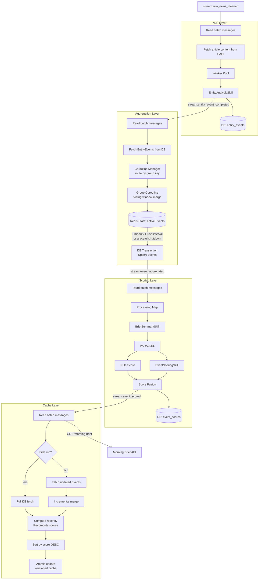
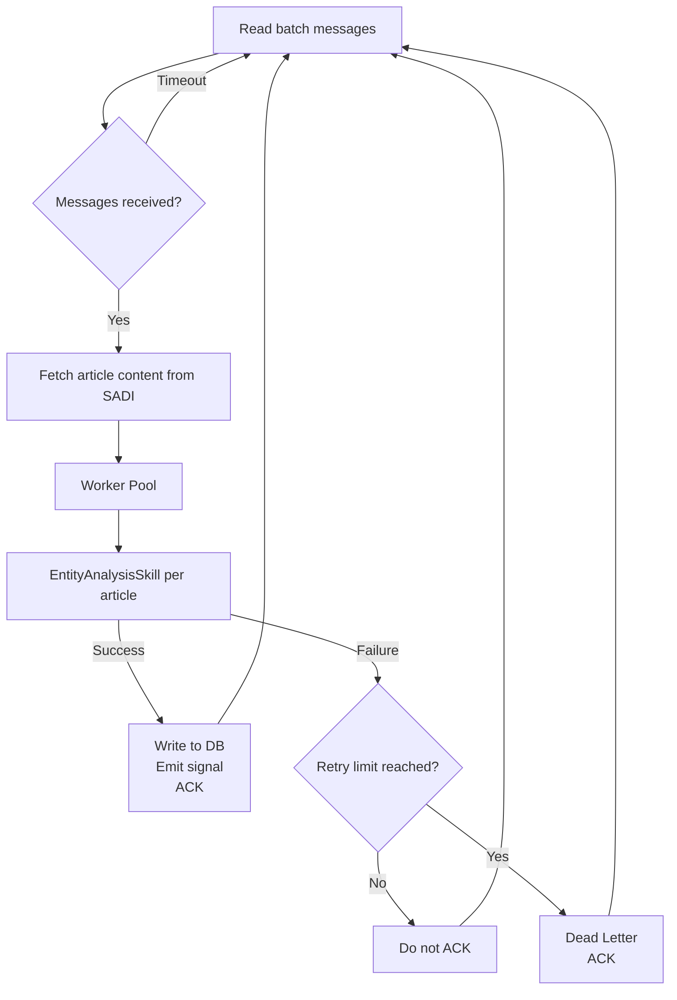
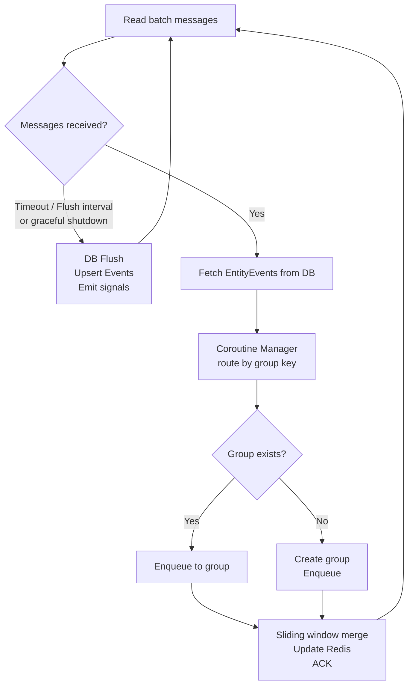
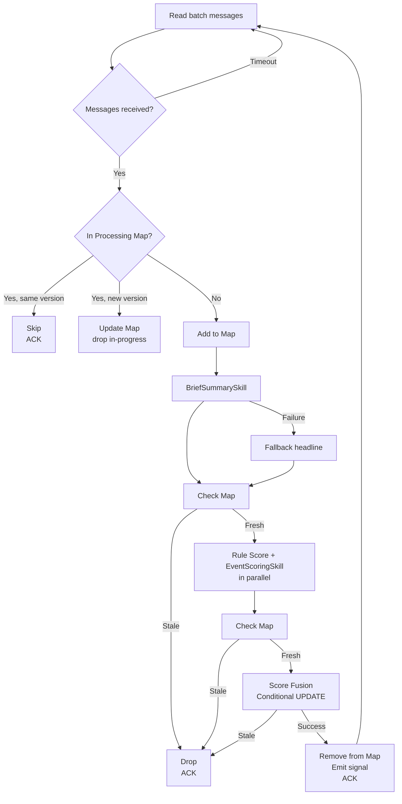
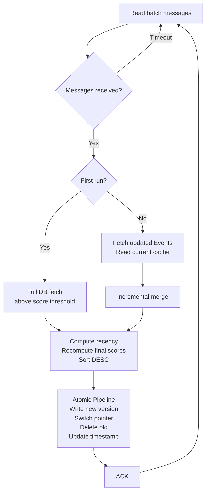

# Stock Assistant Pipeline Intelligence (SAPI)
## Technical Architecture Document — v0.1

| Field | Detail |
|---|---|
| Service Name | Stock Assistant Pipeline Intelligence (SAPI) |
| Document Version | TAD v0.1 |
| Parent System | HK Stock AI Research Assistant |
| Service Responsibility | NLP enrichment, event aggregation, scoring, and cache population |
| Tech Stack | Python + asyncio + Redis |
| Dependencies | PostgreSQL 16, Redis, LLM API (Vertex AI), SADI (via API + Redis Streams), Admin API |
| Document Status | DRAFT — Work in progress |

---

## Table of Contents

1. [Service Overview](#1-service-overview)
2. [System Architecture](#2-system-architecture)
3. [NLP Layer](#3-nlp-layer)
4. [Aggregation Layer](#4-aggregation-layer)
5. [Scoring Layer](#5-scoring-layer)
6. [Cache Layer](#6-cache-layer)
7. [Morning Brief API](#7-morning-brief-api)
8. [LLM Adapter](#8-llm-adapter)
9. [Database Design](#9-database-design)
10. [Redis Design](#10-redis-design)
11. [Error Handling](#11-error-handling)
12. [Deployment](#12-deployment)
13. [Open Questions](#13-open-questions)

---

## 1. Service Overview

### 1.1 Responsibility Boundary

SAPI is the intelligence layer of the HK Stock AI Research Assistant. It consumes cleaned news records from SADI and produces a scored, ranked Morning Brief cache ready for frontend consumption.

> **Core Principle:** SAPI does not perform data acquisition or cleaning. Its input contract is `cleaned_news` records from SADI. Its output contract is a scored Event cache in Redis for the Morning Brief API.

| Layer | Input | Output |
|---|---|---|
| NLP Layer | `cleaned_news` records via SADI API | `EntityEvent` records in DB |
| Aggregation Layer | `EntityEvent` records | `Event` records in DB and Redis |
| Scoring Layer | `Event` records | Scored `Event` records in DB |
| Cache Layer | Scored `Event` records | Morning Brief cache in Redis |

### 1.2 Naming Conventions

| Term | Definition |
|---|---|
| **EntityEvent** | Entity-level event extracted from a single article by EntityAnalysisSkill. One article may produce multiple EntityEvents, one per identified entity. |
| **Event** | Aggregated unit grouping multiple EntityEvents with the same `(stock_code, event_type_primary)` within a sliding time window. Equivalent to "Entity-Event Pair" in the PRD. |
| **Scored Event** | A fully scored Event record combining Event metadata and all scoring dimensions. The atomic unit stored in the Morning Brief cache. |

### 1.3 Tech Stack

| Component | Choice | Rationale |
|---|---|---|
| Runtime | Python 3.12 | Consistent with SADI; best ecosystem for LLM integration |
| Async framework | asyncio | Optimal for IO-intensive LLM API calls; single-threaded concurrency is safe for shared in-memory state |
| API framework | FastAPI | Native async support; automatic OpenAPI documentation |
| Messaging | Redis Streams | Persistent; Consumer Group guarantees at-least-once delivery; `XREADGROUP COUNT+BLOCK` provides native batching with timeout; `XAUTOCLAIM` provides delivery_count for retry management |
| LLM provider | Vertex AI (Gemini) | Enterprise data isolation; no training data usage; asia-east1 region; unified SDK with `vertexai=True` |
| Database client | asyncpg | Native asyncio driver |
| Cache | Redis | Existing dependency; low-latency Morning Brief serving |

### 1.4 Redis Connection Separation

Redis serves two independent purposes in SAPI, managed via separate connection pools to ensure infrastructure substitutability.

| Client | Purpose | Can be replaced by |
|---|---|---|
| `RedisStreamClient` | Inter-service and inter-layer messaging via Redis Streams | Kafka or any message broker |
| `RedisStateClient` | Runtime state storage (active Events, scores, cache) | Remains unaffected by messaging changes |

Both connections may point to the same Redis instance in MVP. Configuration is separated via distinct environment variables `REDIS_STREAM_URL` and `REDIS_STATE_URL`.

### 1.5 Source Configuration

Source authority weights are stored in an Admin database and accessed via Admin API. SAPI caches the configuration in `RedisStateClient` with TTL-based auto-refresh — no dedicated refresh coroutine required.

```
Rule Score requires source:config:
├── Redis key exists → read directly via HGET / HMGET
└── Redis key expired or missing
    → fetch from Admin API
    → write to Redis with TTL = SOURCE_CONFIG_TTL_S
    → fallback if Admin API unreachable: use default weights P1=9, P2=6, P3=4
```

> **Query pattern:** Rule Score computation uses `HMGET source:config source1 source2 ...` to fetch all required weights in a single Redis call.

### 1.6 Recency Score Design

`recency_score` is a time-dependent value that decays continuously:

```
recency_score = 10 × e^(-λ × hours_elapsed)
hours_elapsed = now() - event.aggregation_updated_at
```

**Design decision:** `recency_score` is never stored. The Cache Layer computes it in real time using `event.aggregation_updated_at` as the reference timestamp when building each Morning Brief version. This correctly reflects the freshness of each Event's content at the time it was last aggregated.

Stored scores (`base_rule_score`, `abs_final_score`) exclude `recency_score` and serve as historical snapshots only.

**Design rationale:** All Events' recency scores decay at the same rate between cache updates, so relative ranking is stable. Recomputing only when new scored Events arrive is sufficient — no periodic refresh needed.

---

## 2. System Architecture

### 2.1 Pipeline Design Principle

Each layer is an **independent continuous processor**. No layer waits for upstream completion. Each layer processes what is available and delivers results downstream immediately. The system naturally degrades gracefully — when upstream is slow, downstream still serves users with the most recently available data.

### 2.2 Complete Data Flow



### 2.3 Inter-Layer Signals

All signals use Redis Streams via `RedisStreamClient`. Each stream serves as both the signal and the persistent queue for the receiving layer.

| Stream | Producer | Consumer Group | Message Fields | Role |
|---|---|---|---|---|
| `stream:raw_news_cleaned` | SADI | `sapi-nlp` | `cleaned_id`, `execution_id` | NLP Layer input queue |
| `stream:entity_event_completed` | NLP Layer | `sapi-aggregation` | `entity_event_id` | Aggregation Layer input queue |
| `stream:event_aggregated` | Aggregation Layer | `sapi-scoring` | `event_id` | Scoring Layer input queue |
| `stream:event_scored` | Scoring Layer | `sapi-cache` | `event_id` | Cache Layer input queue |

> `execution_id` is carried only in `stream:raw_news_cleaned` for SADI-to-SAPI traceability. Downstream streams carry only the business ID relevant to each layer.

> **Persistence guarantee:** Redis Streams persist messages until ACKed. On service restart, each layer resumes from its last consumed position via Consumer Group with no data loss.

> **Batching mechanism:** Each layer uses `XREADGROUP COUNT {BATCH_SIZE} BLOCK {TIMEOUT_MS}`. This single command handles both batch size and timeout triggers natively.

---

## 3. NLP Layer

### 3.1 Responsibility

Consume `cleaned_news` records from SADI, invoke EntityAnalysisSkill per article, and write `EntityEvent` records to DB.

### 3.2 Processing Flow



### 3.3 Batching and Concurrency

`XREADGROUP COUNT NLP_BATCH_SIZE BLOCK NLP_BATCH_TIMEOUT_MS` handles both triggers natively:
- Returns up to `NLP_BATCH_SIZE` messages immediately when available
- Returns whatever is available after `NLP_BATCH_TIMEOUT_MS` if batch size not reached

`asyncio.Semaphore(NLP_MAX_CONCURRENT)` limits concurrent LLM API calls within each batch.

### 3.4 Configuration Parameters

| Parameter | Description |
|---|---|
| `NLP_BATCH_SIZE` | Max messages per XREADGROUP read |
| `NLP_BATCH_TIMEOUT_MS` | XREADGROUP block timeout (ms) |
| `NLP_MAX_CONCURRENT` | Worker Pool concurrency limit; constrained by LLM API rate limits |
| `NLP_MAX_RETRY` | Max delivery attempts before Dead Letter |

### 3.5 Error Handling

| Scenario | Strategy |
|---|---|
| LLM API call failure / schema violation | No DB record written; log error; do not ACK → redelivery → Dead Letter at `NLP_MAX_RETRY` |
| DB write failure | See Section 11.1 DB Write Failure policy |
| SADI API failure | Do not ACK → redelivery → Dead Letter at `NLP_MAX_RETRY` |
| RedisStreamClient unreachable | See Section 11.1 RedisStreamClient policy |

---

## 4. Aggregation Layer

### 4.1 Responsibility

Consume `EntityEvent` records, route to per-group coroutines for sliding window merging, maintain active Event state in Redis, and persist Events to DB periodically.

### 4.2 Processing Flow



### 4.3 Coroutine Manager and Concurrency

The Coroutine Manager maintains a dict of active group coroutines:

```
coroutines: Dict[(exchange, stock_code, event_type_primary), GroupCoroutine]
```

- `asyncio.Semaphore(AGG_MAX_CONCURRENT)` limits the number of concurrently active Group Coroutines, controlling Redis and DB concurrent request load
- Each Group Coroutine contains an internal `asyncio.Queue` — EntityEvents for the same group are processed strictly serially, preventing concurrent modification of the same sliding window state
- Group Coroutine is destroyed after `AGG_GROUP_IDLE_TIMEOUT_S` of inactivity; removed from manager dict on destruction

### 4.4 Sliding Window Algorithm

Within each Group Coroutine, EntityEvents are processed in arrival order from the internal queue. For each EntityEvent:

- **Merge condition:** `entity_event.published_at - event.last_seen_at <= SLIDING_WINDOW_HOURS` AND `remaining_lifespan > 0`
- **Hard cap:** `remaining_lifespan = EVENT_MAX_TIMESPAN_HOURS - (entity_event.published_at - event.first_seen_at)`
- **On merge:** update `last_seen_at`; reset Redis TTL to `min(SLIDING_WINDOW_HOURS, remaining_lifespan)`
- **On no merge:** create new Event in memory and Redis

> **`published_at` fallback:** Retrieved via `COALESCE(published_at, created_at)` at query time. Source data is not modified.

### 4.5 DB Flush

DB Flush is triggered by three conditions:

- **XREADGROUP timeout:** No new messages arrive within `AGG_BATCH_TIMEOUT_MS` — equivalent to the input queue being empty.
- **`AGG_DB_FLUSH_INTERVAL_S` elapsed:** Maximum interval between flushes, ensuring timely delivery to downstream layers during continuous high-volume ingestion.
- **Graceful shutdown:** Immediate flush before service exit to persist all in-memory state.

On each flush, within a single DB transaction:
- All active Events in Redis are Upserted to the `events` table
- `aggregation_updated_at = now()` written for each Upserted Event
- All processed EntityEvents marked `is_aggregated = true`

After transaction commits, `stream:event_aggregated` is emitted per event_id.

> **TTL safety constraint:** `AGG_BATCH_TIMEOUT_MS` and `AGG_DB_FLUSH_INTERVAL_S` must be significantly smaller than `SLIDING_WINDOW_HOURS` converted to milliseconds to ensure all active Events are persisted to DB before their Redis TTL expires.

> **Crash recovery:** If the service crashes after ACKing messages but before DB Flush, Redis still holds the active Event state. On restart, the next DB Flush will persist the pre-crash state correctly, maintaining data consistency. The only unrecoverable scenario is simultaneous failure of both the service and Redis — treated as a service quality monitoring event, with remediation deferred to Post-MVP.

### 4.6 Configuration Parameters

| Parameter | Description |
|---|---|
| `AGG_BATCH_SIZE` | Max messages per XREADGROUP read |
| `AGG_BATCH_TIMEOUT_MS` | XREADGROUP block timeout (ms); also serves as queue-empty detection |
| `AGG_MAX_CONCURRENT` | Max concurrent active Group Coroutines; controls Redis and DB concurrent load |
| `AGG_GROUP_IDLE_TIMEOUT_S` | Group Coroutine idle destruction threshold |
| `AGG_DB_FLUSH_INTERVAL_S` | Maximum interval between DB flushes |
| `AGG_MAX_RETRY` | Max delivery attempts before Dead Letter |
| `SLIDING_WINDOW_HOURS` | Max time gap between adjacent articles for merging; base Redis TTL |
| `EVENT_MAX_TIMESPAN_HOURS` | Hard cap on total Event time span |

### 4.7 Error Handling

| Scenario | Strategy |
|---|---|
| DB read failure | Do not ACK; log warning |
| RedisStateClient unreachable | Do not ACK; retry with fixed interval |
| DB Flush failure | See Section 11.1 DB Write Failure policy |
| Group Coroutine failure | UnACked messages redelivered via XAUTOCLAIM → group recreated → reprocessed |
| RedisStreamClient unreachable | See Section 11.1 RedisStreamClient policy |

---

## 5. Scoring Layer

### 5.1 Responsibility

Score Events pushed by the Aggregation Layer. Execute BriefSummarySkill, Rule Score (excluding recency), and EventScoringSkill per Event. Persist score records to DB via conditional update.

### 5.2 Processing Flow



### 5.3 Processing Map

An in-memory Map prevents duplicate processing across concurrent triggers and detects mid-processing data changes:

```
processing_events: Dict[event_id, aggregation_updated_at]
```

- Safe for asyncio single-threaded concurrency — no locking required
- On service restart: Map is empty; in-progress Events are redelivered from Redis Stream and reprocessed normally

### 5.4 Stale Data Detection

| Check Point | Mechanism |
|---|---|
| After BriefSummarySkill | Compare `processing_events[event_id]` with current `aggregation_updated_at` |
| After Rule Score + EventScoringSkill | Same in-memory comparison |
| Score Fusion write | Conditional `UPDATE event_scores WHERE event_id = :id AND events.aggregation_updated_at = :expected`; 0 rows = stale |

### 5.5 Rule Score — Recency Exclusion

`recency_score` is excluded from Rule Score computation. `base_rule_score` and `abs_final_score` stored in `event_scores` are computed without recency:

```
base_rule_score (stored) = Σ(dimension_score × weight) excluding recency_score
abs_final_score (stored) = |base_rule_score × 0.67 + stock_impact_score × 0.33 × 2|
```

The Cache Layer adds recency at build time using `event.aggregation_updated_at` as the reference timestamp.

### 5.6 Sentiment Aggregation

Event-level sentiment is computed from all constituent EntityEvents, weighted by source authority from `source:config`:

```
signed_score = sentiment_score × direction_coefficient
    where POSITIVE=+1, NEUTRAL=0, NEGATIVE=-1

weighted_signed_score = Σ(signed_score × source_authority_weight) ÷ Σ(source_authority_weight)

sentiment_label:
    weighted_signed_score > threshold  → POSITIVE
    weighted_signed_score < -threshold → NEGATIVE
    otherwise                          → NEUTRAL

sentiment_strength_score:
    Σ(sentiment_score × source_authority_weight) ÷ Σ(source_authority_weight)
```

### 5.7 Per-Event Fallbacks

**BriefSummarySkill failure:** `summary_short` populated from `headline` of constituent EntityEvent with highest source authority; ties broken by earliest `published_at`.

**EventScoringSkill failure:** `stock_impact_score = 0`; `llm_fallback = true`; scoring continues with Rule Score only.

### 5.8 Configuration Parameters

| Parameter | Description |
|---|---|
| `SCORING_BATCH_SIZE` | Max messages per XREADGROUP read |
| `SCORING_BATCH_TIMEOUT_MS` | XREADGROUP block timeout (ms) |
| `SCORING_MAX_CONCURRENT` | Max concurrent Event processing; constrained by LLM API rate limits |
| `SCORING_MAX_RETRY` | Max delivery attempts before Dead Letter |
| `SOURCE_CONFIG_TTL_S` | Source configuration cache TTL in Redis |
| `MWP_ADMIN_API_URL` | Admin service API endpoint |

### 5.9 Error Handling

| Scenario | Strategy |
|---|---|
| DB read failure | Do not ACK; log warning |
| BriefSummarySkill failure | Fallback applied; processing continues |
| EventScoringSkill failure | Fallback applied; processing continues |
| source:config unreachable | Use default weights; log warning; processing continues |
| DB write failure | See Section 11.1 DB Write Failure policy |
| RedisStreamClient unreachable | See Section 11.1 RedisStreamClient policy |

---

## 6. Cache Layer

### 6.1 Responsibility

Consume scored Event IDs, fetch and merge Scored Events, compute real-time recency scores using `event.aggregation_updated_at`, and maintain a versioned Morning Brief cache in Redis. Processes messages serially — no concurrent cache updates.

### 6.2 Processing Flow



### 6.3 Recency Score Computation

At each cache build, `recency_score` is computed for all Events using `event.aggregation_updated_at`:

```
recency_score = 10 × e^(-λ × hours_elapsed)
hours_elapsed = now() - event.aggregation_updated_at

final_base_rule_score = stored_base_rule_score + recency_score × recency_weight(0.20)
final_abs_final_score = |final_base_rule_score × 0.67 + stock_impact_score × 0.33 × 2|
```

Sorting uses `final_abs_final_score`. The stored `abs_final_score` in `event_scores` is a historical snapshot excluding recency.

### 6.4 Incremental Merge Rules

Merge decisions use `final_abs_final_score` (real-time computed value including recency):

| Condition | Action |
|---|---|
| Updated Event, `final_abs_final_score >= NOISE_FILTER_THRESHOLD`, already in cache | Replace |
| Updated Event, `final_abs_final_score >= NOISE_FILTER_THRESHOLD`, not in cache | Insert |
| Updated Event, `final_abs_final_score < NOISE_FILTER_THRESHOLD`, already in cache | Remove |
| Updated Event, `final_abs_final_score < NOISE_FILTER_THRESHOLD`, not in cache | Ignore |

### 6.5 Versioned Cache Replacement

All three operations execute atomically via Redis Pipeline `MULTI/EXEC`:

| Step | Frontend reads | State |
|---|---|---|
| Before update | `v42` | Stable |
| Atomic Pipeline: write `v43`, switch pointer, delete `v42` | `v43` | Atomic cutover |
| After update | `v43` | Stable |

`morning_brief:version_counter` is a persistent monotonically incrementing counter with no TTL.

### 6.6 Scored Event Structure

Each item in the Morning Brief cache is a Scored Event. Top-level fields are used for filtering and sorting; display fields are nested.

```json
{
    "event_id": "uuid",
    "exchange": "HKEX",
    "stock_code": "00700.HK",
    "event_type_primary": "EARNINGS",
    "abs_final_score": 7.43,
    "base_rule_score": 8.95,
    "first_seen_at": "2025-01-15T00:00:00Z",
    "last_seen_at": "2025-01-15T06:00:00Z",
    "event": {
        "event_type_secondary": ["BUYBACK"],
        "source_count": 3,
        "source_list": [
            {
                "source_name": "REUTERS",
                "url": "https://...",
                "published_at": "2025-01-15T00:00:00Z"
            }
        ],
        "summary_short": "騰訊Q4廣告收入超預期",
        "summary_full": "騰訊第四季廣告收入按年增長32%，主要受惠於微信視頻號廣告業務強勁增長...",
        "key_numbers": [
            "廣告收入+32% YoY",
            "總收入HK$1,722億",
            "回購計劃HK$1,000億"
        ]
    },
    "score": {
        "stock_impact_score": 3.8,
        "llm_fallback": false,
        "rule_score_detail": {
            "event_type_score": 9.0,
            "source_authority_score": 8.5,
            "sentiment_strength_score": 8.5,
            "source_heat_score": 7.0
        },
        "llm_score_detail": {
            "adjustment_reason": "業績顯著超預期，回購規模反映管理層對前景高度信心，對股價具明確正面催化作用",
            "score_version": "v1.0.0",
            "scored_at": "2025-01-15T00:28:00Z"
        }
    }
}
```

> **`abs_final_score` and `base_rule_score`** are real-time computed values including `recency_score`, not the stored snapshots from `event_scores`.

**Top-level field rationale:**

| Field | Reason |
|---|---|
| `exchange`, `stock_code` | Query filter conditions |
| `event_type_primary` | Potential future filter condition |
| `abs_final_score` | Primary sort key (includes real-time recency) |
| `base_rule_score` | Secondary sort key for tie-breaking (includes real-time recency) |
| `first_seen_at`, `last_seen_at` | Additional tie-breaking sort keys |

**Excluded fields:** `nlp_output`, `aggregation_updated_at`, `updated_at`, `created_at`, `metadata`, `recency_score` — internal fields not relevant to Morning Brief display.

### 6.7 Configuration Parameters

| Parameter | Description |
|---|---|
| `CACHE_BATCH_SIZE` | Max messages per XREADGROUP read |
| `CACHE_BATCH_TIMEOUT_MS` | XREADGROUP block timeout (ms) |
| `CACHE_MAX_RETRY` | Max delivery attempts before Dead Letter |
| `NOISE_FILTER_THRESHOLD` | Minimum `final_abs_final_score` for Morning Brief cache inclusion |
| `CACHE_ORPHAN_CLEANUP_INTERVAL_S` | Interval for scanning and deleting orphaned `morning_brief:v*` keys |

### 6.8 Error Handling

| Scenario | Strategy |
|---|---|
| DB read failure | Do not ACK; log warning |
| RedisStateClient unreachable | Do not ACK; retry with fixed interval |
| Atomic pipeline failure | See Section 11.1 DB Write Failure policy |
| Orphaned version cleanup failure | Log warning; retry on next cleanup interval |
| RedisStreamClient unreachable | See Section 11.1 RedisStreamClient policy |

---

## 7. Morning Brief API

### 7.1 Endpoint

```
GET /morning-brief?stocks=00700,09988,03690&k=20
```

| Parameter | Type | Required | Description |
|---|---|---|---|
| `stocks` | string | Yes | Comma-separated HK stock codes from client watchlist |
| `k` | integer | No | Max results to return; default `TOP_K_DEFAULT = 20` |

### 7.2 Server Processing Logic

```
Read morning_brief:v{current_version} from Redis
        ↓
Step 1: Select Events where stock_code in stocks parameter
        Order by final_abs_final_score DESC
        Take up to k
        ↓
Step 2: If matched count < k
        Append highest scoring non-watchlist Events
        Until total = k or no more Events available
        ↓
Return results
```

### 7.3 Response

> All timestamps in response are UTC. `last_updated` reflects `morning_brief:last_updated` — the time of the last successful cache build.

**Normal response (`HTTP 200`):**

```json
{
    "cache_version": 43,
    "last_updated": "2025-01-15T00:28:00Z",
    "events": [
        {
            "event_id": "uuid",
            "exchange": "HKEX",
            "stock_code": "00700.HK",
            "event_type_primary": "EARNINGS",
            "abs_final_score": 7.43,
            "base_rule_score": 8.95,
            "first_seen_at": "2025-01-15T00:00:00Z",
            "last_seen_at": "2025-01-15T06:00:00Z",
            "event": {
                "event_type_secondary": ["BUYBACK"],
                "source_count": 3,
                "source_list": [
                    {
                        "source_name": "REUTERS",
                        "url": "https://...",
                        "published_at": "2025-01-15T00:00:00Z"
                    }
                ],
                "summary_short": "騰訊Q4廣告收入超預期",
                "summary_full": "騰訊第四季廣告收入按年增長32%，主要受惠於微信視頻號廣告業務強勁增長...",
                "key_numbers": [
                    "廣告收入+32% YoY",
                    "總收入HK$1,722億",
                    "回購計劃HK$1,000億"
                ]
            },
            "score": {
                "stock_impact_score": 3.8,
                "llm_fallback": false,
                "rule_score_detail": {
                    "event_type_score": 9.0,
                    "source_authority_score": 8.5,
                    "sentiment_strength_score": 8.5,
                    "source_heat_score": 7.0
                },
                "llm_score_detail": {
                    "adjustment_reason": "業績顯著超預期，回購規模反映管理層對前景高度信心，對股價具明確正面催化作用",
                    "score_version": "v1.0.0",
                    "scored_at": "2025-01-15T00:28:00Z"
                }
            }
        }
    ]
}
```

**Empty cache (`HTTP 200`):**

```json
{
    "cache_version": null,
    "last_updated": null,
    "events": []
}
```

**System error (`HTTP 503`):**

```json
{
    "error": "system_error",
    "error_code": "CACHE_UNAVAILABLE"
}
```

> Specific `error_code` values are defined per error scenario. Detailed error information is logged server-side only.

### 7.4 Client Processing

The client applies `POOL_MATCH_BOOST` to watchlist-matching Events and re-ranks the results. See PRD Section 12.2 for client-side parameter details.

---

## 8. LLM Adapter

### 8.1 Design Principle

All LLM interactions are encapsulated behind a provider-agnostic Adapter interface defined on day one. Switching providers requires only a new Adapter implementation with no changes to Skill logic.

### 8.2 MVP Implementation

| Attribute | Detail |
|---|---|
| Provider | Vertex AI (Gemini) |
| SDK | `google-genai` with `vertexai=True` |
| Region | `asia-east1` |
| Authentication | Google Cloud IAM (Service Account) |

### 8.3 Adapter Interface Requirements

- Structured Output — enforce response schema
- Function Calling / MCP Tool invocation — required by EntityAnalysisSkill's `lookup_stock()` tool
- Unified exception mapping — provider errors mapped to common types

---

## 9. Database Design

### 9.1 `entity_events` Table

Written by NLP Layer. One record per entity per article. All fields are self-contained — no joins to SADI tables required.

| Field | Type | Nullable | Description |
|---|---|---|---|
| `entity_event_id` | UUID | No | Primary key |
| `exchange` | VARCHAR(10) | No | Exchange identifier e.g. HKEX; Aggregation filter key |
| `source_url` | TEXT | No | Original article URL; unique per article |
| `source_name` | VARCHAR(50) | No | Source identifier e.g. HKEX, MINGPAO; used for source authority weighting |
| `published_at` | TIMESTAMPTZ | Yes | Article publish time UTC; Aggregation falls back to `created_at` via COALESCE |
| `stock_code` | VARCHAR(20) | No | HKEx stock code e.g. 00700.HK; Aggregation group key |
| `event_type_primary` | VARCHAR(50) | No | Primary event classification; Aggregation group key |
| `event_type_secondary` | VARCHAR(50) | Yes | Secondary event classification |
| `sentiment_label` | VARCHAR(10) | No | POSITIVE / NEUTRAL / NEGATIVE |
| `sentiment_score` | FLOAT | No | Signal strength [0, 1] |
| `headline` | TEXT | No | LLM-generated entity headline (Traditional Chinese, ≤20 chars); BriefSummarySkill fallback |
| `nlp_output` | JSONB | No | Full EntityAnalysisSkill output |
| `is_aggregated` | BOOLEAN | No | Default false; set true in DB Flush transaction; used for service quality monitoring |
| `metadata` | JSONB | No | Traceability: `{"cleaned_id": "uuid", "execution_id": "uuid"}` |
| `created_at` | TIMESTAMPTZ | No | Record creation time UTC |
| `updated_at` | TIMESTAMPTZ | No | Last updated time UTC |

**Index strategy:**
- `source_url` — unique index; idempotent insert on conflict
- `exchange` — index; Aggregation filter
- `(stock_code, event_type_primary)` — composite index; Aggregation group query
- `is_aggregated` — index

### 9.2 `events` Table

Written by Aggregation Layer via Upsert. One record per aggregated Event.

| Field | Type | Nullable | Description |
|---|---|---|---|
| `event_id` | UUID | No | Primary key |
| `exchange` | VARCHAR(10) | No | Exchange identifier |
| `stock_code` | VARCHAR(20) | No | Primary stock entity |
| `event_type_primary` | VARCHAR(50) | No | Primary event classification |
| `event_type_secondary` | JSONB | Yes | Array of up to 2 secondary types |
| `source_count` | INTEGER | No | Number of distinct sources |
| `source_list` | JSONB | No | Array of `{source_name, url, published_at}` |
| `first_seen_at` | TIMESTAMPTZ | No | `published_at` of earliest constituent article |
| `last_seen_at` | TIMESTAMPTZ | No | `published_at` of most recent constituent article |
| `nlp_output` | JSONB | No | Full EntityAnalysisSkill output for all constituent articles |
| `summary_short` | TEXT | Yes | BriefSummarySkill output (≤30 Chinese chars) |
| `summary_full` | TEXT | Yes | BriefSummarySkill output (≤150 Chinese chars) |
| `key_numbers` | JSONB | Yes | Array of up to 3 extracted numeric figures |
| `aggregation_updated_at` | TIMESTAMPTZ | No | Written by Aggregation Layer only; recency score reference timestamp for Cache Layer; stale detection key for Scoring Layer conditional UPDATE |
| `updated_at` | TIMESTAMPTZ | No | Last updated time UTC; general audit field |
| `created_at` | TIMESTAMPTZ | No | Record creation time UTC |

**Index strategy:**
- `exchange` — index
- `(stock_code, event_type_primary)` — composite index; Aggregation lookup
- `aggregation_updated_at` — index; Cache Layer recency computation; Scoring Layer conditional UPDATE
- `stock_code` — index; Aggregation and Morning Brief API lookup

### 9.3 `event_scores` Table

Written by Scoring Layer via Upsert. One record per Event. Overwritten on each re-score. Scores exclude `recency_score` — see Section 1.6.

| Field | Type | Nullable | Description |
|---|---|---|---|
| `score_id` | UUID | No | Primary key |
| `event_id` | UUID | No | FK → `events.event_id`; unique constraint |
| `abs_final_score` | FLOAT | No | Score Fusion result excluding recency; historical snapshot |
| `base_rule_score` | FLOAT | No | Weighted rule score excluding recency; baseline for Cache Layer recency recomputation |
| `stock_impact_score` | FLOAT | No | EventScoringSkill output; direct input to Score Fusion |
| `llm_fallback` | BOOLEAN | No | True if EventScoringSkill failed; used for monitoring |
| `rule_score_detail` | JSONB | No | Four scoring dimensions excluding recency: `{event_type_score, source_authority_score, sentiment_strength_score, source_heat_score}`; JSONB for flexibility as weights evolve |
| `llm_score_detail` | JSONB | No | LLM scoring output: `{adjustment_reason, score_version, scored_at}`; JSONB as Skill output structure may evolve |
| `updated_at` | TIMESTAMPTZ | No | Last updated time UTC |
| `created_at` | TIMESTAMPTZ | No | Record creation time UTC |

**Index strategy:**
- `event_id` — unique index; enforces one-to-one with `events`; Upsert conflict target
- `abs_final_score` — index; Cache Layer filter baseline
- `base_rule_score` — index; tie-breaking sort baseline
- `llm_fallback` — index; monitoring queries

---

## 10. Redis Design

### 10.1 Connection Separation

| Client | Keys Used |
|---|---|
| `RedisStreamClient` | All `stream:*` keys |
| `RedisStateClient` | All non-stream keys below |

### 10.2 Aggregation Layer — Active Events

One key per active Event. TTL reset on every merge.

| Key | Type | Description |
|---|---|---|
| `agg:event:{exchange}:{stock_code}:{event_type_primary}` | HASH | `event_id`, `first_seen_at`, `last_seen_at`, `entity_event_ids` (JSON array of UUIDs) |

TTL = `min(SLIDING_WINDOW_HOURS, remaining_lifespan)`. Expires naturally when sliding window closes or `EVENT_MAX_TIMESPAN_HOURS` is reached.

> **TTL safety constraint:** `AGG_BATCH_TIMEOUT_MS` and `AGG_DB_FLUSH_INTERVAL_S` must be significantly smaller than `SLIDING_WINDOW_HOURS` in milliseconds to ensure all active Events are persisted to DB before their Redis TTL expires.

### 10.3 Source Configuration

| Key | Type | Description |
|---|---|---|
| `source:config` | HASH | `{source_name: authority_weight}`; TTL = `SOURCE_CONFIG_TTL_S`; auto-refreshed from Admin API on expiry; queried via `HMGET` for batch weight lookups |

### 10.4 Cache Layer — Morning Brief

| Key | Type | Description |
|---|---|---|
| `morning_brief:version_counter` | INTEGER | Monotonically incrementing version counter; no TTL; incremented via atomic INCR |
| `morning_brief:current_version` | INTEGER | Pointer to active cache version |
| `morning_brief:v{version}` | JSON | Ordered array of Scored Events; `abs_final_score` and `base_rule_score` include real-time recency |
| `morning_brief:last_updated` | TIMESTAMP | Timestamp of last successful cache build; returned in API response; used for frontend staleness display |

---

## 11. Error Handling

### 11.1 Common Mechanisms

**DB Write Failure**

All DB write operations across all layers use a unified retry utility `db_write_with_retry()`. Retry parameters are shared:

- Retry strategy: fixed interval, `DB_WRITE_MAX_RETRY` attempts
- On exhaustion: do not ACK; log warning; await redelivery
- Implementation details are specified in a separate technical implementation document

**RedisStreamClient Reconnect**

When `RedisStreamClient` is unreachable:

- Fixed interval retry every `REDIS_RECONNECT_INTERVAL_S`
- On reconnect: Consumer Group position is preserved; processing resumes automatically from last ACKed message
- Log warning on each failed attempt

**Logging Policy**

All layers log via the unified system logger (`app/logger.py`) using `structlog`. MVP outputs structured JSON logs to stdout, designed for direct integration with external log aggregation systems (e.g. ELK, Cloud Logging) in Post-MVP without code changes.

| Severity | Usage |
|---|---|
| WARNING | Recoverable errors; processing continues or retries |
| CRITICAL | Unrecoverable or persistent failures requiring operator attention |

**Dead Letter Streams**

Each layer writes unrecoverable messages to its own Dead Letter Stream when `delivery_count >= MAX_RETRY`. In MVP, Dead Letter Streams serve as service quality monitoring indicators — no automated reprocessing. Post-MVP: add consumption and reprocessing pipeline.

| Stream | Source Layer |
|---|---|
| `stream:nlp_dead_letter` | NLP Layer |
| `stream:aggregation_dead_letter` | Aggregation Layer |
| `stream:scoring_dead_letter` | Scoring Layer |
| `stream:cache_dead_letter` | Cache Layer |

Dead Letter message fields: `message_id`, `event_id` / `entity_event_id`, `error_type`, `error_detail`, `delivery_count`, `failed_at`, `layer`.

**Retry Count via delivery_count**

`XAUTOCLAIM` returns `delivery_count` for each claimed message — no additional Redis state required:

```
delivery_count < MAX_RETRY → retry processing
delivery_count >= MAX_RETRY → write to Dead Letter Stream → ACK original message
```

**Orphaned Cache Cleanup**

A periodic coroutine scans and removes stale cache versions every `CACHE_ORPHAN_CLEANUP_INTERVAL_S`:

```
SCAN morning_brief:v*
→ Keep morning_brief:v{current_version}
→ Delete all other morning_brief:v* keys
→ Log cleanup results
```

---

## 12. Deployment

### 12.1 Container Configuration

| Service | Image | Notes |
|---|---|---|
| sapi | python:3.12-slim (custom build) | Main SAPI service; all four layers |
| postgres | postgres:16-alpine | Shared with SADI; persistent volume mounted |
| redis | redis:7-alpine | Shared with SADI for streams and state |

### 12.2 Environment Variables

| Variable | Default | Description |
|---|---|---|
| `DATABASE_URL` | — | PostgreSQL connection string; required |
| `REDIS_STREAM_URL` | — | Redis connection for messaging (`RedisStreamClient`); required |
| `REDIS_STATE_URL` | — | Redis connection for state storage (`RedisStateClient`); required |
| `VERTEX_AI_PROJECT` | — | Google Cloud project ID; required |
| `VERTEX_AI_LOCATION` | `asia-east1` | Vertex AI region |
| `MWP_ADMIN_API_URL` | — | Admin service API endpoint; required |
| `NLP_BATCH_SIZE` | 20 | NLP XREADGROUP COUNT |
| `NLP_BATCH_TIMEOUT_MS` | 5000 | NLP XREADGROUP BLOCK timeout (ms) |
| `NLP_MAX_CONCURRENT` | 10 | NLP Worker Pool concurrency limit |
| `NLP_MAX_RETRY` | 3 | NLP max delivery attempts before Dead Letter |
| `AGG_BATCH_SIZE` | 20 | Aggregation XREADGROUP COUNT |
| `AGG_BATCH_TIMEOUT_MS` | 5000 | Aggregation XREADGROUP BLOCK timeout (ms) |
| `AGG_MAX_CONCURRENT` | 20 | Max concurrent active Group Coroutines |
| `AGG_GROUP_IDLE_TIMEOUT_S` | 300 | Group Coroutine idle destruction threshold (seconds) |
| `AGG_DB_FLUSH_INTERVAL_S` | 60 | Maximum interval between Aggregation DB flushes (seconds) |
| `AGG_MAX_RETRY` | 3 | Aggregation max delivery attempts before Dead Letter |
| `SLIDING_WINDOW_HOURS` | 4 | Sliding window for Event merging; base Redis TTL |
| `EVENT_MAX_TIMESPAN_HOURS` | 24 | Hard cap on total Event time span |
| `SCORING_BATCH_SIZE` | 10 | Scoring XREADGROUP COUNT |
| `SCORING_BATCH_TIMEOUT_MS` | 10000 | Scoring XREADGROUP BLOCK timeout (ms) |
| `SCORING_MAX_CONCURRENT` | 5 | Scoring Layer concurrency limit |
| `SCORING_MAX_RETRY` | 3 | Scoring max delivery attempts before Dead Letter |
| `SOURCE_CONFIG_TTL_S` | 3600 | Source configuration cache TTL (seconds) |
| `CACHE_BATCH_SIZE` | 20 | Cache XREADGROUP COUNT |
| `CACHE_BATCH_TIMEOUT_MS` | 5000 | Cache XREADGROUP BLOCK timeout (ms) |
| `CACHE_MAX_RETRY` | 3 | Cache max delivery attempts before Dead Letter |
| `NOISE_FILTER_THRESHOLD` | 3.0 | Minimum `final_abs_final_score` for Morning Brief cache inclusion |
| `CACHE_ORPHAN_CLEANUP_INTERVAL_S` | 3600 | Orphaned cache version cleanup interval (seconds) |
| `RECENCY_DECAY_LAMBDA` | 0.1 | λ for recency score decay formula |
| `DB_WRITE_MAX_RETRY` | 3 | Max DB write retry attempts |
| `STREAM_CLAIM_TIMEOUT_MS` | 30000 | Message pending list idle time before XAUTOCLAIM redelivery (ms) |
| `REDIS_RECONNECT_INTERVAL_S` | 5 | Fixed interval between RedisStreamClient reconnect attempts (seconds) |
| `TOP_K_DEFAULT` | 20 | Default number of Events returned by Morning Brief API |

### 12.3 Project Structure

```
sapi/
├── app/
│   ├── nlp/
│   │   ├── nlp_service.py           # XREADGROUP consumer; batch orchestration
│   │   ├── worker_pool.py           # asyncio.Semaphore concurrency control
│   │   └── entity_analysis_skill.py # EntityAnalysisSkill invocation
│   ├── aggregation/
│   │   ├── aggregation_service.py   # XREADGROUP consumer; coroutine manager; DB flush; graceful shutdown
│   │   ├── group_coroutine.py       # Per-group asyncio.Queue + sliding window merge
│   │   ├── sliding_window.py        # Sliding window merge algorithm
│   │   └── event_store.py           # Redis active Event management
│   ├── scoring/
│   │   ├── scoring_service.py       # XREADGROUP consumer; Processing Map; orchestration
│   │   ├── brief_summary_skill.py   # BriefSummarySkill + fallback
│   │   ├── rule_score.py            # Rule Score excl. recency + sentiment aggregation
│   │   └── event_scoring_skill.py   # EventScoringSkill + fallback
│   ├── cache/
│   │   └── cache_service.py         # XREADGROUP consumer; incremental merge; recency recomputation; atomic versioned replacement; orphan cleanup
│   ├── api/
│   │   └── morning_brief.py         # GET /morning-brief endpoint
│   ├── llm/
│   │   ├── adapter.py               # Provider-agnostic LLM Adapter interface
│   │   └── vertex_adapter.py        # Vertex AI implementation
│   ├── db/
│   │   ├── connection.py            # asyncpg connection pool
│   │   └── utils.py                 # db_write_with_retry() unified write utility
│   ├── redis/
│   │   ├── stream_client.py         # RedisStreamClient — messaging + reconnect logic
│   │   └── state_client.py          # RedisStateClient — state storage
│   ├── logger.py                    # Unified system logger; stdout structured logging
│   ├── config.py                    # Environment variable loading
│   └── main.py                      # Service entry point
├── alembic/
│   └── versions/
│       └── 001_create_tables.py     # entity_events + events + event_scores schema
├── Dockerfile
├── requirements.txt
└── docker-compose.yml
```

---

## 13. Open Questions

| # | Question | Impact | Target |
|---|---|---|---|
| Q-1 | Validate batch size and timeout defaults against real throughput | Latency and efficiency tuning | Week 1 |
| Q-2 | Validate `SCORING_MAX_CONCURRENT` against LLM API rate limits | Scoring Layer throughput | Week 1 |
| Q-3 | Post-MVP: Dead Letter Stream consumption and reprocessing pipeline | Service reliability | Post-MVP |
| Q-4 | Post-MVP: migrate source configuration from local defaults to Admin database | Source authority management | Post-MVP |
| Q-5 | DB Write Failure unified retry implementation details | Implementation specification | Separate document |

---

*— End of Document | SAPI TAD v0.1 —*